# 🧠 SISTEMA POS ENTERPRISE — DOCUMENTO MAESTRO v3.0

> **Documento técnico de referencia completo. Sin omisiones, sin "más adelante", sin "casos raros descartados".**
>
> **Stack oficial:** Laravel 11 + PostgreSQL 16 + Vue 3 (TypeScript) + Redis 7 + Docker + Nginx
> **Móvil:** Flutter (gerencial) + PWA (POS y operación)
> **Hosting principal:** DigitalOcean (Droplets + Managed DB + Spaces + Load Balancers)
> **Modo de operación:** Offline-first con sincronización eventual y consistencia eventual auditada
> **Versión:** 3.0
> **Última actualización:** 2026-04-28
> **Estado:** documento vivo — actualizado al cierre de cada fase

---

# 📘 ÍNDICE GENERAL

### PARTE I — FUNDAMENTOS
1. Visión, propósito y posicionamiento de mercado
2. Modelo de negocio (SaaS, licencia, freemium)
3. Stakeholders y personas
4. Alcance funcional total (MVP → Enterprise)
5. Requerimientos no funcionales completos
6. Restricciones, supuestos y dependencias
7. Marco regulatorio aplicable

### PARTE II — DOMINIO Y NEGOCIO
8. Glosario completo del dominio
9. Bounded Contexts (DDD)
10. Roles, permisos y matriz RACI
11. Reglas de negocio exhaustivas (RN-001 a RN-200+)
12. Casos de uso por rol (todos los flujos)
13. Casos límite (edge cases) y manejo de excepciones
14. Diagramas de flujo completos
15. Máquinas de estado finitas

### PARTE III — ARQUITECTURA TÉCNICA
16. Vista lógica (módulos)
17. Vista de procesos (concurrencia, colas)
18. Vista de despliegue (infraestructura)
19. Vista física (hardware soportado)
20. Vista de datos (modelo completo)
21. Patrones aplicados y justificados
22. Estrategia de manejo de errores
23. Estrategia de transacciones distribuidas (Saga)
24. Concurrencia y bloqueos

### PARTE IV — MODELO DE DATOS
25. Convenciones generales
26. Diagrama ER completo
27. DDL completo de todas las tablas
28. Índices y estrategia de performance
29. Particionamiento
30. Vistas materializadas
31. Triggers y constraints
32. Estrategia de migraciones

### PARTE V — APIs Y CONTRATOS
33. Convenciones de API
34. Versionado y deprecación
35. Catálogo completo de endpoints
36. Webhooks y eventos
37. WebSockets y tiempo real
38. API pública para integraciones
39. SDKs oficiales
40. Documentación OpenAPI

### PARTE VI — OFFLINE-FIRST (CRÍTICO)
41. Filosofía y decisiones de diseño
42. Arquitectura cliente offline
43. Almacenamiento local (IndexedDB)
44. Service Worker y PWA
45. Cola de sincronización
46. Reconciliación y resolución de conflictos
47. Generación de IDs distribuidos
48. Reserva de folios y secuencias
49. Validaciones offline
50. Casos límite de sincronización
51. Recuperación ante corrupción
52. Pruebas offline

### PARTE VII — MULTISUCURSAL Y MULTITENANT
53. Modelo multitenant
54. Aislamiento de datos
55. Topologías de despliegue
56. Sincronización inter-sucursal
57. Replicación de PostgreSQL
58. Edge servers (modelo enterprise)
59. Failover y alta disponibilidad

### PARTE VIII — INTEGRACIONES
60. Hardware (impresoras, scanners, básculas, displays)
61. Pasarelas de pago (tarjetas, transferencias, QR)
62. Facturación electrónica (CFDI 4.0, Factura Electrónica LATAM)
63. Bancos y conciliación
64. Contabilidad (Contpaq, Aspel, QuickBooks, Odoo)
65. E-commerce (sincronización con Shopify, WooCommerce, propio)
66. Marketplaces (MercadoLibre, Amazon)
67. Mensajería (WhatsApp Business, SMS, Email)
68. ERP/CRM externos

### PARTE IX — SEGURIDAD Y CUMPLIMIENTO
69. Modelo de amenazas (STRIDE)
70. Autenticación (passwords, MFA, biometría, SSO)
71. Autorización (RBAC, ABAC)
72. Cifrado (en tránsito, en reposo, en uso)
73. Gestión de secretos
74. Auditoría inmutable
75. Cumplimiento (PCI-DSS, GDPR, LFPDPPP, SOC 2)
76. Hardening de infraestructura
77. Pruebas de seguridad
78. Respuesta a incidentes

### PARTE X — OBSERVABILIDAD
79. Logs estructurados
80. Métricas (Prometheus + Grafana)
81. Trazas distribuidas (OpenTelemetry)
82. APM (Sentry, Laravel Pulse)
83. Health checks
84. Alertas y on-call
85. Dashboards operativos y de negocio
86. SLO/SLI/SLA

### PARTE XI — CALIDAD
87. Estrategia de testing (pirámide)
88. Tests unitarios
89. Tests de integración
90. Tests de feature
91. Tests E2E
92. Tests de performance/carga
93. Tests de seguridad
94. Tests de caos (chaos engineering)
95. Code review y standards
96. Linting y análisis estático

### PARTE XII — DEVOPS E INFRAESTRUCTURA
97. Ambientes (dev, test, staging, prod)
98. Docker y orquestación
99. CI/CD pipelines completos
100. Estrategia de despliegue (blue-green, canary)
101. Rollback y recuperación
102. Backups y disaster recovery
103. Infraestructura como código (Terraform)
104. Costos y FinOps

### PARTE XIII — FASES DE DESARROLLO
105. Fase 0 — Pre-desarrollo y discovery
106. Fase 1 — Fundación
107. Fase 2 — Catálogo e inventario base
108. Fase 3 — POS MVP
109. Fase 4 — Caja
110. Fase 5 — Offline-first ⭐
111. Fase 6 — Inventario avanzado
112. Fase 7 — Reportes y analítica
113. Fase 8 — Multisucursal
114. Fase 9 — Hardening y go-to-market
115. Fase 10 — Facturación electrónica
116. Fase 11 — Integraciones de pago
117. Fase 12 — App móvil gerencial
118. Fase 13 — E-commerce y marketplace
119. Fase 14 — CRM y fidelización
120. Fase 15 — API pública y marketplace de integraciones
121. Fase 16 — Inteligencia (ML, forecast)
122. Fase 17 — Internacionalización completa
123. Fase 18 — Suite contable integrada

### PARTE XIV — OPERACIÓN Y SOPORTE
124. Modelo de soporte por tier
125. Onboarding de clientes
126. Migración desde sistemas legados
127. Capacitación
128. Documentación de usuario
129. Gestión de incidentes
130. SLA de soporte
131. Knowledge base
132. Comunidad y foro

### PARTE XV — NEGOCIO Y COMERCIAL
133. Pricing y planes
134. Onboarding self-service vs asistido
135. Programa de partners
136. Marketing técnico
137. Métricas de producto (North Star, KPIs)
138. Roadmap público

### PARTE XVI — ANEXOS
139. Glosario completo
140. Referencias y estándares
141. Diccionario de errores
142. Catálogo de eventos
143. Plantillas y formatos
144. Runbooks operativos
145. Checklists exhaustivos

---

# PARTE I — FUNDAMENTOS

## 1. VISIÓN, PROPÓSITO Y POSICIONAMIENTO

### 1.1 Visión

Ser la plataforma POS más confiable y completa para operaciones de retail en LATAM y mercados emergentes, capaz de operar en cualquier condición de conectividad, con arquitectura preparada desde el día uno para escalar de un negocio de barrio a una cadena de cientos de sucursales sin reescritura.

### 1.2 Propósito

Eliminar las tres fricciones principales del retail moderno:
1. **Pérdida de ventas por caídas de internet** → operación offline-first.
2. **Inconsistencia de datos entre sucursales** → sincronización auditable.
3. **Complejidad de integración** → contratos abiertos y APIs públicas.

### 1.3 Posicionamiento de mercado

| Segmento | Necesidad | Nuestra propuesta |
|---|---|---|
| **Micro (1 sucursal, <500 SKUs)** | Empezar barato, fácil | Plan Básico, onboarding self-service |
| **PyME (1–5 sucursales, hasta 5k SKUs)** | Crecer sin migrar | Plan Pro, módulos a la carta |
| **Mediano (5–50 sucursales, 5k–50k SKUs)** | Multisucursal real, reportes | Plan Business, soporte prioritario |
| **Enterprise (>50 sucursales o >50k SKUs)** | Customización, SLA, integraciones | Plan Enterprise, edge servers, integraciones a medida |

### 1.4 Diferenciadores clave

1. **Offline-first verdadero:** no es "sigue funcionando un rato sin internet", es "opera 8+ horas sin internet con cero pérdida y sincronización automática transparente".
2. **Multitenant nativo:** no parchado, diseñado desde la primera tabla.
3. **Auditoría inmutable:** cada acción queda registrada con quién, qué, cuándo, dónde, cómo, por qué.
4. **API-first:** todo lo que hace la UI lo puede hacer la API. Sin excepciones.
5. **Escalabilidad horizontal:** del Droplet de $48 USD al cluster Kubernetes sin reescribir.

### 1.5 No-objetivos explícitos

- No competir con ERPs de Tier-1 (SAP, Oracle) en módulos no relacionados con retail.
- No reinventar contabilidad — integrarse con suites contables.
- No ser pasarela de pagos — integrarse con las que ya existen.
- No ser e-commerce de pleno — integrarse con plataformas dedicadas.

---

## 2. MODELO DE NEGOCIO

### 2.1 Modalidades comerciales

| Modalidad | Descripción | Target |
|---|---|---|
| **SaaS Cloud** | Hospedaje en nuestra infraestructura, suscripción mensual | Micro, PyME, Mediano |
| **SaaS Dedicated** | Instancia dedicada en cloud, suscripción premium | Enterprise |
| **On-Premise** | Licencia perpetua, instalación local del cliente | Enterprise con requisitos regulatorios |
| **White Label** | Reventa por partners con marca propia | Distribuidores, integradores |

### 2.2 Planes de suscripción

| Plan | Precio mensual* | Sucursales | Terminales | SKUs | Soporte |
|---|---|---|---|---|---|
| **Free** | $0 | 1 | 1 | 100 | Comunidad |
| **Básico** | $29 USD | 1 | 2 | 1,000 | Email |
| **Pro** | $79 USD | 3 | 6 | 10,000 | Email + chat |
| **Business** | $199 USD | 10 | 30 | 50,000 | 24/5, prioritario |
| **Enterprise** | A medida | Ilimitado | Ilimitado | Ilimitado | 24/7 dedicado |

*Precios indicativos para definición técnica.

### 2.3 Add-ons facturables

- Facturación electrónica (por timbre)
- Edge server por sucursal
- Integración con e-commerce
- Reportes avanzados con BI
- Almacenamiento extra
- Backup geo-redundante
- Soporte 24/7 personalizado

### 2.4 Métricas de negocio (Norte)

- **MRR** (Monthly Recurring Revenue)
- **Churn rate** mensual
- **CAC** (Customer Acquisition Cost)
- **LTV** (Lifetime Value)
- **NRR** (Net Revenue Retention)
- **Tickets/segundo** (capacidad técnica)
- **Sucursales activas**
- **Sync success rate** (KPI técnico clave)

---

## 3. STAKEHOLDERS Y PERSONAS

### 3.1 Personas internas (del cliente)

#### Persona 1 — Dueño / CEO
- **Quiere:** ver el negocio en tiempo real, decidir con datos.
- **Frustraciones:** reportes que tardan, datos desfasados, no poder verificar desde casa.
- **Usa:** dashboard ejecutivo, reportes, app móvil.

#### Persona 2 — Administrador del sistema
- **Quiere:** configurar todo, gestionar usuarios, mantener catálogo.
- **Frustraciones:** sistemas inflexibles, importaciones que fallan.
- **Usa:** módulo de configuración, importadores, gestión de usuarios.

#### Persona 3 — Gerente de sucursal
- **Quiere:** que su sucursal opere sin fricciones, su equipo cumpla metas.
- **Frustraciones:** problemas de hardware, diferencias de caja sin explicación.
- **Usa:** dashboard de sucursal, autorizaciones, reportes operativos.

#### Persona 4 — Supervisor de turno
- **Quiere:** resolver problemas rápido, autorizar acciones, cubrir cajeros.
- **Frustraciones:** tener que ir físicamente a una caja para autorizar.
- **Usa:** autorizaciones móviles, reportes en vivo.

#### Persona 5 — Cajero
- **Quiere:** vender rápido sin trabarse, sin que la fila crezca.
- **Frustraciones:** pantallas con muchos clicks, búsquedas lentas, errores poco claros.
- **Usa:** POS exclusivamente.

#### Persona 6 — Encargado de almacén
- **Quiere:** saber qué hay, qué falta, qué se vence.
- **Frustraciones:** sistemas que no manejan lotes, conteos manuales tediosos.
- **Usa:** módulo de inventario, app móvil para conteos.

#### Persona 7 — Contador (interno o externo)
- **Quiere:** datos limpios para declaraciones, integración con su software.
- **Frustraciones:** exportaciones inconsistentes, datos incompletos.
- **Usa:** reportes contables, exportaciones, integraciones.

#### Persona 8 — Auditor (interno)
- **Quiere:** trazabilidad completa, detectar irregularidades.
- **Frustraciones:** logs incompletos, datos modificables.
- **Usa:** bitácora, reportes de excepciones.

### 3.2 Personas externas

#### Persona 9 — Cliente final
- **Quiere:** comprar rápido, recibir ticket, ser reconocido si es frecuente.
- **Frustraciones:** colas, tickets ilegibles, no recibir promociones merecidas.

#### Persona 10 — Proveedor
- **Quiere:** ver órdenes de compra, conciliar pagos.
- **Frustraciones:** comunicación por email/WhatsApp sin trazabilidad.
- **Usa (futuro):** portal de proveedores.

#### Persona 11 — Desarrollador integrador (partner)
- **Quiere:** API clara, sandbox, documentación.
- **Frustraciones:** APIs mal documentadas, sin webhooks.
- **Usa:** API pública, dashboard de developer.

### 3.3 Stakeholders del producto

- **Equipo de desarrollo**
- **Equipo de soporte y onboarding**
- **Equipo de ventas**
- **Equipo de marketing**
- **Equipo legal y compliance**
- **Inversionistas / dirección**
- **Reguladores fiscales** (SAT, DIAN, SUNAT, etc.)
- **Auditores externos**

---

## 4. ALCANCE FUNCIONAL TOTAL

> **Principio:** todo lo que aparece aquí se construirá. La pregunta no es "si" sino "cuándo". Cada funcionalidad pertenece a una fase numerada (105–123).

### 4.1 Núcleo (Fases 1–9)

#### 4.1.1 Identidad y acceso
- Registro y onboarding self-service
- Login con email/password
- Login con PIN (POS)
- Recuperación de contraseña
- Multi-factor (TOTP, SMS, email)
- Single Sign-On (SAML, OAuth — Enterprise)
- Sesiones por dispositivo
- Cierre forzado de sesión remoto
- Bloqueo por intentos fallidos
- Política de contraseñas configurable
- Rotación de contraseñas
- Biometría en dispositivos compatibles

#### 4.1.2 Gestión organizacional
- Empresas (tenants)
- Sucursales con configuración propia
- Cajas físicas (registers)
- Almacenes (separados de sucursales)
- Bodegas y zonas
- Departamentos y centros de costo
- Estructura jerárquica (matriz, regional, sucursal)

#### 4.1.3 Catálogo
- Productos (incluye toda la complejidad)
- Variantes (talla, color, sabor)
- Combos y paquetes
- Productos compuestos / kits
- Servicios (sin inventario)
- Productos de receta (insumos → producto final)
- Productos por peso
- Productos por volumen
- Productos por longitud
- Múltiples códigos de barras por producto
- Códigos de barras de balanza (peso embebido)
- Categorías jerárquicas
- Marcas
- Proveedores con datos completos
- Atributos personalizados
- Imágenes múltiples
- Precios por canal (mostrador, mayoreo, online)
- Precios por cliente / lista de precios
- Precios por sucursal
- Precios programados (vigencias)
- Promociones automáticas (2x1, 3x2, descuento por cantidad)
- Cupones y vales
- Impuestos múltiples (IVA, IEPS, retenciones)
- Manejo de divisas en producto

#### 4.1.4 Inventario
- Stock en tiempo real por sucursal/almacén
- Lotes con caducidad
- Series (productos serializados: electrónicos, joyería)
- Ubicaciones físicas (pasillo-rack-nivel)
- Entradas (compra, devolución de cliente, transferencia, ajuste +)
- Salidas (venta, merma, transferencia, ajuste -)
- Ajustes con motivo obligatorio
- Conteos cíclicos
- Conteos completos
- Conteos parciales por categoría/zona
- Kardex valorizado (PEPS, UEPS, promedio ponderado, identificación específica)
- Reservas y apartados
- Reabastecimiento sugerido (por punto de reorden)
- Análisis ABC
- Análisis de rotación
- Productos por caducar
- Productos sin movimiento
- Maquila y producción
- Recetas y BOM (Bill of Materials)
- Devoluciones a proveedor
- Mermas (por categoría: dañado, robado, vencido, otro)

#### 4.1.5 Compras
- Solicitudes de compra
- Cotizaciones
- Órdenes de compra
- Recepción parcial
- Facturas de proveedor
- Notas de crédito de proveedor
- Cuentas por pagar
- Programación de pagos
- Pagos a proveedores
- Conciliación de pagos

#### 4.1.6 Ventas
- POS principal con escaneo
- Búsqueda inteligente (autocompletar, fonético, sinónimos)
- Carrito reactivo
- Múltiples carritos simultáneos por cajero
- Suspensión de venta (parcar)
- Múltiples métodos de pago en una venta
- Pagos parciales / abonos / cuentas por cobrar
- Crédito a cliente
- Apartados con anticipo
- Pre-órdenes
- Cotizaciones
- Tickets de regalo
- Cancelaciones (con autorización)
- Devoluciones (parciales, totales)
- Cambios (devolución + nueva venta)
- Notas de crédito
- Vales electrónicos
- Tarjetas de regalo (gift cards)
- Propinas
- Redondeo (configurable)
- Servicio (porcentaje sobre subtotal)
- Comisiones por mesero/vendedor
- Múltiples vendedores en una venta
- Asignación de comisiones
- Mostrador rápido (sin escaneo, productos frecuentes)

#### 4.1.7 Caja
- Apertura con fondo declarado
- Apertura con efectivo de cajeros previos
- Movimientos: ventas, retiros, depósitos, gastos menores
- Múltiples monedas
- Conversión de divisas
- Cambio de cajero (handover) sin cierre
- Cierre con conteo físico desglosado por denominación
- Validación de fondos
- Diferencias y alertas
- Reporte X (intermedio)
- Reporte Z (cierre)
- Auto-corte por horario
- Múltiples cajas por turno
- Reasignación de caja
- Cobros sin caja (terminal autoservicio)

#### 4.1.8 Clientes
- Registro mínimo y avanzado
- Búsqueda rápida
- Historial completo
- Crédito y límite
- Estado de cuenta
- Cobranza
- Notas internas
- Etiquetas / segmentación
- Geolocalización
- Múltiples direcciones
- Múltiples teléfonos
- Datos fiscales (RFC, DNI, CUIT)
- Régimen fiscal
- Uso de CFDI
- Documentos adjuntos
- Notificaciones por canal preferido
- Consentimientos GDPR/LFPDPPP
- Solicitudes de derechos ARCO
- Anonimización (derecho al olvido)

#### 4.1.9 Reportes
**Operativos:**
- Ventas por día/semana/mes/año
- Ventas por hora (mapa de calor)
- Ventas por producto / categoría / marca
- Ventas por cajero / vendedor / sucursal
- Ventas por método de pago
- Ventas por canal
- Ticket promedio
- Productos más vendidos
- Productos sin venta
- Devoluciones y cancelaciones
- Cortes de caja
- Diferencias de caja
- Movimientos de inventario
- Stock actual / bajo / cero
- Productos por caducar
- Conteos
- Mermas
- Compras
- Cuentas por pagar
- Cuentas por cobrar
- Bitácora de auditoría

**Analíticos:**
- Margen de utilidad
- Rotación de inventario
- Días de inventario
- Análisis ABC
- Análisis de Pareto
- Comparativos (período actual vs anterior)
- Tendencias
- Estacionalidad
- Cohorts de clientes
- LTV de cliente
- Frecuencia de compra
- Recencia
- RFM (Recency, Frequency, Monetary)
- Forecast de demanda
- Punto de reorden sugerido
- Mejor sucursal
- Productividad por cajero

**Contables/fiscales:**
- Reporte de ventas para declaración
- IVA causado / IVA acreditable
- IEPS
- Retenciones
- Conciliación bancaria
- Estado de resultados (básico)
- Balance (básico)

### 4.2 Avanzado (Fases 10–18)

#### 4.2.1 Facturación electrónica
- México (CFDI 4.0): facturas, notas de crédito, notas de débito, complementos de pago, retenciones, comercio exterior, nómina
- Cancelación de CFDI (con motivos del SAT)
- Timbrado con PAC autorizado
- Validación XML
- Almacenamiento de XML y PDF
- Envío automático por email
- Portal de descarga del cliente
- Soporte multi-país (Argentina AFIP, Colombia DIAN, Perú SUNAT, Chile SII, Brasil NFe)
- Facturación global (resumen de ventas)
- Facturación a partir de tickets
- Re-facturación
- Conciliación de facturas

#### 4.2.2 Pagos
- Tarjeta presente (integración con Clip, Mercado Pago Point, Stripe Terminal)
- Tarjeta no presente (link de pago)
- Transferencia interbancaria (SPEI, ACH)
- Pago con QR (CoDi, Bizum, PIX)
- Pago con criptomoneda (futuro pero documentado)
- Vales (Sodexo, Edenred, Si Vale)
- Tarjetas de prepago corporativas
- Wallets digitales (Apple Pay, Google Pay)
- Pagos divididos (split payments)
- Membresías y suscripciones
- Recurrencia (cargos automáticos)
- Anti-fraude
- 3DS / Strong Customer Authentication

#### 4.2.3 Móvil
- App nativa para gerentes (Flutter, iOS + Android)
- App nativa para inventario (conteos, recepciones)
- App de POS móvil (vendedores en piso)
- App de cliente final (programa de lealtad)
- Notificaciones push
- Funcionamiento offline en móvil
- Lectura de código de barras con cámara
- NFC para tags de inventario

#### 4.2.4 E-commerce
- Tienda online propia (opcional)
- Sincronización de catálogo
- Sincronización de inventario en tiempo real
- Sincronización de pedidos
- Click & collect (compra online, recoge en tienda)
- Ship from store
- Envío a domicilio
- Tracking de envíos
- Integración con Shopify, WooCommerce, Magento, Tiendanube, VTEX
- Marketplace: MercadoLibre, Amazon, Walmart Marketplace
- Reviews y ratings de productos

#### 4.2.5 CRM y fidelización
- Programa de puntos
- Niveles de membresía
- Beneficios por nivel
- Cupones personalizados
- Campañas segmentadas
- Email marketing (integración con Mailchimp, SendGrid)
- SMS marketing
- WhatsApp Business
- Push notifications
- Encuestas NPS
- Reviews de productos
- Referidos

#### 4.2.6 API pública y plataforma
- API REST documentada (OpenAPI 3.1)
- API GraphQL (opcional)
- Webhooks
- SDKs oficiales (PHP, Node, Python, .NET)
- Sandbox para desarrolladores
- Marketplace de integraciones (apps de terceros)
- Sistema de revisión de apps
- Modelo de revenue share con desarrolladores
- Dashboard de developer
- Logs de API
- Quotas y throttling

#### 4.2.7 Inteligencia
- Forecast de demanda (ML)
- Recomendación de productos relacionados
- Detección de anomalías (fraudes, mermas sospechosas)
- Optimización de precios (price elasticity)
- Predicción de churn de clientes
- Segmentación automática
- Visión por computadora (reconocimiento de productos en cámara)
- Asistente IA (chat para queries de negocio)

#### 4.2.8 Internacionalización
- Multi-idioma (i18n) — UI y datos
- Multi-moneda con tipos de cambio
- Multi-formato (fechas, números, direcciones)
- Multi-zona horaria
- Cumplimiento fiscal por país
- Adaptación a mercados específicos (Brasil, USA, EU)

#### 4.2.9 Suite contable integrada
- Catálogo de cuentas
- Pólizas automáticas
- Conciliación bancaria automatizada
- Estados financieros
- Presupuestos
- Centros de costo
- Cierre contable mensual
- Integración con autoridad fiscal

### 4.3 Funcionalidades transversales

- **Notificaciones:** in-app, email, SMS, push, WhatsApp.
- **Búsqueda global:** una caja de búsqueda que busca en todo (productos, clientes, ventas, documentos).
- **Adjuntos:** documentos a cualquier entidad (facturas escaneadas, fotos de productos, etc.).
- **Comentarios:** en cualquier entidad (interno, no visible al cliente).
- **Tareas:** asignables a usuarios, con vencimiento.
- **Aprobaciones:** flujos configurables (compra > X requiere aprobación).
- **Plantillas:** documentos, emails, tickets, configuraciones.
- **Importación/Exportación:** todas las entidades en CSV, XLSX, JSON.
- **Personalización:** vistas guardadas, filtros, columnas.
- **Accesos rápidos:** atajos de teclado, comandos.


---

## 5. REQUERIMIENTOS NO FUNCIONALES COMPLETOS

### 5.1 Performance

| ID | Requerimiento | Métrica | Umbral |
|---|---|---|---|
| RNF-PERF-001 | Tiempo de respuesta búsqueda producto | P95 | < 100ms |
| RNF-PERF-002 | Tiempo de respuesta agregar al carrito | P95 | < 50ms |
| RNF-PERF-003 | Tiempo de cobro completo (cliente click → ticket impreso) | P95 | < 2s |
| RNF-PERF-004 | Tiempo de generación de ticket PDF | P95 | < 500ms |
| RNF-PERF-005 | Tiempo de carga inicial del POS | P95 | < 3s en 3G |
| RNF-PERF-006 | Tiempo de carga del dashboard | P95 | < 2s |
| RNF-PERF-007 | Tiempo de generación de reporte estándar | P95 | < 5s |
| RNF-PERF-008 | Tiempo de sincronización (50 ventas offline) | Promedio | < 10s |
| RNF-PERF-009 | Tasa de transacciones por terminal | Pico sostenido | 60 ventas/min |
| RNF-PERF-010 | Throughput servidor central (ventas/seg) | Pico | 500 ventas/seg/núcleo |

### 5.2 Disponibilidad y confiabilidad

| ID | Requerimiento | Métrica | Umbral |
|---|---|---|---|
| RNF-AVAIL-001 | Uptime servidor central | Mensual | ≥ 99.9% (Business+) |
| RNF-AVAIL-002 | Operación offline continua | Horas | ≥ 8h |
| RNF-AVAIL-003 | RPO (Recovery Point Objective) | Tiempo | ≤ 5 min |
| RNF-AVAIL-004 | RTO (Recovery Time Objective) | Tiempo | ≤ 1 hora (≤ 15 min Enterprise) |
| RNF-AVAIL-005 | MTBF (Mean Time Between Failures) | Días | ≥ 60 |
| RNF-AVAIL-006 | MTTR (Mean Time To Repair) | Minutos | ≤ 30 |
| RNF-AVAIL-007 | Tasa de éxito de sincronización | % | ≥ 99.95% |
| RNF-AVAIL-008 | Pérdida de datos en sync | % de transacciones | 0% |

### 5.3 Escalabilidad

| ID | Requerimiento | Métrica | Umbral |
|---|---|---|---|
| RNF-SCALE-001 | Tenants simultáneos | Total | ≥ 10,000 |
| RNF-SCALE-002 | Sucursales por tenant | Total | ≥ 500 |
| RNF-SCALE-003 | Terminales por sucursal | Concurrentes | ≥ 30 |
| RNF-SCALE-004 | Productos por tenant | Total | ≥ 500,000 |
| RNF-SCALE-005 | Ventas históricas por tenant | Filas en BD | ≥ 100M |
| RNF-SCALE-006 | Crecimiento horizontal | Sin cambios de código | Sí |
| RNF-SCALE-007 | Crecimiento vertical | Auto-scaling | Sí |

### 5.4 Seguridad

| ID | Requerimiento | Detalle |
|---|---|---|
| RNF-SEC-001 | Cifrado en tránsito | TLS 1.3 obligatorio, HSTS, no fallback a TLS<1.2 |
| RNF-SEC-002 | Cifrado en reposo | AES-256 para datos sensibles, AES-256-CBC para BD |
| RNF-SEC-003 | Hash de passwords | bcrypt cost ≥ 12 (configurable hasta 14 en hardware potente) |
| RNF-SEC-004 | Rotación de claves | APP_KEY anual, certificados según vencimiento |
| RNF-SEC-005 | Política de contraseñas | Mínimo 10 chars, complejidad configurable por tenant |
| RNF-SEC-006 | Bloqueo por intentos | 5 intentos / 15 min, escalable por IP |
| RNF-SEC-007 | Tiempo de sesión | 8h inactividad, configurable |
| RNF-SEC-008 | MFA | Obligatorio para admin/super_admin, opcional para gerentes |
| RNF-SEC-009 | Auditoría | 100% de acciones modificantes registradas |
| RNF-SEC-010 | Retención de logs | Mínimo 12 meses, hasta 10 años Enterprise |
| RNF-SEC-011 | Acceso a datos personales | Solo con justificación registrada |
| RNF-SEC-012 | Anonimización | Capacidad de anonimizar histórico (derecho al olvido) |
| RNF-SEC-013 | Vulnerabilidades críticas | 0 en producción, parche < 24h |
| RNF-SEC-014 | Pen test | Anual mínimo, semestral Enterprise |
| RNF-SEC-015 | Backup cifrado | Sí, claves separadas |

### 5.5 Mantenibilidad

| ID | Requerimiento | Métrica |
|---|---|---|
| RNF-MAINT-001 | Cobertura de tests unitarios | ≥ 70% (módulos core ≥ 85%) |
| RNF-MAINT-002 | Cobertura de tests de feature | ≥ 60% endpoints críticos |
| RNF-MAINT-003 | Análisis estático | PHPStan nivel 6+ sin errores |
| RNF-MAINT-004 | Linting | Cero warnings en CI |
| RNF-MAINT-005 | Documentación de código | PHPDoc en métodos públicos |
| RNF-MAINT-006 | Documentación de arquitectura | ADRs (Architecture Decision Records) |
| RNF-MAINT-007 | Tiempo de onboarding nuevo dev | ≤ 3 días para primer PR |
| RNF-MAINT-008 | Deuda técnica | Tracked en backlog, ≤ 20% del sprint |

### 5.6 Compatibilidad

| ID | Requerimiento | Detalle |
|---|---|---|
| RNF-COMPAT-001 | Navegadores soportados | Chrome 100+, Edge 100+, Firefox 100+, Safari 15+ |
| RNF-COMPAT-002 | Sistema operativo terminal | Windows 10+, Ubuntu 20.04+, macOS 11+ |
| RNF-COMPAT-003 | Resolución mínima | 1280x720 (POS), 1024x768 (admin) |
| RNF-COMPAT-004 | Dispositivos móviles | iOS 14+, Android 9+ |
| RNF-COMPAT-005 | Impresoras | Estándar ESC/POS (Epson TM-*, Star, BIXOLON) |
| RNF-COMPAT-006 | Scanners | HID estándar (USB y BT) |
| RNF-COMPAT-007 | Básculas | RS-232, USB-CDC con protocolos comunes |
| RNF-COMPAT-008 | Cajón monedero | Pulso desde impresora (ESC `p`) o USB |

### 5.7 Usabilidad

| ID | Requerimiento | Detalle |
|---|---|---|
| RNF-UX-001 | Tiempo de capacitación cajero | ≤ 30 minutos para vender |
| RNF-UX-002 | Atajos de teclado | Para todas las acciones frecuentes |
| RNF-UX-003 | Accesibilidad | WCAG 2.1 nivel AA |
| RNF-UX-004 | Responsive | Funcional en pantallas 720p–4K |
| RNF-UX-005 | Idiomas | Español (default), inglés, portugués |
| RNF-UX-006 | Contraste | Modo claro y oscuro |
| RNF-UX-007 | Errores | Mensajes en lenguaje natural, no técnicos |
| RNF-UX-008 | Onboarding | Tutoriales interactivos |
| RNF-UX-009 | Ayuda contextual | Tooltips y links a docs |
| RNF-UX-010 | Personalización | Colores, logo, formato de ticket |

### 5.8 Internacionalización

| ID | Requerimiento | Detalle |
|---|---|---|
| RNF-I18N-001 | Idiomas | Mínimo 3 (es, en, pt-BR), arquitectura para N |
| RNF-I18N-002 | Formato de fecha | Por locale del usuario |
| RNF-I18N-003 | Formato de número | Separadores correctos por locale |
| RNF-I18N-004 | Moneda | Símbolo y código ISO 4217 |
| RNF-I18N-005 | Zona horaria | Por sucursal, almacenado UTC |
| RNF-I18N-006 | Direccionalidad | LTR (preparado para RTL futuro) |
| RNF-I18N-007 | Pluralización | Reglas por idioma (es: 1/otros, en: 1/0+) |

### 5.9 Operabilidad

| ID | Requerimiento | Detalle |
|---|---|---|
| RNF-OPS-001 | Logs estructurados | JSON con campos estandarizados |
| RNF-OPS-002 | Métricas | Prometheus exposable |
| RNF-OPS-003 | Trazas | OpenTelemetry compatible |
| RNF-OPS-004 | Health checks | `/health`, `/health/app`, `/health/deps` |
| RNF-OPS-005 | Alertas | Configurables por canal y severidad |
| RNF-OPS-006 | Runbooks | Para todos los incidentes conocidos |
| RNF-OPS-007 | Despliegue | Zero-downtime con rollback automático |
| RNF-OPS-008 | Observabilidad | Dashboards listos out-of-the-box |

### 5.10 Portabilidad

| ID | Requerimiento | Detalle |
|---|---|---|
| RNF-PORT-001 | Contenedores | Docker, sin dependencias del host |
| RNF-PORT-002 | Cloud-agnostic | DO, AWS, GCP, Azure, on-premise |
| RNF-PORT-003 | BD | PostgreSQL único soporte oficial |
| RNF-PORT-004 | Datos | Exportación completa en formato abierto |

### 5.11 Cumplimiento

| ID | Requerimiento | Detalle |
|---|---|---|
| RNF-COMP-001 | PCI-DSS | No almacenar PAN, solo últimos 4 |
| RNF-COMP-002 | LFPDPPP (México) | Aviso de privacidad, ARCO, derecho de oposición |
| RNF-COMP-003 | GDPR (EU) | Si aplica, consent, portabilidad, olvido |
| RNF-COMP-004 | LGPD (Brasil) | Equivalente brasileño de GDPR |
| RNF-COMP-005 | Resolución Miscelánea Fiscal SAT | Para CFDI y RIP |
| RNF-COMP-006 | NOM-151 | Conservación de mensajes de datos (México) |
| RNF-COMP-007 | SOC 2 Type II | Roadmap a 24 meses (Enterprise) |

---

## 6. RESTRICCIONES, SUPUESTOS Y DEPENDENCIAS

### 6.1 Restricciones

#### Técnicas
- **R-T-001:** Backend en PHP 8.3+ con Laravel 11.
- **R-T-002:** BD PostgreSQL 16+, no MySQL ni otras.
- **R-T-003:** Frontend Vue 3 con Composition API, no Vue 2 ni otras.
- **R-T-004:** No se usarán dependencias con licencia GPL/AGPL en código distribuido.
- **R-T-005:** Soporte mínimo PHP 8.3 — no compatibilidad con versiones anteriores.

#### De negocio
- **R-N-001:** Todo dato del cliente debe quedar en datacenter de su país (data residency configurable).
- **R-N-002:** El cliente debe poder exportar todos sus datos en cualquier momento.
- **R-N-003:** Periodo de retención mínimo legal según país (ej: México 5 años).
- **R-N-004:** No vender datos del cliente a terceros, jamás.

#### Operacionales
- **R-O-001:** Despliegues en producción solo en ventanas de baja actividad (definidas por tenant).
- **R-O-002:** Cambios destructivos en BD requieren plan de rollback.
- **R-O-003:** Respaldos diarios obligatorios.

### 6.2 Supuestos

- **S-001:** Las terminales tienen al menos 4GB RAM y conexión USB para periféricos.
- **S-002:** Los clientes operan en países con infraestructura básica de internet (3G+).
- **S-003:** Los cajeros tienen alfabetización digital básica.
- **S-004:** Existe al menos un administrador técnico designado por tenant.
- **S-005:** Los proveedores de pago (Stripe, MP) mantienen sus APIs disponibles.

### 6.3 Dependencias externas

- **D-001:** DigitalOcean API (Droplets, Spaces, Managed DBs)
- **D-002:** PAC autorizado para timbrado de CFDI (México)
- **D-003:** Pasarelas de pago (cada integración)
- **D-004:** Servicios de SMS (Twilio, MessageBird)
- **D-005:** Servicios de email (SendGrid, Postmark, AWS SES)
- **D-006:** Servicio de WhatsApp Business (Twilio API o Meta directa)
- **D-007:** Cloudflare o similar para WAF y CDN
- **D-008:** Sentry para error tracking
- **D-009:** Servicios de mapas (Google Maps o alternativa)
- **D-010:** Servicios de geolocalización IP (MaxMind)

---

## 7. MARCO REGULATORIO APLICABLE

### 7.1 México (mercado primario)

- **Código Fiscal de la Federación (CFF)**
- **Resolución Miscelánea Fiscal** (anual)
- **CFDI 4.0** — formato y validaciones
- **Complemento de Pagos**
- **NOM-151-SCFI-2016** — conservación de mensajes de datos
- **Ley Federal de Protección de Datos Personales en Posesión de los Particulares (LFPDPPP)**
- **Ley Federal de Protección al Consumidor (LFPC)**
- **PROFECO** — derechos del consumidor

### 7.2 Otros países LATAM

- **Argentina:** AFIP (FE), Ley 25.326 (datos personales)
- **Colombia:** DIAN (FE), Ley 1581/2012
- **Perú:** SUNAT (FE), Ley 29733
- **Chile:** SII (FE), Ley 19.628
- **Brasil:** SEFAZ (NF-e, NFC-e), LGPD

### 7.3 Internacionales

- **PCI-DSS v4.0** — para procesamiento de tarjetas
- **GDPR** — si se opera con datos de residentes EU
- **ISO 27001** — gestión de seguridad de la información (roadmap)
- **SOC 2 Type II** — auditoría operacional (roadmap)

### 7.4 Implicaciones técnicas del marco regulatorio

| Regulación | Implicación técnica |
|---|---|
| CFDI 4.0 | Conexión a PAC, validación XML, conservación mínima 5 años |
| NOM-151 | Constancia de conservación con sello del proveedor |
| LFPDPPP | Aviso de privacidad obligatorio, registro de tratamiento |
| GDPR | Anonimización por solicitud, portabilidad de datos |
| PCI-DSS | No almacenar CVV, PAN cifrado, tokens en lugar de datos |

---

# PARTE II — DOMINIO Y NEGOCIO

## 8. GLOSARIO COMPLETO DEL DOMINIO

| Término | Definición precisa |
|---|---|
| **Tenant (Empresa)** | Entidad legal contratante del servicio. Aísla todos sus datos del resto. |
| **Sucursal (Branch)** | Punto físico de operación del tenant. Tiene stock propio. |
| **Almacén (Warehouse)** | Espacio de almacenamiento. Puede o no coincidir con una sucursal. Una sucursal puede tener múltiples almacenes. |
| **Caja (Cash Register)** | Estación física de cobro. Hardware: PC + impresora + scanner + cajón. |
| **Sesión de caja (Cash Session)** | Intervalo entre apertura y cierre de una caja por un cajero. |
| **Turno (Shift)** | Período de trabajo de un cajero. Puede contener una o varias sesiones de caja. |
| **Producto (Product)** | Item de catálogo. Puede ser tangible o servicio. |
| **Variante** | Versión de un producto con atributos diferenciados (talla, color). |
| **SKU** | Stock Keeping Unit. Identificador único interno. |
| **Código de barras (Barcode)** | Código numérico/alfanumérico legible por scanner. Múltiples por producto posible. |
| **Lote (Batch/Lot)** | Subdivisión de un producto por origen, fecha de recepción y caducidad. |
| **Serie (Serial)** | Identificador único de una unidad individual (electrónicos, joyería). |
| **Stock** | Cantidad disponible en una sucursal/almacén. |
| **Reserva (Reservation)** | Stock apartado pero no vendido (apartado, pre-orden). |
| **Kardex** | Registro histórico de movimientos de inventario por producto. |
| **PEPS / FIFO** | Primero en Entrar, Primero en Salir (costeo por orden de entrada). |
| **UEPS / LIFO** | Último en Entrar, Primero en Salir. |
| **Promedio ponderado** | Método de costeo donde el costo se actualiza a un promedio. |
| **FEFO** | First Expired, First Out — rotación por caducidad próxima. |
| **Punto de reorden** | Nivel de stock que dispara orden de compra automática. |
| **Stock mínimo** | Nivel crítico que dispara alertas. |
| **Merma (Shrinkage)** | Pérdida de inventario (daño, robo, vencimiento). |
| **Conteo cíclico** | Conteo periódico de subconjunto del inventario. |
| **Conteo completo** | Conteo de todo el inventario (típicamente anual). |
| **Venta (Sale)** | Transacción comercial completada. |
| **Línea de venta (Sale Item)** | Item individual dentro de una venta. |
| **Pago (Payment)** | Método de cobro aplicado a una venta. Múltiples por venta posible. |
| **Devolución (Return)** | Reverso de una venta o parte de ella. |
| **Cancelación** | Anulación completa de una venta. |
| **Cambio (Exchange)** | Devolución + nueva venta. |
| **Apartado (Layaway)** | Reserva con anticipo, retira al pagar todo. |
| **Pre-orden** | Compra de producto aún no disponible. |
| **Cotización (Quote)** | Propuesta de venta sin compromiso. |
| **Ticket (Receipt)** | Comprobante de venta impreso. |
| **Folio** | Número consecutivo único de un documento (venta, factura, etc.). |
| **CFDI** | Comprobante Fiscal Digital por Internet (México). |
| **PAC** | Proveedor Autorizado de Certificación (México). |
| **Timbrado** | Proceso de firma fiscal de un CFDI por el PAC. |
| **Cancelación CFDI** | Proceso de invalidar un CFDI ante el SAT. |
| **Cliente (Customer)** | Entidad que compra. Persona física o moral. |
| **Crédito** | Monto que el cliente puede deber. |
| **Cuenta por cobrar** | Saldo pendiente de un cliente. |
| **Cuenta por pagar** | Saldo pendiente con un proveedor. |
| **Proveedor (Supplier)** | Entidad que vende mercancía al tenant. |
| **Orden de compra (PO)** | Documento de pedido a proveedor. |
| **Recepción** | Registro de mercancía que llega del proveedor. |
| **Factura de proveedor** | Documento que respalda lo que el proveedor cobra. |
| **Transferencia** | Movimiento de stock entre sucursales/almacenes. |
| **Ajuste** | Modificación manual de stock (con motivo). |
| **Costeo** | Cálculo del costo unitario de un producto. |
| **Margen** | Diferencia entre precio y costo. |
| **Utilidad** | Margen total. |
| **Rotación** | Velocidad con que se vende y reemplaza el stock. |
| **Days of Inventory (DoI)** | Días estimados que dura el stock actual. |
| **ABC** | Clasificación de productos por importancia (A=alta, B=media, C=baja). |
| **Pareto** | Análisis 80/20. |
| **RFM** | Recency, Frequency, Monetary — segmentación de clientes. |
| **LTV** | Lifetime Value — valor total estimado de un cliente. |
| **CAC** | Customer Acquisition Cost. |
| **Churn** | Pérdida de clientes. |
| **NRR** | Net Revenue Retention. |
| **MRR/ARR** | Monthly/Annual Recurring Revenue. |
| **Apartado vs Pre-orden** | Apartado: producto existe en stock. Pre-orden: aún no. |
| **Idempotencia** | Propiedad de operación que repetirla no cambia el resultado. |
| **CRUD** | Create, Read, Update, Delete. |
| **DTO** | Data Transfer Object. |
| **DDD** | Domain Driven Design. |
| **CQRS** | Command Query Responsibility Segregation. |
| **Event Sourcing** | Persistir estado como secuencia de eventos. |
| **Saga** | Patrón de transacción distribuida con compensación. |
| **Outbox Pattern** | Patrón para emisión confiable de eventos. |
| **CRDT** | Conflict-free Replicated Data Type. |
| **LWW** | Last Write Wins. |
| **Eventual Consistency** | Consistencia eventual (no inmediata). |
| **Strong Consistency** | Consistencia inmediata. |
| **Read-your-writes** | Garantía de leer lo que acabas de escribir. |
| **PWA** | Progressive Web App. |
| **Service Worker** | Script que corre en segundo plano en el navegador. |
| **IndexedDB** | BD NoSQL en navegador. |
| **WebSocket** | Protocolo de comunicación bidireccional. |
| **WebRTC** | Real-Time Communication (futuro: video llamadas). |
| **WebUSB** | API para acceso a USB desde navegador. |
| **WebBluetooth** | API para Bluetooth desde navegador. |
| **ESC/POS** | Estándar de comandos para impresoras térmicas (Epson). |
| **HID** | Human Interface Device — clase USB para teclados, scanners. |
| **OPOS / POSExplorer** | Estándares de Microsoft para POS. |
| **JavaPOS** | Equivalente Java de OPOS. |
| **EPSON TM-* / Star TSP-* / BIXOLON** | Familias de impresoras soportadas. |
| **EAN-13 / UPC-A / Code128 / QR / Data Matrix** | Formatos de códigos de barras. |

---

## 9. BOUNDED CONTEXTS (DDD)

> Se aplica Domain-Driven Design para modelar el sistema. Cada bounded context es un módulo con su propio modelo, lenguaje ubicuo y reglas. Los contextos se comunican vía eventos de dominio o ACL (Anti-Corruption Layer).

### 9.1 Mapa de contextos

```
┌──────────────────────────────────────────────────────────────────┐
│                    SHARED KERNEL                                 │
│  Identity, Multi-tenant, Audit, Notifications, Money,            │
│  Tax, Currency, Time                                             │
└──────────────────────────────────────────────────────────────────┘

┌─────────────┐  ┌─────────────┐  ┌─────────────┐  ┌─────────────┐
│  CATALOG    │◄─┤   PRICING   │  │  INVENTORY  │  │  PURCHASING │
│  Productos, │  │  Listas,    │  │  Stock,     │  │  PO, Recep- │
│  Categorías │  │  Promo,     │  │  Lotes,     │  │  ción, CxP  │
│             │  │  Cupones    │  │  Kardex     │  │             │
└─────────────┘  └─────────────┘  └─────────────┘  └─────────────┘
        ▲              ▲                ▲                  │
        │              │                │                  │
        │              │                ▼                  │
┌─────────────┐  ┌─────────────┐  ┌─────────────┐         │
│   SALES     │◄─┤    POS      │─►│   CASH      │         │
│   Ventas,   │  │   Carrito,  │  │   Sesión,   │         │
│   Devolu-   │  │   Cobro     │  │   Movimien- │         │
│   ciones    │  │             │  │   tos       │         │
└─────────────┘  └─────────────┘  └─────────────┘         │
        │              │                                   │
        ▼              ▼                                   ▼
┌─────────────┐  ┌─────────────┐  ┌─────────────┐  ┌─────────────┐
│  CUSTOMER   │  │  LOYALTY    │  │  BILLING    │  │  ACCOUNTING │
│  CRM,       │  │  Puntos,    │  │  Facturas,  │  │  Contabili- │
│  Crédito    │  │  Niveles    │  │  CFDI       │  │  dad        │
└─────────────┘  └─────────────┘  └─────────────┘  └─────────────┘

┌─────────────┐  ┌─────────────┐  ┌─────────────┐  ┌─────────────┐
│   SYNC      │  │  REPORTING  │  │ INTEGRATION │  │ MARKETPLACE │
│   Cola,     │  │  Reportes,  │  │ Webhooks,   │  │ Apps,       │
│   Conflic-  │  │  Dashboards │  │ API pública │  │ Plugins     │
│   tos       │  │             │  │             │  │             │
└─────────────┘  └─────────────┘  └─────────────┘  └─────────────┘
```

### 9.2 Detalle de bounded contexts

#### 9.2.1 IDENTITY & ACCESS (shared kernel)

**Propósito:** autenticación, autorización, gestión de usuarios y permisos.

**Aggregate roots:**
- `User`
- `Role`
- `Permission`
- `Session`
- `Device`
- `ApiKey`

**Eventos publicados:**
- `UserRegistered`
- `UserLoggedIn`
- `UserLoggedOut`
- `UserPasswordChanged`
- `UserLocked`
- `UserUnlocked`
- `UserRoleAssigned`
- `UserPermissionGranted`
- `MfaEnabled`
- `MfaDisabled`
- `SessionExpired`
- `SuspiciousActivityDetected`

#### 9.2.2 MULTI-TENANT (shared kernel)

**Aggregate roots:**
- `Company` (Tenant)
- `Branch`
- `Warehouse`
- `Department`
- `CostCenter`

**Eventos:**
- `CompanyCreated`
- `CompanySettingsUpdated`
- `CompanySuspended`
- `BranchOpened`
- `BranchClosed`
- `BranchSettingsUpdated`
- `WarehouseCreated`

#### 9.2.3 CATALOG

**Aggregate roots:**
- `Product`
- `ProductVariant`
- `Category`
- `Brand`
- `Unit`
- `Tax`
- `Attribute`

**Lenguaje ubicuo:**
- "Activar producto" no es lo mismo que "publicar producto" (canal específico).
- "Variante" tiene `parent_product_id`. Una variante NO se vende suelta del padre.
- "Combo" es un producto que al venderse desencadena ventas internas de componentes.

**Invariantes:**
- `barcode` único dentro del tenant (excepto barcodes alternativos en `product_barcodes`).
- Producto con stock > 0 no se puede eliminar (solo desactivar).
- Variantes heredan impuestos del padre por defecto.

**Eventos:**
- `ProductCreated`
- `ProductUpdated`
- `ProductPriceChanged`
- `ProductActivated`
- `ProductDeactivated`
- `ProductDeleted`
- `ProductBarcodeAdded`
- `ProductImported` (lote)
- `CategoryCreated`
- `CategoryReorganized`

#### 9.2.4 PRICING

**Aggregate roots:**
- `PriceList`
- `Promotion`
- `Coupon`
- `DiscountRule`

**Lenguaje ubicuo:**
- "Lista de precios": colección de precios por producto y canal.
- "Promoción": regla automática (2x1, %, etc.) con vigencia.
- "Cupón": código manual aplicado por el cliente o cajero.

**Invariantes:**
- No puede haber dos listas de precios activas con mismo `priority` y mismo `channel`.
- Promoción vencida no aplica aunque el carrito ya la tenga.

**Eventos:**
- `PriceListCreated`
- `PriceListPublished`
- `PromotionStarted`
- `PromotionEnded`
- `CouponRedeemed`

#### 9.2.5 INVENTORY

**Aggregate roots:**
- `Stock` (por producto + sucursal)
- `Batch` (lote)
- `SerialNumber`
- `StockMovement`
- `InventoryDocument` (entrada, salida, ajuste)
- `Transfer`
- `Count` (conteo)

**Lenguaje ubicuo:**
- "Stock disponible" = `quantity - reserved`.
- "Movimiento" es inmutable: para corregir, crear movimiento inverso.
- "Ajuste" requiere motivo del catálogo `adjustment_reasons`.
- "Transferencia" tiene 4 estados: draft, sent, received, cancelled.

**Invariantes:**
- `Stock.quantity >= 0` (excepto offline con flag de tolerancia).
- `Stock.reserved <= Stock.quantity`.
- Movimiento siempre tiene `reference_type` y `reference_id`.
- `Batch.quantity` total debe coincidir con `Stock.quantity` del producto-sucursal.

**Eventos:**
- `StockIncreased`
- `StockDecreased`
- `StockReserved`
- `StockReleased`
- `StockAdjusted`
- `BatchCreated`
- `BatchExpiring` (30 días antes)
- `BatchExpired`
- `LowStockReached`
- `OutOfStock`
- `TransferInitiated`
- `TransferShipped`
- `TransferReceived`
- `TransferDiscrepancy`
- `CountStarted`
- `CountCompleted`
- `CountDiscrepancy`

#### 9.2.6 PURCHASING

**Aggregate roots:**
- `Supplier`
- `PurchaseRequest`
- `PurchaseOrder`
- `Receipt` (recepción)
- `SupplierInvoice`
- `SupplierPayment`
- `AccountsPayable`

**Eventos:**
- `PurchaseOrderCreated`
- `PurchaseOrderApproved`
- `PurchaseOrderSent`
- `PurchaseOrderReceived` (parcial o total)
- `SupplierInvoiceRecorded`
- `SupplierPaymentMade`
- `AccountsPayableCleared`

#### 9.2.7 SALES

**Aggregate roots:**
- `Sale`
- `SaleReturn`
- `Quote`
- `Layaway` (apartado)
- `PreOrder`

**Lenguaje ubicuo:**
- "Venta" es inmutable después de cerrarse. Para modificar: cancelación o devolución.
- "Cancelación" reversa todo: stock, caja, factura.
- "Devolución" puede ser parcial.
- "Cambio" es devolución + nueva venta (en una sola transacción de UI).

**Invariantes:**
- `Sale.total = subtotal - discount_total + tax_total`.
- `Sale.payments.sum = Sale.total` (excepto crédito/CxC).
- `Sale.status` solo transiciona en orden definido (FSM).
- Una venta cancelada no puede re-cancelarse.

**Eventos:**
- `SaleStarted` (carrito creado)
- `SaleItemAdded`
- `SaleItemRemoved`
- `SaleDiscountApplied`
- `SaleSuspended`
- `SaleResumed`
- `SaleCompleted`
- `SaleCancelled`
- `SaleReturned`
- `SaleExchanged`

#### 9.2.8 POS (UI orchestration)

**Aggregate roots:**
- `Cart` (estado en cliente)
- `CashierWorkstation`

No tiene persistencia propia significativa; orquesta entre Sales, Cash, Inventory.

#### 9.2.9 CASH

**Aggregate roots:**
- `CashRegister`
- `CashSession`
- `CashMovement`
- `CashCount` (corte declarado)

**Invariantes:**
- Solo una `CashSession` abierta por `CashRegister`.
- Solo una `CashSession` activa por `User`.
- No se puede cerrar caja con ventas suspendidas.
- `expected_amount = opening + sum(cash_in) - sum(cash_out)`.

**Eventos:**
- `CashSessionOpened`
- `CashSessionClosed`
- `CashMovementRegistered`
- `CashDiscrepancyDetected`
- `CashRegisterAssigned`

#### 9.2.10 CUSTOMER

**Aggregate roots:**
- `Customer`
- `CustomerCredit`
- `Address`

**Invariantes:**
- `balance <= credit_limit`.
- Cliente con balance > 0 no puede eliminarse.

**Eventos:**
- `CustomerCreated`
- `CustomerUpdated`
- `CustomerCreditChanged`
- `CustomerBalanceChanged`
- `CustomerAnonymized` (GDPR)
- `CustomerExportRequested`

#### 9.2.11 LOYALTY

**Aggregate roots:**
- `LoyaltyProgram`
- `LoyaltyTier`
- `CustomerLoyalty` (perfil del cliente en el programa)
- `PointsLedger` (movimientos)

**Eventos:**
- `PointsEarned`
- `PointsRedeemed`
- `PointsExpired`
- `TierUpgraded`
- `TierDowngraded`

#### 9.2.12 BILLING (facturación)

**Aggregate roots:**
- `Invoice`
- `CreditNote`
- `DebitNote`
- `PaymentComplement` (CFDI 4.0)

**Eventos:**
- `InvoiceIssued`
- `InvoiceStamped` (timbrado)
- `InvoiceCancelled`
- `InvoiceCancellationApproved` (SAT puede tardar)
- `CreditNoteIssued`
- `PaymentComplementIssued`

#### 9.2.13 ACCOUNTING (contabilidad)

**Aggregate roots:**
- `Account` (cuenta contable)
- `JournalEntry` (póliza)
- `TrialBalance`

**Eventos:**
- `JournalEntryRecorded`
- `PeriodClosed`
- `BalanceCalculated`

#### 9.2.14 SYNC

**Aggregate roots:**
- `SyncQueue`
- `SyncBatch`
- `SyncConflict`
- `SyncDevice`

**Eventos:**
- `SyncBatchSubmitted`
- `SyncBatchProcessed`
- `SyncConflictDetected`
- `SyncConflictResolved`
- `DeviceRegistered`
- `DeviceLastSeen`

#### 9.2.15 REPORTING

**Aggregate roots:**
- `Report` (definición)
- `ReportRun` (ejecución)
- `Dashboard`
- `Widget`

**Eventos:**
- `ReportRequested`
- `ReportGenerated`
- `ReportExported`
- `DashboardCreated`

#### 9.2.16 INTEGRATION

**Aggregate roots:**
- `Webhook`
- `IntegrationConnector`
- `ApiClient`

**Eventos:**
- `WebhookFired`
- `WebhookDelivered`
- `WebhookFailed`
- `IntegrationActivated`

#### 9.2.17 MARKETPLACE (apps de terceros)

**Aggregate roots:**
- `App`
- `AppInstallation`
- `AppReview`

### 9.3 Reglas de comunicación entre contextos

1. **Sin acceso directo a BD entre contextos.** Cada contexto tiene su propio schema (lógico).
2. **Comunicación vía eventos** (asincrónica) o **API interna** (sincrónica con timeout y circuit breaker).
3. **Anti-Corruption Layer (ACL)** para integrar con sistemas legados.
4. **Eventos son contratos.** Cambiar un evento requiere versionar.
5. **Idempotencia obligatoria** en handlers de eventos.

---


## 10. ROLES, PERMISOS Y MATRIZ RACI

### 10.1 Catálogo completo de roles

| Código | Nombre | Descripción |
|---|---|---|
| `super_admin` | Super Admin | Owner del SaaS (Anthropic-side / proveedor) |
| `tenant_owner` | Dueño | Propietario legal del tenant cliente |
| `admin` | Administrador | Administra todo el tenant |
| `regional_manager` | Gerente regional | Supervisa varias sucursales |
| `branch_manager` | Gerente de sucursal | Encargado de una sucursal |
| `shift_supervisor` | Supervisor de turno | Autoriza acciones, cubre cajeros |
| `cashier` | Cajero | Opera POS |
| `senior_cashier` | Cajero senior | Cajero con permisos extendidos |
| `salesperson` | Vendedor de piso | Atiende, no cobra |
| `warehouse_manager` | Encargado de almacén | Inventario completo |
| `warehouse_clerk` | Almacenista | Operación básica de inventario |
| `purchaser` | Comprador | Crea órdenes de compra |
| `accountant` | Contador | Acceso a datos contables/fiscales |
| `auditor` | Auditor | Solo lectura de todo |
| `marketing` | Marketing | Campañas, promociones, segmentación |
| `customer_service` | Servicio al cliente | Devoluciones, soporte cliente |
| `developer` | Desarrollador | API keys, integraciones |
| `integration_user` | Usuario integración | Para sistemas externos (no humano) |

### 10.2 Catálogo de permisos atómicos

> Convención: `module.entity.action`. Cada permiso es atómico y se asigna a roles.

#### Identity & Access
- `users.view`
- `users.create`
- `users.update`
- `users.delete`
- `users.activate`
- `users.deactivate`
- `users.reset-password`
- `users.assign-roles`
- `users.assign-branches`
- `roles.view`
- `roles.create`
- `roles.update`
- `roles.delete`
- `permissions.view`
- `permissions.assign`
- `sessions.view`
- `sessions.revoke`
- `api-keys.view`
- `api-keys.create`
- `api-keys.revoke`

#### Multi-tenant
- `companies.view`
- `companies.update`
- `companies.suspend`
- `branches.view`
- `branches.create`
- `branches.update`
- `branches.delete`
- `branches.activate`
- `branches.deactivate`
- `warehouses.view`
- `warehouses.create`
- `warehouses.update`
- `warehouses.delete`

#### Catalog
- `products.view`
- `products.create`
- `products.update`
- `products.update-price`
- `products.update-cost`
- `products.delete`
- `products.activate`
- `products.deactivate`
- `products.import`
- `products.export`
- `products.bulk-edit`
- `categories.view`
- `categories.create`
- `categories.update`
- `categories.delete`
- `brands.*`
- `units.*`
- `taxes.*`

#### Pricing
- `price-lists.view`
- `price-lists.create`
- `price-lists.update`
- `price-lists.publish`
- `promotions.*`
- `coupons.*`

#### Inventory
- `stock.view`
- `stock.view-other-branches`
- `stock.adjust`
- `stock.adjust-without-supervisor`
- `inventory-documents.view`
- `inventory-documents.create-in`
- `inventory-documents.create-out`
- `inventory-documents.create-adjust`
- `inventory-documents.approve`
- `transfers.view`
- `transfers.create`
- `transfers.send`
- `transfers.receive`
- `transfers.cancel`
- `counts.view`
- `counts.create`
- `counts.execute`
- `counts.approve`
- `batches.view`
- `batches.update`
- `serials.*`

#### Purchasing
- `suppliers.*`
- `purchase-orders.view`
- `purchase-orders.create`
- `purchase-orders.approve`
- `purchase-orders.cancel`
- `receipts.*`
- `supplier-invoices.*`
- `supplier-payments.*`

#### Sales
- `sales.view`
- `sales.view-others`
- `sales.create`
- `sales.cancel`
- `sales.cancel-without-supervisor`
- `sales.return`
- `sales.discount`
- `sales.discount-above-threshold`
- `sales.suspend`
- `sales.export`
- `quotes.*`
- `layaways.*`

#### POS
- `pos.access`
- `pos.use-other-cashier-cart`
- `pos.override-price`
- `pos.use-credit`

#### Cash
- `cash.open-session`
- `cash.close-session`
- `cash.movement-deposit`
- `cash.movement-withdrawal`
- `cash.movement-expense`
- `cash.handover` (entregar caja a otro)
- `cash.view-others-sessions`
- `cash.approve-discrepancy`
- `cash.x-report`
- `cash.z-report`

#### Customer
- `customers.view`
- `customers.create`
- `customers.update`
- `customers.delete`
- `customers.merge`
- `customers.anonymize`
- `customers.credit-grant`
- `customers.credit-block`
- `customers.export`

#### Loyalty
- `loyalty.programs.*`
- `loyalty.tiers.*`
- `loyalty.points.adjust`
- `loyalty.campaigns.*`

#### Billing
- `invoices.view`
- `invoices.create`
- `invoices.stamp`
- `invoices.cancel`
- `credit-notes.*`
- `payment-complements.*`

#### Accounting
- `accounting.accounts.*`
- `accounting.entries.view`
- `accounting.entries.create`
- `accounting.close-period`
- `accounting.reports.*`

#### Reporting
- `reports.operational`
- `reports.financial`
- `reports.audit`
- `reports.custom-create`
- `dashboards.create`
- `dashboards.share`

#### Integration
- `webhooks.*`
- `connectors.*`
- `api-keys.*`

#### Settings
- `settings.general`
- `settings.fiscal`
- `settings.payment`
- `settings.printing`
- `settings.email-templates`
- `settings.notification-rules`
- `settings.security`
- `settings.backup`

### 10.3 Matriz de permisos por rol (extracto)

> Por extensión, se mantiene la matriz completa en `08_anexos/matriz_permisos.csv`. Aquí el extracto de los permisos más críticos.

| Permiso | super_admin | admin | gerente_reg | gerente_suc | supervisor | cajero | almacén | contador | auditor |
|---|:-:|:-:|:-:|:-:|:-:|:-:|:-:|:-:|:-:|
| companies.update | ✔ | ✔ | ✖ | ✖ | ✖ | ✖ | ✖ | ✖ | ✖ |
| branches.create | ✔ | ✔ | ✖ | ✖ | ✖ | ✖ | ✖ | ✖ | ✖ |
| users.create | ✔ | ✔ | △ | △ | ✖ | ✖ | ✖ | ✖ | ✖ |
| products.create | ✔ | ✔ | ✔ | ✔ | ✖ | ✖ | ✖ | ✖ | ✖ |
| products.update-price | ✔ | ✔ | ✔ | △ | ✖ | ✖ | ✖ | ✖ | ✖ |
| stock.adjust | ✔ | ✔ | ✔ | ✔ | ✖ | ✖ | ✔ | ✖ | ✖ |
| transfers.send | ✔ | ✔ | ✔ | ✔ | ✖ | ✖ | ✔ | ✖ | ✖ |
| sales.create | ✔ | ✔ | ✔ | ✔ | ✔ | ✔ | ✖ | ✖ | ✖ |
| sales.cancel | ✔ | ✔ | ✔ | ✔ | ✔ | ✖ | ✖ | ✖ | ✖ |
| sales.discount-above-threshold | ✔ | ✔ | ✔ | ✔ | ✔ | ✖ | ✖ | ✖ | ✖ |
| cash.open-session | ✔ | ✔ | ✔ | ✔ | ✔ | ✔ | ✖ | ✖ | ✖ |
| cash.close-session | ✔ | ✔ | ✔ | ✔ | ✔ | ✔ | ✖ | ✖ | ✖ |
| cash.approve-discrepancy | ✔ | ✔ | ✔ | ✔ | ✖ | ✖ | ✖ | ✖ | ✖ |
| invoices.stamp | ✔ | ✔ | ✔ | △ | ✖ | △ | ✖ | ✔ | ✖ |
| invoices.cancel | ✔ | ✔ | ✔ | ✖ | ✖ | ✖ | ✖ | ✔ | ✖ |
| reports.financial | ✔ | ✔ | ✔ | ✔ | ✖ | ✖ | ✖ | ✔ | ✔ |
| reports.audit | ✔ | ✔ | △ | ✖ | ✖ | ✖ | ✖ | ✖ | ✔ |
| customers.anonymize | ✔ | ✔ | ✖ | ✖ | ✖ | ✖ | ✖ | ✖ | ✖ |
| accounting.close-period | ✔ | ✔ | ✖ | ✖ | ✖ | ✖ | ✖ | ✔ | ✖ |
| webhooks.* | ✔ | ✔ | ✖ | ✖ | ✖ | ✖ | ✖ | ✖ | ✖ |

**Leyenda:** ✔ permitido — ✖ denegado — △ requiere autorización adicional

### 10.4 Matriz RACI (decisiones organizacionales)

| Decisión / Actividad | Dueño | Admin | Gerente Suc | Supervisor | Cajero |
|---|:-:|:-:|:-:|:-:|:-:|
| Definir precios de venta | A | R | C | I | I |
| Aprobar descuentos especiales (>15%) | A | R | R | C | I |
| Cancelación de venta cerrada | A | R | R | R | I |
| Apertura de sucursal | A | R | C | I | I |
| Contratación de personal | A | R | C | I | I |
| Asignación de roles | A | R | C | I | I |
| Cierre fiscal | A | R | I | I | I |
| Auditoría de inventario | A | C | R | I | I |
| Decisión de promociones | A | R | C | I | I |
| Compra a proveedor | A | R | C | I | I |

R = Responsible, A = Accountable, C = Consulted, I = Informed

### 10.5 Permisos especiales por contexto

#### Permisos elevados con autorización inline
Algunas acciones requieren autorización dual: el usuario inicia, un rol superior autoriza con PIN. Se registran ambos en `activity_log`.

Acciones que activan modal de autorización:
- Descuento sobre umbral configurado
- Cancelación de venta cerrada
- Modificación de precio en venta
- Apertura de cajón sin venta (no-sale)
- Edición manual de inventario sin documento
- Devolución sin ticket original
- Borrado de cliente

#### Permisos contextuales
Algunos permisos solo aplican en cierto contexto:
- `sales.view-others`: solo dentro de la misma sucursal salvo gerente regional o admin.
- `cash.view-others-sessions`: solo dentro de la misma sucursal salvo gerente regional o admin.
- Productos: si tenant tiene flag `restrict_branch_products`, gerente solo edita los asignados a su sucursal.

---

## 11. REGLAS DE NEGOCIO EXHAUSTIVAS

> Se enumeran de RN-001 en adelante. Cada regla tiene: ID, descripción, condición, acción, severidad, configurable (S/N), módulo y prueba asociada.

> **Severidad:**
> - **Estricta:** no se puede violar. Sistema bloquea.
> - **Configurable:** el tenant decide si aplica o no, y con qué umbral.
> - **Automática:** sistema actúa automáticamente.
> - **Advertencia:** sistema permite pero alerta.

### 11.1 Reglas de identidad y acceso

| ID | Regla | Severidad | Config |
|---|---|---|---|
| RN-001 | Email único por tenant | Estricta | N |
| RN-002 | Password mínimo 10 caracteres con complejidad | Estricta | S |
| RN-003 | Bloqueo tras 5 intentos fallidos | Estricta | S |
| RN-004 | Bloqueo dura 15 min, configurable | Estricta | S |
| RN-005 | Sesión expira tras 8h inactividad | Estricta | S |
| RN-006 | MFA obligatorio para admin | Estricta | S |
| RN-007 | PIN del cajero hash bcrypt, 4-8 dígitos | Estricta | S |
| RN-008 | Recuperación de password vence en 1 hora | Estricta | N |
| RN-009 | Token de API rotable manualmente | Estricta | N |
| RN-010 | Usuario desactivado no puede iniciar sesión | Estricta | N |
| RN-011 | Usuario eliminado solo soft delete (audit) | Estricta | N |
| RN-012 | No reuso de los últimos 5 passwords | Configurable | S |
| RN-013 | Usuario debe estar asignado a al menos una sucursal | Estricta | N |

### 11.2 Reglas de catálogo y productos

| ID | Regla | Severidad | Config |
|---|---|---|---|
| RN-020 | Barcode único por tenant | Estricta | N |
| RN-021 | SKU único por tenant | Estricta | N |
| RN-022 | Producto sin precio retail no se puede activar | Estricta | N |
| RN-023 | Precio menor o igual a costo genera advertencia | Advertencia | S |
| RN-024 | Producto activo en venta debe tener stock o `allow_backorder=true` | Configurable | S |
| RN-025 | Cambio de unidad de medida bloqueado si hay movimientos | Estricta | N |
| RN-026 | Eliminación física solo si nunca se vendió | Estricta | N |
| RN-027 | Variantes heredan impuesto del padre por defecto | Automática | N |
| RN-028 | Combo en venta descuenta stock de componentes | Automática | N |
| RN-029 | Producto inactivo no aparece en POS pero respeta histórico | Estricta | N |
| RN-030 | Importación CSV en dry-run obligatorio antes del real | Estricta | N |
| RN-031 | Imagen de producto máx 5MB, formatos JPG/PNG/WEBP | Estricta | S |
| RN-032 | Cambio de precio queda en historial | Automática | N |
| RN-033 | Producto serializado requiere captura de serie en venta | Estricta | N |
| RN-034 | Producto con caducidad requiere `tracks_lots=true` | Estricta | N |

### 11.3 Reglas de inventario

| ID | Regla | Severidad | Config |
|---|---|---|---|
| RN-040 | Stock no puede ser negativo (online) | Estricta | S (offline excepción) |
| RN-041 | Movimiento de inventario es inmutable | Estricta | N |
| RN-042 | Para corregir movimiento: crear inverso | Estricta | N |
| RN-043 | Ajuste requiere motivo de catálogo | Estricta | N |
| RN-044 | Ajuste >X% del stock requiere aprobación gerente | Configurable | S |
| RN-045 | FEFO automático para productos con caducidad | Automática | S |
| RN-046 | Lote sin caducidad permitido (con flag) | Configurable | S |
| RN-047 | Transferencia descuenta origen al enviar | Automática | N |
| RN-048 | Stock destino aumenta al recibir, no al enviar | Automática | N |
| RN-049 | Discrepancia en transferencia genera ajuste con motivo `transfer_loss` | Automática | N |
| RN-050 | Conteo cíclico sin captura completa no se cierra | Estricta | N |
| RN-051 | Diferencias de conteo >X requieren aprobación | Configurable | S |
| RN-052 | Stock por sucursal y por almacén separados | Estricta | N |
| RN-053 | Reserva no puede exceder stock disponible | Estricta | N |
| RN-054 | Reserva caduca tras N días si no se completa | Configurable | S |
| RN-055 | Producto a punto de caducar (≤30 días) genera alerta | Automática | S |
| RN-056 | Producto vencido se bloquea de venta | Estricta | N |
| RN-057 | Producto vencido va a merma con motivo `expired` | Automática | N |
| RN-058 | Stock bajo (<min_stock) genera alerta | Automática | S |
| RN-059 | Stock cero en producto activo genera alerta | Automática | S |
| RN-060 | Recepción puede ser parcial respecto a OC | Estricta | N |
| RN-061 | Recepción mayor a OC requiere autorización | Configurable | S |

### 11.4 Reglas de ventas

| ID | Regla | Severidad | Config |
|---|---|---|---|
| RN-070 | Venta requiere caja abierta | Estricta | N |
| RN-071 | Venta sin items no se permite | Estricta | N |
| RN-072 | Cantidad mínima por línea > 0 | Estricta | N |
| RN-073 | Producto inactivo no se puede agregar | Estricta | N |
| RN-074 | Precio de venta es snapshot al momento | Estricta | N |
| RN-075 | Impuesto de venta es snapshot al momento | Estricta | N |
| RN-076 | Descuento >X% requiere supervisor (X configurable) | Configurable | S |
| RN-077 | Descuento total no puede exceder subtotal | Estricta | N |
| RN-078 | Total no puede ser negativo | Estricta | N |
| RN-079 | Total = sum(items.total) - discount + tax | Automática | N |
| RN-080 | Pago debe igualar total (excepto crédito) | Estricta | N |
| RN-081 | Cambio = pago en efectivo - total a pagar en efectivo | Automática | N |
| RN-082 | Múltiples métodos de pago permitidos | Estricta | N |
| RN-083 | Cancelación requiere supervisor | Estricta | S |
| RN-084 | Cancelación reversa: stock, caja, factura | Automática | N |
| RN-085 | Devolución solo dentro de N días desde venta | Configurable | S |
| RN-086 | Devolución requiere ticket o búsqueda por folio | Estricta | S |
| RN-087 | Devolución sin ticket requiere supervisor | Configurable | S |
| RN-088 | Cambio = devolución + nueva venta atómica | Automática | N |
| RN-089 | Mayoreo aplica al alcanzar `wholesale_min_qty` | Automática | S |
| RN-090 | Promoción 2x1 aplica automáticamente | Automática | S |
| RN-091 | Cupón se valida contra fecha vigencia | Estricta | N |
| RN-092 | Cupón de un solo uso se marca al aplicar | Automática | N |
| RN-093 | Cliente con crédito vencido no puede comprar a crédito | Estricta | N |
| RN-094 | Crédito no puede exceder `credit_limit` | Estricta | N |
| RN-095 | Apartado requiere anticipo mínimo X% | Configurable | S |
| RN-096 | Apartado no completado en N días se libera | Configurable | S |
| RN-097 | Cotización vence en N días | Configurable | S |
| RN-098 | Venta sin cliente permitida (cliente "Público en general") | Estricta | S |
| RN-099 | Venta a crédito requiere cliente registrado | Estricta | N |
| RN-100 | Tickets de regalo no muestran precios | Estricta | N |
| RN-101 | Propina máx 30% del subtotal | Configurable | S |

### 11.5 Reglas de caja

| ID | Regla | Severidad | Config |
|---|---|---|---|
| RN-110 | Solo una sesión de caja abierta por caja física | Estricta | N |
| RN-111 | Solo una sesión de caja abierta por usuario | Estricta | N |
| RN-112 | Apertura requiere fondo declarado | Estricta | N |
| RN-113 | Cierre requiere conteo declarado | Estricta | N |
| RN-114 | Cierre con ventas suspendidas no permitido | Estricta | N |
| RN-115 | Diferencia >X% genera alerta | Configurable | S |
| RN-116 | Auto-cierre tras N horas configurable | Configurable | S |
| RN-117 | Retiro de caja requiere supervisor si >X | Configurable | S |
| RN-118 | Apertura de cajón sin venta (no-sale) requiere autorización | Estricta | S |
| RN-119 | Cambio de cajero (handover) requiere conteo intermedio | Estricta | S |
| RN-120 | Múltiples monedas en caja requieren conteo separado | Estricta | N |

### 11.6 Reglas de facturación

| ID | Regla | Severidad | Config |
|---|---|---|---|
| RN-130 | Factura requiere datos fiscales completos del cliente | Estricta | N |
| RN-131 | RFC válido (validación de formato y dígito verificador) | Estricta | N |
| RN-132 | Factura se timbra con PAC autorizado | Estricta | N |
| RN-133 | Cancelación CFDI 4.0 requiere motivo SAT | Estricta | N |
| RN-134 | Cancelación CFDI con receptor activo requiere aceptación | Estricta | N |
| RN-135 | Factura cancelada no se puede re-timbrar | Estricta | N |
| RN-136 | Factura se asocia a una o más ventas | Estricta | N |
| RN-137 | Total de factura = suma de ventas asociadas | Estricta | N |
| RN-138 | Factura global de tickets agrupa por día | Configurable | S |
| RN-139 | XML y PDF de factura se conservan 5 años mínimo | Estricta | N |
| RN-140 | Folio de factura sigue serie configurada | Estricta | N |
| RN-141 | Complemento de pago obligatorio para PPD | Estricta | N |

### 11.7 Reglas de sincronización offline

| ID | Regla | Severidad | Config |
|---|---|---|---|
| RN-150 | Toda venta offline tiene UUID generado en cliente | Estricta | N |
| RN-151 | Sync usa Idempotency-Key obligatorio | Estricta | N |
| RN-152 | Operaciones se procesan en orden cronológico cliente | Estricta | N |
| RN-153 | Conflicto de sale: idempotente, se acepta el primero | Automática | N |
| RN-154 | Conflicto de stock: se acepta venta histórica + alerta admin | Automática | N |
| RN-155 | Producto con precio cambiado: se respeta snapshot del cliente | Automática | N |
| RN-156 | Sesión de caja en otro dispositivo: conflicto duro requiere intervención | Estricta | N |
| RN-157 | Tras 24h offline sin sync, advertir al usuario | Automática | S |
| RN-158 | Tras 72h sin sync, bloquear nuevas ventas | Configurable | S |
| RN-159 | Reintento de sync con backoff exponencial: 1s, 2s, 4s, 8s, max 5min | Automática | N |
| RN-160 | Sync queue >1000 items genera alerta crítica | Automática | N |
| RN-161 | Folios reservados por dispositivo evita colisiones | Estricta | N |
| RN-162 | Cliente nuevo creado offline se identifica por UUID local hasta sync | Automática | N |

### 11.8 Reglas de auditoría

| ID | Regla | Severidad | Config |
|---|---|---|---|
| RN-170 | Toda acción modificante se registra en activity_log | Estricta | N |
| RN-171 | activity_log no se actualiza ni elimina | Estricta | N |
| RN-172 | activity_log se particiona por mes | Automática | N |
| RN-173 | Logs >12 meses se archivan a Spaces | Automática | S |
| RN-174 | Logs de seguridad (login, MFA) se separan | Estricta | N |
| RN-175 | Cambios masivos generan resumen en log | Automática | N |
| RN-176 | Login fallido se registra con IP y user agent | Estricta | N |
| RN-177 | Cambio de role se registra con quien lo hizo | Estricta | N |
| RN-178 | Cambio de precio se registra con valor anterior y nuevo | Estricta | N |

### 11.9 Reglas de notificaciones

| ID | Regla | Severidad | Config |
|---|---|---|---|
| RN-190 | Stock bajo notifica a almacén y gerente | Automática | S |
| RN-191 | Diferencia de caja notifica a gerente | Automática | S |
| RN-192 | Login sospechoso (IP/país nuevo) notifica al usuario | Automática | S |
| RN-193 | Backup fallido notifica a admin | Automática | N |
| RN-194 | Sync caída >2h notifica a admin | Automática | S |
| RN-195 | Producto a punto de caducar notifica a almacén | Automática | S |
| RN-196 | Venta >X notifica a admin (alerta de fraude) | Configurable | S |
| RN-197 | Cancelación >X% del día notifica a auditor | Configurable | S |
| RN-198 | Cliente sobre el límite de crédito notifica a cobranza | Automática | S |

### 11.10 Reglas multimoneda

| ID | Regla | Severidad | Config |
|---|---|---|---|
| RN-210 | Tenant tiene moneda principal | Estricta | N |
| RN-211 | Producto puede tener precios en múltiples monedas | Configurable | S |
| RN-212 | Tipo de cambio se actualiza diario (configurable) | Automática | S |
| RN-213 | Venta en moneda extranjera registra tipo de cambio del momento | Automática | N |
| RN-214 | Reportes en moneda principal por default | Automática | S |

### 11.11 Reglas multitienda

| ID | Regla | Severidad | Config |
|---|---|---|---|
| RN-230 | Producto activo es global, stock es por sucursal | Estricta | N |
| RN-231 | Cliente es global por default, configurable a sucursal | Configurable | S |
| RN-232 | Transferencia entre sucursales requiere ambas activas | Estricta | N |
| RN-233 | Stock de otra sucursal visible solo con permiso | Estricta | N |
| RN-234 | Caja es siempre por sucursal | Estricta | N |

### 11.12 Reglas de loyalty

| ID | Regla | Severidad | Config |
|---|---|---|---|
| RN-250 | Puntos se acumulan al pagar (no al apartar) | Automática | N |
| RN-251 | Puntos no se acumulan en líneas con descuento >X% | Configurable | S |
| RN-252 | Puntos vencen tras N meses de no uso | Configurable | S |
| RN-253 | Redención de puntos no genera nuevos puntos | Automática | N |
| RN-254 | Cambio de tier es automático según gasto acumulado | Automática | S |
| RN-255 | Tier baja al pasar X meses sin compra | Configurable | S |

### 11.13 Reglas de e-commerce

| ID | Regla | Severidad | Config |
|---|---|---|---|
| RN-270 | Stock disponible online = stock total - reservas físicas | Automática | S |
| RN-271 | Pedido online crea reserva al confirmar pago | Automática | N |
| RN-272 | Pedido cancelado libera reserva | Automática | N |
| RN-273 | Click & collect crea reserva por sucursal | Automática | N |
| RN-274 | Click & collect expira tras N días sin recoger | Configurable | S |


## 12. CASOS DE USO POR ROL (TODOS LOS FLUJOS)

> Cada caso de uso incluye: ID, actor, precondiciones, flujo principal, flujos alternativos, excepciones, postcondiciones, reglas afectadas, notas de implementación.

### 12.1 Casos de uso de Cajero

#### CU-CAJ-001 — Iniciar sesión en POS

**Actor:** Cajero
**Precondiciones:**
- Usuario activo, asignado a sucursal
- Estación POS configurada

**Flujo principal:**
1. Cajero abre POS (PWA o desktop)
2. Selecciona sucursal (si tiene varias asignadas)
3. Ingresa email y password
4. Sistema valida credenciales
5. Sistema verifica MFA si aplica
6. Sistema crea `Session` con `device_id`
7. Sistema entrega token, datos de usuario, permisos, sucursales
8. Sistema sincroniza catálogo si es primera vez o `last_sync` >24h
9. POS muestra pantalla principal

**Flujos alternativos:**
- 3a. Cajero usa PIN en lugar de password
- 4a. Credenciales inválidas → cuenta intento fallido (RN-003)
- 5a. MFA requerido → modal de TOTP
- 8a. Sin internet → carga catálogo de IndexedDB

**Postcondiciones:**
- Sesión activa
- Catálogo disponible

**Reglas:** RN-001, RN-002, RN-003, RN-004

#### CU-CAJ-002 — Iniciar turno (apertura de caja)

**Actor:** Cajero
**Precondiciones:**
- Sesión iniciada
- Sin caja abierta para este usuario
- Caja física disponible (sin sesión activa de otro)

**Flujo principal:**
1. Cajero pulsa "Abrir caja"
2. Sistema lista cajas físicas disponibles
3. Cajero selecciona una
4. Sistema solicita declarar fondo (efectivo inicial)
5. Cajero captura monto y desglose por denominaciones (opcional)
6. Sistema crea `CashSession` con status=open
7. Sistema imprime ticket de apertura
8. POS desbloquea pantalla de venta

**Flujos alternativos:**
- 3a. Caja seleccionada tiene sesión abierta de otro → bloquear con mensaje
- 4a. Cajero no tiene fondo → ingresar 0 (RN-112 lo permite si fondo=0 explícito)
- 7a. Impresora falla → marcar pendiente, continuar

**Postcondiciones:**
- `CashSession` activa
- POS listo para vender

**Reglas:** RN-110, RN-111, RN-112

#### CU-CAJ-003 — Búsqueda y agregado de producto al carrito

**Actor:** Cajero
**Precondiciones:**
- Caja abierta
- Carrito activo o nuevo

**Flujo principal:**
1. Cajero escanea código de barras
2. Sistema busca producto
3. Sistema valida producto activo (RN-073)
4. Sistema valida stock (RN-024)
5. Sistema aplica precio según canal y mayoreo (RN-089)
6. Sistema agrega al carrito con cantidad 1
7. Sistema actualiza totales en vivo

**Flujos alternativos:**
- 1a. Cajero busca por nombre (autocompletar)
- 1b. Cajero pulsa producto en grid de favoritos
- 1c. Producto por peso → POS lee báscula
- 1d. Producto serializado → solicita captura de serie (RN-033)
- 1e. Producto con variantes → mostrar selector de variante
- 4a. Sin stock + RN-024 estricto → bloquear con mensaje y opción de override (con permiso)
- 4b. Sin stock + tenant permite backorder → permitir, marcar línea
- 5a. Cantidad alcanza umbral mayoreo → cambiar precio automáticamente
- 7a. Producto en promoción 2x1 → recalcular descuento

**Excepciones:**
- Producto no encontrado → mensaje y opción de captura manual
- Barcode duplicado (data corrupta) → mostrar selector

**Postcondiciones:**
- Carrito con item agregado
- Totales actualizados

**Reglas:** RN-024, RN-029, RN-033, RN-073, RN-074, RN-089, RN-090

#### CU-CAJ-004 — Aplicar descuento en línea

**Actor:** Cajero (o Supervisor para autorizar)
**Precondiciones:**
- Línea de venta con cantidad y precio

**Flujo principal:**
1. Cajero pulsa "Descuento" en línea
2. Sistema solicita: tipo (% o monto) y valor
3. Cajero captura
4. Sistema valida porcentaje contra umbral (RN-076)
5. Si excede umbral → modal de autorización
6. Supervisor ingresa PIN
7. Sistema valida PIN del supervisor
8. Sistema aplica descuento
9. Sistema registra evento `SaleDiscountApplied` con autorizador

**Flujos alternativos:**
- 5a. Dentro de umbral cajero → aplica directamente
- 6a. PIN incorrecto → reintentar (3 veces)
- 6b. Cancelar autorización → no aplica descuento

**Excepciones:**
- Descuento >100% → bloquear (RN-077)
- Descuento que haga total negativo → bloquear (RN-078)

**Reglas:** RN-076, RN-077, RN-078

#### CU-CAJ-005 — Aplicar descuento en total

Similar a CU-CAJ-004 pero el descuento se distribuye proporcionalmente entre líneas (para mantener consistencia fiscal).

#### CU-CAJ-006 — Aplicar cupón

**Actor:** Cajero
**Flujo principal:**
1. Cajero pulsa "Cupón"
2. Captura código
3. Sistema valida:
   - Existe
   - Vigente (RN-091)
   - No usado (si single-use, RN-092)
   - Cliente cumple condiciones
   - Items cumplen condiciones
4. Sistema aplica beneficio
5. Si cupón es single-use, lo marca

**Excepciones:**
- Cupón ya usado → mensaje
- Cupón vencido → mensaje
- Carrito no cumple condiciones → mensaje específico

#### CU-CAJ-007 — Suspender venta

**Flujo:**
1. Cajero pulsa "Suspender"
2. Sistema asigna folio temporal
3. Sistema guarda carrito en cache local + servidor
4. Sistema limpia carrito activo
5. Cajero atiende otro cliente
6. Cajero recupera carrito por lista o folio

**Notas de implementación:**
- Carrito suspendido tiene TTL configurable (24h default).
- Suspendidos se ven en pantalla con indicador.
- Cierre de caja bloqueado si hay suspendidos (RN-114).

#### CU-CAJ-008 — Recuperar venta suspendida

**Flujo:**
1. Cajero pulsa "Suspendidos"
2. Sistema lista suspendidos del cajero (o todos si tiene permiso)
3. Cajero selecciona
4. Sistema carga carrito en pantalla
5. Cajero continúa

#### CU-CAJ-009 — Cobrar venta

**Actor:** Cajero
**Precondiciones:**
- Carrito con items
- Caja abierta

**Flujo principal:**
1. Cajero pulsa "Cobrar"
2. Sistema muestra modal de pago con total
3. Cajero selecciona método(s) de pago
4. Para efectivo: captura monto recibido, calcula cambio
5. Para tarjeta: si hay integración, dispara cobro; si no, captura referencia
6. Para múltiple: itera hasta cubrir total
7. Sistema valida que sum(pagos) = total (RN-080)
8. Cajero pulsa "Finalizar"
9. Sistema ejecuta transacción atómica:
   a. Crea `Sale` con status=completed
   b. Crea `SaleItem` por cada línea (snapshot precio, impuesto)
   c. Crea `SaleItemBatch` para FEFO (RN-045)
   d. Crea `Payment` por cada método
   e. Genera `StockMovement` por cada item
   f. Genera `CashMovement` para efectivo y tarjeta
   g. Genera evento `SaleCompleted`
   h. Acumula puntos al cliente (si aplica, RN-250)
10. Sistema imprime ticket vía ESC/POS
11. Sistema abre cajón si pago en efectivo
12. Sistema limpia carrito

**Flujos alternativos:**
- 4a. Pago a crédito (cuenta del cliente) → valida límite (RN-094)
- 4b. Pago con vales / gift card → valida saldo
- 4c. Pago con QR (CoDi, Bizum) → genera QR y espera confirmación
- 4d. Cliente paga propina → suma al total (RN-101)
- 9a. **Modo offline:** crea en IndexedDB con UUID, encola en sync_queue (RN-150, RN-151)
- 10a. Impresora falla → marca venta con `print_pending=true`, intenta reimprimir luego
- 10b. Cliente quiere ticket por email/WhatsApp → enviar enlace en lugar de imprimir

**Excepciones:**
- Sin caja abierta (entre el inicio y el cobro alguien la cerró) → bloquear (RN-070)
- Producto se inactivó (caso raro) → revalidar y bloquear si afecta
- Pago tarjeta declinado → permitir reintento o método alternativo
- Hardware (impresora/cajón) falla → continuar venta, marcar pendiente

**Postcondiciones:**
- `Sale` registrada
- Stock descontado
- Caja actualizada
- Ticket impreso (o pendiente)
- Puntos acumulados

**Reglas:** RN-024, RN-040, RN-070, RN-074, RN-075, RN-076, RN-080, RN-082, RN-094, RN-101, RN-150-RN-162, RN-250

#### CU-CAJ-010 — Devolución de venta

**Actor:** Cajero (con autorización Supervisor)
**Flujo principal:**
1. Cajero pulsa "Devolución"
2. Captura folio o escanea QR del ticket
3. Sistema busca venta y muestra items
4. Cajero selecciona items y cantidades a devolver
5. Sistema valida ventana de devolución (RN-085)
6. Cajero captura motivo
7. Modal autorización supervisor
8. Sistema ejecuta:
   a. Crea `SaleReturn` con items
   b. Genera `StockMovement` (entrada con tipo=return)
   c. Genera `CashMovement` (salida = monto devuelto)
   d. Si afecta CFDI: emite `CreditNote`
9. Imprime ticket de devolución
10. Devuelve dinero o emite vale

**Reglas:** RN-085, RN-086, RN-087

#### CU-CAJ-011 — Cambio de producto

Devolución + nueva venta en una transacción de UI única.

#### CU-CAJ-012 — Cancelar venta cerrada

**Actor:** Cajero (con autorización supervisor)
**Flujo:** ver CU-SUP-002

#### CU-CAJ-013 — Apartado

**Flujo:**
1. Cajero arma carrito
2. Pulsa "Apartado"
3. Captura cliente
4. Sistema solicita anticipo (mínimo X% RN-095)
5. Cobro del anticipo
6. Sistema crea `Layaway` y reserva stock
7. Imprime comprobante de apartado
8. Cliente regresa a pagar el resto → completar a venta

#### CU-CAJ-014 — Cotización

**Flujo:**
1. Cajero arma carrito
2. Pulsa "Cotización"
3. Sistema solicita cliente (opcional) y email para enviar
4. Crea `Quote` sin afectar stock
5. Genera PDF y envía por email

#### CU-CAJ-015 — Movimiento de caja (retiro/depósito)

**Flujo:**
1. Cajero pulsa "Retiro" o "Depósito"
2. Captura monto y motivo
3. Si retiro >umbral: autorización supervisor (RN-117)
4. Sistema registra `CashMovement`
5. Imprime comprobante

#### CU-CAJ-016 — Cierre de turno

**Actor:** Cajero
**Precondiciones:**
- Caja abierta
- Sin ventas suspendidas (RN-114)

**Flujo principal:**
1. Cajero pulsa "Cerrar caja"
2. Sistema muestra resumen:
   - Apertura
   - Ventas totales por método
   - Movimientos
   - Esperado en efectivo
3. Cajero captura conteo declarado (con desglose por denominación opcional)
4. Sistema calcula `expected_amount` y `difference`
5. Si |difference| > umbral (RN-115) → marca alerta
6. Sistema cierra `CashSession`
7. Imprime reporte Z
8. POS solicita login para nuevo turno

**Flujos alternativos:**
- 1a. Hay suspendidas → bloquear, mostrar lista para resolver
- 5a. Diferencia significativa → notificación a gerente (RN-191)

**Reglas:** RN-110, RN-111, RN-113, RN-114, RN-115

### 12.2 Casos de uso de Supervisor

#### CU-SUP-001 — Autorizar acción

**Flujo:**
1. Cajero solicita acción que requiere autorización
2. Sistema muestra modal con descripción de acción
3. Supervisor ingresa PIN o credenciales
4. Sistema valida y registra autorización en `activity_log`
5. Acción procede

#### CU-SUP-002 — Cancelar venta cerrada

**Flujo:**
1. Buscar venta por folio/fecha
2. Pulsar "Cancelar"
3. Capturar motivo obligatorio
4. Sistema:
   a. Cambia `Sale.status=cancelled`
   b. Reversa stock movements
   c. Reversa cash movements
   d. Si tiene CFDI: solicita cancelación al SAT (puede tardar)
   e. Registra evento
5. Imprime ticket de cancelación

#### CU-SUP-003 — Aprobar diferencia de caja

**Flujo:**
1. Lista de cortes con diferencia
2. Supervisor revisa, comenta
3. Aprobar o rechazar (con motivo)

#### CU-SUP-004 — Resolver venta suspendida abandonada

**Flujo:**
1. Lista de suspendidas con TTL vencido
2. Supervisor decide: completar, cancelar, fusionar

### 12.3 Casos de uso de Almacén

#### CU-ALM-001 — Recibir mercancía de proveedor

**Actor:** Almacenista
**Precondiciones:**
- Orden de compra existente (opcional)

**Flujo principal:**
1. Almacenista pulsa "Recepción"
2. Asocia OC (opcional)
3. Por cada producto:
   a. Escanea
   b. Captura cantidad
   c. Captura costo (sugerido de OC)
   d. Si tracks_lots: captura número de lote y caducidad
4. Sistema valida cantidades vs OC (puede haber diferencia)
5. Confirma recepción
6. Sistema:
   a. Crea `InventoryDocument` tipo=in
   b. Crea `Batch` por lote
   c. Crea `StockMovement` (positivo)
   d. Actualiza `Stock.quantity`
   e. Actualiza costo (PEPS / promedio según método)
   f. Marca OC como recibida (parcial o total)
7. Imprime comprobante

**Flujos alternativos:**
- 4a. Cantidad mayor a OC → autorización (RN-061)
- 4b. Cantidad menor → recepción parcial, OC sigue abierta

#### CU-ALM-002 — Salida de inventario

**Flujo:**
1. Crear `InventoryDocument` tipo=out
2. Captura productos y cantidades
3. Captura motivo (merma, donación, uso interno, etc.)
4. Confirma
5. Genera movements y descuenta stock

#### CU-ALM-003 — Ajuste de inventario

**Flujo:**
1. Crear `InventoryDocument` tipo=adjust
2. Por producto: captura cantidad real (no diferencia)
3. Sistema calcula diferencia
4. Captura motivo obligatorio (RN-043)
5. Si ajuste >X% → autorización (RN-044)
6. Confirma
7. Movements positivos o negativos

#### CU-ALM-004 — Conteo cíclico

**Flujo:**
1. Crear `Count` (selecciona scope: categoría, ubicación, etc.)
2. Sistema genera lista esperada
3. Captura conteo (manual o con app móvil)
4. Sistema compara
5. Diferencias se muestran
6. Aprobar o ajustar
7. Ajustes generan movements

#### CU-ALM-005 — Transferencia: enviar

**Flujo:**
1. Crear `Transfer`
2. Sucursal destino
3. Productos y cantidades
4. Confirma envío → stock origen baja, status=sent
5. Imprime guía de remisión

#### CU-ALM-006 — Transferencia: recibir

**Flujo:**
1. Lista de transferencias entrantes
2. Almacenista marca recibida
3. Captura cantidades reales (puede haber merma)
4. Si discrepancia: ajuste automático con motivo `transfer_loss` (RN-049)
5. Stock destino sube, status=received

#### CU-ALM-007 — Devolución a proveedor

**Flujo:**
1. Crear documento de devolución
2. Productos y motivo
3. Genera movement de salida con tipo=return_to_supplier
4. Crea nota de crédito en CxP del proveedor

### 12.4 Casos de uso de Comprador

#### CU-COM-001 — Crear orden de compra

**Flujo:**
1. Selecciona proveedor
2. Sucursal destino
3. Productos sugeridos (basado en stock bajo y rotación)
4. Modificable
5. Captura precios y términos
6. Genera OC en estado draft
7. Envía a aprobación

#### CU-COM-002 — Aprobar OC

Por gerente, basado en monto y políticas.

#### CU-COM-003 — Recibir factura de proveedor

**Flujo:**
1. Asocia a OC y recepciones
2. Captura datos de factura (XML CFDI si aplica)
3. Validación 3-way match (OC vs recepción vs factura)
4. Discrepancias requieren resolución
5. Aprobar → cuenta por pagar generada

#### CU-COM-004 — Pago a proveedor

**Flujo:**
1. Selecciona facturas a pagar
2. Captura método y referencia
3. Genera complemento de pago (si CFDI)
4. Concilia con extracto bancario

### 12.5 Casos de uso de Gerente de sucursal

#### CU-GER-001 — Dashboard en vivo

**Flujo:**
1. Gerente abre dashboard
2. Sistema muestra:
   - Ventas del día por hora
   - Cajeros activos
   - Stock crítico
   - Diferencias de caja recientes
3. WebSocket actualiza en tiempo real

#### CU-GER-002 — Aprobar acción solicitada por sucursal

Notificaciones in-app, email o push para autorizaciones que escalan.

#### CU-GER-003 — Solicitar transferencia

**Flujo:**
1. Ver stock cruzado con permiso (RN-233)
2. Crear solicitud de transferencia a sucursal X
3. Notificación a gerente de origen
4. Origen aprueba/rechaza
5. Si aprueba: crea Transfer

#### CU-GER-004 — Configurar promoción

**Flujo:**
1. Crear `Promotion` (tipo, vigencia, condiciones)
2. Productos elegibles
3. Sucursales aplicables
4. Activar/Programar

### 12.6 Casos de uso de Administrador

#### CU-ADM-001 — Crear empresa (tenant) — solo super_admin

#### CU-ADM-002 — Configurar empresa (datos fiscales, logo, formato ticket)

#### CU-ADM-003 — Crear sucursal

#### CU-ADM-004 — Crear usuario

#### CU-ADM-005 — Asignar roles a usuario

#### CU-ADM-006 — Configurar caja física

#### CU-ADM-007 — Importación masiva de productos
**Flujo:**
1. Descarga plantilla CSV
2. Llena
3. Sube
4. Sistema ejecuta dry-run, muestra:
   - Total de filas
   - Errores por fila
   - Filas válidas
5. Admin corrige errores y vuelve a subir, o
6. Confirma importación parcial (solo válidas)
7. Sistema importa, registra resumen

#### CU-ADM-008 — Configurar impuestos del país

#### CU-ADM-009 — Configurar formato de ticket

Editor visual con preview.

#### CU-ADM-010 — Configurar políticas (umbrales de descuento, reservas, etc.)

### 12.7 Casos de uso de Contador

#### CU-CON-001 — Generar factura individual

**Flujo:**
1. Buscar venta o crear nueva factura
2. Captura datos del cliente fiscales
3. Sistema timbra con PAC
4. Genera XML y PDF
5. Envía por email

#### CU-CON-002 — Generar factura global de tickets del día

**Flujo:**
1. Selecciona rango de fechas
2. Sistema agrupa ventas sin factura
3. Genera factura global (al público en general)
4. Timbra

#### CU-CON-003 — Cancelación de CFDI

**Flujo:**
1. Buscar factura
2. Pulsar "Cancelar"
3. Selecciona motivo SAT (01, 02, 03, 04)
4. Si motivo 01 (con relación): captura UUID que sustituye
5. Envía solicitud al SAT
6. Si receptor activo, requiere aceptación (RN-134)
7. Estado pasa a `cancellation_pending` o `cancelled`

#### CU-CON-004 — Reportes fiscales

- IVA causado/acreditable
- Retenciones
- Comprobantes emitidos
- Comprobantes cancelados

#### CU-CON-005 — Conciliación bancaria

**Flujo:**
1. Importa estado de cuenta (CSV/MT940)
2. Sistema matchea automáticamente con movimientos registrados
3. Discrepancias se resuelven manualmente

### 12.8 Casos de uso de Auditor

#### CU-AUD-001 — Consultar bitácora

**Flujo:**
1. Filtros: usuario, entidad, fecha, evento, IP
2. Resultados paginados
3. Detalle con old/new values
4. Exportar CSV

#### CU-AUD-002 — Reporte de excepciones

Patrones sospechosos:
- Cajero con muchas cancelaciones
- Diferencias de caja recurrentes
- Descuentos altos repetidos
- Cambios de precio fuera de horario

#### CU-AUD-003 — Verificar inmutabilidad

Hashes encadenados de logs (Merkle tree opcional, Enterprise).

### 12.9 Casos de uso de Cliente final

#### CU-CLI-001 — Recibir ticket digital

Por email/WhatsApp en lugar de impreso.

#### CU-CLI-002 — Consultar puntos de loyalty

Vía portal web o app móvil.

#### CU-CLI-003 — Solicitar derecho ARCO/GDPR

**Flujo:**
1. Cliente solicita acceso, rectificación, cancelación, oposición
2. Sistema notifica al admin
3. Admin procesa según tipo:
   - Acceso: exporta datos
   - Cancelación: anonimiza
4. Confirmación al cliente

### 12.10 Casos de uso de Sistema (automáticos / batch)

#### CU-SYS-001 — Sincronización automática
Service worker detecta conexión, sincroniza queue.

#### CU-SYS-002 — Reorden automático
Cron diario detecta productos en punto de reorden y genera sugerencia de OC.

#### CU-SYS-003 — Cierre automático de caja
Si se configuró auto-cierre y se cumple horario.

#### CU-SYS-004 — Expiración de apartados
Cron diario libera apartados vencidos.

#### CU-SYS-005 — Vencimiento de cotizaciones
Marca como vencidas.

#### CU-SYS-006 — Recálculo de tier de loyalty
Cron mensual.

#### CU-SYS-007 — Alertas de productos por caducar
Cron diario, notifica a almacén.

#### CU-SYS-008 — Backup
Cron diario.

#### CU-SYS-009 — Archivado de logs antiguos
Cron mensual, mueve logs >12 meses a Spaces.

#### CU-SYS-010 — Limpieza de sesiones expiradas
Cron horario.

### 12.11 Casos de uso de Integración (API/Webhook)

#### CU-INT-001 — App externa consulta inventario
GET /api/v1/products?include=stock con API key.

#### CU-INT-002 — App externa crea venta
POST /api/v1/sales con Idempotency-Key.

#### CU-INT-003 — Sistema externo recibe evento de venta
Webhook se dispara a URL configurada con firma HMAC.

#### CU-INT-004 — Reintento de webhook fallido
Backoff exponencial, hasta 24 reintentos.

#### CU-INT-005 — Marketplace publica nueva app
Pasa revisión, queda disponible en directorio.

---

## 13. CASOS LÍMITE Y MANEJO DE EXCEPCIONES

> Aquí van los escenarios que en otros documentos se descartan como "raros". No se omiten.

### 13.1 Casos límite de identidad

| ID | Escenario | Manejo |
|---|---|---|
| EX-001 | Usuario eliminado mientras tiene sesión activa | Token se invalida en próxima petición; al login redirige a logout |
| EX-002 | Usuario cambiado de rol mientras opera | Refrescar permisos en próxima petición; si pierde acceso, logout forzado |
| EX-003 | Usuario en dos sesiones simultáneas | Permitido por default; configurable a "una sola sesión" |
| EX-004 | Reset password mientras hay sesión activa | Cierra todas las sesiones del usuario |
| EX-005 | MFA token expira en medio de operación | Solicita re-verificar |
| EX-006 | Usuario olvida cerrar sesión | Auto-logout por inactividad (RN-005) |
| EX-007 | Reloj del cliente desfasado | Servidor detecta drift, advierte |
| EX-008 | Servidor restaurado a backup, tokens viejos | Tokens vigentes según `created_at` en BD; si BD restaurada antes de creación → invalido |
| EX-009 | Cuenta locked y necesita login urgente | Admin puede unlock manualmente |
| EX-010 | Email del usuario cambia | Re-validación; tokens viejos siguen vigentes |

### 13.2 Casos límite de catálogo

| ID | Escenario | Manejo |
|---|---|---|
| EX-020 | Dos cajeros editan el mismo producto a la vez | Optimistic locking con `version`; segundo recibe conflicto |
| EX-021 | Producto con histórico se intenta eliminar | Solo soft delete; hard delete bloqueado |
| EX-022 | Barcode escaneado coincide con dos productos (data dirty) | Mostrar selector y registrar en log para limpieza |
| EX-023 | Producto con variantes, una variante eliminada | Variante se desactiva, no se elimina si tiene ventas |
| EX-024 | Importación de 50,000 productos | Procesar en chunks, progreso visible, posibilidad de cancelar |
| EX-025 | CSV con encoding inválido (UTF-8 vs Latin-1) | Detectar y advertir, ofrecer conversión |
| EX-026 | Precio con coma vs punto decimal | Normalizar según locale del archivo |
| EX-027 | Producto con imagen corrupta | Mostrar placeholder, marcar para reemplazo |
| EX-028 | Categoría con loop (A → B → A) | Validar al crear/editar, bloquear |
| EX-029 | Producto en múltiples promociones simultáneas | Aplicar la mejor para el cliente (configurable: best vs first) |
| EX-030 | Cambio de unidad de medida con stock | Bloquear (RN-025), exigir conversión manual |

### 13.3 Casos límite de inventario

| ID | Escenario | Manejo |
|---|---|---|
| EX-040 | Stock se vuelve negativo por sync tardío offline | Permitir, alertar, generar conteo |
| EX-041 | Lote vence durante una venta | Bloquear venta de ese lote, sugerir otro |
| EX-042 | Producto reservado >stock por bug | Detectar en consistencia diaria, alertar |
| EX-043 | Transferencia "perdida" (sent pero nunca received) | TTL de 30 días, escalar a admin |
| EX-044 | Conteo cíclico interrumpido por cierre de turno | Persistir progreso, retomar |
| EX-045 | Conteo con miles de items | Permitir captura por lotes, guardado parcial |
| EX-046 | Ajuste duplicado por doble click | Idempotencia con UUID en cliente |
| EX-047 | Recepción de mercancía mayor que la solicitada | Permitir con autorización (RN-061), o crear OC complementaria |
| EX-048 | Producto en tránsito (sent, no received) y sucursal lo solicita en otra transferencia | Stock virtual: descontado de origen, no sumado a destino |
| EX-049 | Devolución de cliente reingresa stock vencido | Mover a merma automáticamente con motivo `expired_return` |

### 13.4 Casos límite de ventas

| ID | Escenario | Manejo |
|---|---|---|
| EX-060 | Cliente paga con billete grande, cajero no tiene cambio | Permitir suspender, pedir cambio físicamente, completar |
| EX-061 | Cobro con tarjeta declinado tras imprimir ticket | Imposible si flujo correcto: cobro va antes de imprimir; si pasó, anular y reimprimir |
| EX-062 | Cajero cobra pero impresora se atasca | Marcar `print_pending`, opción de reimprimir |
| EX-063 | Internet cae justo al cobrar tarjeta integrada | Terminal del banco completa transacción de forma offline; sistema marca pendiente verificación |
| EX-064 | Cliente quiere mezclar pagos: efectivo, tarjeta, vale, crédito | Soportado nativamente |
| EX-065 | Venta con propina fraccionaria que da decimales raros | Redondeo configurable (RN), prefijo o sufijo |
| EX-066 | Cliente pide ticket de regalo después de cerrar venta | Permitir reimpresión sin precios |
| EX-067 | Devolución de producto con descuento aplicado | Reverso prorrateado de descuento |
| EX-068 | Devolución después del cierre de caja del día | Permitido si dentro de ventana; afecta caja actual |
| EX-069 | Devolución sin ticket, cliente reclama compra | Política configurable: bloquear, permitir con autorización |
| EX-070 | Múltiples ventas en paralelo del mismo cajero (multi-carrito) | Soportado, identificadas por carrito_id |
| EX-071 | Venta con producto que cambió de precio entre carrito y cobro | Snapshot en línea de venta evita el problema (RN-074) |
| EX-072 | Cliente compra producto de promoción, devuelve uno → ¿pierde la promoción? | Configurable: recalcular promoción al devolver |
| EX-073 | Precio promocional + descuento manual | Aplicar promoción primero, luego descuento sobre el precio promocional |
| EX-074 | Cliente quiere modificar venta cerrada (no devolución) | No permitido (RN-007 dominio); sólo cancelar+rehacer |
| EX-075 | Pago en múltiples monedas | Conversión al tipo de cambio del momento, registrar por separado |
| EX-076 | Producto con precio cero (regalo, muestra) | Permitido con autorización |
| EX-077 | Venta que excede límite de monto del cajero | Autorización supervisor |
| EX-078 | Cliente menor de edad compra producto restringido (alcohol, tabaco) | Sistema marca producto como `requires_age_verification`, solicita confirmación |
| EX-079 | Cancelación masiva (cajero cancela 10 ventas seguidas) | Alerta de fraude (RN-197) |

### 13.5 Casos límite de caja

| ID | Escenario | Manejo |
|---|---|---|
| EX-090 | Diferencia muy grande inexplicable | Bloquear cierre hasta justificación, escalar |
| EX-091 | Cajero abandona caja sin cerrar | Auto-cierre por horario o intervención de gerente |
| EX-092 | Caja con monedas extranjeras y nacionales mezcladas | Conteo por moneda separado |
| EX-093 | Robo durante turno | Cierre inmediato, reporte interno, ajuste con motivo `theft` |
| EX-094 | Apagón durante venta | Al regresar luz: si la venta no se persistió, se pierde; si se persistió, ticket re-imprimible |
| EX-095 | Cierre con sesión web caída | Persistir cierre en cliente, sincronizar |

### 13.6 Casos límite de sincronización offline

| ID | Escenario | Manejo |
|---|---|---|
| EX-110 | Mismo `client_uuid` enviado 2 veces | Idempotencia: segundo retorna mismo resultado |
| EX-111 | Sync exitoso pero cliente nunca recibe respuesta (red corta) | Reintentar, idempotencia previene duplicados |
| EX-112 | Cliente envía batch en orden A,B,C; servidor procesa B,A,C | Servidor ordena por `client_timestamp` antes de aplicar |
| EX-113 | Cliente offline crea venta para cliente que nunca existió en servidor | Cliente nuevo se crea con UUID local; sync crea cliente y matchea |
| EX-114 | Producto borrado en servidor, cliente offline aún lo vende | Aceptar venta usando snapshot; alertar admin |
| EX-115 | Stock se agotó en servidor mientras cliente offline vendía | Aceptar venta, generar movement aún en negativo, alertar |
| EX-116 | Reloj del cliente atrasado/adelantado | `client_timestamp` se preserva, pero sistema usa `received_at` para auditoría |
| EX-117 | Cliente pierde IndexedDB (limpieza navegador) con 100 ventas pendientes | Reproducible solo si confirmó logout; advertencia previa antes de logout. Si pasa: ventas perdidas con plan de recuperación |
| EX-118 | Dos dispositivos offline crean ventas con folios reservados solapados | Reserva de rangos por dispositivo evita el problema; si pasa, servidor reasigna |
| EX-119 | Sync tarda demasiado, usuario cierra navegador | Service Worker continúa en background |
| EX-120 | Servidor down durante sync | Reintentar con backoff |
| EX-121 | Sucursal sin sync por 7 días | Bloquear nuevas ventas hasta sync (RN-158) |
| EX-122 | Token expira durante sync | Renovar automáticamente o re-login |
| EX-123 | Versión de schema diferente entre cliente y servidor | Cliente detecta y solicita actualización antes de sync |
| EX-124 | Migración de schema en servidor mientras hay clientes offline | Versionado de payloads; servidor acepta versiones N y N-1 |
| EX-125 | Cajero sincroniza ventas de hace 3 días (después de vacaciones) | Permitido, alertar; las ventas viejas pueden afectar cortes ya cerrados → marcar `historical_sync` |
| EX-126 | Conflicto de cierre de caja: dispositivo A cerró, dispositivo B trae ventas posteriores al cierre | Reabrir caja temporalmente, integrar, recerrar con ajuste |

### 13.7 Casos límite de facturación

| ID | Escenario | Manejo |
|---|---|---|
| EX-140 | PAC down durante timbrado | Reintentar, encolar; si persiste, alertar |
| EX-141 | Datos fiscales del cliente inválidos | Validar antes de timbrar, devolver mensaje específico |
| EX-142 | Cancelación de CFDI rechazada por SAT | Mantener factura activa, mostrar motivo, opción de re-intentar con corrección |
| EX-143 | Factura emitida con datos incorrectos | Cancelar y re-emitir |
| EX-144 | Factura sustituida (motivo 04) | Capturar UUID que sustituye, validar relación |
| EX-145 | Cliente quiere factura de venta de mes anterior | Permitido si no se ha emitido factura global aún |
| EX-146 | Factura global ya incluye la venta, cliente pide factura individual | No es posible; emitir nota de crédito y nueva factura |
| EX-147 | Tipo de cambio no disponible para fecha de factura | Usar último disponible, alertar |

### 13.8 Casos límite de hardware

| ID | Escenario | Manejo |
|---|---|---|
| EX-160 | Impresora sin papel | Sistema marca pendiente, permite cargar y reimprimir |
| EX-161 | Cajón monedero atorado | Aviso al cajero, abrir manual con llave |
| EX-162 | Scanner descalibrado (lecturas incorrectas) | Detectar patrones extraños y advertir |
| EX-163 | Báscula desconectada | Permitir captura manual con autorización |
| EX-164 | PC se apaga durante venta | Al reiniciar, recuperar carrito desde IndexedDB |
| EX-165 | Pantalla táctil falla | Soportar 100% por teclado |
| EX-166 | Múltiples impresoras en una PC | Configurar por estación |
| EX-167 | Impresora de red ocupada por otra estación | Reintentar con backoff |
| EX-168 | Update del navegador rompe compatibilidad WebUSB | Fallback a agente local (PrintBridge) |

### 13.9 Casos límite organizacionales

| ID | Escenario | Manejo |
|---|---|---|
| EX-180 | Sucursal cierra permanentemente | Marca como `is_active=false`, sus datos quedan, no permite nuevas operaciones |
| EX-181 | Sucursal con stock al cerrar | Transferir a otra sucursal antes de desactivar |
| EX-182 | Cliente compra el negocio de otro cliente (M&A) | Migración asistida o merge de tenants (Enterprise) |
| EX-183 | Tenant deja de pagar | Suspensión gradual: 1) advertencias 2) read-only 3) suspensión 4) eliminación tras N meses |
| EX-184 | Tenant pide eliminación total | Anonimización + retención mínima legal + eliminación al vencer |
| EX-185 | Empleado roba datos de tenant | Auditoría detecta, escalación |

---

## 14. DIAGRAMAS DE FLUJO COMPLETOS

> Los diagramas se mantienen en formato Mermaid para versionado en Git. Renderizables en GitHub, GitLab, IDEs.

### 14.1 Flujo principal de venta (online)

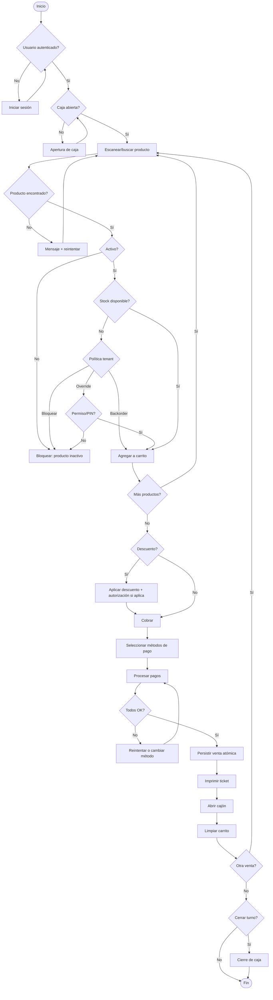

### 14.2 Flujo de venta (offline)

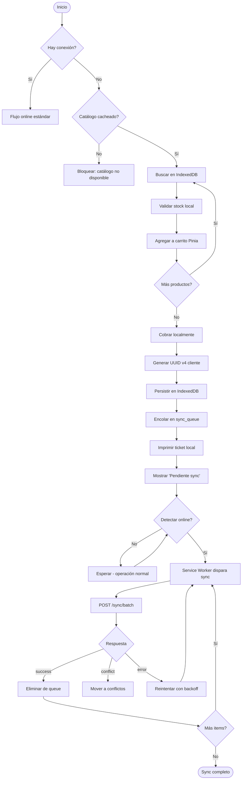

### 14.3 Máquina de estados de Sale

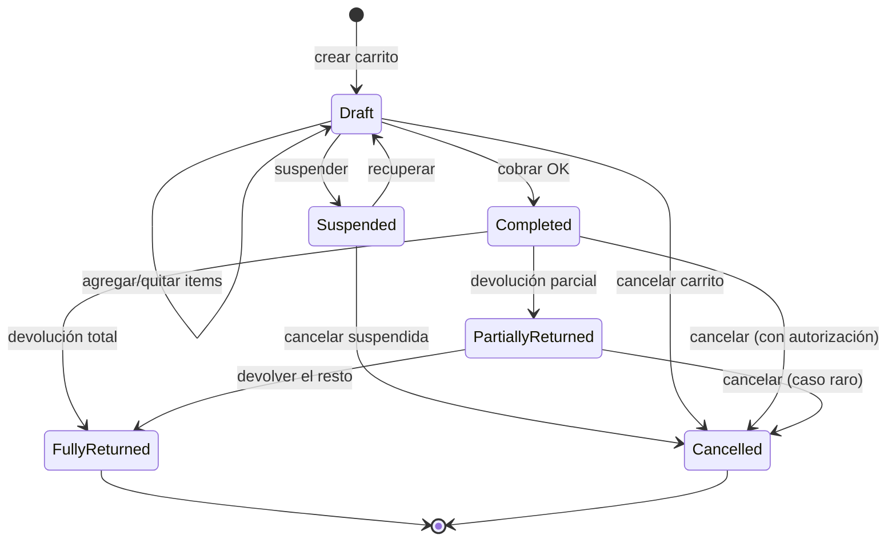

### 14.4 Máquina de estados de CashSession

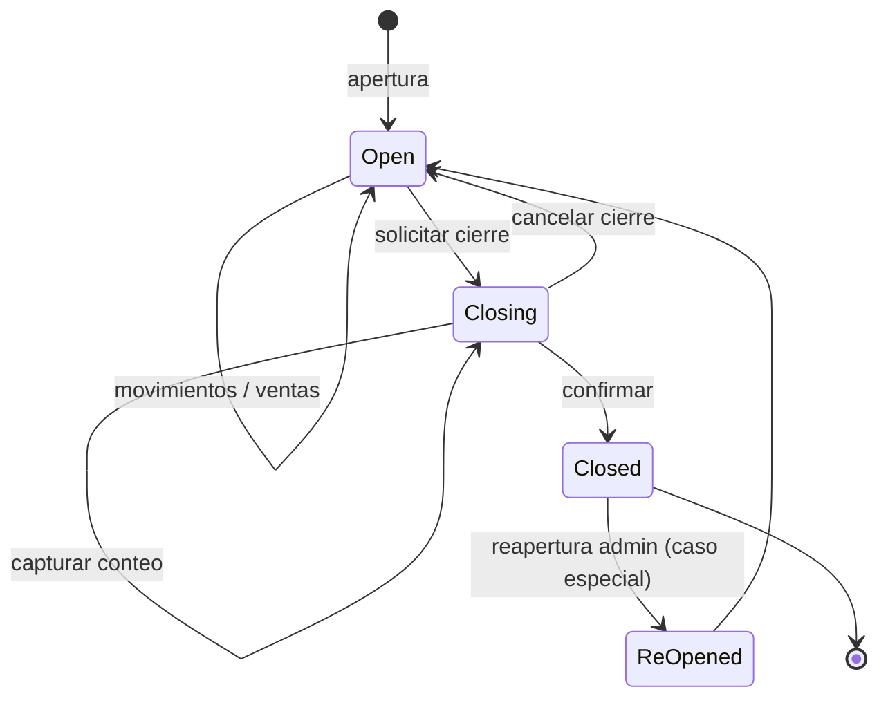

### 14.5 Máquina de estados de Transfer

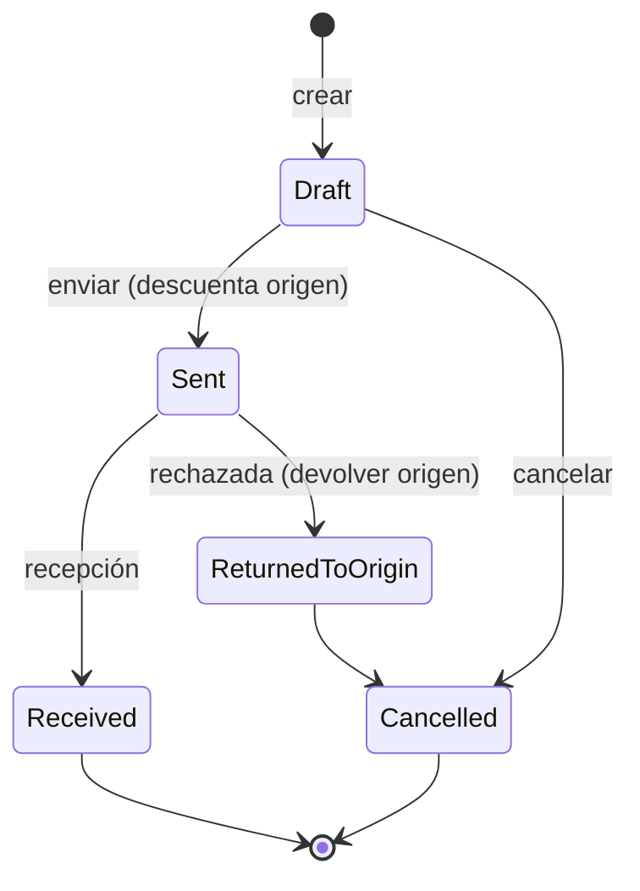

### 14.6 Máquina de estados de PurchaseOrder

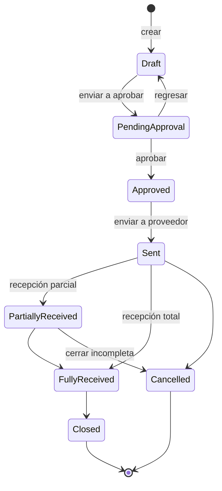

### 14.7 Máquina de estados de Invoice (CFDI)

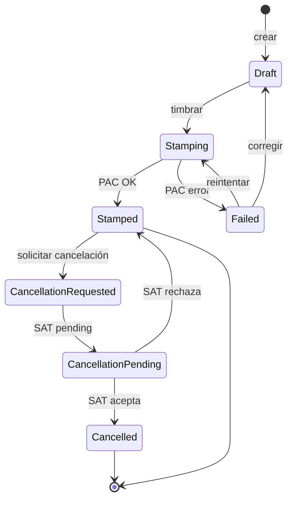

### 14.8 Flujo de sincronización detallado

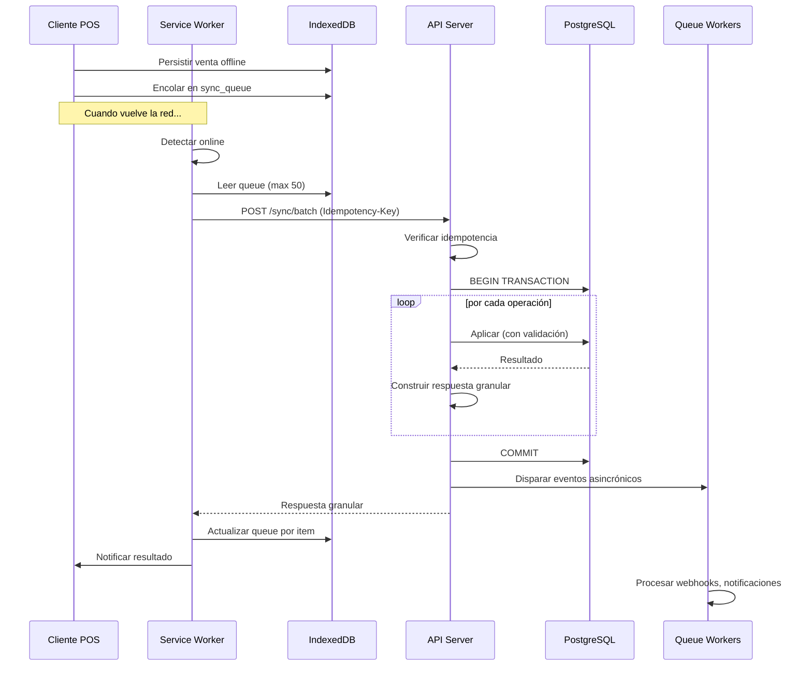

### 14.9 Flujo de resolución de conflictos

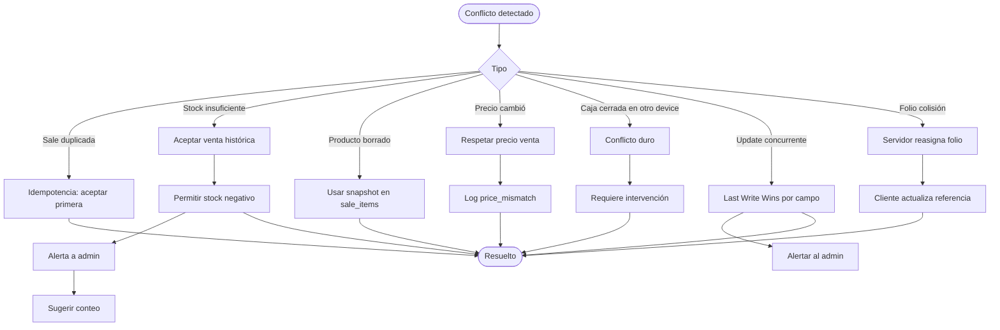

### 14.10 Flujo de cierre de caja

```mermaid
flowchart TD
    Start([Cajero solicita cierre]) --> Suspended{Hay ventas suspendidas?}
    Suspended -- Sí --> Block[Bloquear, mostrar lista]
    Block --> Resolve[Resolver suspendidas]
    Resolve --> Suspended
    Suspended -- No --> Calc[Calcular expected_amount]
    Calc --> ShowSummary[Mostrar resumen]
    ShowSummary --> Capture[Capturar conteo declarado]
    Capture --> Diff[Calcular difference]
    Diff --> Threshold{|diff| > umbral?}
    Threshold -- Sí --> Notify[Notificar gerente]
    Notify --> Confirm{Cajero confirma?}
    Threshold -- No --> Confirm
    Confirm -- Sí --> Persist[Persistir cierre]
    Confirm -- No --> Capture
    Persist --> PrintZ[Imprimir reporte Z]
    PrintZ --> Logout[Logout]
    Logout --> End([Fin])
```

### 14.11 Flujo de recepción de mercancía

```mermaid
flowchart TD
    Start([Inicio]) --> POAssoc{Asociar OC?}
    POAssoc -- Sí --> LoadPO[Cargar OC]
    POAssoc -- No --> NoP O[Recepción libre]
    LoadPO --> Capture[Capturar productos y cantidades]
    NoP --> Capture
    Capture --> LotCheck{Producto con lotes?}
    LotCheck -- Sí --> CaptureLot[Capturar lote y caducidad]
    CaptureLot --> Cost
    LotCheck -- No --> Cost[Capturar costo]
    Cost --> More{Más productos?}
    More -- Sí --> Capture
    More -- No --> Validate[Validar vs OC]
    Validate --> Diff{Diferencias?}
    Diff -- Mayor a OC --> Auth{Autorización}
    Auth -- No --> Reject[Rechazar]
    Auth -- Sí --> Confirm
    Diff -- Menor o igual --> Confirm[Confirmar]
    Confirm --> Persist[Crear documento + movements + batches]
    Persist --> UpdatePO[Actualizar status OC]
    UpdatePO --> Print[Imprimir comprobante]
    Print --> End([Fin])
```

### 14.12 Flujo de devolución

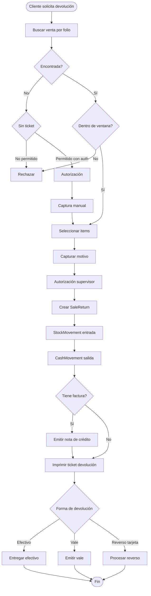

### 14.13 Flujo de timbrado de CFDI

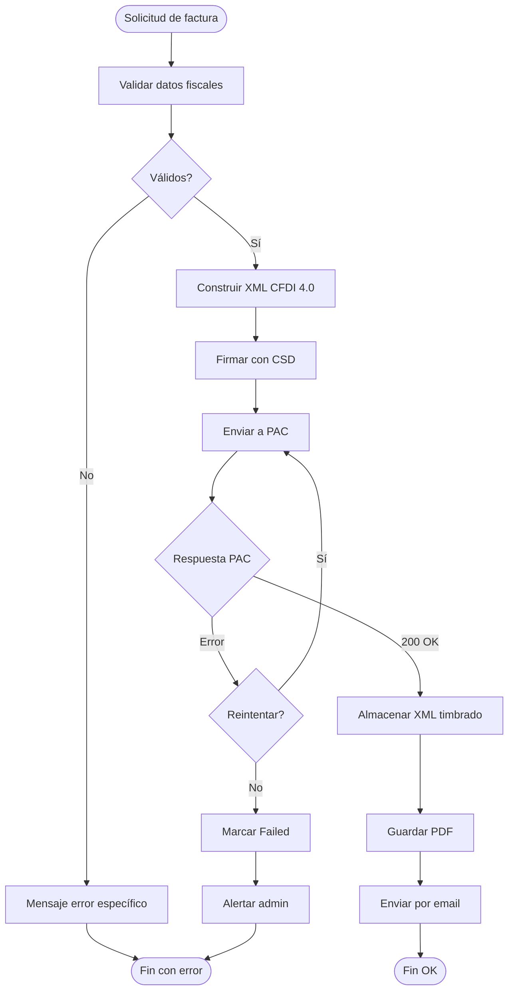

### 14.14 Flujo de onboarding de nuevo tenant

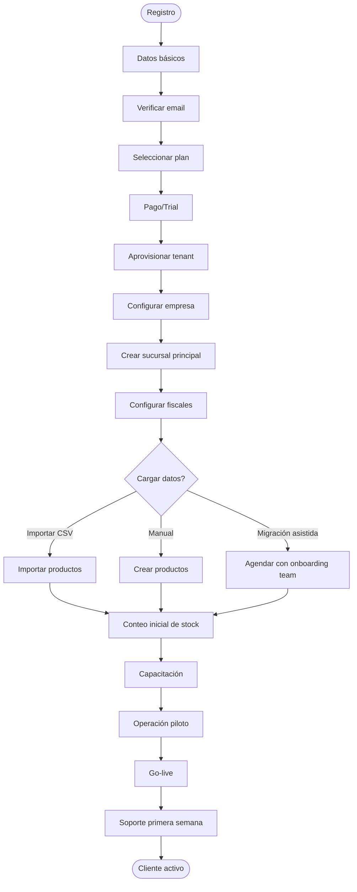


---

# PARTE III — ARQUITECTURA TÉCNICA

## 15. VISTA LÓGICA (módulos)

### 15.1 Modularización

El sistema sigue arquitectura modular monolítica con potencial de separación a microservicios. Cada módulo es un bounded context (sección 9) con:
- Models, Services, Repositories propios
- Migrations en su carpeta
- Routes propios
- Tests propios
- Eventos públicos como contrato

### 15.2 Estructura de directorios (Laravel)

```
app/
├── Core/
│   ├── Concerns/        traits compartidos (HasUuid, BelongsToTenant)
│   ├── Contracts/       interfaces transversales
│   ├── Exceptions/      excepciones del dominio
│   ├── Events/          eventos base
│   ├── Listeners/       listeners base (audit, etc.)
│   ├── Middleware/      tenant resolver, activity logger
│   ├── Services/        servicios transversales
│   └── Support/         helpers
├── Modules/
│   ├── Identity/        usuarios, roles, sesiones, MFA
│   ├── Tenant/          empresas, sucursales, almacenes
│   ├── Catalog/         productos, categorías, marcas
│   ├── Pricing/         listas, promociones, cupones
│   ├── Inventory/       stock, lotes, kardex, conteos
│   ├── Purchasing/      proveedores, OCs, recepciones
│   ├── Sales/           ventas, devoluciones, cotizaciones
│   ├── POS/             orquestación POS, multi-carrito
│   ├── Cash/            sesiones, movimientos, cortes
│   ├── Customer/        clientes, crédito
│   ├── Loyalty/         puntos, niveles
│   ├── Billing/         facturación CFDI
│   ├── Accounting/      contabilidad
│   ├── Sync/            cola, conflictos, dispositivos
│   ├── Reporting/       reportes, dashboards
│   ├── Integration/     webhooks, API pública
│   ├── Marketplace/     apps de terceros
│   └── Notification/    in-app, email, sms, push
└── Shared/
    ├── Casts/           Money, Currency
    ├── Enums/           todos los enums del sistema
    ├── ValueObjects/    objetos de valor
    ├── Validators/      reglas custom
    └── Formatters/

database/
├── migrations/          ordenadas por timestamp
├── seeders/             por módulo
└── factories/           para tests

routes/
├── api/
│   ├── v1/              endpoints v1
│   └── v2/              endpoints v2 (futuro)
├── web.php              admin SPA
└── pos.php              POS SPA

resources/
├── js/
│   ├── admin/           Vue app admin
│   ├── pos/             Vue app POS
│   └── shared/          composables, stores compartidos
├── css/
└── views/

tests/
├── Unit/
├── Feature/
├── Integration/
└── Browser/             Dusk

config/
├── pos.php              configuración del producto
├── multitenant.php
├── sync.php
└── ...

storage/
├── app/
├── framework/
└── logs/
```

### 15.3 Capas de un módulo

```
┌─────────────────────────────────────────────────┐
│  HTTP Layer (Controllers, Requests, Resources)  │
└─────────────────────────────────────────────────┘
                       │
                       ▼
┌─────────────────────────────────────────────────┐
│  Application Layer (Services, Actions, DTOs)    │
└─────────────────────────────────────────────────┘
                       │
                       ▼
┌─────────────────────────────────────────────────┐
│  Domain Layer (Models, Value Objects, Events)   │
└─────────────────────────────────────────────────┘
                       │
                       ▼
┌─────────────────────────────────────────────────┐
│  Infrastructure (Repositories, Queues, Cache)   │
└─────────────────────────────────────────────────┘
```

## 16. VISTA DE PROCESOS

### 16.1 Procesos en runtime

```
┌────────────────────────────────────────────────┐
│ Nginx (reverse proxy + TLS termination)        │
└────────────────────────────────────────────────┘
              │
   ┌──────────┴──────────┐
   ▼                     ▼
┌────────────┐    ┌──────────────────┐
│ PHP-FPM    │    │ Reverb (WebSocket)│
│ (web req)  │    │ (events live)    │
└────────────┘    └──────────────────┘
        │
        ├─► PostgreSQL 16 (datos)
        ├─► Redis 7 (cache, sessions, queue, locks)
        └─► Spaces (S3 - archivos, backups)

┌────────────────────────────────────────────────┐
│ Workers (Horizon)                              │
│  - default queue                               │
│  - sync queue (alta prioridad)                 │
│  - reports queue (baja prioridad)              │
│  - notifications queue                         │
│  - webhooks queue                              │
└────────────────────────────────────────────────┘

┌────────────────────────────────────────────────┐
│ Scheduler (laravel/scheduler)                  │
│  - cron tasks                                  │
└────────────────────────────────────────────────┘
```

### 16.2 Concurrencia

#### Bloqueos optimistas
- Productos, listas de precios: `version` column.
- Si dos editan el mismo producto a la vez: el segundo recibe `409 Conflict` con la versión actual y debe re-leer.

#### Bloqueos pesimistas (selectivos)
- Stock: `SELECT ... FOR UPDATE` en transacción de venta.
- Cash session: lock al cerrar.
- Folio reservation: lock al asignar.

#### Distributed locks
- Redis-based para operaciones cross-process:
  - Sync de un mismo dispositivo: lock para evitar lotes paralelos
  - Generación de folio global: lock corto
  - Recálculo de balance contable: lock largo

### 16.3 Colas

| Cola | Propósito | Workers | Prioridad |
|---|---|---|---|
| `default` | Tareas misceláneas | 4 | media |
| `sync` | Procesamiento de sync_queue | 8 | alta |
| `notifications` | email, SMS, push, WhatsApp | 4 | media |
| `webhooks` | envío con reintentos | 4 | media |
| `reports` | generación pesada | 2 | baja |
| `imports` | importación de CSV grandes | 2 | baja |
| `billing` | timbrado CFDI | 4 | alta |
| `audit` | append a activity_log (si async) | 2 | baja |

### 16.4 Tareas programadas

| Tarea | Frecuencia | Cola |
|---|---|---|
| Backup BD | diaria 03:00 | default |
| Limpieza sesiones expiradas | hourly | default |
| Recálculo de tier loyalty | mensual | default |
| Reorden sugerido | diario 02:00 | default |
| Vencimiento apartados | diario 01:00 | default |
| Vencimiento cotizaciones | diario 01:00 | default |
| Alertas productos por caducar | diario 06:00 | notifications |
| Archivado logs antiguos | mensual | default |
| Refresh de vistas materializadas | cada 5 min | reports |
| Heartbeat sucursales | cada minuto | default |
| Health check externo (PAC, etc.) | cada 5 min | default |

## 17. VISTA DE DESPLIEGUE

### 17.1 Topología por tamaño de cliente

#### Cliente pequeño (1-3 sucursales, hasta 10 terminales)

```
┌──────────────────────────────────────────────┐
│  DigitalOcean Droplet (4vCPU/8GB)            │
│  - Nginx + PHP-FPM + Laravel                 │
│  - PostgreSQL 16                             │
│  - Redis 7                                   │
│  - Horizon workers                           │
│  - Reverb websockets                         │
│  - Backups locales + Spaces                  │
└──────────────────────────────────────────────┘
       │
       ├─ Spaces (250GB) — archivos
       └─ Reserved IP

Costo estimado: ~$92 USD/mes
```

#### Cliente mediano (3-15 sucursales, hasta 50 terminales)

```
┌──────────────────────────┐
│ Load Balancer (DO)       │
└──────────────────────────┘
        │
   ┌────┴────┐
   ▼         ▼
┌─────────┐ ┌─────────┐
│Droplet 1│ │Droplet 2│
│App+Web  │ │App+Web  │
│4vCPU/8GB│ │4vCPU/8GB│
└─────────┘ └─────────┘
        │
        ▼
┌────────────────────┐
│ Managed PostgreSQL │
│ (4GB, 1 réplica)   │
└────────────────────┘
        │
┌────────────────────┐
│ Managed Redis      │
│ (1GB)              │
└────────────────────┘
        │
┌────────────────────┐
│ Spaces 1TB         │
└────────────────────┘

Costo estimado: ~$400 USD/mes
```

#### Cliente Enterprise (50+ sucursales, 100+ terminales)

```
┌────────────────────────┐
│ Cloudflare (CDN+WAF)   │
└────────────────────────┘
            │
┌────────────────────────┐
│ DigitalOcean LB        │
└────────────────────────┘
            │
   ┌────────┼────────┬────────┐
   ▼        ▼        ▼        ▼
┌───────┐┌───────┐┌───────┐┌───────┐
│App-1  ││App-2  ││App-3  ││App-N  │
│DO     ││DO     ││DO     ││DOKS   │
│Droplet││Droplet││Droplet││ pods  │
└───────┘└───────┘└───────┘└───────┘
            │
            ▼
┌─────────────────────────────────┐
│ Managed PostgreSQL HA           │
│ (master + 2 replicas + standby) │
└─────────────────────────────────┘
            │
┌─────────────────────────────────┐
│ Managed Redis HA (cluster mode) │
└─────────────────────────────────┘
            │
┌─────────────────────────────────┐
│ Spaces multi-region             │
└─────────────────────────────────┘

Edge servers en cada sucursal grande:
┌──────────────────────┐
│ Mini-PC en sucursal  │
│ - cache local        │
│ - sync proxy         │
│ - imp. center        │
└──────────────────────┘

Costo estimado: $2,000-5,000+ USD/mes
```

### 17.2 Ambientes

| Ambiente | URL | Datos | Acceso |
|---|---|---|---|
| `local` | localhost | mock | dev |
| `dev` | dev.tu-dominio.com | sintéticos | dev |
| `staging` | staging.tu-dominio.com | copia anonimizada de prod | dev + QA |
| `pre-prod` | preprod.tu-dominio.com | espejo de prod | dev senior + ops |
| `production` | app.tu-dominio.com | reales | clientes |
| `dr` | dr.tu-dominio.com (cold) | replica | activación manual |

## 18. VISTA FÍSICA (hardware)

### 18.1 Hardware del POS

#### Configuración mínima
- CPU: dual core 1.5GHz+
- RAM: 4GB
- Almacenamiento: 32GB SSD
- USB: 4 puertos
- Pantalla: 1024x768 (mejor 1280x800)
- Conectividad: WiFi + Ethernet
- OS: Windows 10+, Ubuntu 22.04+, macOS 11+

#### Configuración recomendada
- CPU: quad core 2.0GHz+
- RAM: 8GB
- Almacenamiento: 128GB SSD
- USB: 6 puertos (incluye al menos 2 USB 3.0)
- Pantalla táctil 15"
- Cajón monedero conectado a impresora
- UPS (no break) integrado o externo

### 18.2 Periféricos soportados

#### Impresoras (tested)
- **Epson:** TM-T20III, TM-T88V, TM-T88VI, TM-m30, TM-P20
- **Star Micronics:** TSP100III, TSP650II, mPOP
- **BIXOLON:** SRP-330II, SRP-Q300, SRP-S300
- **Citizen:** CT-S310II, CT-S801
- **Genéricos ESC/POS:** Xprinter, 3nStar, Itoteck (calidad variable)

#### Conexiones
- USB (preferido)
- Ethernet/Network
- Bluetooth (móvil)
- WiFi (limitado)
- Serial RS-232 (legacy)

#### Scanners (tested)
- **Honeywell:** Voyager 1250g/1450g, Xenon 1900
- **Zebra/Symbol:** LS2208, DS2208
- **Datalogic:** QuickScan QD2400
- **Genéricos HID:** la mayoría funcionan

#### Soporta:
- 1D: EAN-13, EAN-8, UPC-A, UPC-E, Code39, Code93, Code128, ITF, GS1-128
- 2D: QR Code, Data Matrix, PDF417, Aztec
- Códigos de balanza (peso embebido en EAN-13)

#### Cajones monederos
- Cajón estándar conectado a impresora vía RJ-11/RJ-12
- Apertura por pulso (comando ESC `p`)
- Cajón USB independiente (segunda opción)

#### Básculas
- **CAS:** PD-2, PR2 series
- **Toledo (Mettler-Toledo):** Aciros, Tiger
- **Bizerba:** SC-II, BC-II
- Protocolos: serial RS-232, USB-CDC, Ethernet
- Captura de peso: vía agente local que expone WebSocket

#### Pantallas de cliente
- Segundo monitor HDMI
- Display USB pequeño (10")
- Smart TV con Chromecast (kiosk mode)

#### Lectores de tarjeta
- Integrados via SDK del banco (Clip, Mercado Pago Point, Stripe Terminal)
- Independientes: el cajero captura monto en terminal del banco, sistema solo registra referencia

#### NFC / RFID (futuro)
- Lectores de tags para inventario rápido
- Tarjetas de loyalty NFC

## 19. VISTA DE DATOS

### 19.1 Estrategia general

- **PostgreSQL 16** como BD primaria.
- **Redis 7** como cache y queue.
- **MeiliSearch** o **PostgreSQL FTS** para búsqueda de productos.
- **TimescaleDB extension** (opcional) para series temporales (métricas, ventas históricas).
- **Spaces** para archivos (imágenes, PDFs, XMLs, backups).

### 19.2 Multitenancy en BD

**Estrategia: shared database, shared schema con `company_id`.**

Razones:
- Más simple de operar (una BD vs N)
- Escalable hasta miles de tenants
- Backups y migraciones uniformes
- Menos costoso

Riesgo: aislamiento depende de queries; mitigación con global scopes y middleware obligatorio.

**Para Enterprise se ofrece schema separado o BD dedicada.**

### 19.3 Particionamiento

Tablas particionadas:
- `sales` por `company_id` y `branch_id` (sub-particionamiento por mes en clientes grandes)
- `stock_movements` por `company_id` y mes
- `activity_log` por mes
- `sync_queue` por status

### 19.4 Índices clave

- Índice GIN en columnas JSONB (settings, payload)
- Índices compuestos en queries frecuentes (`company_id + branch_id + created_at`)
- Índices parciales (ej: solo registros activos)
- Índices BRIN en tablas de time-series

## 20. PATRONES APLICADOS Y JUSTIFICADOS

| Patrón | Aplicación | Justificación |
|---|---|---|
| **Repository** | Acceso a datos | Aislar Eloquent del Service, facilitar tests |
| **Service Layer** | Lógica de negocio | Controllers delgados, lógica reusable |
| **Action Pattern** | Acciones de un solo propósito | Composable, fácil testing (`spatie/laravel-actions`) |
| **DTO** | Transporte entre capas | Tipado fuerte (`spatie/laravel-data`) |
| **Form Request** | Validación HTTP | Separación de concerns |
| **Event-Driven** | Side effects desacoplados | SaleCompleted dispara stock, caja, notif |
| **Outbox Pattern** | Eventos confiables | Garantía de entrega cuando hay sync |
| **Saga** | Transacciones distribuidas | Sync entre módulos con compensación |
| **CQRS** | Queries vs Commands | Reportes en réplica de lectura |
| **Strategy** | Métodos de costeo, FEFO | Intercambiables por configuración |
| **Observer** | Auditoría automática | Hook a Eloquent events |
| **Specification** | Filtros complejos | Queries componibles (`spatie/laravel-query-builder`) |
| **Decorator** | Cache, logging | Repos decorados sin tocar lógica |
| **Adapter** | Integraciones | PAC, pasarelas de pago, e-commerce |
| **Circuit Breaker** | Calls a externos | Evitar cascada de fallos |
| **Retry with Backoff** | Sync, webhooks, PAC | Resilencia |
| **Idempotency Key** | POSTs críticos | Evitar duplicados |
| **Optimistic Locking** | Edición concurrente | `version` column |
| **Soft Delete** | Borrado lógico | Auditoría |
| **Materialized View** | Reportes pesados | Performance, refresh programado |
| **Read-through cache** | Lectura | Productos, configuración |
| **Write-behind cache** | Escritura | No aplicable a transacciones financieras |
| **Bulk Insert** | Importaciones | Performance |
| **Connection Pooling** | BD | PgBouncer en alto volumen |

## 21. ESTRATEGIA DE MANEJO DE ERRORES

### 21.1 Jerarquía de excepciones

```
\Exception
├── \App\Core\Exceptions\PosException (base)
│   ├── \App\Core\Exceptions\DomainException
│   │   ├── BusinessRuleViolation
│   │   ├── InsufficientStockException
│   │   ├── CashSessionNotOpenException
│   │   ├── DiscountThresholdExceededException
│   │   ├── PriceMismatchException
│   │   └── ...
│   ├── \App\Core\Exceptions\InfrastructureException
│   │   ├── PacUnavailableException
│   │   ├── PaymentGatewayException
│   │   ├── PrinterException
│   │   └── ...
│   ├── \App\Core\Exceptions\AuthorizationException
│   │   ├── InsufficientPermissionsException
│   │   ├── InvalidPinException
│   │   └── ...
│   └── \App\Core\Exceptions\ValidationException
└── ...
```

### 21.2 Manejo por capa

- **Domain:** lanzar excepciones específicas con código y contexto.
- **Service:** capturar y convertir a excepciones de dominio si vienen de infra.
- **Controller:** manejar (delegar a `Handler.php`) y retornar JSON estructurado.
- **Handler:** mapea excepciones a HTTP status y formato de error consistente.

### 21.3 Formato de error

```json
{
  "error": {
    "code": "INSUFFICIENT_STOCK",
    "message": "No hay stock suficiente para el producto X",
    "details": {
      "product_uuid": "...",
      "available": 2,
      "requested": 5
    },
    "trace_id": "trace-abc123",
    "documentation_url": "https://docs.tu-dominio.com/errors/INSUFFICIENT_STOCK"
  }
}
```

### 21.4 Catálogo parcial de códigos de error

| Código | HTTP | Descripción |
|---|---|---|
| `VALIDATION_ERROR` | 422 | Datos de entrada inválidos |
| `INSUFFICIENT_STOCK` | 409 | Stock insuficiente |
| `CASH_SESSION_NOT_OPEN` | 409 | No hay caja abierta |
| `DISCOUNT_THRESHOLD_EXCEEDED` | 403 | Descuento requiere autorización |
| `INVALID_CREDENTIALS` | 401 | Credenciales incorrectas |
| `MFA_REQUIRED` | 401 | Falta MFA |
| `ACCOUNT_LOCKED` | 423 | Cuenta bloqueada |
| `PERMISSION_DENIED` | 403 | Sin permisos |
| `RESOURCE_NOT_FOUND` | 404 | Recurso no existe |
| `RESOURCE_LOCKED` | 423 | Recurso en uso |
| `OPTIMISTIC_LOCK_FAILED` | 409 | Versión desactualizada |
| `IDEMPOTENCY_KEY_REUSED` | 409 | Clave reutilizada con datos diferentes |
| `RATE_LIMIT_EXCEEDED` | 429 | Demasiadas peticiones |
| `PAC_UNAVAILABLE` | 503 | PAC no disponible |
| `PAYMENT_DECLINED` | 402 | Pago rechazado |
| `INVALID_TAX_ID` | 422 | RFC inválido |
| `BARCODE_DUPLICATE` | 409 | Barcode duplicado |
| `SESSION_EXPIRED` | 401 | Sesión vencida |
| `MAINTENANCE_MODE` | 503 | Modo mantenimiento |
| `SERVER_ERROR` | 500 | Error genérico |

## 22. ESTRATEGIA DE TRANSACCIONES DISTRIBUIDAS (SAGA)

### 22.1 Cuándo usar Saga

Cuando una operación abarca múltiples bounded contexts:
- **Crear venta** abarca: Sales, Inventory, Cash, Loyalty, Billing.
- **Sincronización** abarca: Sync, Sales, Inventory, Cash.
- **Cancelación** abarca: todos los anteriores en reversa.

### 22.2 Patrón Choreography vs Orchestration

**Para nosotros: Orchestration con Saga Coordinator.**

Razones:
- Más fácil de razonar
- Auditoría clara del flujo
- Compensaciones explícitas

Choreography (vía eventos puros) se usa para side effects no críticos (notificaciones, analytics).

### 22.3 Ejemplo: Saga de venta

```
SaleSaga:
  Steps:
    1. Reservar stock (Inventory)         → compensate: liberar reserva
    2. Crear venta (Sales)                → compensate: marcar void
    3. Registrar movimiento caja (Cash)   → compensate: reverso movement
    4. Acumular puntos (Loyalty)          → compensate: deducir puntos
    5. Generar factura (Billing) [opc]    → compensate: cancelar factura
    6. Imprimir ticket                    → no compensate (efecto físico)

Si falla en paso N:
  ejecutar compensación de N-1, N-2, ..., 1
```

### 22.4 Implementación

- Tabla `sagas` con estado de cada paso.
- Workers que avanzan saga.
- Timeouts y retries por paso.
- Compensación idempotente.

## 23. CONCURRENCIA Y BLOQUEOS

### 23.1 Casos críticos

- **Stock:** dos cajeros venden el mismo último producto a la vez.
- **Folio:** dos servidores generan el mismo folio.
- **Caja:** intento de cerrar caja mientras alguien registra venta.
- **Producto:** dos admins editan a la vez.

### 23.2 Soluciones

| Problema | Solución |
|---|---|
| Stock | `SELECT ... FOR UPDATE` en transacción de venta |
| Folio | Sequencia PostgreSQL o lock distribuido en Redis |
| Caja en cierre | Lock en `cash_session` + verificar status |
| Edición concurrente | `version` column + 409 Conflict |
| Sync paralelo del mismo dispositivo | Redis lock por device_id |

### 23.3 Deadlocks

- Orden consistente de adquisición de locks.
- Timeouts cortos (5 seg).
- Detección y reintento automático en Postgres.


---

# PARTE IV — MODELO DE DATOS COMPLETO

## 24. CONVENCIONES GENERALES

### 24.1 Convenciones de nomenclatura

- Tablas en plural, snake_case: `products`, `sale_items`.
- Pivotes en orden alfabético: `product_tag`, `role_user`.
- Columnas snake_case: `created_at`, `unit_price`.
- Foreign keys: `<entity>_id` para BIGINT FK, `<entity>_uuid` para UUID FK.
- Booleans: prefijo `is_` o `has_`: `is_active`, `has_expiration`.
- Timestamps: `*_at`: `created_at`, `cancelled_at`.
- JSON: `settings`, `metadata`, `payload`.
- Indices nombrados: `idx_<tabla>_<columnas>`.
- FK constraints nombradas: `fk_<tabla>_<col>`.

### 24.2 Columnas estándar en toda tabla

```sql
id              BIGSERIAL PRIMARY KEY,
uuid            UUID UNIQUE NOT NULL DEFAULT gen_random_uuid(),
created_at      TIMESTAMP WITH TIME ZONE NOT NULL DEFAULT NOW(),
updated_at      TIMESTAMP WITH TIME ZONE NOT NULL DEFAULT NOW(),
deleted_at      TIMESTAMP WITH TIME ZONE NULL,    -- soft delete cuando aplica
created_by      BIGINT NULL REFERENCES users(id),
updated_by      BIGINT NULL REFERENCES users(id)
```

### 24.3 Multi-tenancy en columnas

Toda tabla con datos del tenant lleva:
```sql
company_id      BIGINT NOT NULL REFERENCES companies(id) ON DELETE RESTRICT,
```

Y un global scope en Eloquent que filtra por `company_id` actual.

### 24.4 Sincronización offline en columnas

Tablas que se crean/modifican offline llevan:
```sql
client_uuid     UUID NULL,           -- UUID generado en cliente
device_id       VARCHAR(100) NULL,   -- dispositivo que originó
created_offline BOOLEAN DEFAULT FALSE,
synced_at       TIMESTAMP NULL,      -- cuándo se sincronizó
```

### 24.5 Versionado optimista

Tablas con edición concurrente:
```sql
version         INTEGER NOT NULL DEFAULT 1
```

Update se hace con `WHERE version = ?` y se incrementa.

## 25. DIAGRAMA ER (alto nivel)

> El diagrama completo se mantiene en `08_anexos/er_diagram.dbml` (formato dbdiagram.io). Aquí la vista de alto nivel.

```
┌─────────────┐        ┌─────────────┐
│ companies   │───┬───►│ branches    │
└─────────────┘   │    └─────────────┘
                  │           │
                  │           ▼
                  │    ┌─────────────┐    ┌──────────────┐
                  │    │ warehouses  │    │ cash_registers│
                  │    └─────────────┘    └──────────────┘
                  │                              │
                  │                              ▼
                  │                       ┌──────────────┐
                  │                       │cash_sessions │
                  │                       └──────────────┘
                  │                              │
   ┌──────────────┼──────────────────┐           │
   ▼              ▼                  ▼           │
┌──────┐  ┌────────────┐    ┌────────────┐       │
│ users│  │ products   │    │ customers  │       │
└──────┘  └────────────┘    └────────────┘       │
   │             │                 │             │
   │             ├──► product_     │             │
   │             │    barcodes     │             │
   │             │                 │             │
   │             ├──► product_     │             │
   │             │    batches      │             │
   │             │                 │             │
   │             ├──► stocks ◄─────┼─── (branch) │
   │             │                 │             │
   │             ├──► price_lists  │             │
   │             │                 │             │
   │             ▼                 ▼             ▼
   │      ┌────────────────────────────────────────┐
   └─────►│              sales                     │
          └────────────────────────────────────────┘
                      │
            ┌─────────┼─────────┬──────────────┐
            ▼         ▼         ▼              ▼
       sale_items  sale_      sale_returns   stock_
                   payments                  movements
```

## 26. DDL COMPLETO

> El DDL completo está en `08_anexos/schema.sql` como SQL ejecutable. Aquí se documentan las tablas más relevantes con explicaciones.

### 26.1 Identity & Access

```sql
-- USUARIOS
CREATE TABLE users (
    id                  BIGSERIAL PRIMARY KEY,
    uuid                UUID UNIQUE NOT NULL DEFAULT gen_random_uuid(),
    company_id          BIGINT NOT NULL REFERENCES companies(id) ON DELETE RESTRICT,
    default_branch_id   BIGINT NULL REFERENCES branches(id) ON DELETE SET NULL,
    name                VARCHAR(180) NOT NULL,
    email               VARCHAR(180) NOT NULL,
    email_verified_at   TIMESTAMPTZ NULL,
    password            VARCHAR(255) NOT NULL,
    pin                 VARCHAR(255) NULL,
    avatar_url          VARCHAR(500) NULL,
    locale              VARCHAR(10) NOT NULL DEFAULT 'es',
    timezone            VARCHAR(64) NOT NULL DEFAULT 'America/Mexico_City',
    is_active           BOOLEAN NOT NULL DEFAULT TRUE,
    is_super_admin      BOOLEAN NOT NULL DEFAULT FALSE,
    last_login_at       TIMESTAMPTZ NULL,
    last_login_ip       INET NULL,
    last_login_device   VARCHAR(100) NULL,
    failed_attempts     SMALLINT NOT NULL DEFAULT 0,
    locked_until        TIMESTAMPTZ NULL,
    password_changed_at TIMESTAMPTZ NOT NULL DEFAULT NOW(),
    must_change_password BOOLEAN NOT NULL DEFAULT FALSE,
    mfa_enabled         BOOLEAN NOT NULL DEFAULT FALSE,
    mfa_secret          VARCHAR(255) NULL,           -- cifrado
    mfa_recovery_codes  TEXT NULL,                   -- cifrado, JSON
    settings            JSONB NOT NULL DEFAULT '{}',
    remember_token      VARCHAR(100) NULL,
    version             INTEGER NOT NULL DEFAULT 1,
    created_at          TIMESTAMPTZ NOT NULL DEFAULT NOW(),
    updated_at          TIMESTAMPTZ NOT NULL DEFAULT NOW(),
    deleted_at          TIMESTAMPTZ NULL,
    created_by          BIGINT NULL,
    updated_by          BIGINT NULL,
    UNIQUE (company_id, email)
);

CREATE INDEX idx_users_company_email ON users(company_id, email) WHERE deleted_at IS NULL;
CREATE INDEX idx_users_email_active ON users(email) WHERE is_active = TRUE AND deleted_at IS NULL;

-- SESIONES (Sanctum + custom)
CREATE TABLE personal_access_tokens (
    id                  BIGSERIAL PRIMARY KEY,
    tokenable_type      VARCHAR(255) NOT NULL,
    tokenable_id        BIGINT NOT NULL,
    name                VARCHAR(255) NOT NULL,
    token               VARCHAR(64) UNIQUE NOT NULL,
    abilities           TEXT NULL,
    last_used_at        TIMESTAMPTZ NULL,
    expires_at          TIMESTAMPTZ NULL,
    device_id           VARCHAR(100) NULL,
    ip_address          INET NULL,
    user_agent          TEXT NULL,
    created_at          TIMESTAMPTZ NOT NULL DEFAULT NOW(),
    updated_at          TIMESTAMPTZ NOT NULL DEFAULT NOW()
);

CREATE INDEX idx_pat_tokenable ON personal_access_tokens(tokenable_type, tokenable_id);

-- ROLES Y PERMISOS (spatie/laravel-permission)
CREATE TABLE roles (
    id          BIGSERIAL PRIMARY KEY,
    company_id  BIGINT NULL REFERENCES companies(id),
    name        VARCHAR(125) NOT NULL,
    guard_name  VARCHAR(125) NOT NULL,
    description TEXT NULL,
    is_system   BOOLEAN NOT NULL DEFAULT FALSE,
    created_at  TIMESTAMPTZ NOT NULL DEFAULT NOW(),
    updated_at  TIMESTAMPTZ NOT NULL DEFAULT NOW()
);

CREATE TABLE permissions (
    id          BIGSERIAL PRIMARY KEY,
    name        VARCHAR(125) UNIQUE NOT NULL,
    guard_name  VARCHAR(125) NOT NULL,
    module      VARCHAR(60) NOT NULL,
    description TEXT NULL,
    created_at  TIMESTAMPTZ NOT NULL DEFAULT NOW(),
    updated_at  TIMESTAMPTZ NOT NULL DEFAULT NOW()
);

CREATE TABLE role_user (
    role_id     BIGINT NOT NULL REFERENCES roles(id) ON DELETE CASCADE,
    user_id     BIGINT NOT NULL REFERENCES users(id) ON DELETE CASCADE,
    branch_id   BIGINT NULL REFERENCES branches(id) ON DELETE CASCADE,
    PRIMARY KEY (role_id, user_id, branch_id)
);

CREATE TABLE permission_role (
    permission_id   BIGINT NOT NULL REFERENCES permissions(id) ON DELETE CASCADE,
    role_id         BIGINT NOT NULL REFERENCES roles(id) ON DELETE CASCADE,
    PRIMARY KEY (permission_id, role_id)
);
```

### 26.2 Tenant & Organización

```sql
CREATE TABLE companies (
    id                  BIGSERIAL PRIMARY KEY,
    uuid                UUID UNIQUE NOT NULL DEFAULT gen_random_uuid(),
    name                VARCHAR(180) NOT NULL,
    legal_name          VARCHAR(180) NULL,
    tax_id              VARCHAR(40) NULL,
    tax_regime          VARCHAR(20) NULL,
    country             CHAR(2) NOT NULL DEFAULT 'MX',
    state               VARCHAR(60) NULL,
    city                VARCHAR(120) NULL,
    address             TEXT NULL,
    postal_code         VARCHAR(10) NULL,
    phone               VARCHAR(40) NULL,
    email               VARCHAR(180) NULL,
    website             VARCHAR(180) NULL,
    logo_url            VARCHAR(500) NULL,
    currency            CHAR(3) NOT NULL DEFAULT 'MXN',
    timezone            VARCHAR(64) NOT NULL DEFAULT 'America/Mexico_City',
    locale              VARCHAR(10) NOT NULL DEFAULT 'es',
    plan                VARCHAR(40) NOT NULL DEFAULT 'free',
    plan_expires_at     TIMESTAMPTZ NULL,
    trial_ends_at       TIMESTAMPTZ NULL,
    is_active           BOOLEAN NOT NULL DEFAULT TRUE,
    suspended_at        TIMESTAMPTZ NULL,
    suspension_reason   TEXT NULL,
    settings            JSONB NOT NULL DEFAULT '{}',
    fiscal_settings     JSONB NOT NULL DEFAULT '{}',
    created_at          TIMESTAMPTZ NOT NULL DEFAULT NOW(),
    updated_at          TIMESTAMPTZ NOT NULL DEFAULT NOW(),
    deleted_at          TIMESTAMPTZ NULL
);

CREATE INDEX idx_companies_active ON companies(is_active) WHERE deleted_at IS NULL;

CREATE TABLE branches (
    id              BIGSERIAL PRIMARY KEY,
    uuid            UUID UNIQUE NOT NULL DEFAULT gen_random_uuid(),
    company_id      BIGINT NOT NULL REFERENCES companies(id) ON DELETE RESTRICT,
    code            VARCHAR(20) NOT NULL,
    name            VARCHAR(180) NOT NULL,
    legal_name      VARCHAR(180) NULL,
    tax_id          VARCHAR(40) NULL,
    address         TEXT NULL,
    city            VARCHAR(120) NULL,
    state           VARCHAR(60) NULL,
    postal_code     VARCHAR(10) NULL,
    country         CHAR(2) NULL,
    phone           VARCHAR(40) NULL,
    email           VARCHAR(180) NULL,
    timezone        VARCHAR(64) NULL,
    is_main         BOOLEAN NOT NULL DEFAULT FALSE,
    is_active       BOOLEAN NOT NULL DEFAULT TRUE,
    settings        JSONB NOT NULL DEFAULT '{}',
    folio_prefix    VARCHAR(10) NULL,
    folio_next      INTEGER NOT NULL DEFAULT 1,
    created_at      TIMESTAMPTZ NOT NULL DEFAULT NOW(),
    updated_at      TIMESTAMPTZ NOT NULL DEFAULT NOW(),
    deleted_at      TIMESTAMPTZ NULL,
    UNIQUE (company_id, code)
);

CREATE TABLE warehouses (
    id              BIGSERIAL PRIMARY KEY,
    uuid            UUID UNIQUE NOT NULL DEFAULT gen_random_uuid(),
    company_id      BIGINT NOT NULL REFERENCES companies(id),
    branch_id       BIGINT NULL REFERENCES branches(id),
    code            VARCHAR(20) NOT NULL,
    name            VARCHAR(120) NOT NULL,
    type            VARCHAR(20) NOT NULL DEFAULT 'standard',
    address         TEXT NULL,
    is_active       BOOLEAN DEFAULT TRUE,
    created_at      TIMESTAMPTZ NOT NULL DEFAULT NOW(),
    updated_at      TIMESTAMPTZ NOT NULL DEFAULT NOW(),
    UNIQUE (company_id, code)
);

CREATE TABLE locations (
    id              BIGSERIAL PRIMARY KEY,
    warehouse_id    BIGINT NOT NULL REFERENCES warehouses(id) ON DELETE CASCADE,
    code            VARCHAR(40) NOT NULL,
    description     VARCHAR(120) NULL,
    aisle           VARCHAR(10) NULL,
    rack            VARCHAR(10) NULL,
    level           VARCHAR(10) NULL,
    UNIQUE (warehouse_id, code)
);
```

### 26.3 Catálogo

```sql
CREATE TABLE categories (
    id              BIGSERIAL PRIMARY KEY,
    uuid            UUID UNIQUE NOT NULL DEFAULT gen_random_uuid(),
    company_id      BIGINT NOT NULL REFERENCES companies(id),
    parent_id       BIGINT NULL REFERENCES categories(id) ON DELETE SET NULL,
    name            VARCHAR(120) NOT NULL,
    slug            VARCHAR(140) NOT NULL,
    description     TEXT NULL,
    image_url       VARCHAR(500) NULL,
    position        INTEGER NOT NULL DEFAULT 0,
    is_active       BOOLEAN DEFAULT TRUE,
    created_at      TIMESTAMPTZ NOT NULL DEFAULT NOW(),
    updated_at      TIMESTAMPTZ NOT NULL DEFAULT NOW(),
    deleted_at      TIMESTAMPTZ NULL,
    UNIQUE (company_id, slug)
);

CREATE TABLE brands (
    id              BIGSERIAL PRIMARY KEY,
    uuid            UUID UNIQUE NOT NULL DEFAULT gen_random_uuid(),
    company_id      BIGINT NOT NULL REFERENCES companies(id),
    name            VARCHAR(120) NOT NULL,
    logo_url        VARCHAR(500) NULL,
    is_active       BOOLEAN DEFAULT TRUE,
    created_at      TIMESTAMPTZ NOT NULL DEFAULT NOW(),
    updated_at      TIMESTAMPTZ NOT NULL DEFAULT NOW(),
    UNIQUE (company_id, name)
);

CREATE TABLE units (
    id              BIGSERIAL PRIMARY KEY,
    company_id      BIGINT NOT NULL REFERENCES companies(id),
    code            VARCHAR(10) NOT NULL,
    name            VARCHAR(60) NOT NULL,
    symbol          VARCHAR(10) NULL,
    type            VARCHAR(20) NOT NULL DEFAULT 'unit', -- unit, weight, volume, length
    allow_decimal   BOOLEAN NOT NULL DEFAULT FALSE,
    decimal_places  SMALLINT NOT NULL DEFAULT 0,
    UNIQUE (company_id, code)
);

CREATE TABLE taxes (
    id              BIGSERIAL PRIMARY KEY,
    company_id      BIGINT NOT NULL REFERENCES companies(id),
    code            VARCHAR(20) NOT NULL,
    name            VARCHAR(60) NOT NULL,
    rate            NUMERIC(7,4) NOT NULL,           -- 0.1600
    type            VARCHAR(20) NOT NULL,            -- vat, ieps, withholding
    is_included     BOOLEAN NOT NULL DEFAULT TRUE,
    is_active       BOOLEAN NOT NULL DEFAULT TRUE,
    sat_code        VARCHAR(10) NULL,                 -- código fiscal
    UNIQUE (company_id, code)
);

CREATE TABLE products (
    id                  BIGSERIAL PRIMARY KEY,
    uuid                UUID UNIQUE NOT NULL DEFAULT gen_random_uuid(),
    company_id          BIGINT NOT NULL REFERENCES companies(id),
    sku                 VARCHAR(60) NOT NULL,
    barcode             VARCHAR(60) NOT NULL,
    name                VARCHAR(255) NOT NULL,
    description         TEXT NULL,
    short_description   VARCHAR(500) NULL,
    category_id         BIGINT NULL REFERENCES categories(id),
    brand_id            BIGINT NULL REFERENCES brands(id),
    unit_id             BIGINT NOT NULL REFERENCES units(id),
    tax_id              BIGINT NOT NULL REFERENCES taxes(id),
    parent_product_id   BIGINT NULL REFERENCES products(id),  -- variantes
    type                VARCHAR(20) NOT NULL DEFAULT 'simple', -- simple, variant, combo, kit, service
    sat_product_code    VARCHAR(20) NULL,                       -- clave SAT
    price_cost          NUMERIC(14,4) NOT NULL DEFAULT 0,
    price_retail        NUMERIC(14,4) NOT NULL DEFAULT 0,
    price_wholesale     NUMERIC(14,4) NULL,
    wholesale_min_qty   NUMERIC(12,3) NULL,
    min_stock           NUMERIC(12,3) NOT NULL DEFAULT 0,
    max_stock           NUMERIC(12,3) NULL,
    reorder_point       NUMERIC(12,3) NULL,
    reorder_quantity    NUMERIC(12,3) NULL,
    has_expiration      BOOLEAN NOT NULL DEFAULT FALSE,
    tracks_lots         BOOLEAN NOT NULL DEFAULT FALSE,
    tracks_serial       BOOLEAN NOT NULL DEFAULT FALSE,
    is_weighable        BOOLEAN NOT NULL DEFAULT FALSE,
    is_service          BOOLEAN NOT NULL DEFAULT FALSE,
    requires_age_verification BOOLEAN NOT NULL DEFAULT FALSE,
    allow_backorder     BOOLEAN NOT NULL DEFAULT FALSE,
    is_active           BOOLEAN NOT NULL DEFAULT TRUE,
    is_published_online BOOLEAN NOT NULL DEFAULT FALSE,
    weight_grams        NUMERIC(10,2) NULL,
    dimensions          JSONB NULL,                  -- {length, width, height, unit}
    image_url           VARCHAR(500) NULL,
    images              JSONB DEFAULT '[]',          -- array de URLs
    attributes          JSONB DEFAULT '{}',          -- atributos personalizados
    metadata            JSONB DEFAULT '{}',
    version             INTEGER NOT NULL DEFAULT 1,
    created_at          TIMESTAMPTZ NOT NULL DEFAULT NOW(),
    updated_at          TIMESTAMPTZ NOT NULL DEFAULT NOW(),
    deleted_at          TIMESTAMPTZ NULL,
    UNIQUE (company_id, sku),
    UNIQUE (company_id, barcode)
);

CREATE INDEX idx_products_active ON products(company_id, is_active) WHERE deleted_at IS NULL;
CREATE INDEX idx_products_barcode ON products(barcode);
CREATE INDEX idx_products_category ON products(category_id) WHERE deleted_at IS NULL;
CREATE INDEX idx_products_search ON products USING GIN(to_tsvector('spanish', name || ' ' || COALESCE(description, '')));
CREATE INDEX idx_products_attributes ON products USING GIN(attributes);

CREATE TABLE product_barcodes (
    id              BIGSERIAL PRIMARY KEY,
    product_id      BIGINT NOT NULL REFERENCES products(id) ON DELETE CASCADE,
    barcode         VARCHAR(60) NOT NULL,
    unit_id         BIGINT NULL REFERENCES units(id),
    quantity        NUMERIC(12,3) NOT NULL DEFAULT 1,
    is_primary      BOOLEAN NOT NULL DEFAULT FALSE,
    UNIQUE (barcode)
);

CREATE TABLE product_images (
    id              BIGSERIAL PRIMARY KEY,
    product_id      BIGINT NOT NULL REFERENCES products(id) ON DELETE CASCADE,
    url             VARCHAR(500) NOT NULL,
    position        INTEGER NOT NULL DEFAULT 0,
    is_primary      BOOLEAN NOT NULL DEFAULT FALSE,
    alt_text        VARCHAR(255) NULL
);

CREATE TABLE product_components (
    -- para combos y kits
    id              BIGSERIAL PRIMARY KEY,
    parent_product_id  BIGINT NOT NULL REFERENCES products(id) ON DELETE CASCADE,
    component_product_id BIGINT NOT NULL REFERENCES products(id),
    quantity        NUMERIC(12,3) NOT NULL,
    is_optional     BOOLEAN NOT NULL DEFAULT FALSE,
    position        INTEGER NOT NULL DEFAULT 0
);

CREATE TABLE product_suppliers (
    id              BIGSERIAL PRIMARY KEY,
    product_id      BIGINT NOT NULL REFERENCES products(id) ON DELETE CASCADE,
    supplier_id     BIGINT NOT NULL REFERENCES suppliers(id) ON DELETE CASCADE,
    supplier_sku    VARCHAR(60) NULL,
    cost            NUMERIC(14,4) NULL,
    lead_time_days  INTEGER NULL,
    is_preferred    BOOLEAN NOT NULL DEFAULT FALSE,
    UNIQUE (product_id, supplier_id)
);

CREATE TABLE product_price_history (
    id              BIGSERIAL PRIMARY KEY,
    product_id      BIGINT NOT NULL REFERENCES products(id),
    field           VARCHAR(40) NOT NULL,        -- price_retail, price_cost, etc.
    old_value       NUMERIC(14,4),
    new_value       NUMERIC(14,4),
    changed_by      BIGINT NULL REFERENCES users(id),
    changed_at      TIMESTAMPTZ NOT NULL DEFAULT NOW()
);

CREATE INDEX idx_product_price_history ON product_price_history(product_id, changed_at DESC);
```

### 26.4 Pricing

```sql
CREATE TABLE price_lists (
    id              BIGSERIAL PRIMARY KEY,
    uuid            UUID UNIQUE NOT NULL DEFAULT gen_random_uuid(),
    company_id      BIGINT NOT NULL REFERENCES companies(id),
    name            VARCHAR(120) NOT NULL,
    code            VARCHAR(40) NOT NULL,
    channel         VARCHAR(40) NOT NULL DEFAULT 'pos',  -- pos, online, wholesale
    currency        CHAR(3) NOT NULL,
    priority        INTEGER NOT NULL DEFAULT 0,
    is_active       BOOLEAN NOT NULL DEFAULT TRUE,
    valid_from      TIMESTAMPTZ NULL,
    valid_until     TIMESTAMPTZ NULL,
    UNIQUE (company_id, code)
);

CREATE TABLE price_list_items (
    id              BIGSERIAL PRIMARY KEY,
    price_list_id   BIGINT NOT NULL REFERENCES price_lists(id) ON DELETE CASCADE,
    product_id      BIGINT NOT NULL REFERENCES products(id),
    price           NUMERIC(14,4) NOT NULL,
    UNIQUE (price_list_id, product_id)
);

CREATE TABLE customer_price_lists (
    customer_id     BIGINT NOT NULL REFERENCES customers(id) ON DELETE CASCADE,
    price_list_id   BIGINT NOT NULL REFERENCES price_lists(id) ON DELETE CASCADE,
    PRIMARY KEY (customer_id, price_list_id)
);

CREATE TABLE promotions (
    id              BIGSERIAL PRIMARY KEY,
    uuid            UUID UNIQUE NOT NULL DEFAULT gen_random_uuid(),
    company_id      BIGINT NOT NULL REFERENCES companies(id),
    name            VARCHAR(180) NOT NULL,
    type            VARCHAR(40) NOT NULL,  -- percent_off, fixed_off, buy_x_get_y, bundle
    valid_from      TIMESTAMPTZ NOT NULL,
    valid_until     TIMESTAMPTZ NOT NULL,
    rules           JSONB NOT NULL,        -- definición específica del tipo
    applicable_channels JSONB DEFAULT '[]',
    applicable_branches JSONB DEFAULT '[]',
    max_uses        INTEGER NULL,
    uses_count      INTEGER NOT NULL DEFAULT 0,
    priority        INTEGER NOT NULL DEFAULT 0,
    is_active       BOOLEAN NOT NULL DEFAULT TRUE,
    created_at      TIMESTAMPTZ NOT NULL DEFAULT NOW(),
    updated_at      TIMESTAMPTZ NOT NULL DEFAULT NOW()
);

CREATE TABLE coupons (
    id              BIGSERIAL PRIMARY KEY,
    uuid            UUID UNIQUE NOT NULL DEFAULT gen_random_uuid(),
    company_id      BIGINT NOT NULL REFERENCES companies(id),
    code            VARCHAR(40) NOT NULL,
    promotion_id    BIGINT NULL REFERENCES promotions(id),
    discount_type   VARCHAR(20) NOT NULL,  -- percent, fixed
    discount_value  NUMERIC(10,4) NOT NULL,
    min_purchase    NUMERIC(14,2) NULL,
    valid_from      TIMESTAMPTZ NULL,
    valid_until     TIMESTAMPTZ NULL,
    max_uses        INTEGER NULL,
    uses_count      INTEGER NOT NULL DEFAULT 0,
    max_per_customer INTEGER NULL,
    is_single_use   BOOLEAN NOT NULL DEFAULT FALSE,
    customer_id     BIGINT NULL REFERENCES customers(id),
    is_active       BOOLEAN NOT NULL DEFAULT TRUE,
    created_at      TIMESTAMPTZ NOT NULL DEFAULT NOW(),
    UNIQUE (company_id, code)
);

CREATE TABLE coupon_uses (
    id              BIGSERIAL PRIMARY KEY,
    coupon_id       BIGINT NOT NULL REFERENCES coupons(id),
    customer_id     BIGINT NULL REFERENCES customers(id),
    sale_id         BIGINT NULL REFERENCES sales(id),
    used_at         TIMESTAMPTZ NOT NULL DEFAULT NOW()
);
```

### 26.5 Inventario

```sql
CREATE TABLE stocks (
    id                  BIGSERIAL PRIMARY KEY,
    product_id          BIGINT NOT NULL REFERENCES products(id),
    branch_id           BIGINT NOT NULL REFERENCES branches(id),
    warehouse_id        BIGINT NULL REFERENCES warehouses(id),
    location_id         BIGINT NULL REFERENCES locations(id),
    quantity            NUMERIC(14,3) NOT NULL DEFAULT 0,
    quantity_reserved   NUMERIC(14,3) NOT NULL DEFAULT 0,
    quantity_in_transit NUMERIC(14,3) NOT NULL DEFAULT 0,
    average_cost        NUMERIC(14,4) NOT NULL DEFAULT 0,
    last_movement_at    TIMESTAMPTZ NULL,
    last_received_at    TIMESTAMPTZ NULL,
    last_sold_at        TIMESTAMPTZ NULL,
    version             INTEGER NOT NULL DEFAULT 1,
    updated_at          TIMESTAMPTZ NOT NULL DEFAULT NOW(),
    UNIQUE (product_id, branch_id, warehouse_id, location_id)
);

CREATE INDEX idx_stocks_branch_product ON stocks(branch_id, product_id);
CREATE INDEX idx_stocks_low ON stocks(branch_id) WHERE quantity <= 0;

CREATE TABLE product_batches (
    id                  BIGSERIAL PRIMARY KEY,
    uuid                UUID UNIQUE NOT NULL DEFAULT gen_random_uuid(),
    product_id          BIGINT NOT NULL REFERENCES products(id),
    branch_id           BIGINT NOT NULL REFERENCES branches(id),
    warehouse_id        BIGINT NULL REFERENCES warehouses(id),
    lot_number          VARCHAR(60) NULL,
    expiration_date     DATE NULL,
    received_date       DATE NOT NULL,
    received_quantity   NUMERIC(14,3) NOT NULL,
    quantity            NUMERIC(14,3) NOT NULL,
    cost                NUMERIC(14,4) NOT NULL,
    supplier_id         BIGINT NULL REFERENCES suppliers(id),
    purchase_order_id   BIGINT NULL REFERENCES purchase_orders(id),
    notes               TEXT NULL,
    created_at          TIMESTAMPTZ NOT NULL DEFAULT NOW(),
    updated_at          TIMESTAMPTZ NOT NULL DEFAULT NOW()
);

CREATE INDEX idx_batches_product_branch_exp ON product_batches(product_id, branch_id, expiration_date) WHERE quantity > 0;

CREATE TABLE serial_numbers (
    id                  BIGSERIAL PRIMARY KEY,
    product_id          BIGINT NOT NULL REFERENCES products(id),
    branch_id           BIGINT NOT NULL REFERENCES branches(id),
    serial              VARCHAR(120) NOT NULL,
    status              VARCHAR(20) NOT NULL DEFAULT 'in_stock', -- in_stock, sold, returned, defective
    received_date       DATE NULL,
    sold_date           DATE NULL,
    sale_item_id        BIGINT NULL REFERENCES sale_items(id),
    cost                NUMERIC(14,4) NULL,
    notes               TEXT NULL,
    created_at          TIMESTAMPTZ NOT NULL DEFAULT NOW(),
    UNIQUE (product_id, serial)
);

CREATE TABLE inventory_documents (
    id                  BIGSERIAL PRIMARY KEY,
    uuid                UUID UNIQUE NOT NULL DEFAULT gen_random_uuid(),
    company_id          BIGINT NOT NULL REFERENCES companies(id),
    branch_id           BIGINT NOT NULL REFERENCES branches(id),
    warehouse_id        BIGINT NULL REFERENCES warehouses(id),
    type                VARCHAR(20) NOT NULL, -- in, out, adjust, count
    folio               VARCHAR(40) NOT NULL,
    reason_code         VARCHAR(40) NOT NULL,
    reason_description  TEXT NULL,
    supplier_id         BIGINT NULL REFERENCES suppliers(id),
    purchase_order_id   BIGINT NULL REFERENCES purchase_orders(id),
    user_id             BIGINT NOT NULL REFERENCES users(id),
    approved_by         BIGINT NULL REFERENCES users(id),
    approved_at         TIMESTAMPTZ NULL,
    total_cost          NUMERIC(14,2) NOT NULL DEFAULT 0,
    items_count         INTEGER NOT NULL DEFAULT 0,
    status              VARCHAR(20) NOT NULL DEFAULT 'completed',
    notes               TEXT NULL,
    client_uuid         UUID NULL,
    device_id           VARCHAR(100) NULL,
    created_offline     BOOLEAN DEFAULT FALSE,
    synced_at           TIMESTAMPTZ NULL,
    created_at          TIMESTAMPTZ NOT NULL DEFAULT NOW(),
    updated_at          TIMESTAMPTZ NOT NULL DEFAULT NOW(),
    UNIQUE (company_id, folio)
);

CREATE INDEX idx_inv_docs_branch_date ON inventory_documents(branch_id, created_at DESC);

CREATE TABLE inventory_document_items (
    id                  BIGSERIAL PRIMARY KEY,
    inventory_document_id BIGINT NOT NULL REFERENCES inventory_documents(id) ON DELETE CASCADE,
    product_id          BIGINT NOT NULL REFERENCES products(id),
    batch_id            BIGINT NULL REFERENCES product_batches(id),
    quantity            NUMERIC(14,3) NOT NULL,
    unit_cost           NUMERIC(14,4) NOT NULL DEFAULT 0,
    total_cost          NUMERIC(14,2) NOT NULL DEFAULT 0,
    expiration_date     DATE NULL,
    lot_number          VARCHAR(60) NULL,
    serial_numbers      JSONB DEFAULT '[]',
    notes               TEXT NULL
);

CREATE TABLE stock_movements (
    id                  BIGSERIAL,
    uuid                UUID NOT NULL DEFAULT gen_random_uuid(),
    company_id          BIGINT NOT NULL REFERENCES companies(id),
    product_id          BIGINT NOT NULL REFERENCES products(id),
    branch_id           BIGINT NOT NULL REFERENCES branches(id),
    warehouse_id        BIGINT NULL REFERENCES warehouses(id),
    batch_id            BIGINT NULL REFERENCES product_batches(id),
    type                VARCHAR(20) NOT NULL,  -- in, out, adjust, transfer_in, transfer_out, sale, return
    quantity            NUMERIC(14,3) NOT NULL,
    quantity_before     NUMERIC(14,3) NOT NULL,
    quantity_after      NUMERIC(14,3) NOT NULL,
    unit_cost           NUMERIC(14,4) NULL,
    total_cost          NUMERIC(14,2) NULL,
    reference_type      VARCHAR(40) NOT NULL,
    reference_id        BIGINT NOT NULL,
    user_id             BIGINT NULL REFERENCES users(id),
    notes               TEXT NULL,
    created_at          TIMESTAMPTZ NOT NULL DEFAULT NOW()
) PARTITION BY RANGE (created_at);

CREATE INDEX idx_stock_movements_product ON stock_movements(product_id, branch_id, created_at DESC);
CREATE INDEX idx_stock_movements_ref ON stock_movements(reference_type, reference_id);

-- Partición por mes (gestión via pg_partman o scripts)
CREATE TABLE stock_movements_2026_04 PARTITION OF stock_movements
    FOR VALUES FROM ('2026-04-01') TO ('2026-05-01');

CREATE TABLE transfers (
    id                  BIGSERIAL PRIMARY KEY,
    uuid                UUID UNIQUE NOT NULL DEFAULT gen_random_uuid(),
    company_id          BIGINT NOT NULL REFERENCES companies(id),
    folio               VARCHAR(40) NOT NULL,
    from_branch_id      BIGINT NOT NULL REFERENCES branches(id),
    to_branch_id        BIGINT NOT NULL REFERENCES branches(id),
    from_warehouse_id   BIGINT NULL REFERENCES warehouses(id),
    to_warehouse_id     BIGINT NULL REFERENCES warehouses(id),
    status              VARCHAR(20) NOT NULL DEFAULT 'draft',
    sent_by_user_id     BIGINT NULL REFERENCES users(id),
    received_by_user_id BIGINT NULL REFERENCES users(id),
    sent_at             TIMESTAMPTZ NULL,
    received_at         TIMESTAMPTZ NULL,
    cancelled_at        TIMESTAMPTZ NULL,
    cancelled_by        BIGINT NULL REFERENCES users(id),
    cancellation_reason TEXT NULL,
    transport_method    VARCHAR(60) NULL,
    transport_reference VARCHAR(120) NULL,
    notes               TEXT NULL,
    total_cost          NUMERIC(14,2) NOT NULL DEFAULT 0,
    created_at          TIMESTAMPTZ NOT NULL DEFAULT NOW(),
    updated_at          TIMESTAMPTZ NOT NULL DEFAULT NOW(),
    UNIQUE (company_id, folio)
);

CREATE TABLE transfer_items (
    id                  BIGSERIAL PRIMARY KEY,
    transfer_id         BIGINT NOT NULL REFERENCES transfers(id) ON DELETE CASCADE,
    product_id          BIGINT NOT NULL REFERENCES products(id),
    batch_id            BIGINT NULL REFERENCES product_batches(id),
    quantity_sent       NUMERIC(14,3) NOT NULL,
    quantity_received   NUMERIC(14,3) NULL,
    unit_cost           NUMERIC(14,4) NOT NULL,
    notes               TEXT NULL
);

CREATE TABLE inventory_counts (
    id                  BIGSERIAL PRIMARY KEY,
    uuid                UUID UNIQUE NOT NULL DEFAULT gen_random_uuid(),
    company_id          BIGINT NOT NULL REFERENCES companies(id),
    branch_id           BIGINT NOT NULL REFERENCES branches(id),
    warehouse_id        BIGINT NULL REFERENCES warehouses(id),
    folio               VARCHAR(40) NOT NULL,
    type                VARCHAR(20) NOT NULL,  -- full, cyclic, partial
    scope               JSONB DEFAULT '{}',     -- categorías, ubicaciones, etc.
    status              VARCHAR(20) NOT NULL DEFAULT 'draft', -- draft, in_progress, completed, approved, cancelled
    started_at          TIMESTAMPTZ NULL,
    completed_at        TIMESTAMPTZ NULL,
    approved_at         TIMESTAMPTZ NULL,
    approved_by         BIGINT NULL REFERENCES users(id),
    items_expected      INTEGER NOT NULL DEFAULT 0,
    items_counted       INTEGER NOT NULL DEFAULT 0,
    discrepancy_count   INTEGER NOT NULL DEFAULT 0,
    notes               TEXT NULL,
    created_at          TIMESTAMPTZ NOT NULL DEFAULT NOW(),
    updated_at          TIMESTAMPTZ NOT NULL DEFAULT NOW()
);

CREATE TABLE inventory_count_items (
    id                  BIGSERIAL PRIMARY KEY,
    count_id            BIGINT NOT NULL REFERENCES inventory_counts(id) ON DELETE CASCADE,
    product_id          BIGINT NOT NULL REFERENCES products(id),
    expected_quantity   NUMERIC(14,3) NOT NULL,
    counted_quantity    NUMERIC(14,3) NULL,
    difference          NUMERIC(14,3) GENERATED ALWAYS AS (counted_quantity - expected_quantity) STORED,
    counted_by          BIGINT NULL REFERENCES users(id),
    counted_at          TIMESTAMPTZ NULL,
    notes               TEXT NULL
);

CREATE TABLE adjustment_reasons (
    id              BIGSERIAL PRIMARY KEY,
    company_id      BIGINT NOT NULL REFERENCES companies(id),
    code            VARCHAR(40) NOT NULL,
    name            VARCHAR(120) NOT NULL,
    type            VARCHAR(20) NOT NULL,  -- shrinkage, theft, damage, expired, count, other
    affects_kpi     BOOLEAN NOT NULL DEFAULT TRUE,
    is_active       BOOLEAN NOT NULL DEFAULT TRUE,
    UNIQUE (company_id, code)
);
```

### 26.6 Compras (Purchasing)

```sql
CREATE TABLE suppliers (
    id              BIGSERIAL PRIMARY KEY,
    uuid            UUID UNIQUE NOT NULL DEFAULT gen_random_uuid(),
    company_id      BIGINT NOT NULL REFERENCES companies(id),
    code            VARCHAR(40) NULL,
    name            VARCHAR(180) NOT NULL,
    legal_name      VARCHAR(180) NULL,
    tax_id          VARCHAR(40) NULL,
    contact_name    VARCHAR(120) NULL,
    email           VARCHAR(180) NULL,
    phone           VARCHAR(40) NULL,
    address         TEXT NULL,
    payment_terms   VARCHAR(60) NULL,         -- net 30, COD, etc.
    payment_days    INTEGER NULL,
    credit_limit    NUMERIC(14,2) NULL,
    balance         NUMERIC(14,2) NOT NULL DEFAULT 0,
    currency        CHAR(3) NULL,
    notes           TEXT NULL,
    is_active       BOOLEAN NOT NULL DEFAULT TRUE,
    created_at      TIMESTAMPTZ NOT NULL DEFAULT NOW(),
    updated_at      TIMESTAMPTZ NOT NULL DEFAULT NOW(),
    deleted_at      TIMESTAMPTZ NULL
);

CREATE TABLE purchase_orders (
    id                  BIGSERIAL PRIMARY KEY,
    uuid                UUID UNIQUE NOT NULL DEFAULT gen_random_uuid(),
    company_id          BIGINT NOT NULL REFERENCES companies(id),
    branch_id           BIGINT NOT NULL REFERENCES branches(id),
    supplier_id         BIGINT NOT NULL REFERENCES suppliers(id),
    folio               VARCHAR(40) NOT NULL,
    status              VARCHAR(20) NOT NULL DEFAULT 'draft',
    requested_by        BIGINT NULL REFERENCES users(id),
    approved_by         BIGINT NULL REFERENCES users(id),
    approved_at         TIMESTAMPTZ NULL,
    sent_at             TIMESTAMPTZ NULL,
    expected_date       DATE NULL,
    subtotal            NUMERIC(14,2) NOT NULL DEFAULT 0,
    tax_total           NUMERIC(14,2) NOT NULL DEFAULT 0,
    total               NUMERIC(14,2) NOT NULL DEFAULT 0,
    currency            CHAR(3) NULL,
    exchange_rate       NUMERIC(14,6) NULL,
    notes               TEXT NULL,
    created_at          TIMESTAMPTZ NOT NULL DEFAULT NOW(),
    updated_at          TIMESTAMPTZ NOT NULL DEFAULT NOW(),
    UNIQUE (company_id, folio)
);

CREATE TABLE purchase_order_items (
    id                  BIGSERIAL PRIMARY KEY,
    purchase_order_id   BIGINT NOT NULL REFERENCES purchase_orders(id) ON DELETE CASCADE,
    product_id          BIGINT NOT NULL REFERENCES products(id),
    quantity            NUMERIC(14,3) NOT NULL,
    quantity_received   NUMERIC(14,3) NOT NULL DEFAULT 0,
    unit_cost           NUMERIC(14,4) NOT NULL,
    tax_rate            NUMERIC(7,4) NOT NULL DEFAULT 0,
    tax_amount          NUMERIC(14,2) NOT NULL DEFAULT 0,
    subtotal            NUMERIC(14,2) NOT NULL,
    total               NUMERIC(14,2) NOT NULL
);

CREATE TABLE supplier_invoices (
    id                  BIGSERIAL PRIMARY KEY,
    uuid                UUID UNIQUE NOT NULL DEFAULT gen_random_uuid(),
    company_id          BIGINT NOT NULL REFERENCES companies(id),
    supplier_id         BIGINT NOT NULL REFERENCES suppliers(id),
    purchase_order_id   BIGINT NULL REFERENCES purchase_orders(id),
    folio               VARCHAR(80) NOT NULL,
    cfdi_uuid           UUID NULL,
    cfdi_xml_url        VARCHAR(500) NULL,
    issue_date          DATE NOT NULL,
    due_date            DATE NOT NULL,
    subtotal            NUMERIC(14,2) NOT NULL,
    tax_total           NUMERIC(14,2) NOT NULL,
    total               NUMERIC(14,2) NOT NULL,
    paid_amount         NUMERIC(14,2) NOT NULL DEFAULT 0,
    balance             NUMERIC(14,2) GENERATED ALWAYS AS (total - paid_amount) STORED,
    status              VARCHAR(20) NOT NULL DEFAULT 'pending', -- pending, partial, paid, cancelled
    payment_method      VARCHAR(40) NULL,
    notes               TEXT NULL,
    created_at          TIMESTAMPTZ NOT NULL DEFAULT NOW(),
    updated_at          TIMESTAMPTZ NOT NULL DEFAULT NOW()
);

CREATE TABLE supplier_payments (
    id                  BIGSERIAL PRIMARY KEY,
    uuid                UUID UNIQUE NOT NULL DEFAULT gen_random_uuid(),
    company_id          BIGINT NOT NULL REFERENCES companies(id),
    supplier_id         BIGINT NOT NULL REFERENCES suppliers(id),
    invoice_id          BIGINT NULL REFERENCES supplier_invoices(id),
    folio               VARCHAR(40) NOT NULL,
    payment_date        DATE NOT NULL,
    amount              NUMERIC(14,2) NOT NULL,
    method              VARCHAR(40) NOT NULL,
    reference           VARCHAR(120) NULL,
    bank_account_id     BIGINT NULL REFERENCES bank_accounts(id),
    user_id             BIGINT NULL REFERENCES users(id),
    notes               TEXT NULL,
    created_at          TIMESTAMPTZ NOT NULL DEFAULT NOW()
);
```

### 26.7 Customer

```sql
CREATE TABLE customers (
    id                  BIGSERIAL PRIMARY KEY,
    uuid                UUID UNIQUE NOT NULL DEFAULT gen_random_uuid(),
    company_id          BIGINT NOT NULL REFERENCES companies(id),
    code                VARCHAR(40) NULL,
    type                VARCHAR(20) NOT NULL DEFAULT 'individual', -- individual, business
    name                VARCHAR(180) NOT NULL,
    legal_name          VARCHAR(180) NULL,
    tax_id              VARCHAR(40) NULL,
    tax_regime          VARCHAR(20) NULL,
    cfdi_use            VARCHAR(20) NULL,
    email               VARCHAR(180) NULL,
    phone               VARCHAR(40) NULL,
    mobile              VARCHAR(40) NULL,
    birthday            DATE NULL,
    gender              VARCHAR(20) NULL,
    notes               TEXT NULL,
    credit_limit        NUMERIC(14,2) NOT NULL DEFAULT 0,
    balance             NUMERIC(14,2) NOT NULL DEFAULT 0,
    is_blocked          BOOLEAN NOT NULL DEFAULT FALSE,
    blocked_reason      TEXT NULL,
    is_active           BOOLEAN NOT NULL DEFAULT TRUE,
    is_anonymous        BOOLEAN NOT NULL DEFAULT FALSE,
    anonymized_at       TIMESTAMPTZ NULL,
    consent_marketing   BOOLEAN NOT NULL DEFAULT FALSE,
    consent_at          TIMESTAMPTZ NULL,
    privacy_notice_version VARCHAR(20) NULL,
    tags                JSONB DEFAULT '[]',
    metadata            JSONB DEFAULT '{}',
    created_at          TIMESTAMPTZ NOT NULL DEFAULT NOW(),
    updated_at          TIMESTAMPTZ NOT NULL DEFAULT NOW(),
    deleted_at          TIMESTAMPTZ NULL
);

CREATE INDEX idx_customers_company_phone ON customers(company_id, phone);
CREATE INDEX idx_customers_search ON customers USING GIN(to_tsvector('spanish', name || ' ' || COALESCE(email, '') || ' ' || COALESCE(phone, '')));

CREATE TABLE customer_addresses (
    id              BIGSERIAL PRIMARY KEY,
    customer_id     BIGINT NOT NULL REFERENCES customers(id) ON DELETE CASCADE,
    label           VARCHAR(60) NOT NULL,
    street          VARCHAR(255) NULL,
    number_ext      VARCHAR(20) NULL,
    number_int      VARCHAR(20) NULL,
    neighborhood    VARCHAR(120) NULL,
    city            VARCHAR(120) NULL,
    state           VARCHAR(60) NULL,
    postal_code     VARCHAR(10) NULL,
    country         CHAR(2) NULL,
    latitude        NUMERIC(10,7) NULL,
    longitude       NUMERIC(10,7) NULL,
    is_primary      BOOLEAN NOT NULL DEFAULT FALSE,
    is_billing      BOOLEAN NOT NULL DEFAULT FALSE,
    is_shipping     BOOLEAN NOT NULL DEFAULT FALSE
);

CREATE TABLE customer_credit_movements (
    id              BIGSERIAL PRIMARY KEY,
    customer_id     BIGINT NOT NULL REFERENCES customers(id),
    type            VARCHAR(20) NOT NULL,  -- charge, payment, adjustment
    amount          NUMERIC(14,2) NOT NULL,
    balance_after   NUMERIC(14,2) NOT NULL,
    reference_type  VARCHAR(40) NULL,
    reference_id    BIGINT NULL,
    user_id         BIGINT NULL REFERENCES users(id),
    notes           TEXT NULL,
    created_at      TIMESTAMPTZ NOT NULL DEFAULT NOW()
);
```

### 26.8 Sales

```sql
CREATE TABLE sales (
    id                  BIGSERIAL,
    uuid                UUID NOT NULL DEFAULT gen_random_uuid(),
    company_id          BIGINT NOT NULL REFERENCES companies(id),
    branch_id           BIGINT NOT NULL REFERENCES branches(id),
    cash_session_id     BIGINT NOT NULL REFERENCES cash_sessions(id),
    cash_register_id    BIGINT NOT NULL REFERENCES cash_registers(id),
    user_id             BIGINT NOT NULL REFERENCES users(id),     -- cajero
    salesperson_id      BIGINT NULL REFERENCES users(id),         -- vendedor (si distinto)
    customer_id         BIGINT NULL REFERENCES customers(id),
    folio               VARCHAR(40) NOT NULL,
    status              VARCHAR(20) NOT NULL DEFAULT 'completed',
    -- amounts
    items_count         INTEGER NOT NULL,
    items_quantity      NUMERIC(14,3) NOT NULL,
    subtotal            NUMERIC(14,2) NOT NULL,
    discount_total      NUMERIC(14,2) NOT NULL DEFAULT 0,
    tax_total           NUMERIC(14,2) NOT NULL,
    tip_amount          NUMERIC(14,2) NOT NULL DEFAULT 0,
    service_charge      NUMERIC(14,2) NOT NULL DEFAULT 0,
    total               NUMERIC(14,2) NOT NULL,
    paid_amount         NUMERIC(14,2) NOT NULL DEFAULT 0,
    change_amount       NUMERIC(14,2) NOT NULL DEFAULT 0,
    balance             NUMERIC(14,2) GENERATED ALWAYS AS (total - paid_amount) STORED,
    -- currency
    currency            CHAR(3) NOT NULL,
    exchange_rate       NUMERIC(14,6) NOT NULL DEFAULT 1,
    -- channel
    channel             VARCHAR(20) NOT NULL DEFAULT 'pos', -- pos, online, mobile
    -- promotion
    coupon_id           BIGINT NULL REFERENCES coupons(id),
    promotion_ids       JSONB DEFAULT '[]',
    -- billing
    requires_invoice    BOOLEAN NOT NULL DEFAULT FALSE,
    invoice_id          BIGINT NULL,
    -- cancellation
    cancelled_at        TIMESTAMPTZ NULL,
    cancelled_by        BIGINT NULL REFERENCES users(id),
    cancelled_authorized_by BIGINT NULL REFERENCES users(id),
    cancellation_reason TEXT NULL,
    -- offline / sync
    client_uuid         UUID NULL,
    device_id           VARCHAR(100) NULL,
    created_offline     BOOLEAN NOT NULL DEFAULT FALSE,
    client_created_at   TIMESTAMPTZ NULL,
    synced_at           TIMESTAMPTZ NULL,
    -- print
    print_pending       BOOLEAN NOT NULL DEFAULT FALSE,
    printed_at          TIMESTAMPTZ NULL,
    -- audit
    notes               TEXT NULL,
    metadata            JSONB DEFAULT '{}',
    created_at          TIMESTAMPTZ NOT NULL DEFAULT NOW(),
    updated_at          TIMESTAMPTZ NOT NULL DEFAULT NOW(),
    PRIMARY KEY (id, created_at)
) PARTITION BY RANGE (created_at);

CREATE UNIQUE INDEX idx_sales_uuid ON sales(uuid);
CREATE UNIQUE INDEX idx_sales_company_folio ON sales(company_id, folio);
CREATE INDEX idx_sales_branch_date ON sales(branch_id, created_at DESC);
CREATE INDEX idx_sales_customer ON sales(customer_id) WHERE customer_id IS NOT NULL;
CREATE INDEX idx_sales_cash_session ON sales(cash_session_id);
CREATE INDEX idx_sales_client_uuid ON sales(client_uuid) WHERE client_uuid IS NOT NULL;

-- Particionamiento mensual via pg_partman
CREATE TABLE sales_2026_04 PARTITION OF sales FOR VALUES FROM ('2026-04-01') TO ('2026-05-01');
CREATE TABLE sales_2026_05 PARTITION OF sales FOR VALUES FROM ('2026-05-01') TO ('2026-06-01');

CREATE TABLE sale_items (
    id                  BIGSERIAL PRIMARY KEY,
    sale_id             BIGINT NOT NULL,
    sale_created_at     TIMESTAMPTZ NOT NULL,
    line_number         INTEGER NOT NULL,
    product_id          BIGINT NOT NULL REFERENCES products(id),
    -- snapshots (immutable)
    product_name        VARCHAR(255) NOT NULL,
    product_sku         VARCHAR(60) NOT NULL,
    product_barcode     VARCHAR(60) NOT NULL,
    sat_product_code    VARCHAR(20) NULL,
    -- quantities and pricing
    unit_id             BIGINT NOT NULL REFERENCES units(id),
    quantity            NUMERIC(14,3) NOT NULL,
    unit_price          NUMERIC(14,4) NOT NULL,
    unit_cost           NUMERIC(14,4) NOT NULL DEFAULT 0,
    -- discount
    discount_type       VARCHAR(20) NULL, -- percent, fixed, promotion, coupon
    discount_value      NUMERIC(10,4) NULL,
    discount_amount     NUMERIC(14,2) NOT NULL DEFAULT 0,
    discount_authorized_by BIGINT NULL REFERENCES users(id),
    -- tax (snapshot)
    tax_id              BIGINT NULL REFERENCES taxes(id),
    tax_rate            NUMERIC(7,4) NOT NULL,
    tax_amount          NUMERIC(14,2) NOT NULL,
    tax_included        BOOLEAN NOT NULL,
    -- totals
    subtotal            NUMERIC(14,2) NOT NULL,
    total               NUMERIC(14,2) NOT NULL,
    margin              NUMERIC(14,2) GENERATED ALWAYS AS (subtotal - (quantity * unit_cost)) STORED,
    -- references
    promotion_id        BIGINT NULL REFERENCES promotions(id),
    salesperson_id      BIGINT NULL REFERENCES users(id),
    -- serial numbers / batches
    serials             JSONB DEFAULT '[]',
    notes               TEXT NULL
);

CREATE INDEX idx_sale_items_sale ON sale_items(sale_id, sale_created_at);
CREATE INDEX idx_sale_items_product ON sale_items(product_id);

CREATE TABLE sale_item_batches (
    id                  BIGSERIAL PRIMARY KEY,
    sale_item_id        BIGINT NOT NULL REFERENCES sale_items(id) ON DELETE CASCADE,
    batch_id            BIGINT NOT NULL REFERENCES product_batches(id),
    quantity            NUMERIC(14,3) NOT NULL,
    unit_cost           NUMERIC(14,4) NOT NULL
);

CREATE TABLE sale_payments (
    id                  BIGSERIAL PRIMARY KEY,
    uuid                UUID UNIQUE NOT NULL DEFAULT gen_random_uuid(),
    sale_id             BIGINT NOT NULL,
    sale_created_at     TIMESTAMPTZ NOT NULL,
    method              VARCHAR(40) NOT NULL, -- cash, card_credit, card_debit, transfer, voucher, gift_card, credit, points, mixed
    amount              NUMERIC(14,2) NOT NULL,
    received_amount     NUMERIC(14,2) NULL,   -- recibido (efectivo)
    change_amount       NUMERIC(14,2) NULL,
    currency            CHAR(3) NOT NULL,
    exchange_rate       NUMERIC(14,6) NOT NULL DEFAULT 1,
    amount_in_main_currency NUMERIC(14,2) NOT NULL,
    -- card
    card_brand          VARCHAR(20) NULL,
    card_last_4         VARCHAR(4) NULL,
    card_holder         VARCHAR(120) NULL,
    auth_code           VARCHAR(40) NULL,
    payment_processor   VARCHAR(40) NULL,
    processor_reference VARCHAR(120) NULL,
    -- transfer
    bank_reference      VARCHAR(120) NULL,
    -- gift card / voucher
    voucher_id          BIGINT NULL REFERENCES vouchers(id),
    -- credit
    customer_credit_movement_id BIGINT NULL REFERENCES customer_credit_movements(id),
    -- generic
    reference           VARCHAR(120) NULL,
    notes               TEXT NULL,
    created_at          TIMESTAMPTZ NOT NULL DEFAULT NOW()
);

CREATE TABLE sale_returns (
    id                  BIGSERIAL PRIMARY KEY,
    uuid                UUID UNIQUE NOT NULL DEFAULT gen_random_uuid(),
    company_id          BIGINT NOT NULL REFERENCES companies(id),
    branch_id           BIGINT NOT NULL REFERENCES branches(id),
    cash_session_id     BIGINT NULL REFERENCES cash_sessions(id),
    user_id             BIGINT NOT NULL REFERENCES users(id),
    authorized_by       BIGINT NULL REFERENCES users(id),
    original_sale_id    BIGINT NOT NULL,
    original_sale_created_at TIMESTAMPTZ NOT NULL,
    folio               VARCHAR(40) NOT NULL,
    reason              TEXT NOT NULL,
    refund_method       VARCHAR(40) NOT NULL,  -- cash, card_reverse, voucher
    voucher_id          BIGINT NULL REFERENCES vouchers(id),
    subtotal            NUMERIC(14,2) NOT NULL,
    tax_total           NUMERIC(14,2) NOT NULL,
    total               NUMERIC(14,2) NOT NULL,
    credit_note_id      BIGINT NULL,
    notes               TEXT NULL,
    created_at          TIMESTAMPTZ NOT NULL DEFAULT NOW(),
    UNIQUE (company_id, folio)
);

CREATE TABLE sale_return_items (
    id                  BIGSERIAL PRIMARY KEY,
    sale_return_id      BIGINT NOT NULL REFERENCES sale_returns(id) ON DELETE CASCADE,
    sale_item_id        BIGINT NOT NULL,
    product_id          BIGINT NOT NULL REFERENCES products(id),
    quantity            NUMERIC(14,3) NOT NULL,
    unit_price          NUMERIC(14,4) NOT NULL,
    discount_amount     NUMERIC(14,2) NOT NULL DEFAULT 0,
    tax_rate            NUMERIC(7,4) NOT NULL,
    tax_amount          NUMERIC(14,2) NOT NULL,
    subtotal            NUMERIC(14,2) NOT NULL,
    total               NUMERIC(14,2) NOT NULL,
    return_to_stock     BOOLEAN NOT NULL DEFAULT TRUE,
    condition           VARCHAR(20) NOT NULL DEFAULT 'new', -- new, damaged, expired
    notes               TEXT NULL
);

CREATE TABLE quotes (
    id                  BIGSERIAL PRIMARY KEY,
    uuid                UUID UNIQUE NOT NULL DEFAULT gen_random_uuid(),
    company_id          BIGINT NOT NULL REFERENCES companies(id),
    branch_id           BIGINT NOT NULL REFERENCES branches(id),
    user_id             BIGINT NOT NULL REFERENCES users(id),
    customer_id         BIGINT NULL REFERENCES customers(id),
    folio               VARCHAR(40) NOT NULL,
    valid_until         DATE NOT NULL,
    status              VARCHAR(20) NOT NULL DEFAULT 'active', -- active, expired, accepted, cancelled, converted
    subtotal            NUMERIC(14,2) NOT NULL,
    discount_total      NUMERIC(14,2) NOT NULL DEFAULT 0,
    tax_total           NUMERIC(14,2) NOT NULL,
    total               NUMERIC(14,2) NOT NULL,
    converted_sale_id   BIGINT NULL,
    notes               TEXT NULL,
    created_at          TIMESTAMPTZ NOT NULL DEFAULT NOW(),
    updated_at          TIMESTAMPTZ NOT NULL DEFAULT NOW()
);

CREATE TABLE quote_items (
    id                  BIGSERIAL PRIMARY KEY,
    quote_id            BIGINT NOT NULL REFERENCES quotes(id) ON DELETE CASCADE,
    product_id          BIGINT NOT NULL REFERENCES products(id),
    quantity            NUMERIC(14,3) NOT NULL,
    unit_price          NUMERIC(14,4) NOT NULL,
    discount_amount     NUMERIC(14,2) NOT NULL DEFAULT 0,
    tax_rate            NUMERIC(7,4) NOT NULL,
    subtotal            NUMERIC(14,2) NOT NULL,
    total               NUMERIC(14,2) NOT NULL
);

CREATE TABLE layaways (
    id                  BIGSERIAL PRIMARY KEY,
    uuid                UUID UNIQUE NOT NULL DEFAULT gen_random_uuid(),
    company_id          BIGINT NOT NULL REFERENCES companies(id),
    branch_id           BIGINT NOT NULL REFERENCES branches(id),
    customer_id         BIGINT NOT NULL REFERENCES customers(id),
    user_id             BIGINT NOT NULL REFERENCES users(id),
    folio               VARCHAR(40) NOT NULL,
    expires_at          TIMESTAMPTZ NOT NULL,
    status              VARCHAR(20) NOT NULL DEFAULT 'active', -- active, completed, expired, cancelled
    subtotal            NUMERIC(14,2) NOT NULL,
    tax_total           NUMERIC(14,2) NOT NULL,
    total               NUMERIC(14,2) NOT NULL,
    deposit             NUMERIC(14,2) NOT NULL,
    paid_amount         NUMERIC(14,2) NOT NULL,
    balance             NUMERIC(14,2) GENERATED ALWAYS AS (total - paid_amount) STORED,
    converted_sale_id   BIGINT NULL,
    notes               TEXT NULL,
    created_at          TIMESTAMPTZ NOT NULL DEFAULT NOW(),
    updated_at          TIMESTAMPTZ NOT NULL DEFAULT NOW()
);

CREATE TABLE layaway_items (
    id              BIGSERIAL PRIMARY KEY,
    layaway_id      BIGINT NOT NULL REFERENCES layaways(id) ON DELETE CASCADE,
    product_id      BIGINT NOT NULL REFERENCES products(id),
    quantity        NUMERIC(14,3) NOT NULL,
    unit_price      NUMERIC(14,4) NOT NULL,
    total           NUMERIC(14,2) NOT NULL
);

CREATE TABLE layaway_payments (
    id              BIGSERIAL PRIMARY KEY,
    layaway_id      BIGINT NOT NULL REFERENCES layaways(id) ON DELETE CASCADE,
    amount          NUMERIC(14,2) NOT NULL,
    method          VARCHAR(40) NOT NULL,
    reference       VARCHAR(120) NULL,
    created_at      TIMESTAMPTZ NOT NULL DEFAULT NOW()
);

CREATE TABLE vouchers (
    id              BIGSERIAL PRIMARY KEY,
    uuid            UUID UNIQUE NOT NULL DEFAULT gen_random_uuid(),
    company_id      BIGINT NOT NULL REFERENCES companies(id),
    code            VARCHAR(40) NOT NULL,
    type            VARCHAR(20) NOT NULL DEFAULT 'gift_card', -- gift_card, voucher, credit_note
    initial_amount  NUMERIC(14,2) NOT NULL,
    balance         NUMERIC(14,2) NOT NULL,
    issued_to_customer_id BIGINT NULL REFERENCES customers(id),
    issued_for_sale_id BIGINT NULL,
    issued_for_return_id BIGINT NULL REFERENCES sale_returns(id),
    valid_from      TIMESTAMPTZ NOT NULL DEFAULT NOW(),
    valid_until     TIMESTAMPTZ NULL,
    is_active       BOOLEAN NOT NULL DEFAULT TRUE,
    created_at      TIMESTAMPTZ NOT NULL DEFAULT NOW(),
    UNIQUE (company_id, code)
);

CREATE TABLE voucher_movements (
    id              BIGSERIAL PRIMARY KEY,
    voucher_id      BIGINT NOT NULL REFERENCES vouchers(id),
    type            VARCHAR(20) NOT NULL, -- issue, redeem, refund
    amount          NUMERIC(14,2) NOT NULL,
    balance_after   NUMERIC(14,2) NOT NULL,
    sale_id         BIGINT NULL,
    notes           TEXT NULL,
    created_at      TIMESTAMPTZ NOT NULL DEFAULT NOW()
);
```

### 26.9 Cash

```sql
CREATE TABLE cash_registers (
    id              BIGSERIAL PRIMARY KEY,
    uuid            UUID UNIQUE NOT NULL DEFAULT gen_random_uuid(),
    company_id      BIGINT NOT NULL REFERENCES companies(id),
    branch_id       BIGINT NOT NULL REFERENCES branches(id),
    code            VARCHAR(40) NOT NULL,
    name            VARCHAR(120) NOT NULL,
    is_active       BOOLEAN NOT NULL DEFAULT TRUE,
    settings        JSONB DEFAULT '{}',
    UNIQUE (branch_id, code)
);

CREATE TABLE cash_sessions (
    id                  BIGSERIAL PRIMARY KEY,
    uuid                UUID UNIQUE NOT NULL DEFAULT gen_random_uuid(),
    company_id          BIGINT NOT NULL REFERENCES companies(id),
    branch_id           BIGINT NOT NULL REFERENCES branches(id),
    cash_register_id    BIGINT NOT NULL REFERENCES cash_registers(id),
    user_id             BIGINT NOT NULL REFERENCES users(id),
    folio               VARCHAR(40) NOT NULL,
    status              VARCHAR(20) NOT NULL DEFAULT 'open', -- open, closing, closed, reopened
    opened_at           TIMESTAMPTZ NOT NULL,
    closed_at           TIMESTAMPTZ NULL,
    opening_amount      NUMERIC(14,2) NOT NULL,
    opening_breakdown   JSONB NULL,                    -- denominaciones
    declared_amount     NUMERIC(14,2) NULL,
    declared_breakdown  JSONB NULL,
    expected_amount     NUMERIC(14,2) NULL,
    difference          NUMERIC(14,2) GENERATED ALWAYS AS (declared_amount - expected_amount) STORED,
    cash_in_total       NUMERIC(14,2) NOT NULL DEFAULT 0,
    cash_out_total      NUMERIC(14,2) NOT NULL DEFAULT 0,
    sales_total         NUMERIC(14,2) NOT NULL DEFAULT 0,
    sales_count         INTEGER NOT NULL DEFAULT 0,
    notes               TEXT NULL,
    auto_closed         BOOLEAN NOT NULL DEFAULT FALSE,
    closed_by_user_id   BIGINT NULL REFERENCES users(id),
    approved_by         BIGINT NULL REFERENCES users(id),
    approved_at         TIMESTAMPTZ NULL,
    client_uuid         UUID NULL,
    device_id           VARCHAR(100) NULL,
    created_offline     BOOLEAN DEFAULT FALSE,
    synced_at           TIMESTAMPTZ NULL,
    created_at          TIMESTAMPTZ NOT NULL DEFAULT NOW(),
    updated_at          TIMESTAMPTZ NOT NULL DEFAULT NOW(),
    UNIQUE (company_id, folio)
);

CREATE INDEX idx_cash_sessions_open ON cash_sessions(cash_register_id) WHERE status = 'open';
CREATE INDEX idx_cash_sessions_user_open ON cash_sessions(user_id) WHERE status = 'open';

CREATE TABLE cash_movements (
    id                  BIGSERIAL PRIMARY KEY,
    uuid                UUID UNIQUE NOT NULL DEFAULT gen_random_uuid(),
    cash_session_id     BIGINT NOT NULL REFERENCES cash_sessions(id),
    user_id             BIGINT NOT NULL REFERENCES users(id),
    type                VARCHAR(20) NOT NULL,  -- sale, withdrawal, deposit, expense, refund, opening, closing
    payment_method      VARCHAR(40) NOT NULL,
    amount              NUMERIC(14,2) NOT NULL,
    currency            CHAR(3) NOT NULL,
    exchange_rate       NUMERIC(14,6) NOT NULL DEFAULT 1,
    reference_type      VARCHAR(40) NULL,
    reference_id        BIGINT NULL,
    authorized_by       BIGINT NULL REFERENCES users(id),
    notes               TEXT NULL,
    created_at          TIMESTAMPTZ NOT NULL DEFAULT NOW()
);

CREATE INDEX idx_cash_movements_session ON cash_movements(cash_session_id);
```

### 26.10 Loyalty

```sql
CREATE TABLE loyalty_programs (
    id                  BIGSERIAL PRIMARY KEY,
    uuid                UUID UNIQUE NOT NULL DEFAULT gen_random_uuid(),
    company_id          BIGINT NOT NULL REFERENCES companies(id),
    name                VARCHAR(120) NOT NULL,
    is_active           BOOLEAN NOT NULL DEFAULT TRUE,
    earn_rate           NUMERIC(7,4) NOT NULL,        -- ej: 1 punto por cada $10 pesos
    redeem_rate         NUMERIC(7,4) NOT NULL,        -- ej: 100 puntos = $10 pesos
    expiration_months   INTEGER NULL,
    rules               JSONB DEFAULT '{}',
    created_at          TIMESTAMPTZ NOT NULL DEFAULT NOW()
);

CREATE TABLE loyalty_tiers (
    id                  BIGSERIAL PRIMARY KEY,
    program_id          BIGINT NOT NULL REFERENCES loyalty_programs(id) ON DELETE CASCADE,
    name                VARCHAR(60) NOT NULL,
    level               INTEGER NOT NULL,
    min_spend_period    NUMERIC(14,2) NULL,           -- gasto mínimo en el período
    period_months       INTEGER DEFAULT 12,
    benefits            JSONB DEFAULT '{}',
    color               VARCHAR(20) NULL,
    UNIQUE (program_id, level)
);

CREATE TABLE customer_loyalty (
    id                  BIGSERIAL PRIMARY KEY,
    customer_id         BIGINT NOT NULL REFERENCES customers(id),
    program_id          BIGINT NOT NULL REFERENCES loyalty_programs(id),
    tier_id             BIGINT NULL REFERENCES loyalty_tiers(id),
    points_balance      INTEGER NOT NULL DEFAULT 0,
    points_lifetime     INTEGER NOT NULL DEFAULT 0,
    spend_period        NUMERIC(14,2) NOT NULL DEFAULT 0,
    period_start        DATE NOT NULL DEFAULT CURRENT_DATE,
    last_activity_at    TIMESTAMPTZ NULL,
    UNIQUE (customer_id, program_id)
);

CREATE TABLE loyalty_movements (
    id                  BIGSERIAL PRIMARY KEY,
    customer_loyalty_id BIGINT NOT NULL REFERENCES customer_loyalty(id),
    type                VARCHAR(20) NOT NULL,         -- earn, redeem, expire, adjust
    points              INTEGER NOT NULL,
    balance_after       INTEGER NOT NULL,
    reference_type      VARCHAR(40) NULL,
    reference_id        BIGINT NULL,
    expires_at          DATE NULL,
    notes               TEXT NULL,
    created_at          TIMESTAMPTZ NOT NULL DEFAULT NOW()
);
```

### 26.11 Billing (CFDI)

```sql
CREATE TABLE invoices (
    id                  BIGSERIAL PRIMARY KEY,
    uuid                UUID UNIQUE NOT NULL DEFAULT gen_random_uuid(),
    company_id          BIGINT NOT NULL REFERENCES companies(id),
    branch_id           BIGINT NOT NULL REFERENCES branches(id),
    customer_id         BIGINT NULL REFERENCES customers(id),
    folio               VARCHAR(80) NOT NULL,
    series              VARCHAR(40) NOT NULL,
    type                VARCHAR(20) NOT NULL DEFAULT 'I',  -- I, E, T, P (CFDI 4.0)
    issued_at           TIMESTAMPTZ NOT NULL DEFAULT NOW(),
    -- CFDI specific
    cfdi_uuid           UUID NULL,
    cfdi_version        VARCHAR(10) NOT NULL DEFAULT '4.0',
    cfdi_xml_url        VARCHAR(500) NULL,
    cfdi_pdf_url        VARCHAR(500) NULL,
    sat_seal            TEXT NULL,
    issuer_seal         TEXT NULL,
    certificate_number  VARCHAR(40) NULL,
    payment_method      VARCHAR(20) NOT NULL,          -- PUE, PPD
    payment_form        VARCHAR(10) NOT NULL,          -- 01 (efectivo), 04 (tarjeta), etc.
    payment_currency    CHAR(3) NOT NULL,
    exchange_rate       NUMERIC(14,6) NOT NULL DEFAULT 1,
    cfdi_use            VARCHAR(20) NOT NULL,          -- G01, G03, etc.
    -- amounts
    subtotal            NUMERIC(14,2) NOT NULL,
    discount_total      NUMERIC(14,2) NOT NULL DEFAULT 0,
    tax_total           NUMERIC(14,2) NOT NULL,
    total               NUMERIC(14,2) NOT NULL,
    paid_amount         NUMERIC(14,2) NOT NULL DEFAULT 0,
    balance             NUMERIC(14,2) GENERATED ALWAYS AS (total - paid_amount) STORED,
    -- status
    status              VARCHAR(20) NOT NULL DEFAULT 'draft', -- draft, stamping, stamped, failed, cancellation_requested, cancellation_pending, cancelled
    -- stamp info
    stamped_at          TIMESTAMPTZ NULL,
    pac_id              VARCHAR(40) NULL,
    pac_response        JSONB NULL,
    -- cancellation
    cancellation_reason VARCHAR(10) NULL,             -- 01, 02, 03, 04
    cancellation_substitute_uuid UUID NULL,
    cancellation_requested_at TIMESTAMPTZ NULL,
    cancelled_at        TIMESTAMPTZ NULL,
    -- relations
    related_invoice_id  BIGINT NULL REFERENCES invoices(id),
    relation_type       VARCHAR(10) NULL,             -- 01, 02, 03, 04, 05, 06, 07
    -- notes
    notes               TEXT NULL,
    metadata            JSONB DEFAULT '{}',
    created_at          TIMESTAMPTZ NOT NULL DEFAULT NOW(),
    updated_at          TIMESTAMPTZ NOT NULL DEFAULT NOW(),
    UNIQUE (company_id, series, folio)
);

CREATE INDEX idx_invoices_customer ON invoices(customer_id) WHERE customer_id IS NOT NULL;
CREATE INDEX idx_invoices_status ON invoices(status);
CREATE INDEX idx_invoices_cfdi_uuid ON invoices(cfdi_uuid) WHERE cfdi_uuid IS NOT NULL;

CREATE TABLE invoice_sales (
    invoice_id      BIGINT NOT NULL REFERENCES invoices(id) ON DELETE CASCADE,
    sale_id         BIGINT NOT NULL,
    sale_created_at TIMESTAMPTZ NOT NULL,
    PRIMARY KEY (invoice_id, sale_id)
);

CREATE TABLE invoice_items (
    id                  BIGSERIAL PRIMARY KEY,
    invoice_id          BIGINT NOT NULL REFERENCES invoices(id) ON DELETE CASCADE,
    sale_item_id        BIGINT NULL,
    product_id          BIGINT NULL REFERENCES products(id),
    sat_product_code    VARCHAR(20) NOT NULL,
    description         VARCHAR(500) NOT NULL,
    unit_id             BIGINT NULL REFERENCES units(id),
    sat_unit_code       VARCHAR(10) NOT NULL,
    quantity            NUMERIC(14,3) NOT NULL,
    unit_price          NUMERIC(14,4) NOT NULL,
    discount_amount     NUMERIC(14,2) NOT NULL DEFAULT 0,
    subtotal            NUMERIC(14,2) NOT NULL,
    taxes               JSONB NOT NULL DEFAULT '[]',  -- detalle de impuestos
    total               NUMERIC(14,2) NOT NULL
);

CREATE TABLE payment_complements (
    id                  BIGSERIAL PRIMARY KEY,
    uuid                UUID UNIQUE NOT NULL DEFAULT gen_random_uuid(),
    company_id          BIGINT NOT NULL REFERENCES companies(id),
    customer_id         BIGINT NOT NULL REFERENCES customers(id),
    folio               VARCHAR(80) NOT NULL,
    cfdi_uuid           UUID NULL,
    payment_date        TIMESTAMPTZ NOT NULL,
    payment_form        VARCHAR(10) NOT NULL,
    amount              NUMERIC(14,2) NOT NULL,
    currency            CHAR(3) NOT NULL,
    exchange_rate       NUMERIC(14,6) NOT NULL DEFAULT 1,
    operation_number    VARCHAR(40) NULL,
    issuing_bank        VARCHAR(120) NULL,
    issuing_account     VARCHAR(40) NULL,
    receiving_bank      VARCHAR(120) NULL,
    receiving_account   VARCHAR(40) NULL,
    status              VARCHAR(20) NOT NULL DEFAULT 'draft',
    cfdi_xml_url        VARCHAR(500) NULL,
    cfdi_pdf_url        VARCHAR(500) NULL,
    stamped_at          TIMESTAMPTZ NULL,
    cancelled_at        TIMESTAMPTZ NULL,
    created_at          TIMESTAMPTZ NOT NULL DEFAULT NOW()
);

CREATE TABLE payment_complement_invoices (
    id                  BIGSERIAL PRIMARY KEY,
    payment_complement_id BIGINT NOT NULL REFERENCES payment_complements(id) ON DELETE CASCADE,
    invoice_id          BIGINT NOT NULL REFERENCES invoices(id),
    installment_number  INTEGER NOT NULL DEFAULT 1,
    previous_balance    NUMERIC(14,2) NOT NULL,
    paid_amount         NUMERIC(14,2) NOT NULL,
    new_balance         NUMERIC(14,2) NOT NULL
);
```

### 26.12 Sync

```sql
CREATE TABLE sync_devices (
    id              BIGSERIAL PRIMARY KEY,
    uuid            UUID UNIQUE NOT NULL DEFAULT gen_random_uuid(),
    company_id      BIGINT NOT NULL REFERENCES companies(id),
    branch_id       BIGINT NOT NULL REFERENCES branches(id),
    user_id         BIGINT NULL REFERENCES users(id),
    device_id       VARCHAR(100) NOT NULL,         -- generado en cliente
    name            VARCHAR(120) NULL,
    type            VARCHAR(20) NOT NULL,           -- pos, mobile, kiosk
    fingerprint     VARCHAR(255) NULL,
    last_seen_at    TIMESTAMPTZ NULL,
    last_sync_at    TIMESTAMPTZ NULL,
    is_active       BOOLEAN NOT NULL DEFAULT TRUE,
    folio_range_start INTEGER NULL,
    folio_range_end INTEGER NULL,
    folio_next      INTEGER NULL,
    settings        JSONB DEFAULT '{}',
    created_at      TIMESTAMPTZ NOT NULL DEFAULT NOW(),
    updated_at      TIMESTAMPTZ NOT NULL DEFAULT NOW(),
    UNIQUE (company_id, device_id)
);

CREATE TABLE sync_batches (
    id              BIGSERIAL PRIMARY KEY,
    uuid            UUID UNIQUE NOT NULL,
    company_id      BIGINT NOT NULL REFERENCES companies(id),
    device_id       VARCHAR(100) NOT NULL,
    branch_id       BIGINT NOT NULL REFERENCES branches(id),
    operations_count INTEGER NOT NULL,
    success_count   INTEGER NOT NULL DEFAULT 0,
    conflict_count  INTEGER NOT NULL DEFAULT 0,
    error_count     INTEGER NOT NULL DEFAULT 0,
    status          VARCHAR(20) NOT NULL DEFAULT 'processing',
    received_at     TIMESTAMPTZ NOT NULL DEFAULT NOW(),
    completed_at    TIMESTAMPTZ NULL,
    request_payload JSONB NOT NULL,
    response_payload JSONB NULL,
    error_message   TEXT NULL
);

CREATE INDEX idx_sync_batches_device ON sync_batches(device_id, received_at DESC);

CREATE TABLE sync_operations (
    id              BIGSERIAL PRIMARY KEY,
    batch_id        BIGINT NOT NULL REFERENCES sync_batches(id) ON DELETE CASCADE,
    client_uuid     UUID NOT NULL,
    entity_type     VARCHAR(60) NOT NULL,
    entity_uuid     UUID NULL,
    operation       VARCHAR(20) NOT NULL,
    client_timestamp TIMESTAMPTZ NOT NULL,
    payload         JSONB NOT NULL,
    status          VARCHAR(20) NOT NULL DEFAULT 'pending',
    server_id       BIGINT NULL,
    server_uuid     UUID NULL,
    response        JSONB NULL,
    error_code      VARCHAR(40) NULL,
    error_message   TEXT NULL,
    processed_at    TIMESTAMPTZ NULL,
    UNIQUE (client_uuid)
);

CREATE INDEX idx_sync_ops_batch ON sync_operations(batch_id);
CREATE INDEX idx_sync_ops_status ON sync_operations(status, processed_at);

CREATE TABLE sync_conflicts (
    id              BIGSERIAL PRIMARY KEY,
    uuid            UUID UNIQUE NOT NULL DEFAULT gen_random_uuid(),
    company_id      BIGINT NOT NULL REFERENCES companies(id),
    branch_id       BIGINT NOT NULL REFERENCES branches(id),
    device_id       VARCHAR(100) NOT NULL,
    sync_operation_id BIGINT NULL REFERENCES sync_operations(id),
    entity_type     VARCHAR(60) NOT NULL,
    entity_uuid     UUID NOT NULL,
    conflict_type   VARCHAR(40) NOT NULL,    -- duplicate, stock_mismatch, price_mismatch, etc.
    client_data     JSONB NOT NULL,
    server_data     JSONB NOT NULL,
    resolution      VARCHAR(40) NULL,        -- accept_client, accept_server, manual_merge
    resolved_at     TIMESTAMPTZ NULL,
    resolved_by     BIGINT NULL REFERENCES users(id),
    notes           TEXT NULL,
    created_at      TIMESTAMPTZ NOT NULL DEFAULT NOW()
);

CREATE INDEX idx_sync_conflicts_unresolved ON sync_conflicts(company_id, created_at) WHERE resolved_at IS NULL;
```

### 26.13 Audit (activity_log)

```sql
CREATE TABLE activity_log (
    id              BIGSERIAL,
    uuid            UUID NOT NULL DEFAULT gen_random_uuid(),
    company_id      BIGINT NULL REFERENCES companies(id),
    branch_id       BIGINT NULL REFERENCES branches(id),
    log_name        VARCHAR(60) NOT NULL,
    description     TEXT NOT NULL,
    subject_type    VARCHAR(180) NULL,
    subject_id      BIGINT NULL,
    causer_type     VARCHAR(180) NULL,
    causer_id       BIGINT NULL,
    causer_name     VARCHAR(180) NULL,        -- snapshot del nombre
    event           VARCHAR(60) NOT NULL,      -- created, updated, deleted, login, etc.
    properties      JSONB NULL,
    batch_uuid      UUID NULL,
    ip_address      INET NULL,
    user_agent      TEXT NULL,
    device_id       VARCHAR(100) NULL,
    request_id      VARCHAR(100) NULL,
    severity        VARCHAR(20) NOT NULL DEFAULT 'info',  -- info, warning, error, critical
    created_at      TIMESTAMPTZ NOT NULL DEFAULT NOW()
) PARTITION BY RANGE (created_at);

CREATE INDEX idx_activity_log_subject ON activity_log(subject_type, subject_id, created_at DESC);
CREATE INDEX idx_activity_log_causer ON activity_log(causer_id, created_at DESC) WHERE causer_id IS NOT NULL;
CREATE INDEX idx_activity_log_company_event ON activity_log(company_id, event, created_at DESC);

-- Particionamiento mensual
CREATE TABLE activity_log_2026_04 PARTITION OF activity_log FOR VALUES FROM ('2026-04-01') TO ('2026-05-01');

-- No permite UPDATE ni DELETE
REVOKE UPDATE, DELETE ON activity_log FROM application_role;
```

### 26.14 Notifications

```sql
CREATE TABLE notifications (
    id              BIGSERIAL PRIMARY KEY,
    uuid            UUID UNIQUE NOT NULL DEFAULT gen_random_uuid(),
    company_id      BIGINT NOT NULL REFERENCES companies(id),
    type            VARCHAR(180) NOT NULL,
    notifiable_type VARCHAR(180) NOT NULL,
    notifiable_id   BIGINT NOT NULL,
    data            JSONB NOT NULL,
    channels        JSONB NOT NULL DEFAULT '[]',   -- ['email', 'sms', 'push', 'in-app']
    severity        VARCHAR(20) NOT NULL DEFAULT 'info',
    read_at         TIMESTAMPTZ NULL,
    created_at      TIMESTAMPTZ NOT NULL DEFAULT NOW(),
    expires_at      TIMESTAMPTZ NULL
);

CREATE INDEX idx_notifications_notifiable ON notifications(notifiable_type, notifiable_id, created_at DESC);
CREATE INDEX idx_notifications_unread ON notifications(notifiable_id) WHERE read_at IS NULL;
```

### 26.15 Webhooks & Integrations

```sql
CREATE TABLE webhooks (
    id              BIGSERIAL PRIMARY KEY,
    uuid            UUID UNIQUE NOT NULL DEFAULT gen_random_uuid(),
    company_id      BIGINT NOT NULL REFERENCES companies(id),
    name            VARCHAR(120) NOT NULL,
    url             VARCHAR(500) NOT NULL,
    events          JSONB NOT NULL,             -- ['sale.created', 'product.updated']
    secret          VARCHAR(64) NOT NULL,
    is_active       BOOLEAN NOT NULL DEFAULT TRUE,
    timeout_seconds INTEGER NOT NULL DEFAULT 10,
    retry_policy    JSONB DEFAULT '{}',
    created_at      TIMESTAMPTZ NOT NULL DEFAULT NOW(),
    updated_at      TIMESTAMPTZ NOT NULL DEFAULT NOW()
);

CREATE TABLE webhook_deliveries (
    id              BIGSERIAL PRIMARY KEY,
    uuid            UUID UNIQUE NOT NULL DEFAULT gen_random_uuid(),
    webhook_id      BIGINT NOT NULL REFERENCES webhooks(id) ON DELETE CASCADE,
    event_type      VARCHAR(60) NOT NULL,
    payload         JSONB NOT NULL,
    response_status INTEGER NULL,
    response_body   TEXT NULL,
    response_headers JSONB NULL,
    duration_ms     INTEGER NULL,
    attempt_number  INTEGER NOT NULL DEFAULT 1,
    next_attempt_at TIMESTAMPTZ NULL,
    succeeded_at    TIMESTAMPTZ NULL,
    failed_at       TIMESTAMPTZ NULL,
    created_at      TIMESTAMPTZ NOT NULL DEFAULT NOW()
);

CREATE INDEX idx_webhook_deliveries_pending ON webhook_deliveries(webhook_id, next_attempt_at) WHERE succeeded_at IS NULL AND failed_at IS NULL;
```

### 26.16 Idempotency

```sql
CREATE TABLE idempotency_keys (
    key             VARCHAR(120) PRIMARY KEY,
    user_id         BIGINT NULL REFERENCES users(id),
    request_hash    VARCHAR(64) NOT NULL,
    response_status INTEGER NULL,
    response_body   JSONB NULL,
    expires_at      TIMESTAMPTZ NOT NULL,
    created_at      TIMESTAMPTZ NOT NULL DEFAULT NOW()
);

CREATE INDEX idx_idempotency_keys_expires ON idempotency_keys(expires_at);
```

## 27. ÍNDICES Y PERFORMANCE

### 27.1 Estrategia de indexación

1. **Indexar siempre:** FK columns, columnas usadas en WHERE frecuente.
2. **Indexar selectivamente:** columnas con alta cardinalidad.
3. **Usar índices compuestos:** para queries multi-columna en orden de selectividad.
4. **Índices parciales:** para filtros frecuentes (`WHERE deleted_at IS NULL`).
5. **Índices GIN:** para JSONB y full-text.
6. **Índices BRIN:** para series temporales grandes.
7. **Evitar:** índices que jamás se usan (medir con `pg_stat_user_indexes`).

### 27.2 Vistas materializadas

```sql
CREATE MATERIALIZED VIEW mv_sales_daily_by_branch AS
SELECT
    company_id,
    branch_id,
    DATE(created_at AT TIME ZONE 'America/Mexico_City') AS sale_date,
    COUNT(*) AS sales_count,
    SUM(items_quantity) AS items_sold,
    SUM(subtotal) AS subtotal,
    SUM(discount_total) AS discounts,
    SUM(tax_total) AS taxes,
    SUM(total) AS total
FROM sales
WHERE status = 'completed'
GROUP BY company_id, branch_id, DATE(created_at AT TIME ZONE 'America/Mexico_City');

CREATE UNIQUE INDEX ON mv_sales_daily_by_branch (company_id, branch_id, sale_date);

-- Refresh cada 15 minutos via pg_cron
SELECT cron.schedule('refresh-sales-daily', '*/15 * * * *',
    'REFRESH MATERIALIZED VIEW CONCURRENTLY mv_sales_daily_by_branch');
```

### 27.3 Triggers críticos

```sql
-- Trigger para actualizar updated_at automáticamente
CREATE OR REPLACE FUNCTION update_updated_at_column()
RETURNS TRIGGER AS $$
BEGIN
   NEW.updated_at = NOW();
   RETURN NEW;
END;
$$ LANGUAGE plpgsql;

-- Aplicar a todas las tablas relevantes
CREATE TRIGGER update_products_updated_at BEFORE UPDATE ON products
    FOR EACH ROW EXECUTE FUNCTION update_updated_at_column();

-- Trigger para incrementar version (optimistic locking)
CREATE OR REPLACE FUNCTION increment_version()
RETURNS TRIGGER AS $$
BEGIN
   IF NEW.version = OLD.version THEN
      NEW.version = OLD.version + 1;
   END IF;
   RETURN NEW;
END;
$$ LANGUAGE plpgsql;

-- Trigger para validar consistencia de stock
CREATE OR REPLACE FUNCTION validate_stock_non_negative()
RETURNS TRIGGER AS $$
BEGIN
   IF NEW.quantity < 0 AND NOT EXISTS (
       SELECT 1 FROM products p WHERE p.id = NEW.product_id AND p.allow_backorder = TRUE
   ) THEN
       RAISE EXCEPTION 'Stock no puede ser negativo para este producto';
   END IF;
   RETURN NEW;
END;
$$ LANGUAGE plpgsql;
```

### 27.4 Estrategia de migraciones

**Reglas:**
1. Migraciones siempre forward y reversible si es posible.
2. Migraciones destructivas requieren plan de rollback.
3. Migraciones en producción se hacen en ventana de mantenimiento si bloquean.
4. Para tablas grandes: usar `ADD COLUMN ... DEFAULT NULL` (rápido), luego `UPDATE` por chunks, luego `SET NOT NULL`.
5. Indexación en producción con `CONCURRENTLY`.
6. Cambios de constraint en pasos: deshabilitar, agregar columna, validar, habilitar.

**Plan de versionado:**
- Migration files con timestamp.
- Schema migrations table track del estado.
- En sync con código (CI verifica que las migrations funcionen en BD limpia).


---

# PARTE V — APIs Y CONTRATOS

## 28. CONVENCIONES Y VERSIONADO

### 28.1 Principios

1. **REST + JSON** como estándar primario; gRPC opcional para integraciones internas de alto rendimiento.
2. **HTTPS obligatorio** en todos los ambientes excepto local.
3. **Versionado por URL**: `/api/v1/...`, `/api/v2/...`. La versión mayor cambia con breaking changes.
4. **Deprecación gradual**: una versión vieja se mantiene operativa al menos 6 meses tras anuncio público de deprecación, con header `Sunset` y `Deprecation`.
5. **Compatibilidad hacia atrás dentro de versión mayor**: añadir campos nunca rompe; eliminar o cambiar tipo sí (requiere nueva versión).
6. **Idempotencia obligatoria** en `POST` y `PUT` que muten estado: header `Idempotency-Key` con UUID.
7. **Multi-tenant**: cada request lleva contexto de tenant resuelto por subdominio o header `X-Tenant`.

### 28.2 Convenciones de naming

- Recursos en plural: `/products`, `/sales`, `/cash-sessions`.
- IDs en URL son UUIDs (no `id` numérico interno).
- Acciones no-CRUD usan sub-recursos verbo: `POST /sales/{uuid}/cancel`, `POST /cash-sessions/{uuid}/close`.
- Filtros en query string: `?status=active&category_id=...&q=...`.
- Paginación cursor-based por defecto: `?cursor=...&limit=50`. Offset solo para reportes.
- Ordenamiento: `?sort=created_at&order=desc`.
- Inclusión de relaciones: `?include=items,payments,customer`.
- Selección de campos: `?fields=uuid,total,created_at`.

### 28.3 Headers estándar

**Request:**
```
Authorization: Bearer {token}
Content-Type: application/json
Accept: application/json
Accept-Language: es-MX
X-Tenant: {company_uuid_or_slug}
X-Branch: {branch_uuid}              # opcional, contexto sucursal
X-Device-Id: {device_uuid}           # obligatorio en dispositivos POS
X-Client-Version: {semver}           # versión del cliente
Idempotency-Key: {uuid}              # POST/PUT que muten estado
If-Match: {etag}                     # actualizaciones con optimistic locking
If-None-Match: {etag}                # cache validation
```

**Response:**
```
Content-Type: application/json
ETag: {hash}
X-Request-Id: {uuid}
X-RateLimit-Limit: 120
X-RateLimit-Remaining: 119
X-RateLimit-Reset: 1735689600
X-API-Version: 1
Sunset: Sat, 31 Dec 2026 23:59:59 GMT   # si está deprecada
Deprecation: true
Link: <...>; rel="next", <...>; rel="prev"
```

### 28.4 Formato de respuesta exitosa

**Single resource:**
```json
{
  "data": {
    "uuid": "...",
    "type": "sale",
    "attributes": {...},
    "relationships": {
      "items": {"data": [{"uuid": "...", "type": "sale_item"}]},
      "customer": {"data": {"uuid": "...", "type": "customer"}}
    }
  },
  "meta": {
    "request_id": "req_abc123",
    "timestamp": "2026-04-28T15:30:00Z",
    "api_version": "1.4.0"
  }
}
```

**Collection con paginación:**
```json
{
  "data": [...],
  "meta": {
    "request_id": "...",
    "timestamp": "...",
    "pagination": {
      "cursor": "eyJpZCI6MTIzNH0=",
      "next_cursor": "eyJpZCI6MTI4NH0=",
      "prev_cursor": null,
      "limit": 50,
      "has_more": true,
      "total_estimated": 1234
    }
  },
  "links": {
    "self": "https://api.../products?cursor=...",
    "next": "https://api.../products?cursor=...",
    "first": "https://api.../products"
  }
}
```

### 28.5 Formato de error

```json
{
  "error": {
    "code": "INSUFFICIENT_STOCK",
    "message": "No hay stock suficiente para el producto",
    "message_localized": "No hay stock suficiente para el producto Coca-Cola 600ml",
    "details": {
      "product_uuid": "...",
      "product_name": "Coca-Cola 600ml",
      "available": 2,
      "requested": 5,
      "branch_uuid": "..."
    },
    "field_errors": [],
    "doc_url": "https://docs.pos.example.com/errors/INSUFFICIENT_STOCK",
    "trace_id": "tr_xyz789",
    "request_id": "req_abc123",
    "timestamp": "2026-04-28T15:30:00Z"
  }
}
```

**Errores de validación:**
```json
{
  "error": {
    "code": "VALIDATION_ERROR",
    "message": "Validation failed",
    "field_errors": [
      {
        "field": "items[0].quantity",
        "code": "MIN_VALUE",
        "message": "La cantidad debe ser mayor a 0",
        "value": 0,
        "constraint": {"min": 0.001}
      },
      {
        "field": "customer.email",
        "code": "INVALID_FORMAT",
        "message": "Email inválido",
        "value": "no-es-email"
      }
    ]
  }
}
```

### 28.6 Códigos HTTP

| Código | Significado | Uso |
|---|---|---|
| 200 | OK | GET, PUT, PATCH exitoso |
| 201 | Created | POST exitoso que crea recurso |
| 202 | Accepted | Request aceptado para proceso async |
| 204 | No Content | DELETE exitoso |
| 301/302 | Redirect | Recurso movido |
| 304 | Not Modified | Cache hit con ETag |
| 400 | Bad Request | JSON malformado, request inválido |
| 401 | Unauthorized | Token ausente, expirado o inválido |
| 402 | Payment Required | Plan vencido o suspendido |
| 403 | Forbidden | Autenticado pero sin permisos |
| 404 | Not Found | Recurso no existe |
| 405 | Method Not Allowed | Método no soportado |
| 406 | Not Acceptable | Accept header no soportable |
| 408 | Request Timeout | Timeout en request |
| 409 | Conflict | Estado conflicto (folio duplicado, idempotencia, optimistic lock) |
| 410 | Gone | Recurso eliminado permanentemente |
| 411 | Length Required | Content-Length faltante |
| 412 | Precondition Failed | If-Match no cumple |
| 413 | Payload Too Large | Body excede límite |
| 414 | URI Too Long | URL excede límite |
| 415 | Unsupported Media Type | Content-Type no soportado |
| 422 | Unprocessable Entity | Validación de negocio falló |
| 423 | Locked | Recurso bloqueado |
| 425 | Too Early | Replay anti-pattern |
| 428 | Precondition Required | If-Match/If-None-Match obligatorio |
| 429 | Too Many Requests | Rate limit excedido |
| 451 | Unavailable For Legal Reasons | Bloqueado por compliance |
| 500 | Internal Server Error | Error inesperado del servidor |
| 501 | Not Implemented | Funcionalidad no implementada |
| 502 | Bad Gateway | Upstream error |
| 503 | Service Unavailable | Mantenimiento o sobrecarga |
| 504 | Gateway Timeout | Timeout en upstream |
| 507 | Insufficient Storage | Storage agotado |
| 509 | Bandwidth Limit | Cuota de bandwidth excedida |
| 511 | Network Auth Required | Captive portal |

### 28.7 Códigos de error de aplicación (catálogo)

Todos los errores tienen un código alfanumérico SCREAMING_SNAKE_CASE estable. Catálogo completo en anexo. Categorías:

- `AUTH_*`: autenticación y autorización
- `VALIDATION_*`: validación de input
- `RESOURCE_*`: ciclo de vida de recursos
- `BUSINESS_*`: reglas de negocio
- `INVENTORY_*`: específicos de inventario
- `SALES_*`: específicos de ventas
- `CASH_*`: específicos de caja
- `BILLING_*`: facturación electrónica
- `SYNC_*`: sincronización offline
- `INTEGRATION_*`: integraciones externas
- `RATE_LIMIT_*`: rate limiting
- `INFRA_*`: infraestructura (raros, no expuestos al usuario final)

Ejemplos:
- `AUTH_TOKEN_EXPIRED`, `AUTH_TOKEN_INVALID`, `AUTH_INSUFFICIENT_SCOPE`, `AUTH_2FA_REQUIRED`, `AUTH_PIN_INVALID`, `AUTH_PIN_LOCKED`
- `VALIDATION_REQUIRED_FIELD`, `VALIDATION_FORMAT_INVALID`, `VALIDATION_OUT_OF_RANGE`, `VALIDATION_DUPLICATE`
- `RESOURCE_NOT_FOUND`, `RESOURCE_DELETED`, `RESOURCE_VERSION_CONFLICT`, `RESOURCE_DEPENDENCY_BLOCKING`
- `BUSINESS_RULE_VIOLATION`, `BUSINESS_LIMIT_EXCEEDED`
- `INVENTORY_INSUFFICIENT_STOCK`, `INVENTORY_BATCH_EXPIRED`, `INVENTORY_NEGATIVE_FORBIDDEN`, `INVENTORY_LOCKED`
- `SALES_CASH_SESSION_REQUIRED`, `SALES_PRICE_MISMATCH`, `SALES_CANNOT_MODIFY_CLOSED`, `SALES_REFUND_WINDOW_EXPIRED`
- `CASH_SESSION_ALREADY_OPEN`, `CASH_SESSION_NOT_OPEN`, `CASH_DIFFERENCE_REQUIRES_APPROVAL`
- `BILLING_PAC_UNAVAILABLE`, `BILLING_RFC_INVALID`, `BILLING_CFDI_REJECTED`, `BILLING_CANCELLATION_TIMEOUT`
- `SYNC_OPERATION_DUPLICATE`, `SYNC_CONFLICT_REQUIRES_RESOLUTION`, `SYNC_DEVICE_UNREGISTERED`, `SYNC_FOLIO_RANGE_EXHAUSTED`
- `INTEGRATION_TIMEOUT`, `INTEGRATION_AUTHENTICATION_FAILED`, `INTEGRATION_RATE_LIMITED`
- `RATE_LIMIT_EXCEEDED`
- `INFRA_DATABASE_UNAVAILABLE`, `INFRA_QUEUE_OVERFLOW`

### 28.8 Idempotencia

**Reglas:**
- Toda operación que mute estado (`POST` excepto `/auth/login`, `PUT`, `PATCH`, `DELETE`) acepta `Idempotency-Key`.
- Clave es UUID v4 generada por cliente.
- Servidor almacena por 24h: `(idempotency_key, request_hash, response_status, response_body)`.
- Si llega la misma clave con mismo hash → devolver respuesta cacheada.
- Si llega misma clave con hash diferente → 409 `IDEMPOTENCY_KEY_REUSE_CONFLICT`.
- Si la clave está en proceso (lock) → 409 `IDEMPOTENCY_KEY_IN_PROGRESS` con `Retry-After`.

**Implementación:**
- Tabla `idempotency_keys` indexada.
- Lock distribuido en Redis al inicio del proceso.
- Cleanup automático de claves expiradas vía cron.

### 28.9 Optimistic locking

- Recursos editables traen `version: int` en su payload.
- Updates incluyen `If-Match: "{version}"` o campo `version` en body.
- Si versión no coincide → 409 `RESOURCE_VERSION_CONFLICT` con estado actual del recurso.
- Cliente debe presentar diff al usuario y reintentar.

### 28.10 Rate limiting

| Endpoint / categoría | Límite | Ventana |
|---|---|---|
| `POST /auth/login` | 5 | 1 min por IP |
| `POST /auth/login` | 10 | 1 hora por IP (cap absoluto) |
| `POST /auth/pin-verify` | 10 | 1 min por usuario |
| `POST /auth/forgot-password` | 3 | 1 hora por email |
| `POST /sales` | 60 | 1 min por usuario |
| `POST /sync/batch` | 30 | 1 min por device |
| `POST /sync/batch` (operaciones internas) | 5000 | 1 hora por device |
| `GET /products` | 300 | 1 min por usuario |
| `GET /reports/*` | 30 | 1 min por usuario |
| API pública (por defecto) | 1000 | 1 hora por API key |
| API pública (plan enterprise) | 10000 | 1 hora por API key |
| Webhooks (entrega) | 100 | 1 min por endpoint |
| Default global | 600 | 1 min por usuario autenticado |

**Implementación:** Redis con sliding window. Headers `X-RateLimit-*`. Cuando se rebasa: 429 con `Retry-After`.

### 28.11 Tamaños y límites

- Body máximo POST/PUT: 10 MB.
- Imágenes upload: 5 MB.
- Adjuntos a CFDI: 1 MB.
- URL máxima: 2048 caracteres.
- Header total: 16 KB.
- Cantidad máxima de items en una venta: 500.
- Cantidad máxima de operaciones en un batch sync: 200.
- Tiempo de procesamiento máximo (SLA): 30 segundos antes de timeout.
- Conexión WebSocket idle: 60s sin ping → drop.

### 28.12 Compresión

- Gzip y Brotli habilitados en respuesta.
- Cliente debe enviar `Accept-Encoding`.
- Aplica solo a respuestas > 1 KB.

### 28.13 Internacionalización

- `Accept-Language` para mensajes localizados.
- Soportados al menos: `es-MX`, `es-AR`, `es-CO`, `es-PE`, `es-CL`, `en-US`, `pt-BR`.
- Códigos de error son neutros; `message_localized` traduce.
- Fechas siempre en ISO 8601 con timezone (`2026-04-28T15:30:00-06:00`).
- Números: punto decimal en JSON; formateo en cliente.
- Moneda en formato ISO 4217 (`MXN`, `USD`, etc.).

---

## 29. CATÁLOGO COMPLETO DE ENDPOINTS

> Convenciones: `{uuid}` siempre es UUID v4. `→` indica acciones. Permisos requeridos se denotan `[role.permission]`.

### 29.1 Autenticación y sesión

| Método | Endpoint | Descripción | Permiso |
|---|---|---|---|
| POST | `/api/v1/auth/login` | Login email/password | público |
| POST | `/api/v1/auth/login/2fa` | Verificar 2FA tras login | sesión parcial |
| POST | `/api/v1/auth/logout` | Cerrar sesión actual | autenticado |
| POST | `/api/v1/auth/logout-all` | Cerrar todas las sesiones | autenticado |
| GET | `/api/v1/auth/sessions` | Listar sesiones activas | autenticado |
| DELETE | `/api/v1/auth/sessions/{id}` | Revocar sesión específica | autenticado |
| POST | `/api/v1/auth/refresh` | Refresh token | refresh token |
| POST | `/api/v1/auth/forgot-password` | Iniciar recuperación | público |
| POST | `/api/v1/auth/reset-password` | Confirmar reset con token | token reset |
| POST | `/api/v1/auth/change-password` | Cambiar password | autenticado |
| POST | `/api/v1/auth/pin-verify` | Verificar PIN supervisor | autenticado |
| POST | `/api/v1/auth/pin-set` | Establecer/cambiar PIN | autenticado |
| POST | `/api/v1/auth/2fa/enroll` | Iniciar enrollment 2FA | autenticado |
| POST | `/api/v1/auth/2fa/confirm` | Confirmar 2FA con código | autenticado |
| DELETE | `/api/v1/auth/2fa` | Deshabilitar 2FA | autenticado + password |
| GET | `/api/v1/auth/me` | Información del usuario actual | autenticado |
| GET | `/api/v1/auth/permissions` | Permisos del usuario | autenticado |
| POST | `/api/v1/auth/devices/register` | Registrar dispositivo POS | autenticado |
| GET | `/api/v1/auth/devices` | Listar dispositivos | autenticado |
| DELETE | `/api/v1/auth/devices/{uuid}` | Desautorizar dispositivo | admin |

### 29.2 Tenant y configuración

| Método | Endpoint | Descripción |
|---|---|---|
| GET | `/api/v1/tenants/me` | Tenant actual |
| PATCH | `/api/v1/tenants/me` | Actualizar config tenant |
| GET | `/api/v1/tenants/me/settings` | Settings agrupados |
| PATCH | `/api/v1/tenants/me/settings` | Actualizar settings |
| GET | `/api/v1/tenants/me/branches` | Listar sucursales |
| POST | `/api/v1/tenants/me/branches` | Crear sucursal |
| GET | `/api/v1/tenants/me/branches/{uuid}` | Detalle sucursal |
| PATCH | `/api/v1/tenants/me/branches/{uuid}` | Actualizar |
| DELETE | `/api/v1/tenants/me/branches/{uuid}` | Soft delete |
| POST | `/api/v1/tenants/me/branches/{uuid}/activate` | Activar |
| POST | `/api/v1/tenants/me/branches/{uuid}/deactivate` | Desactivar |
| GET | `/api/v1/tenants/me/cash-registers` | Cajas físicas |
| POST | `/api/v1/tenants/me/cash-registers` | Crear caja |
| GET | `/api/v1/tenants/me/warehouses` | Almacenes |
| POST | `/api/v1/tenants/me/warehouses` | Crear almacén |
| GET | `/api/v1/tenants/me/locations` | Ubicaciones de almacén |
| POST | `/api/v1/tenants/me/locations` | Crear ubicación |

### 29.3 Usuarios, roles y permisos

| Método | Endpoint | Descripción |
|---|---|---|
| GET | `/api/v1/users` | Listar usuarios |
| POST | `/api/v1/users` | Crear usuario |
| GET | `/api/v1/users/{uuid}` | Detalle |
| PATCH | `/api/v1/users/{uuid}` | Actualizar |
| DELETE | `/api/v1/users/{uuid}` | Soft delete |
| POST | `/api/v1/users/{uuid}/activate` | Activar |
| POST | `/api/v1/users/{uuid}/deactivate` | Desactivar |
| POST | `/api/v1/users/{uuid}/unlock` | Desbloquear cuenta |
| POST | `/api/v1/users/{uuid}/force-password-reset` | Forzar reset |
| GET | `/api/v1/users/{uuid}/sessions` | Sesiones del usuario |
| GET | `/api/v1/users/{uuid}/activity` | Actividad reciente |
| POST | `/api/v1/users/{uuid}/branches` | Asignar sucursales |
| GET | `/api/v1/roles` | Listar roles |
| POST | `/api/v1/roles` | Crear rol custom |
| GET | `/api/v1/roles/{uuid}` | Detalle |
| PATCH | `/api/v1/roles/{uuid}` | Actualizar |
| DELETE | `/api/v1/roles/{uuid}` | Eliminar (si no tiene usuarios) |
| GET | `/api/v1/permissions` | Catálogo de permisos |

### 29.4 Catálogo (productos)

| Método | Endpoint | Descripción |
|---|---|---|
| GET | `/api/v1/products` | Listar con filtros |
| POST | `/api/v1/products` | Crear |
| GET | `/api/v1/products/{uuid}` | Detalle |
| PATCH | `/api/v1/products/{uuid}` | Actualizar |
| DELETE | `/api/v1/products/{uuid}` | Soft delete |
| POST | `/api/v1/products/{uuid}/restore` | Restaurar |
| GET | `/api/v1/products/by-barcode/{barcode}` | Lookup por código de barras |
| GET | `/api/v1/products/{uuid}/variants` | Variantes |
| POST | `/api/v1/products/{uuid}/variants` | Crear variante |
| GET | `/api/v1/products/{uuid}/barcodes` | Códigos alternativos |
| POST | `/api/v1/products/{uuid}/barcodes` | Agregar código |
| DELETE | `/api/v1/products/{uuid}/barcodes/{id}` | Quitar |
| GET | `/api/v1/products/{uuid}/images` | Imágenes |
| POST | `/api/v1/products/{uuid}/images` | Subir imagen |
| DELETE | `/api/v1/products/{uuid}/images/{id}` | Eliminar |
| GET | `/api/v1/products/{uuid}/price-history` | Histórico de precios |
| POST | `/api/v1/products/{uuid}/duplicate` | Duplicar |
| POST | `/api/v1/products/import` | Importación masiva |
| GET | `/api/v1/products/import/{job_uuid}` | Estado de importación |
| POST | `/api/v1/products/export` | Solicitar exportación |
| GET | `/api/v1/products/snapshot` | Snapshot completo paginado |
| GET | `/api/v1/categories` | Listar categorías |
| POST | `/api/v1/categories` | Crear |
| GET | `/api/v1/categories/tree` | Árbol completo |
| PATCH | `/api/v1/categories/{uuid}` | Actualizar |
| DELETE | `/api/v1/categories/{uuid}` | Eliminar |
| POST | `/api/v1/categories/{uuid}/move` | Mover en árbol |
| GET | `/api/v1/brands` | Marcas |
| POST | `/api/v1/brands` | Crear |
| GET | `/api/v1/units` | Unidades de medida |
| GET | `/api/v1/taxes` | Impuestos |
| POST | `/api/v1/taxes` | Crear impuesto |

### 29.5 Precios y promociones

| Método | Endpoint | Descripción |
|---|---|---|
| GET | `/api/v1/price-lists` | Listas de precios |
| POST | `/api/v1/price-lists` | Crear |
| GET | `/api/v1/price-lists/{uuid}` | Detalle con productos |
| PATCH | `/api/v1/price-lists/{uuid}` | Actualizar |
| POST | `/api/v1/price-lists/{uuid}/items` | Agregar productos |
| DELETE | `/api/v1/price-lists/{uuid}/items/{id}` | Quitar |
| POST | `/api/v1/price-lists/{uuid}/clone` | Duplicar |
| POST | `/api/v1/price-lists/{uuid}/apply-bulk-change` | Cambio masivo (% o monto) |
| GET | `/api/v1/promotions` | Promociones |
| POST | `/api/v1/promotions` | Crear |
| GET | `/api/v1/promotions/{uuid}` | Detalle |
| PATCH | `/api/v1/promotions/{uuid}` | Actualizar |
| POST | `/api/v1/promotions/{uuid}/activate` | Activar |
| POST | `/api/v1/promotions/{uuid}/deactivate` | Desactivar |
| POST | `/api/v1/promotions/preview` | Calcular precio para items dado un contexto |
| GET | `/api/v1/coupons` | Cupones |
| POST | `/api/v1/coupons` | Crear |
| POST | `/api/v1/coupons/validate` | Validar cupón aplicable |

### 29.6 Inventario

| Método | Endpoint | Descripción |
|---|---|---|
| GET | `/api/v1/inventory/stocks` | Stock por sucursal/almacén |
| GET | `/api/v1/inventory/stocks/{product_uuid}` | Stock de un producto en todos los almacenes |
| GET | `/api/v1/inventory/movements` | Kardex/movimientos |
| GET | `/api/v1/inventory/movements/{uuid}` | Detalle |
| GET | `/api/v1/inventory/batches` | Lotes |
| GET | `/api/v1/inventory/batches/{uuid}` | Detalle de lote |
| POST | `/api/v1/inventory/batches/{uuid}/quarantine` | Bloquear lote |
| POST | `/api/v1/inventory/batches/{uuid}/release` | Liberar lote |
| GET | `/api/v1/inventory/serials` | Series (productos serializados) |
| GET | `/api/v1/inventory/expirations` | Próximos a caducar |
| POST | `/api/v1/inventory/documents` | Crear documento (entrada/salida/ajuste) |
| GET | `/api/v1/inventory/documents` | Listar |
| GET | `/api/v1/inventory/documents/{uuid}` | Detalle |
| POST | `/api/v1/inventory/documents/{uuid}/post` | Confirmar (afecta stock) |
| POST | `/api/v1/inventory/documents/{uuid}/cancel` | Cancelar |
| GET | `/api/v1/inventory/transfers` | Transferencias |
| POST | `/api/v1/inventory/transfers` | Crear transferencia |
| POST | `/api/v1/inventory/transfers/{uuid}/send` | Enviar |
| POST | `/api/v1/inventory/transfers/{uuid}/receive` | Recibir |
| POST | `/api/v1/inventory/transfers/{uuid}/cancel` | Cancelar |
| GET | `/api/v1/inventory/counts` | Conteos cíclicos |
| POST | `/api/v1/inventory/counts` | Crear conteo |
| GET | `/api/v1/inventory/counts/{uuid}` | Detalle |
| POST | `/api/v1/inventory/counts/{uuid}/start` | Iniciar |
| POST | `/api/v1/inventory/counts/{uuid}/items` | Capturar conteos |
| POST | `/api/v1/inventory/counts/{uuid}/freeze` | Congelar para revisión |
| POST | `/api/v1/inventory/counts/{uuid}/post` | Generar ajustes finales |
| POST | `/api/v1/inventory/reservations` | Reservar stock |
| DELETE | `/api/v1/inventory/reservations/{uuid}` | Liberar reserva |
| POST | `/api/v1/inventory/recalculate-cost` | Recalcular costo (admin) |

### 29.7 Compras

| Método | Endpoint | Descripción |
|---|---|---|
| GET | `/api/v1/suppliers` | Proveedores |
| POST | `/api/v1/suppliers` | Crear |
| GET | `/api/v1/suppliers/{uuid}` | Detalle |
| PATCH | `/api/v1/suppliers/{uuid}` | Actualizar |
| GET | `/api/v1/suppliers/{uuid}/products` | Productos del proveedor |
| GET | `/api/v1/suppliers/{uuid}/balance` | Saldo / cuentas por pagar |
| GET | `/api/v1/purchase-orders` | Órdenes de compra |
| POST | `/api/v1/purchase-orders` | Crear OC |
| GET | `/api/v1/purchase-orders/{uuid}` | Detalle |
| PATCH | `/api/v1/purchase-orders/{uuid}` | Actualizar (si draft) |
| POST | `/api/v1/purchase-orders/{uuid}/submit` | Enviar a proveedor |
| POST | `/api/v1/purchase-orders/{uuid}/approve` | Aprobar |
| POST | `/api/v1/purchase-orders/{uuid}/cancel` | Cancelar |
| POST | `/api/v1/purchase-orders/{uuid}/receive` | Recepción |
| GET | `/api/v1/purchase-receipts` | Recepciones |
| POST | `/api/v1/purchase-receipts` | Crear recepción manual |
| GET | `/api/v1/purchase-receipts/{uuid}` | Detalle |
| GET | `/api/v1/supplier-invoices` | Facturas de proveedor |
| POST | `/api/v1/supplier-invoices` | Capturar factura |
| POST | `/api/v1/supplier-invoices/{uuid}/match` | Conciliar con OC/recepción |
| POST | `/api/v1/supplier-invoices/{uuid}/pay` | Registrar pago |

### 29.8 Ventas (POS)

| Método | Endpoint | Descripción |
|---|---|---|
| POST | `/api/v1/sales` | Crear venta (online) |
| GET | `/api/v1/sales` | Listar ventas |
| GET | `/api/v1/sales/{uuid}` | Detalle |
| POST | `/api/v1/sales/{uuid}/cancel` | Cancelar |
| POST | `/api/v1/sales/{uuid}/return` | Devolución |
| POST | `/api/v1/sales/{uuid}/print` | Re-imprimir ticket |
| POST | `/api/v1/sales/{uuid}/email` | Enviar por email |
| POST | `/api/v1/sales/{uuid}/whatsapp` | Enviar por WhatsApp |
| POST | `/api/v1/sales/{uuid}/invoice-request` | Solicitar facturación |
| POST | `/api/v1/sales/quotations` | Cotización |
| GET | `/api/v1/sales/quotations` | Listar cotizaciones |
| POST | `/api/v1/sales/quotations/{uuid}/convert` | Convertir a venta |
| POST | `/api/v1/sales/layaways` | Apartado |
| POST | `/api/v1/sales/layaways/{uuid}/payment` | Abono a apartado |
| POST | `/api/v1/sales/layaways/{uuid}/redeem` | Convertir a venta final |
| POST | `/api/v1/sales/layaways/{uuid}/cancel` | Cancelar apartado |
| POST | `/api/v1/sales/preorders` | Pre-orden |
| POST | `/api/v1/sales/parked` | Suspender carrito |
| GET | `/api/v1/sales/parked` | Listar carritos suspendidos |
| POST | `/api/v1/sales/parked/{uuid}/resume` | Reanudar |
| DELETE | `/api/v1/sales/parked/{uuid}` | Descartar |
| POST | `/api/v1/sales/calculate` | Calcular totales sin persistir (preview) |
| POST | `/api/v1/sales/{uuid}/exchange` | Cambio de mercancía |
| GET | `/api/v1/sales/{uuid}/related` | Devoluciones, facturas, cancelaciones |

### 29.9 Caja

| Método | Endpoint | Descripción |
|---|---|---|
| POST | `/api/v1/cash-sessions/open` | Abrir sesión |
| GET | `/api/v1/cash-sessions/current` | Sesión actual del usuario |
| GET | `/api/v1/cash-sessions` | Listar sesiones |
| GET | `/api/v1/cash-sessions/{uuid}` | Detalle |
| POST | `/api/v1/cash-sessions/{uuid}/movement` | Registrar movimiento manual |
| GET | `/api/v1/cash-sessions/{uuid}/movements` | Listar movimientos |
| POST | `/api/v1/cash-sessions/{uuid}/withdrawal` | Retiro |
| POST | `/api/v1/cash-sessions/{uuid}/deposit` | Depósito |
| POST | `/api/v1/cash-sessions/{uuid}/expense` | Gasto menor |
| POST | `/api/v1/cash-sessions/{uuid}/x-report` | Reporte X (parcial) |
| POST | `/api/v1/cash-sessions/{uuid}/close` | Cerrar (Z) |
| POST | `/api/v1/cash-sessions/{uuid}/blind-count` | Conteo ciego |
| POST | `/api/v1/cash-sessions/{uuid}/approve-difference` | Aprobar diferencia |
| GET | `/api/v1/cash-sessions/{uuid}/audit` | Auditoría completa |

### 29.10 Clientes (CRM)

| Método | Endpoint | Descripción |
|---|---|---|
| GET | `/api/v1/customers` | Listar |
| POST | `/api/v1/customers` | Crear |
| GET | `/api/v1/customers/{uuid}` | Detalle |
| PATCH | `/api/v1/customers/{uuid}` | Actualizar |
| DELETE | `/api/v1/customers/{uuid}` | Anonimizar (GDPR) |
| GET | `/api/v1/customers/{uuid}/sales` | Histórico de compras |
| GET | `/api/v1/customers/{uuid}/balance` | Crédito y saldos |
| GET | `/api/v1/customers/{uuid}/loyalty` | Puntos y nivel |
| POST | `/api/v1/customers/{uuid}/loyalty/redeem` | Canjear puntos |
| POST | `/api/v1/customers/{uuid}/loyalty/adjust` | Ajustar puntos (admin) |
| GET | `/api/v1/customers/{uuid}/consents` | Consentimientos GDPR |
| POST | `/api/v1/customers/{uuid}/consents` | Registrar consentimiento |
| DELETE | `/api/v1/customers/{uuid}/consents/{type}` | Revocar |
| POST | `/api/v1/customers/{uuid}/export` | Exportar datos personales |
| POST | `/api/v1/customers/{uuid}/anonymize` | Derecho al olvido |
| POST | `/api/v1/customers/{uuid}/credit-payment` | Pago a cuenta |
| GET | `/api/v1/customer-segments` | Segmentos |
| POST | `/api/v1/customer-segments` | Crear segmento |

### 29.11 Facturación electrónica

| Método | Endpoint | Descripción |
|---|---|---|
| POST | `/api/v1/billing/invoices` | Emitir factura desde venta |
| GET | `/api/v1/billing/invoices` | Listar facturas |
| GET | `/api/v1/billing/invoices/{uuid}` | Detalle |
| GET | `/api/v1/billing/invoices/{uuid}/xml` | Descargar XML |
| GET | `/api/v1/billing/invoices/{uuid}/pdf` | Descargar PDF |
| POST | `/api/v1/billing/invoices/{uuid}/send` | Enviar por email |
| POST | `/api/v1/billing/invoices/{uuid}/cancel` | Cancelar (con motivo) |
| GET | `/api/v1/billing/invoices/{uuid}/cancellation-status` | Estado de cancelación SAT |
| POST | `/api/v1/billing/invoices/{uuid}/replace` | Sustituir |
| GET | `/api/v1/billing/payment-complements` | Complementos de pago |
| POST | `/api/v1/billing/payment-complements` | Emitir complemento |
| GET | `/api/v1/billing/credit-notes` | Notas de crédito |
| POST | `/api/v1/billing/credit-notes` | Emitir nota |
| GET | `/api/v1/billing/global-invoices` | Facturas globales (público en general) |
| POST | `/api/v1/billing/global-invoices/generate` | Generar factura global del periodo |
| GET | `/api/v1/billing/portal/{tenant_slug}/{folio}` | Portal autoservicio cliente final |
| POST | `/api/v1/billing/portal/{tenant_slug}/{folio}/invoice` | Cliente solicita factura |

### 29.12 Reportes

| Método | Endpoint | Descripción |
|---|---|---|
| GET | `/api/v1/reports/sales/by-day` | Ventas por día |
| GET | `/api/v1/reports/sales/by-hour` | Por hora |
| GET | `/api/v1/reports/sales/by-product` | Por producto |
| GET | `/api/v1/reports/sales/by-category` | Por categoría |
| GET | `/api/v1/reports/sales/by-cashier` | Por cajero |
| GET | `/api/v1/reports/sales/by-payment-method` | Por método de pago |
| GET | `/api/v1/reports/sales/by-branch` | Comparativo sucursales |
| GET | `/api/v1/reports/sales/cancellations` | Cancelaciones |
| GET | `/api/v1/reports/sales/returns` | Devoluciones |
| GET | `/api/v1/reports/sales/discounts` | Descuentos aplicados |
| GET | `/api/v1/reports/cash/x-reports` | Reportes X |
| GET | `/api/v1/reports/cash/z-reports` | Reportes Z (cierres) |
| GET | `/api/v1/reports/cash/differences` | Diferencias |
| GET | `/api/v1/reports/inventory/current-stock` | Stock actual |
| GET | `/api/v1/reports/inventory/low-stock` | Stock bajo |
| GET | `/api/v1/reports/inventory/expiring` | Por caducar |
| GET | `/api/v1/reports/inventory/abc` | Análisis ABC |
| GET | `/api/v1/reports/inventory/rotation` | Rotación |
| GET | `/api/v1/reports/inventory/dead-stock` | Stock muerto |
| GET | `/api/v1/reports/inventory/valuation` | Valorización |
| GET | `/api/v1/reports/inventory/kardex` | Kardex de producto |
| GET | `/api/v1/reports/financial/margin` | Margen |
| GET | `/api/v1/reports/financial/profitability` | Rentabilidad |
| GET | `/api/v1/reports/financial/p-and-l` | P&L resumen |
| GET | `/api/v1/reports/customers/top` | Top clientes |
| GET | `/api/v1/reports/customers/rfm` | Análisis RFM |
| GET | `/api/v1/reports/audit/activity` | Bitácora |
| GET | `/api/v1/reports/{type}/export` | Exportar (CSV/XLSX/PDF) |
| POST | `/api/v1/reports/scheduled` | Crear reporte programado |
| GET | `/api/v1/reports/scheduled` | Listar programados |
| DELETE | `/api/v1/reports/scheduled/{uuid}` | Quitar |

### 29.13 Sincronización offline

| Método | Endpoint | Descripción |
|---|---|---|
| POST | `/api/v1/sync/batch` | Push de operaciones offline |
| GET | `/api/v1/sync/changes` | Pull de cambios desde timestamp |
| GET | `/api/v1/sync/heartbeat` | Verificar conectividad/auth |
| POST | `/api/v1/sync/folio-range/request` | Solicitar rango de folios reservados |
| GET | `/api/v1/sync/conflicts` | Conflictos pendientes de resolución |
| POST | `/api/v1/sync/conflicts/{uuid}/resolve` | Resolver manualmente |
| GET | `/api/v1/sync/status/{device_uuid}` | Estado de sync de un dispositivo |
| POST | `/api/v1/sync/snapshot/products` | Snapshot full inicial |
| POST | `/api/v1/sync/snapshot/customers` | Snapshot clientes |
| POST | `/api/v1/sync/registration` | Registrar dispositivo nuevo |

### 29.14 Webhooks

| Método | Endpoint | Descripción |
|---|---|---|
| GET | `/api/v1/webhooks` | Listar suscripciones |
| POST | `/api/v1/webhooks` | Crear suscripción |
| GET | `/api/v1/webhooks/{uuid}` | Detalle |
| PATCH | `/api/v1/webhooks/{uuid}` | Actualizar |
| DELETE | `/api/v1/webhooks/{uuid}` | Eliminar |
| POST | `/api/v1/webhooks/{uuid}/test` | Disparar evento de prueba |
| POST | `/api/v1/webhooks/{uuid}/rotate-secret` | Rotar firma HMAC |
| GET | `/api/v1/webhooks/{uuid}/deliveries` | Histórico de entregas |
| POST | `/api/v1/webhooks/{uuid}/deliveries/{id}/retry` | Reintentar entrega |
| GET | `/api/v1/webhooks/events` | Catálogo de eventos disponibles |

### 29.15 API pública (para integradores)

Mismo catálogo, prefijo `/api/public/v1/`. Auth con API Keys + scopes. Rate limits diferenciados.

### 29.16 Admin / Super-admin (panel SaaS)

| Método | Endpoint | Descripción |
|---|---|---|
| GET | `/api/admin/v1/tenants` | Listar tenants |
| POST | `/api/admin/v1/tenants` | Provisionar tenant |
| GET | `/api/admin/v1/tenants/{uuid}` | Detalle |
| POST | `/api/admin/v1/tenants/{uuid}/suspend` | Suspender |
| POST | `/api/admin/v1/tenants/{uuid}/reactivate` | Reactivar |
| POST | `/api/admin/v1/tenants/{uuid}/upgrade` | Cambiar plan |
| POST | `/api/admin/v1/tenants/{uuid}/impersonate` | Login como usuario (con auditoría) |
| GET | `/api/admin/v1/tenants/{uuid}/usage` | Uso (storage, calls API, tx) |
| POST | `/api/admin/v1/tenants/{uuid}/data-export` | Exportar datos |
| POST | `/api/admin/v1/tenants/{uuid}/data-deletion` | Programar borrado |
| GET | `/api/admin/v1/system/health` | Health global |
| GET | `/api/admin/v1/system/metrics` | Métricas globales |
| POST | `/api/admin/v1/system/maintenance` | Activar modo mantenimiento |
| GET | `/api/admin/v1/audit/global` | Auditoría cross-tenant (super_admin) |

---

## 30. ESPECIFICACIÓN OPENAPI

El proyecto mantiene `openapi.yaml` versionado en `docs/api/`, generado parcialmente desde anotaciones del código (atributos PHP `#[OA\...]` con `darkaonline/l5-swagger`) y completado manualmente para schemas complejos.

### 30.1 Estructura del archivo

```yaml
openapi: 3.1.0
info:
  title: POS Enterprise API
  version: 1.4.0
  description: API REST del sistema POS multi-tenant
  contact: { ... }
  license: { name: Proprietary }
servers:
  - url: https://api.pos.example.com/api/v1
    description: Production
  - url: https://staging-api.pos.example.com/api/v1
    description: Staging
security:
  - bearerAuth: []
  - apiKey: []
components:
  securitySchemes:
    bearerAuth: { type: http, scheme: bearer, bearerFormat: JWT }
    apiKey: { type: apiKey, in: header, name: X-API-Key }
  parameters:
    TenantHeader: { ... }
    BranchHeader: { ... }
    DeviceIdHeader: { ... }
    IdempotencyKey: { ... }
  schemas:
    Error: { ... }
    Pagination: { ... }
    Product: { ... }
    Sale: { ... }
    SaleItem: { ... }
    # ... ~200 schemas
  responses:
    Unauthorized: { ... }
    NotFound: { ... }
    ValidationError: { ... }
    Conflict: { ... }
paths:
  /products:
    get: { ... }
    post: { ... }
  /products/{uuid}:
    get: { ... }
    patch: { ... }
    delete: { ... }
  # ... todos los endpoints
```

### 30.2 Generación de SDKs

Desde OpenAPI se generan SDKs en:
- TypeScript (cliente web/mobile, generador `openapi-typescript-codegen`)
- PHP (testing, generador `openapi-generator`)
- Python (integradores, `openapi-generator`)
- Java (clientes ERP, opcional)
- Go (servicios edge, opcional)

CI publica automáticamente las versiones tageadas a npm, packagist y pypi privados.

### 30.3 Documentación interactiva

- Swagger UI en `https://docs.pos.example.com/api`
- Redoc en `https://docs.pos.example.com/api-redoc`
- Ambos consumen el mismo `openapi.yaml`

---

## 31. WEBHOOKS

### 31.1 Modelo

Webhooks permiten que sistemas externos reciban notificaciones cuando ocurren eventos en el POS.

**Configuración por tenant:**
- URL HTTPS destino.
- Eventos suscritos (lista de tipos).
- Secret para firma HMAC.
- Timeout (default 10s, max 30s).
- Estado: active / paused.

### 31.2 Catálogo completo de eventos

| Evento | Descripción |
|---|---|
| `sale.created` | Venta creada (online o sincronizada) |
| `sale.updated` | Venta actualizada |
| `sale.cancelled` | Venta cancelada |
| `sale.returned` | Devolución procesada |
| `sale.invoice_requested` | Cliente pidió factura |
| `quotation.created` | Cotización |
| `quotation.converted` | Cotización → venta |
| `layaway.created` | Apartado |
| `layaway.payment` | Abono a apartado |
| `layaway.redeemed` | Apartado convertido a venta |
| `layaway.cancelled` | Cancelado |
| `cash_session.opened` | Apertura de caja |
| `cash_session.closed` | Cierre |
| `cash_session.difference_alert` | Diferencia significativa |
| `product.created` | Producto creado |
| `product.updated` | Actualizado |
| `product.deleted` | Eliminado |
| `product.price_changed` | Cambio de precio |
| `product.low_stock` | Alerta de stock bajo |
| `product.out_of_stock` | Sin stock |
| `inventory.movement` | Movimiento de inventario |
| `inventory.transfer_sent` | Transferencia enviada |
| `inventory.transfer_received` | Recibida |
| `inventory.expiring_soon` | Lote por caducar (configurable días) |
| `inventory.expired` | Lote caducado |
| `inventory.count_completed` | Conteo cíclico cerrado |
| `purchase_order.created` | OC creada |
| `purchase_order.received` | Recepción |
| `customer.created` | Cliente creado |
| `customer.updated` | Actualizado |
| `customer.credit_limit_exceeded` | Excedió crédito |
| `loyalty.points_earned` | Puntos ganados |
| `loyalty.points_redeemed` | Puntos canjeados |
| `loyalty.tier_changed` | Cambio de nivel |
| `invoice.emitted` | CFDI timbrado |
| `invoice.cancelled` | Cancelada |
| `invoice.payment_received` | Complemento de pago |
| `user.created` | Usuario creado |
| `user.locked` | Bloqueado |
| `user.permissions_changed` | Cambio de permisos |
| `system.tenant_suspended` | Tenant suspendido |
| `system.maintenance_scheduled` | Mantenimiento agendado |
| `sync.batch_completed` | Batch sincronizado |
| `sync.conflict_detected` | Conflicto |

### 31.3 Formato de payload

```json
{
  "id": "evt_abc123",
  "type": "sale.created",
  "tenant_uuid": "...",
  "branch_uuid": "...",
  "created_at": "2026-04-28T15:30:00Z",
  "api_version": "1.4.0",
  "data": {
    "sale": { /* objeto sale completo */ }
  },
  "previous_data": null,
  "metadata": {
    "user_uuid": "...",
    "device_uuid": "...",
    "request_id": "req_..."
  }
}
```

### 31.4 Firma HMAC

Header `X-POS-Signature: t={timestamp},v1={hex_hmac_sha256}`

Cliente debe:
1. Verificar `timestamp` está dentro de 5 min de tolerancia.
2. Calcular `hmac_sha256(secret, "{timestamp}.{body}")`.
3. Comparar en tiempo constante con `v1`.

### 31.5 Reintentos

- 3 reintentos: 1 min, 5 min, 30 min.
- Backoff exponencial.
- Solo retry si HTTP 5xx, timeout, o conexión rechazada.
- 4xx (excepto 408, 429) NO reintenta (es problema del receptor).
- 410 desactiva el webhook automáticamente.

### 31.6 Garantías

- **At-least-once delivery**: el receptor puede recibir el mismo evento varias veces (debe ser idempotente usando `id`).
- **Orden no garantizado**: por simplicidad de retries.
- **Cola persistente** en backend (Redis Streams o tabla DB).
- **Histórico** de últimas 90 entregas por webhook.

### 31.7 IPs salientes

Lista de IPs públicas desde donde se envían webhooks (para que el cliente las whitelist en su firewall) publicada en `https://docs.pos.example.com/webhooks/ips`.

---

## 32. WEBSOCKETS Y EVENTOS EN TIEMPO REAL

Implementado con Laravel Reverb (Pusher-compatible).

### 32.1 Canales

- `private-tenant.{tenant_uuid}`: eventos globales del tenant.
- `private-branch.{branch_uuid}`: eventos por sucursal.
- `presence-pos.{branch_uuid}`: presencia de cajeros conectados.
- `private-user.{user_uuid}`: notificaciones personales.

### 32.2 Eventos

Subset de eventos de webhooks, nombre con `client.*` prefix.

- `client.sale.created`
- `client.cash_session.opened`
- `client.product.price_changed`
- `client.inventory.low_stock`
- `client.notification.new` (para usuario)
- `client.dashboard.update` (KPIs en vivo)

### 32.3 Autorización

- Cliente solicita auth a `/broadcasting/auth` con cookie/token.
- Backend valida que el usuario tenga permiso para ese canal.
- Reverb confirma suscripción.

### 32.4 Manejo de desconexión

- Heartbeat cada 30s.
- Reconexión automática con backoff (1s, 2s, 5s, 15s, 30s).
- Al reconectar: cliente solicita estado actual vía REST, no asume continuidad.

---

## 33. SDKs OFICIALES

### 33.1 SDK TypeScript / JavaScript

```typescript
import { POSClient } from '@pos/sdk';

const client = new POSClient({
  apiKey: 'sk_...',
  tenant: 'mi-empresa',
  baseURL: 'https://api.pos.example.com',
  timeout: 30000,
});

// Auto-typed con OpenAPI
const products = await client.products.list({
  q: 'leche',
  category_id: 'uuid-...',
  limit: 50,
});

const sale = await client.sales.create({
  branch_uuid: '...',
  cash_session_uuid: '...',
  items: [...],
  payments: [...],
}, { idempotencyKey: 'uuid-...' });

client.webhooks.on('sale.created', (event) => { ... });
```

### 33.2 SDK PHP

```php
use POS\SDK\Client;

$client = new Client([
    'api_key' => 'sk_...',
    'tenant'  => 'mi-empresa',
]);

$sale = $client->sales->create([
    'items' => [...],
], ['idempotency_key' => $uuid]);
```

### 33.3 SDK Python

```python
from pos_sdk import POSClient

client = POSClient(api_key='sk_...', tenant='mi-empresa')
sale = client.sales.create(items=[...], idempotency_key=uuid)
```

### 33.4 Características comunes a todos los SDKs

- Reintentos automáticos con backoff exponencial.
- Manejo de rate limits (espera el tiempo indicado).
- Timeouts configurables.
- Logging estructurado.
- Generación de idempotency keys automática.
- Tipo seguro (TS/Python con type hints).
- Streaming para listados grandes.
- Pagination iterators automáticos.
- Validación local antes de enviar.
- Modo test (no efectos reales).


---

# PARTE VI — OFFLINE-FIRST EXHAUSTIVO

## 34. FILOSOFÍA OFFLINE-FIRST

### 34.1 Premisas

1. **El servidor no es la fuente de verdad para operación local**: cada terminal opera autónomamente con su réplica.
2. **El servidor consolida**: integra los hechos reportados por terminales y resuelve conflictos.
3. **Eventual consistency**: dos sucursales pueden ver estados ligeramente diferentes durante minutos; convergen.
4. **No hay rollback de hechos comerciales**: una venta hecha offline NO se "deshace" si el sync detecta problemas; se compensa con devolución, ajuste o anotación.
5. **Idempotencia en todos lados**: cliente y servidor toleran que la misma operación llegue múltiples veces.
6. **UI nunca bloquea por red**: lo único que bloquea es no tener datos cargados (catálogo inicial). Una vez con datos, la red es un detalle.
7. **Telemetría siempre activa**: incluso offline, los logs se acumulan localmente y suben al sincronizar.

### 34.2 Lo que offline NO debe romper

- Vender productos (con stock conocido al inicio del turno + ajustes locales).
- Cobrar en efectivo o tarjeta (la tarjeta usa terminal externo, no nuestro POS).
- Imprimir tickets.
- Apertura y cierre de caja.
- Búsquedas de productos.
- Búsquedas de clientes recurrentes (cacheados).
- Aplicar promociones definidas previamente.
- Reservar cantidades (apartados locales).
- Registrar movimientos manuales de caja.
- Capturar entradas de inventario (recepciones).
- Registrar gastos menores.
- Suspender y reanudar carritos.
- Generar tickets temporales sin folio fiscal final (para clientes que no requieren factura).

### 34.3 Lo que offline NO puede hacer (por diseño)

| Operación | Por qué no |
|---|---|
| Timbrar CFDI / factura electrónica | Requiere conexión a PAC en línea |
| Cobrar con pasarela online (Stripe Charges directos) | Requiere API externa |
| Cancelar venta de turno previo (o de otro turno) | Requiere coordinación con servidor |
| Devoluciones de ventas hechas en otra sucursal | Requiere autoridad central |
| Transferencias inter-sucursal originadas | Requiere acuerdo bilateral con destino |
| Modificar productos (precio, descripción) | Catálogo central |
| Crear usuarios | Identidad central |
| Cambiar permisos | Identidad central |
| Reportes históricos cross-tenant | Datos centralizados |
| Cerrar contabilidad | Requiere completitud de datos |

Para estos casos, la UI muestra estado "no disponible offline" con explicación clara.

---

## 35. ARQUITECTURA DEL CLIENTE OFFLINE

### 35.1 Componentes

```
┌────────────────────────────────────────────────────────────┐
│  PWA Cliente (Vue 3 + TypeScript)                          │
│                                                            │
│  ┌──────────────────────────────────────────────────────┐ │
│  │ UI Layer (Vue components)                            │ │
│  │  - POS screen, inventory, reports, etc.              │ │
│  └────────────────────────────┬─────────────────────────┘ │
│                                │                           │
│  ┌────────────────────────────▼─────────────────────────┐ │
│  │ State Management (Pinia stores)                      │ │
│  │  - useCartStore, useAuthStore, useCatalogStore...    │ │
│  └────────────────────────────┬─────────────────────────┘ │
│                                │                           │
│  ┌────────────────────────────▼─────────────────────────┐ │
│  │ Repository Layer (TypeScript)                        │ │
│  │  - ProductRepository, SaleRepository, ...            │ │
│  │  - Reads always from IndexedDB                       │ │
│  │  - Writes to IndexedDB + sync_queue                  │ │
│  └────────────────────────────┬─────────────────────────┘ │
│                                │                           │
│  ┌──────────────┬─────────────┼─────────────┬───────────┐ │
│  ▼              ▼             ▼             ▼           ▼ │
│ ┌─────────┐ ┌─────────┐ ┌─────────────┐ ┌──────────┐ ┌──────┐
│ │ IndexedDB│ │ Cache   │ │ Service     │ │ Crypto   │ │ Print │
│ │ (Dexie) │ │ Storage │ │ Worker      │ │ Module   │ │ Bridge│
│ └─────────┘ └─────────┘ └──────┬──────┘ └──────────┘ └──────┘
│                                  │                          │
│  ┌───────────────────────────────▼───────────────────────┐ │
│  │ Sync Engine                                           │ │
│  │  - Push (drains sync_queue)                           │ │
│  │  - Pull (fetches /sync/changes)                       │ │
│  │  - Conflict resolver                                  │ │
│  │  - Background sync                                    │ │
│  └───────────────────────────────┬───────────────────────┘ │
│                                   │                        │
└───────────────────────────────────┼────────────────────────┘
                                    │
                                    ▼
                         (red, cuando disponible)
                                    │
                                    ▼
                            Servidor central
```

### 35.2 Stack tecnológico cliente

- **Vue 3.4+** con `<script setup>` y Composition API.
- **TypeScript 5+** strict mode.
- **Pinia 2+** para state management con plugin `pinia-plugin-persistedstate` para persistencia.
- **Dexie.js 4+** como wrapper de IndexedDB.
- **Workbox 7** para Service Worker.
- **VueUse** para composables.
- **Vue Router 4** con modo `history`.
- **Vite 5** como bundler con plugin PWA.
- **TailwindCSS 3+** con preset propio.
- **Vitest** + **Cypress** para testing.

### 35.3 Estructura de carpetas

```
src/
├── api/                    # Wrappers REST tipados
│   ├── client.ts          # Axios instance con interceptors
│   ├── auth.ts
│   ├── products.ts
│   ├── sales.ts
│   ├── sync.ts
│   └── ...
├── db/                     # Dexie schemas
│   ├── schema.ts
│   ├── migrations.ts      # Versionado de IndexedDB
│   └── index.ts
├── repositories/           # Capa de acceso a datos (lee local, escribe local + queue)
│   ├── ProductRepository.ts
│   ├── SaleRepository.ts
│   ├── CashSessionRepository.ts
│   ├── InventoryRepository.ts
│   └── ...
├── stores/                 # Pinia stores
│   ├── auth.ts
│   ├── cart.ts
│   ├── catalog.ts
│   ├── cashSession.ts
│   ├── connectivity.ts
│   ├── sync.ts
│   └── ...
├── services/              # Lógica de negocio cliente
│   ├── PricingService.ts
│   ├── DiscountService.ts
│   ├── PaymentService.ts
│   ├── PrintService.ts
│   ├── ScannerService.ts
│   └── ...
├── sync/                   # Motor de sincronización
│   ├── SyncEngine.ts
│   ├── PushQueue.ts
│   ├── PullStream.ts
│   ├── ConflictResolver.ts
│   └── BackgroundSync.ts
├── components/
│   ├── pos/
│   ├── inventory/
│   ├── cash/
│   └── shared/
├── views/
├── router/
├── i18n/
├── crypto/
│   ├── tokenStore.ts      # token cifrado en IndexedDB
│   └── secureStorage.ts
├── workers/                # Web Workers
│   ├── pricing.worker.ts  # cálculos pesados
│   └── sync.worker.ts
├── service-worker.ts       # Service Worker (Workbox)
├── manifest.webmanifest
└── main.ts
```

### 35.4 Inicialización al cargar app

Secuencia obligatoria:

```
1. Cargar shell HTML/JS/CSS desde Service Worker (cache-first).
2. Verificar token en IndexedDB → si válido, hidratar auth store.
3. Verificar device_id registrado → si no, redirigir a registro.
4. Verificar versión de IndexedDB schema → ejecutar migraciones si necesario.
5. Verificar last_full_sync → si > 7 días o nunca, forzar full sync.
6. Iniciar listener de conectividad (online/offline events).
7. Iniciar heartbeat periódico (cada 30s si online, cada 5 min si offline).
8. Iniciar Sync Engine en background.
9. Cargar UI principal.
```

### 35.5 Estados del cliente

```
┌──────────────┐
│ uninitialized│
└──────┬───────┘
       │ load app
       ▼
┌──────────────┐  no token  ┌──────────────┐
│ booting      │───────────▶│ login        │
└──────┬───────┘             └──────┬───────┘
       │ token OK                   │
       ▼                            ▼
┌──────────────┐  device not     ┌──────────────┐
│ ready        │  registered     │ device-setup │
└──────┬───────┘─────────────────└──────────────┘
       │
       ├─ online ─────▶ sync activo, full UX
       ├─ offline ────▶ banner amarillo, UX completo offline
       ├─ degraded ───▶ sync con errores, alertas
       └─ blocked ────▶ tenant suspendido, UX limitada (solo lectura)
```

---

## 36. INDEXEDDB CON DEXIE

### 36.1 Schema (versión 1)

```typescript
import Dexie, { Table } from 'dexie';

interface ProductLocal {
  uuid: string;
  sku: string;
  barcode: string;
  name: string;
  category_uuid: string;
  unit_uuid: string;
  tax_rate: number;
  price_retail: number;
  price_wholesale?: number;
  price_cost: number;
  is_active: boolean;
  is_weighable: boolean;
  has_expiration: boolean;
  tracks_lots: boolean;
  tracks_serial: boolean;
  image_url?: string;
  search_blob: string;       // texto preprocesado para búsqueda
  updated_at: string;
  version: number;
}

interface StockLocal {
  composite_key: string;      // {product_uuid}_{warehouse_uuid}
  product_uuid: string;
  warehouse_uuid: string;
  branch_uuid: string;
  quantity_at_session_start: number;
  delta_local: number;        // ajustes desde el inicio del turno
  quantity_known: number;     // = at_session_start + delta_local
  reserved: number;
  last_updated_at: string;
}

interface SaleLocal {
  uuid: string;
  client_uuid: string;
  folio_local?: string;       // del rango reservado
  folio_server?: string;      // asignado por servidor al sincronizar
  branch_uuid: string;
  cash_session_uuid: string;
  user_uuid: string;
  customer_uuid?: string;
  items: any[];
  payments: any[];
  subtotal: number;
  discount_total: number;
  tax_total: number;
  total: number;
  status: 'draft' | 'completed' | 'cancelled';
  created_offline: boolean;
  created_at: string;
  synced_at?: string;
  sync_status: 'pending' | 'syncing' | 'success' | 'conflict' | 'error';
  sync_attempts: number;
  sync_last_error?: string;
}

interface CashSessionLocal {
  uuid: string;
  cash_register_uuid: string;
  user_uuid: string;
  branch_uuid: string;
  opened_at: string;
  opening_amount: number;
  closed_at?: string;
  declared_amount?: number;
  expected_amount?: number;
  difference?: number;
  status: 'open' | 'closed';
  movements: any[];           // se desnormaliza para velocidad
  created_offline: boolean;
  sync_status: string;
}

interface CashMovementLocal { ... }
interface CustomerLocal { ... }
interface InventoryDocumentLocal { ... }
interface SyncQueueItem {
  id?: number;                // auto-increment
  client_uuid: string;
  entity_type: string;
  entity_uuid: string;
  operation: 'create' | 'update' | 'delete';
  payload: any;
  client_timestamp: string;
  attempts: number;
  next_attempt_at: string;
  last_error?: string;
  status: 'pending' | 'in_flight' | 'success' | 'conflict' | 'failed';
  created_at: string;
}
interface ConflictLocal {
  uuid: string;
  entity_type: string;
  entity_uuid: string;
  client_state: any;
  server_state: any;
  reason: string;
  detected_at: string;
  resolved_at?: string;
  resolution?: 'use_client' | 'use_server' | 'merge' | 'manual';
}
interface SettingLocal { key: string; value: any; updated_at: string; }
interface DeviceMetadata { ... }
interface FolioRangeLocal { ... }
interface ActivityLogLocal { ... }
interface PrintJobLocal { ... }

class POSDatabase extends Dexie {
  products!: Table<ProductLocal, string>;
  product_barcodes!: Table<{ barcode: string; product_uuid: string }, string>;
  categories!: Table<any, string>;
  taxes!: Table<any, string>;
  units!: Table<any, string>;
  price_lists!: Table<any, string>;
  promotions!: Table<any, string>;
  stocks!: Table<StockLocal, string>;
  customers!: Table<CustomerLocal, string>;
  sales!: Table<SaleLocal, string>;
  cash_sessions!: Table<CashSessionLocal, string>;
  cash_movements!: Table<CashMovementLocal, string>;
  inventory_documents!: Table<InventoryDocumentLocal, string>;
  sync_queue!: Table<SyncQueueItem, number>;
  conflicts!: Table<ConflictLocal, string>;
  settings!: Table<SettingLocal, string>;
  device_metadata!: Table<DeviceMetadata, string>;
  folio_ranges!: Table<FolioRangeLocal, string>;
  activity_log!: Table<ActivityLogLocal, number>;
  print_jobs!: Table<PrintJobLocal, string>;

  constructor() {
    super('POSDatabase');

    this.version(1).stores({
      products: 'uuid, barcode, sku, name, category_uuid, *search_blob, is_active, updated_at',
      product_barcodes: 'barcode, product_uuid',
      categories: 'uuid, parent_uuid, name',
      taxes: 'uuid, code',
      units: 'uuid, code',
      price_lists: 'uuid, name, is_active',
      promotions: 'uuid, code, starts_at, ends_at, is_active',
      stocks: 'composite_key, product_uuid, warehouse_uuid, branch_uuid',
      customers: 'uuid, phone, email, name, *search_blob',
      sales: 'uuid, client_uuid, folio_local, folio_server, branch_uuid, cash_session_uuid, status, sync_status, created_at',
      cash_sessions: 'uuid, cash_register_uuid, user_uuid, status, opened_at',
      cash_movements: 'uuid, cash_session_uuid, type, created_at',
      inventory_documents: 'uuid, branch_uuid, type, status, created_at',
      sync_queue: '++id, client_uuid, entity_type, entity_uuid, status, [status+next_attempt_at], created_at',
      conflicts: 'uuid, entity_type, entity_uuid, detected_at, resolved_at',
      settings: 'key',
      device_metadata: 'key',
      folio_ranges: 'uuid, branch_uuid, status, exhausted_at',
      activity_log: '++id, entity_type, entity_uuid, action, created_at',
      print_jobs: 'uuid, status, created_at',
    });

    // version 2 hipotética con migración:
    // this.version(2).stores({...}).upgrade(tx => {...});
  }
}

export const db = new POSDatabase();
```

### 36.2 Migraciones de schema

Cada release que cambie schema incrementa la versión de Dexie con función `upgrade(tx)` que migra datos existentes. El cliente:

1. Detecta versión nueva al abrir DB.
2. Bloquea UI con loader "Actualizando datos locales...".
3. Ejecuta `upgrade(tx)`.
4. Si falla: notifica al usuario, ofrece exportar datos antes de borrar (botón "soporte").
5. Si éxito: continúa.

### 36.3 Capacidad y cuotas

- Navegadores modernos permiten 50%-80% del disco libre vía StorageManager API.
- Solicitar storage persistente: `navigator.storage.persist()`.
- Monitorear uso: `navigator.storage.estimate()`.
- Alerta al usuario al 80% de cuota.
- Política de purga automática:
  - Activity log local: máximo 5000 entradas, drop más antiguas.
  - Print jobs completados: drop después de 7 días.
  - Sync queue items en `success`: drop tras 24h.
  - Customers no usados: drop tras 30 días sin uso (no compartidos en sesión).

### 36.4 Búsqueda en cliente

- Productos: índice multiEntry en `search_blob` (palabras normalizadas, lowercase, sin acentos).
- Búsqueda full-text con tokenización propia (Dexie no tiene FTS nativo).
- Para catálogos > 50,000 productos: usar Web Worker con `flexsearch` indexando en memoria.
- Resultados ordenados por relevancia y popularidad (campo `sales_count_30d` precomputado).

### 36.5 Cifrado

Datos sensibles cifrados con AES-GCM:
- `cash_movements` (montos): no, no es PII.
- Token de auth: SÍ, con clave derivada del PIN del usuario.
- `customers.tax_id`, `email`, `phone`: SÍ, cifrados.
- `customers.name`: NO (necesario para búsqueda).

Implementación con Web Crypto API. Clave maestra derivada con PBKDF2 del PIN.

---

## 37. SERVICE WORKER

### 37.1 Estrategias de cache

```typescript
// service-worker.ts (con Workbox)
import { precacheAndRoute, cleanupOutdatedCaches } from 'workbox-precaching';
import { registerRoute, NavigationRoute } from 'workbox-routing';
import { CacheFirst, NetworkFirst, StaleWhileRevalidate } from 'workbox-strategies';
import { ExpirationPlugin } from 'workbox-expiration';
import { CacheableResponsePlugin } from 'workbox-cacheable-response';
import { BackgroundSyncPlugin } from 'workbox-background-sync';

// 1. Precache del shell (HTML, JS, CSS, fuentes)
precacheAndRoute(self.__WB_MANIFEST);
cleanupOutdatedCaches();

// 2. Navigation requests → app shell
registerRoute(new NavigationRoute(
  createHandlerBoundToURL('/index.html'),
  { denylist: [/^\/api\//, /^\/admin\//] }
));

// 3. Imágenes → CacheFirst con expiración
registerRoute(
  ({ request }) => request.destination === 'image',
  new CacheFirst({
    cacheName: 'images',
    plugins: [
      new ExpirationPlugin({ maxEntries: 500, maxAgeSeconds: 30 * 24 * 60 * 60 }),
      new CacheableResponsePlugin({ statuses: [0, 200] }),
    ],
  })
);

// 4. API GET (catálogo) → StaleWhileRevalidate
registerRoute(
  ({ url }) => url.pathname.startsWith('/api/v1/products') && url.pathname.match(/^\/api\/v1\/products\/[a-f0-9-]+$/),
  new StaleWhileRevalidate({
    cacheName: 'products-api',
    plugins: [
      new ExpirationPlugin({ maxEntries: 5000, maxAgeSeconds: 24 * 60 * 60 }),
    ],
  })
);

// 5. API POST sync/batch → Background Sync (reintenta cuando hay red)
const bgSyncPlugin = new BackgroundSyncPlugin('sync-batch-queue', {
  maxRetentionTime: 24 * 60,  // 24h
  onSync: async ({ queue }) => {
    let entry;
    while (entry = await queue.shiftRequest()) {
      try {
        await fetch(entry.request.clone());
      } catch (error) {
        await queue.unshiftRequest(entry);
        throw error;
      }
    }
  },
});

registerRoute(
  ({ url }) => url.pathname === '/api/v1/sync/batch',
  new NetworkFirst({
    plugins: [bgSyncPlugin],
    networkTimeoutSeconds: 30,
  }),
  'POST'
);

// 6. Other API → NetworkFirst con fallback
registerRoute(
  ({ url }) => url.pathname.startsWith('/api/'),
  new NetworkFirst({
    cacheName: 'api',
    networkTimeoutSeconds: 10,
    plugins: [
      new ExpirationPlugin({ maxEntries: 200, maxAgeSeconds: 60 * 60 }),
    ],
  })
);

// 7. Listener de mensajes desde la app
self.addEventListener('message', (event) => {
  if (event.data.type === 'SKIP_WAITING') self.skipWaiting();
  if (event.data.type === 'PERFORM_SYNC') performSync();
});
```

### 37.2 Updates del SW

Estrategia: **immediate notify** + **manual approve**.

- Cuando un nuevo SW se descarga: notificar al usuario "Hay una nueva versión disponible".
- Botón "Actualizar ahora" hace `skipWaiting()` y recarga.
- Si el usuario ignora: nunca activa automáticamente (evita interrupciones a media venta).

### 37.3 PWA Manifest

```json
{
  "name": "POS Enterprise",
  "short_name": "POS",
  "start_url": "/?source=pwa",
  "display": "standalone",
  "orientation": "any",
  "theme_color": "#1e40af",
  "background_color": "#ffffff",
  "icons": [...],
  "shortcuts": [
    { "name": "Nueva venta", "url": "/pos/new" },
    { "name": "Cierre de caja", "url": "/cash/close" }
  ],
  "share_target": { ... },
  "file_handlers": [...]
}
```

### 37.4 Instalación como app

- Banner de instalación en navegadores compatibles.
- Detección de instalación: `appinstalled` event.
- Modo standalone detectado: `window.matchMedia('(display-mode: standalone)')`.

---

## 38. COLA DE SINCRONIZACIÓN

### 38.1 Modelo

`sync_queue` es una tabla local con cada operación pendiente. Cada item:

```typescript
{
  id: 1234,                              // auto
  client_uuid: '550e...',                // dedupe
  entity_type: 'sale',
  entity_uuid: '...',
  operation: 'create',
  payload: { /* venta completa */ },
  client_timestamp: '2026-04-28T14:00:00.000Z',
  attempts: 0,
  next_attempt_at: '2026-04-28T14:00:00.000Z',
  last_error: null,
  status: 'pending',
  created_at: '2026-04-28T14:00:00.000Z',
}
```

### 38.2 Estados

```
pending ──────────► in_flight ───────► success
   ▲                    │
   │                    ├─────────────► conflict (manual o auto)
   │                    │
   │                    └─────────────► failed (drenajes futuros)
   │                                       │
   └──────────── retry ────────────────────┘
```

### 38.3 Push (drenaje)

Algoritmo:

```
loop {
  if (!online) wait until online
  if (in_flight count >= MAX_PARALLEL) wait
  pick batch of N items where status='pending' AND next_attempt_at <= NOW
  if (batch is empty) wait or break
  mark items as 'in_flight'
  POST /api/v1/sync/batch with idempotency key = batch_uuid
  on response:
    for each item result:
      if (status='success'):
        update local entity with server_uuid, folio_server, etc.
        mark sync_queue item 'success'
        emit event 'sync.item.success'
      if (status='conflict'):
        store conflict
        mark 'conflict'
        emit event 'sync.conflict.detected'
      if (status='error'):
        increment attempts
        compute next_attempt_at = NOW + backoff(attempts)
        mark 'pending' (volver a cola) or 'failed' if attempts > MAX
        store last_error
}
```

Parámetros:

- `MAX_PARALLEL = 1` (un batch a la vez para garantizar orden por entidad).
- `BATCH_SIZE = 50`.
- `MAX_ATTEMPTS = 10` antes de marcar `failed`.
- `BACKOFF`: 1s, 2s, 4s, 8s, 16s, 32s, 1m, 5m, 15m, 30m, 1h.

### 38.4 Orden de operaciones

**Por entidad debe respetarse el orden temporal**: si una venta se canceló offline después de crearse offline, la cancelación NO puede llegar al servidor antes de la creación.

Garantías:
1. Push secuencial por `entity_uuid` (ventas no se mezclan entre sí, pero una venta no puede ir antes que su predecesora del mismo carrito).
2. Dentro de un batch, el servidor procesa en orden recibido.
3. Si una operación falla, se bloquean operaciones posteriores de la misma entidad hasta resolver.

### 38.5 Pull (cambios desde servidor)

```
GET /api/v1/sync/changes?since={last_pull_timestamp}&entities=products,prices,promotions,inventory_lots,customers
```

Response:
```json
{
  "data": {
    "products": {
      "created": [...],
      "updated": [...],
      "deleted": [{"uuid": "..."}]
    },
    "prices": { ... },
    "promotions": { ... },
    "inventory_lots": { ... },
    "customers": { ... }
  },
  "meta": {
    "snapshot_timestamp": "2026-04-28T15:30:00Z",
    "has_more": false,
    "next_cursor": null
  }
}
```

Cliente aplica:
- `created` → upsert en IndexedDB.
- `updated` → comparar version local vs remota, aplicar si remota mayor o si local no fue modificado localmente.
- `deleted` → marcar `is_active=false` o eliminar (depende de entidad).

Frecuencia: cada 5 min si online, o tras push exitoso.

### 38.6 Snapshot inicial

Al instalar dispositivo o tras pérdida de IndexedDB:

1. Cliente llama `POST /api/v1/sync/snapshot/products` que devuelve job async.
2. Servidor genera snapshot completo del catálogo (paginado).
3. Cliente descarga páginas (cursor-based).
4. UI muestra progreso "Cargando catálogo: 12,453 / 50,000".
5. Tras products: customers, taxes, etc.
6. Marca `last_full_sync = now`.

---

## 39. RECONCILIACIÓN Y CONFLICTOS

### 39.1 Tipos de conflicto

| Tipo | Ejemplo | Resolución |
|---|---|---|
| **Idempotencia** | Misma venta enviada dos veces | Servidor retorna éxito con la venta existente |
| **Stock insuficiente** | Venta offline pero el producto ya estaba agotado | Acepta venta, permite stock negativo, alerta admin |
| **Producto eliminado** | Producto eliminado entre cache y sync | Acepta venta usando snapshot guardado en sale_item |
| **Precio cambió** | Precio diferente al cache | Acepta precio congelado, registra `PRICE_MISMATCH` |
| **Cash session ya cerrada** | Otro dispositivo cerró la caja | Bloqueo: requiere intervención de gerente |
| **Versión obsoleta de producto** | Update local con base obsoleta | Servidor rechaza, devuelve estado actual, cliente decide |
| **Folio duplicado** | Dos dispositivos generaron mismo folio | Servidor reasigna, cliente actualiza |
| **Cancelación retrospectiva** | Cancelar venta que ya tiene factura emitida | Bloqueo: cancelar factura primero |
| **Devolución sobre venta cancelada** | Inconsistencia | Rechazar |
| **Cliente eliminado** | Cliente borrado mientras venta offline | Asociar a `customer_uuid` original (snapshot) |
| **Tenant suspendido** | Cliente perdió acceso | Servidor rechaza, cliente pasa a modo bloqueado |

### 39.2 Estrategias por tipo de entidad

**Sales:**
- Inmutables al sincronizar (es histórico).
- `client_uuid` es la clave de idempotencia.
- Si stock no alcanza: aceptar con alerta.
- Si producto cambió de precio: usar precio del cliente.

**CashSessions:**
- Inmutables al sincronizar.
- Si conflicto de cash_register (otra sesión simultánea): rechazar y requerir intervención.

**Stocks:**
- Servidor recalcula desde movimientos, no del valor enviado.
- Last-Write-Wins por movimiento individual.

**Products / Catalog:**
- Catálogo es leído por terminal, raramente escrito.
- Si terminal modifica producto (ej: ajuste de precio inline por gerente offline):
  - Optimistic locking con `version`.
  - Si conflicto: presentar diff, pedir resolución manual.

**Customers:**
- Merge field-by-field con timestamp.
- Si dos terminales crean cliente con mismo teléfono: deduplicar por servidor con regla de merge.

**Cash movements:**
- Inmutables. Acumular.

### 39.3 Cola de conflictos para humanos

Conflictos que requieren resolución manual van a tabla `conflicts`. UI dedicada:

```
Conflictos pendientes (3)
─────────────────────────────────
[!] Caja no abierta detectada al sincronizar
    Venta #45a2 (offline) reporta cash_session_uuid X
    pero esa caja fue cerrada antes de la venta.
    [Ver detalles] [Asignar a otra sesión] [Cancelar venta]

[!] Producto modificado en otro lugar
    Tu cambio: precio 25.00, otro: precio 27.00
    [Mantener mío] [Aceptar el otro] [Editar ambos]

[!] Cliente duplicado
    Cliente "Juan Perez" telefono 5551234567
    detectado también en sucursal Centro
    [Fusionar] [Mantener separados]
─────────────────────────────────
```

Solo gerente o admin puede resolver. Auditado.

### 39.4 Resolución programática (ejemplos)

```typescript
class ConflictResolver {
  resolve(conflict: ConflictLocal): Promise<Resolution> {
    switch (conflict.entity_type) {
      case 'sale':
        return this.resolveSale(conflict);
      case 'product':
        return this.resolveProduct(conflict);
      case 'customer':
        return this.resolveCustomer(conflict);
      // ...
    }
  }

  private async resolveSale(conflict): Promise<Resolution> {
    // Las ventas son históricos: si el servidor las acepta, ya está.
    // El "conflicto" en este caso es una alerta, no un bloqueo.
    if (conflict.reason === 'STOCK_NEGATIVE') {
      await this.notifyAdmin(conflict);
      return { resolution: 'use_client', auto: true };
    }
    if (conflict.reason === 'PRICE_MISMATCH') {
      await this.logForAudit(conflict);
      return { resolution: 'use_client', auto: true };
    }
    if (conflict.reason === 'CASH_SESSION_CLOSED') {
      return { resolution: 'manual', requireRole: 'manager' };
    }
    return { resolution: 'manual' };
  }
}
```

---

## 40. IDS DISTRIBUIDOS Y FOLIOS

### 40.1 UUIDs

- Generación: UUID v4 en cliente al crear cualquier entidad.
- Formato: 36 chars (`8-4-4-4-12`).
- Garantía: probabilidad de colisión despreciable (2^122 espacios).
- Cliente NO espera asignación de servidor para usar el UUID.

### 40.2 Folios fiscales / consecutivos

**Problema:** los folios deben ser consecutivos por sucursal/serie, sin huecos, sin duplicados.

**Solución: rangos reservados.**

#### 40.2.1 Solicitud de rango

Al iniciar sesión o cuando quedan < 20 folios:
```
POST /api/v1/sync/folio-range/request
{
  "device_uuid": "...",
  "branch_uuid": "...",
  "series": "A",
  "size": 100
}
```

Respuesta:
```json
{
  "range_uuid": "...",
  "series": "A",
  "from": 5001,
  "to": 5100,
  "expires_at": "2026-04-30T00:00:00Z"
}
```

#### 40.2.2 Uso

Cliente tiene tabla local `folio_ranges` con:
- `range_uuid`, `series`, `from`, `to`, `next_to_use`, `expires_at`.

Al crear venta:
- Tomar `next_to_use`, asignarlo a la venta.
- Incrementar `next_to_use`.
- Si `next_to_use > to` → solicitar nuevo rango.

#### 40.2.3 Devolución de rango

Al cerrar sesión o tras 24h sin uso, el cliente devuelve el rango no usado:
```
POST /api/v1/sync/folio-range/return
{
  "range_uuid": "...",
  "last_used": 5042
}
```

Servidor marca folios 5043-5100 como "no usados" y los reasigna a otro dispositivo (con cuidado: solo si la sucursal acepta huecos por configuración).

#### 40.2.4 Huecos

Por defecto, los folios pueden tener huecos (rango no consumido se marca como `void` con motivo `range_returned`). Esto es legalmente aceptable en la mayoría de jurisdicciones si se reporta.

Si el cliente requiere consecutivos estrictos: el servidor implementa una "renumeración" al recibir las ventas, asignando folios consecutivos en orden de `client_timestamp`. Esto puede generar diferencia entre `folio_local` y `folio_server`. La UI debe mostrar el `folio_server` cuando exista.

#### 40.2.5 CFDI y series fiscales

Los folios fiscales (CFDI) son DIFERENTES de los folios de ticket interno. Se asignan en el momento del timbrado, que solo ocurre online. La estrategia:

- Ticket interno: folio del rango reservado (offline-friendly).
- CFDI: el cliente lo solicita después; servidor timbra y asigna folio fiscal.

### 40.3 IDs numéricos internos

- `BIGSERIAL` en BD (PK interna).
- Nunca expuestos en API pública.
- Solo para joins y rendimiento.

---

## 41. VALIDACIONES OFFLINE

### 41.1 Lo que se valida en cliente

**Permisos:** cache de permisos del usuario sincronizado al login.
- Si hay un permiso "borderline" (ej: descuento mayor al umbral), se ejecuta verificación local del PIN (hash bcrypt sincronizado).

**Stock:** usa `stocks_local.quantity_known`. Si el producto permite negativo o `quantity_known >= cantidad solicitada`: OK.

**Precios:** del cache. Servidor revalidará al sync.

**Promociones:** del cache. Reglas evaluadas localmente.

**Cliente y crédito:** del cache. Si el cliente tiene crédito disponible offline conocido, se acepta. Si excede: bloquear o pedir autorización supervisor.

**Caja abierta:** estado local autoritativo (cada terminal sabe su sesión).

**Caducidad de lotes:** del cache. FEFO automático.

### 41.2 Lo que NO se puede validar offline

- Validación cruzada con otra sucursal (ej: stock de la sucursal vecina).
- Estado real de un cliente en otra sucursal (ej: si tiene saldo pendiente).
- Validez de un cupón limitado a N usos (puede que ya se haya agotado).

Estrategia: aceptar con marca, validar en sync, generar alerta si falla.

### 41.3 Tabla de severidad de validaciones offline

| Validación | Severidad | Comportamiento offline |
|---|---|---|
| Stock cero (no permite backorder) | Bloqueante | Rechazar venta |
| Stock cero (permite backorder) | Aviso | Aceptar con marca |
| Producto inactivo | Bloqueante | Rechazar |
| Caducidad pasada | Bloqueante | Rechazar lote, sugerir otro |
| Cliente sobre-crédito (offline conocido) | Configurable | Bloquear o autorización |
| Descuento sobre umbral | Configurable | PIN supervisor |
| Cancelar venta antigua | Bloqueante | "Solo online" |
| Venta sin caja abierta | Bloqueante | Rechazar |
| Cupón consumido | No detectable offline | Aceptar, validar en sync |

---

## 42. CASOS LÍMITE OFFLINE EXHAUSTIVOS

### 42.1 Múltiples terminales en misma sucursal offline

Tres terminales en una sucursal, todos offline simultáneamente.

**Escenario:** stock de producto X = 10 unidades.
- Terminal 1 vende 5 → quantity_known local pasa a 5.
- Terminal 2 vende 6 → quantity_known local pasa a 4 (sigue 10 en su cache porque no hubo sync).
- Terminal 3 vende 7 → quantity_known local pasa a 3 (idem).

Total real: deberíamos haber vendido máximo 10. Vendimos 18.

**Resolución:**
- En sucursal con varias terminales: se recomienda **edge server local** (ver sección de despliegue) que sincroniza en LAN cada 30s.
- Sin edge: se acepta el sobreventa. Stock queda negativo. Alerta a admin. Se compensa con compra urgente o cancelación de venta más reciente (con autorización del cliente).
- Configuración por tenant: "permitir sobreventa offline" sí/no.

### 42.2 Apagón / cierre forzado durante venta

Cliente está cobrando, IndexedDB NO ha persistido aún.

- **IndexedDB es transaccional**: cada `db.sales.add(...)` es atómico.
- Política: persistir ANTES de imprimir y abrir cajón. Si la persistencia falla, no se imprime.
- Si apagón ocurre tras `commit` pero antes de imprimir: al reiniciar, app detecta `sale.status='completed'` sin print_job exitoso → prompt "¿Quieres imprimir el ticket?".

### 42.3 IndexedDB corrupta

Detección:
- Error en lecturas/escrituras Dexie.
- Hash de integridad sobre tabla `device_metadata` no coincide.

Recuperación:
1. Bloquear UI con modal: "Datos locales corruptos. Soporte requerido."
2. Botón: "Exportar datos pendientes" (sync_queue, sales en estado pending) a JSON descargable.
3. Botón: "Restaurar" → borra IndexedDB y vuelve a snapshot inicial.
4. El JSON exportado puede importarse en otra terminal o subirse a soporte para recuperación.

### 42.4 Cliente offline > 8 horas

Soporte oficial. Sin embargo:
- Banner amarillo permanente.
- Sync queue puede crecer mucho (alerta a 50, 100, 500 items).
- Recordatorio cada hora de que se ha vendido offline X tiempo.
- Riesgo de stock muy desactualizado.
- A las 24h: bloqueo suave (advertencia roja al cajero, requiere ack).
- A las 48h: bloqueo duro (POS solo permite consultas, no más ventas hasta verificar conexión y sincronizar).

### 42.5 Reloj del dispositivo desincronizado

Cliente con reloj hacia adelante o atrás puede crear:
- `created_at` futuras o pasadas.
- Confusión en orden de operaciones.
- Tickets con fecha incorrecta.

Mitigación:
- Al login, comparar reloj cliente vs servidor (`/sync/heartbeat` devuelve `server_time`).
- Diferencia > 5 min: advertencia.
- Diferencia > 30 min: bloqueo, requiere ajustar.
- En sync: servidor anota `client_clock_drift` por dispositivo.

### 42.6 Dispositivo robado

Procedimiento:
1. Admin marca dispositivo como `revoked` desde panel.
2. Próximo heartbeat falla con 401, app borra todo y cierra sesión.
3. Si el dispositivo estaba completamente offline: tras X días (configurable, default 7), token local expira automáticamente.
4. Datos en sync_queue NO se pierden hasta que llega online; al llegar, servidor rechaza por revoked, cliente queda en estado limbo. Soporte puede recuperar.

### 42.7 Migración de dispositivo

Cliente compra nueva tablet. Procedimiento:
1. Login en nueva tablet con sus credenciales.
2. Registro de dispositivo nuevo.
3. Snapshot inicial.
4. Vieja tablet: el admin la revoca o el usuario hace logout.
5. Si vieja tablet tiene sync queue pendiente: drenarla antes de revocar.

### 42.8 Cambio de zona horaria del dispositivo

- Cliente reporta timezone en `device_metadata`.
- Servidor usa `branch.timezone` para validaciones (no la del cliente).
- `created_at` se almacenan UTC, se muestran en timezone del usuario.

### 42.9 Pérdida total de datos del cliente

Cliente formateó, perdió tablet, etc. Sin sync queue pendiente: pérdida es de cache, recuperable con login + snapshot.

Si HAY sync queue pendiente perdida: pérdida real de operaciones. Riesgo aceptable porque:
- Ventas están en tickets físicos impresos.
- Procedimiento manual: capturar manualmente (con ticket) en la nueva sesión.
- Auditoría: marcar como "captura manual ex-post".

Para reducir el riesgo:
- Sincronizar lo más pronto posible.
- En offline largo, alertar al usuario.
- Modo paranoid (opcional): replicar sync_queue a `localStorage` o exportar periódicamente a archivo.

---

## 43. RECUPERACIÓN ANTE CORRUPCIÓN

(Cubierto en 42.3)

Adicionalmente:

### 43.1 Verificación periódica de integridad

Cada hora, un job en cliente:
1. Cuenta items en sync_queue.
2. Verifica hash de tabla `device_metadata`.
3. Verifica que cada `sale.uuid` en estado `synced` tiene su `folio_server`.
4. Verifica que `cash_session.expected_amount` cuadra con suma de movimientos.

Inconsistencias se reportan a `/api/v1/sync/integrity-issue` con detalle.

### 43.2 Backup local

Cliente puede generar backup local manualmente:
- Botón "Exportar datos" → JSON con tablas críticas + sync_queue.
- Cifrado con password definido por usuario.
- Útil antes de actualizaciones grandes.

---

## 44. PRUEBAS DE OFFLINE

### 44.1 Manual

Lista de pruebas a ejecutar antes de cada release:
- [ ] Apagar wifi a media venta → completar venta → verificar persistencia.
- [ ] Vender 50 productos offline → reconectar → verificar sync correcto.
- [ ] Apagar tablet a media venta → reabrir → recuperar estado.
- [ ] Forzar cierre de pestaña → reabrir → recuperar.
- [ ] Vaciar IndexedDB manualmente → reload → flow de recovery.
- [ ] Cambiar reloj del dispositivo +1h, +24h → comportamiento.
- [ ] Dos pestañas abiertas simultáneamente → cuál tiene autoridad.
- [ ] Dispositivo offline 24h → comportamiento.
- [ ] Sincronizar con conflictos provocados → resolución.
- [ ] Stock se vuelve negativo offline → alerta correcta.

### 44.2 Automatizadas (Cypress)

```typescript
describe('Offline mode', () => {
  beforeEach(() => {
    cy.login('cajero@test.com', 'password');
    cy.openCashSession(1000);
  });

  it('completes a sale offline and syncs on reconnect', () => {
    cy.intercept('**/api/**', { forceNetworkError: true }).as('offline');

    cy.scanProduct('7501055330027');
    cy.get('[data-cy=cart-item]').should('have.length', 1);
    cy.get('[data-cy=charge]').click();
    cy.get('[data-cy=pay-cash]').type('100');
    cy.get('[data-cy=confirm-payment]').click();

    cy.get('[data-cy=ticket-printed]').should('be.visible');
    cy.get('[data-cy=offline-banner]').should('be.visible');
    cy.get('[data-cy=pending-sync-count]').should('contain', '1');

    // Reconnect
    cy.intercept('**/api/**').as('online');
    cy.window().then(win => win.dispatchEvent(new Event('online')));

    cy.get('[data-cy=pending-sync-count]', { timeout: 15000 }).should('contain', '0');
    cy.get('[data-cy=offline-banner]').should('not.exist');
  });

  it('resolves stock conflict on sync', () => { ... });
  it('handles cash session conflict', () => { ... });
  it('recovers from corrupted IndexedDB', () => { ... });
  it('handles 8h offline operation', () => { ... });
});
```

### 44.3 Chaos engineering

En staging, simular periódicamente:
- Pérdida de red 50% del tiempo.
- Latencia variable.
- Errores 5xx aleatorios.
- BD del cliente corrupta.

Verificar que el cliente sigue operando.


---

# PARTE VII — MULTITENANT Y MULTISUCURSAL

## 45. ESTRATEGIA MULTITENANT

### 45.1 Modelos de aislamiento (análisis)

| Modelo | Descripción | Pros | Contras |
|---|---|---|---|
| **Pool (shared DB, shared schema)** | Todos los tenants en mismas tablas con `company_id` | Eficiente, simple, escala | Riesgo de filtración, queries siempre filtradas |
| **Bridge (shared DB, separate schemas)** | Mismo DB cluster, schema por tenant | Cierto aislamiento, joins complejos | Conexiones explosivas, migraciones por schema |
| **Silo (separate DB)** | DB completa por tenant | Aislamiento total, customizable | Costo, ops complejas |

**Decisión:** modelo **híbrido**.
- **Por defecto: Pool.** Todos los tenants comparten DB y schema, con `company_id` en cada tabla y middleware que filtra.
- **Plan Enterprise: opción Silo.** Tenant grande puede solicitar instancia dedicada.
- **Tablas de `system_*` (auditoría global, billing del SaaS, jobs)**: schema separado `system`.

### 45.2 Resolución de tenant

Por orden de prioridad:

1. **Subdominio**: `{slug}.pos.example.com` resuelve a tenant por `slug`.
2. **Header**: `X-Tenant: {uuid|slug}`.
3. **JWT claim**: token contiene `tid: uuid`.
4. **Path prefix** (solo admin panel): `/api/admin/v1/tenants/{uuid}/...`.

Si ninguno: 400 `TENANT_NOT_RESOLVED`.

### 45.3 Middleware multitenant

```php
// app/Http/Middleware/EnsureTenantContext.php
class EnsureTenantContext
{
    public function handle(Request $request, Closure $next)
    {
        $tenant = $this->resolveTenant($request);

        if (!$tenant) {
            throw new TenantNotResolvedException();
        }

        if (!$tenant->is_active) {
            throw new TenantSuspendedException(
                $tenant->suspension_reason ?? 'Account suspended'
            );
        }

        // Set globals for query scopes
        app()->instance('currentTenant', $tenant);
        Tenancy::setCurrent($tenant);

        // PostgreSQL session variable for RLS (defense in depth)
        DB::statement("SET LOCAL app.current_tenant_id = ?", [$tenant->id]);

        return $next($request);
    }
}
```

### 45.4 Global query scopes

Cada modelo tenant-aware extiende `TenantScopedModel`:

```php
abstract class TenantScopedModel extends Model
{
    protected static function booted(): void
    {
        static::addGlobalScope(new TenantScope());

        static::creating(function ($model) {
            if (!$model->company_id) {
                $model->company_id = Tenancy::current()->id;
            } elseif ($model->company_id !== Tenancy::current()->id) {
                throw new CrossTenantAccessException();
            }
        });
    }
}
```

`TenantScope` agrega `WHERE company_id = ?` a todas las queries.

### 45.5 Row-Level Security (PostgreSQL)

**Defense in depth**: además del scope en aplicación, RLS en PostgreSQL.

```sql
-- Habilitar RLS en cada tabla tenant
ALTER TABLE products ENABLE ROW LEVEL SECURITY;

-- Política: solo registros del tenant actual
CREATE POLICY products_tenant_isolation ON products
    USING (company_id = current_setting('app.current_tenant_id')::bigint);

-- Política especial: super_admin puede ver todo (cuando se setea otra variable)
CREATE POLICY products_super_admin_bypass ON products
    USING (current_setting('app.is_super_admin', true) = 'true');
```

Esto previene queries accidentales sin filtro y es auditable a nivel BD.

### 45.6 Seguridad: prevención de filtraciones

Lista de cosas que se verifican obligatoriamente:

- ✅ Cada modelo tenant tiene `company_id`.
- ✅ Cada FK entre modelos tenant valida que ambos tengan mismo `company_id`.
- ✅ Tests automatizados que crean dos tenants y verifican que uno no ve datos del otro (multi-tenant test suite).
- ✅ Middleware obligatorio en todas las rutas (excepto las explícitamente públicas).
- ✅ Cache keyado por tenant: `cache:tenant:{id}:products:{uuid}` (no leakea entre tenants).
- ✅ Queues etiquetan jobs con tenant: al ejecutar, restablecen contexto.
- ✅ Logs incluyen `tenant_id` en cada entrada.
- ✅ Errores no exponen información de otros tenants.

### 45.7 Cuotas y límites por tenant

Cada plan tiene límites configurables:

| Recurso | Free | Starter | Business | Enterprise |
|---|---|---|---|---|
| Sucursales | 1 | 3 | 20 | Ilimitado |
| Terminales POS | 1 | 5 | 50 | Ilimitado |
| Usuarios | 3 | 15 | 100 | Ilimitado |
| Productos | 500 | 5,000 | 100,000 | Ilimitado |
| Transacciones / mes | 1,000 | 10,000 | 500,000 | Ilimitado |
| Almacenamiento (imágenes) | 1 GB | 10 GB | 100 GB | Ilimitado |
| API calls / mes | 10,000 | 100,000 | 1,000,000 | Ilimitado |
| Webhooks | 0 | 5 | 50 | Ilimitado |
| Reportes programados | 0 | 5 | 50 | Ilimitado |
| Soporte | Comunidad | Email | Email + Chat | 24/7 + dedicado |
| SLA | - | - | 99.5% | 99.9% |

Validación de límites:
- Soft check al frontend (UX).
- Hard check al backend (validación + 402 `PLAN_LIMIT_EXCEEDED`).
- Cron diario que cuenta y notifica al alcanzar 80% del límite.

### 45.8 Provisionamiento de tenant

Flujo automatizado:

1. Usuario se registra (signup) o admin crea desde panel.
2. Job `ProvisionTenant` se encola.
3. Job ejecuta:
   - Crear `companies` row con UUID.
   - Crear sucursal default.
   - Crear caja default.
   - Crear almacén default.
   - Crear usuario super_admin con password temporal.
   - Crear roles default (admin, gerente, supervisor, cajero, almacén, auditor).
   - Crear permisos default asignados a roles.
   - Crear unidades default (pza, kg, lt, etc.).
   - Crear impuestos default según país (IVA 16% para MX, etc.).
   - Crear categorías default.
   - Crear listas de precio (Pública, Mayoreo).
   - Crear configuración inicial.
   - Generar API keys default.
   - Setup webhooks tipo "primer login completado".
4. Email al super_admin con credenciales y wizard de setup.
5. Subdominio activado (registro DNS si aplicable).
6. Tenant pasa a status `trial` o `active`.

### 45.9 Suspensión, reactivación y baja

**Suspensión** (no pago, abuso, violación de términos):
- Tenant queda accesible solo en modo READ-ONLY.
- Usuarios pueden ver datos pero no operar.
- Banner: "Cuenta suspendida. Contacta soporte."
- Tras 30 días: lock total (404 al intentar acceso).
- Tras 90 días: borrado lógico (datos preservados pero invisibles).
- Tras 180 días: borrado físico (con backup en cold storage 7 años para compliance).

**Reactivación:**
- Admin SaaS reactiva.
- Tenant vuelve a operativo.
- Datos intactos.

**Baja voluntaria:**
- Cliente solicita baja.
- Período de gracia 30 días.
- Exportación completa de datos disponible.
- Tras gracia: borrado lógico, luego físico.

### 45.10 Migración entre planes

- Upgrade: inmediato. Pago prorrateado.
- Downgrade: efectivo en próxima renovación. Si excede límites del nuevo plan, se notifica y se da plazo para ajustar.

---

## 46. ESTRATEGIA MULTISUCURSAL

### 46.1 Topologías

**Topología A — Cliente puro (default):**
- Cada terminal POS conecta directo al servidor central.
- IndexedDB en cada terminal.
- Sucursal sin servidor local.
- Internet por sucursal: 1 conexión + respaldo (4G).

**Topología B — Edge server por sucursal (Enterprise):**
- Mini-servidor LAN en sucursal (NUC, Raspberry Pi 5, mini-PC).
- Edge server consolida operaciones de las terminales en LAN.
- Sincroniza con central periódicamente.
- Sucursal puede operar con LAN sin internet.
- Reduce ancho de banda hacia el central.

**Topología C — Réplicas multi-región (escala global):**
- Servidor central tiene réplicas en regiones.
- Tenants se asignan a región según ubicación.
- Replicación entre regiones para reportes globales.
- Pensado para clientes con sucursales en múltiples países.

### 46.2 Topología B: detalle del edge server

Hardware:
- Mini PC (Intel NUC i5, 16 GB RAM, 256 GB SSD) - $400-600 USD.
- Alimentación con UPS (mínimo 30 min).
- Conexión Ethernet a router de sucursal.
- IP fija en LAN.

Software (Docker Compose):
- PostgreSQL 16 (réplica de tablas relevantes a la sucursal).
- Redis local.
- Aplicación Laravel "edge mode".
- Reverse proxy (Nginx).

Funcionamiento:
- Terminales POS apuntan a `http://pos-edge.local` en lugar del central.
- Edge server hace proxy de:
  - **Lecturas:** sirve desde su DB local (catálogo, stock, etc.).
  - **Escrituras:** las acepta localmente y las propaga al central asincrónicamente.
- Cada N segundos (configurable, default 30s), edge sincroniza con central.
- Si edge cae: terminales pueden operar offline contra IndexedDB y luego sincronizar con edge cuando vuelva.
- Si conexión con central cae: edge sigue funcionando, acumula operaciones y sincroniza después.

Ventajas:
- Latencia mínima en LAN (< 5 ms).
- Resistencia a internet inestable.
- Reduce carga al central (un punto de sync por sucursal).
- Permite operación 100% local de la sucursal.

Desventajas:
- Costo de hardware adicional.
- Punto único de falla en sucursal (mitigado: terminales tienen IndexedDB de respaldo).
- Operaciones cruzadas (transferencias) más complejas.

### 46.3 Particionamiento de datos

**Globales por tenant** (compartidos entre sucursales):
- `companies`, `users`, `roles`, `permissions`
- `products`, `categories`, `brands`, `units`, `taxes`
- `customers`
- `price_lists`, `promotions`
- `suppliers`
- `webhooks`, `api_keys`

**Por sucursal**:
- `branches`, `cash_registers`, `warehouses`, `locations`
- `cash_sessions`, `cash_movements`
- `sales`, `sale_items`, `sale_payments`
- `inventory_documents`, `inventory_document_items`
- `transfers` (entre 2 sucursales)
- `stocks` (composite key product+warehouse)
- `inventory_movements`
- `purchase_orders`, `purchase_receipts`

### 46.4 Operaciones cross-branch

**Transferencias inter-sucursal:**
1. Sucursal A crea transferencia a B (status `draft`).
2. A confirma envío (status `sent`). Stock de A baja inmediatamente.
3. Mercancía viaja físicamente (puede tomar días).
4. B recibe (status `received`). B captura cantidad recibida (puede haber merma).
5. Si cantidad recibida < enviada: ajuste automático con motivo `transfer_loss`.
6. Si B no recibió en N días: alerta a admin.

**Stock visibility:**
- Por defecto, terminal solo ve stock de su sucursal.
- Configurable: gerente puede ver stock de otras sucursales para sugerencias de transferencia.
- Búsqueda especial "buscar en otras sucursales": consulta servidor en tiempo real.

**Compartir cliente entre sucursales:**
- Un cliente puede comprar en cualquier sucursal del tenant.
- Crédito y puntos son globales del tenant, no por sucursal.
- Histórico de compras agregado.

### 46.5 Configuración por sucursal

Cada sucursal tiene `settings` JSONB con:
- Timezone propio.
- Impresora default.
- Caja default.
- Métodos de pago habilitados (no todas aceptan tarjeta, p.ej.).
- Lista de precios default.
- Serie de folio para tickets.
- Datos fiscales si difiere (sucursal en otro país).
- Branding propio (logo, colores).

### 46.6 Reportes consolidados

Vistas materializadas en BD central agregan datos de todas las sucursales:

- `mv_sales_daily_global` (ventas globales por tenant por día).
- `mv_inventory_global` (stock total por producto cross-sucursal).
- `mv_branch_comparison` (comparativos de KPIs).

Refrescadas cada 15 min vía pg_cron.

### 46.7 Permisos cross-branch

Roles configurables por sucursal:

| Permiso | Default por sucursal | Cross-branch posible |
|---|---|---|
| Vender | Sí, en su sucursal | No |
| Ver stock propio | Sí | - |
| Ver stock otras | No | Sí, configurable |
| Iniciar transferencia desde otra | No | Sí, gerente regional |
| Reportes sucursal propia | Sí | - |
| Reportes consolidados | No | Sí, admin/gerente regional |

### 46.8 Identidad de dispositivo y sucursal

Cada dispositivo está vinculado a UNA sucursal default. Cambio de sucursal requiere:
- Cierre de cualquier caja abierta.
- Re-autenticación.
- Posible re-snapshot del catálogo (productos de la nueva sucursal).
- Logging del cambio para auditoría.

---

## 47. ESCALAMIENTO HORIZONTAL

### 47.1 Escala de la aplicación Laravel

Stateless: la app puede escalar horizontalmente con múltiples instancias detrás de load balancer.

Sesiones:
- Usar driver `redis` (compartido entre instancias).
- Sticky sessions NO necesarias.

Cache:
- Redis compartido.

Queues:
- Redis compartido. Múltiples workers procesando.

WebSockets:
- Reverb soporta múltiples instancias con Redis pub/sub.

Configuración:
- 12-factor: configuración por variables de entorno.

### 47.2 Escala de PostgreSQL

**Vertical**: empezar con servidor manejado, ir subiendo recursos.

**Horizontal:**
- **Read replicas**: streaming replication para queries de lectura (reportes pesados).
- **Connection pooling**: PgBouncer para reducir conexiones físicas.
- **Particionamiento**: tablas grandes (sales, inventory_movements, activity_log) particionadas por fecha (mensual o trimestral).

**Sharding** (último recurso):
- Sharding por `company_id` cuando un solo cluster no aguante.
- Implementación: tabla de routing `companies → shard`.
- Service layer hace dispatching.

### 47.3 Escala del cache

Redis: empezar con instancia simple, luego cluster.

### 47.4 Escala del storage

DigitalOcean Spaces (S3-compatible) para:
- Imágenes de productos.
- PDFs generados.
- XMLs de CFDI.
- Backups.
- Exports de datos.

CDN global vía DigitalOcean (o CloudFlare delante).

### 47.5 Métricas de escalamiento

Triggers para escalar:

| Métrica | Umbral | Acción |
|---|---|---|
| CPU app server > 70% sostenido 10 min | Agregar instancia |
| Memoria app server > 80% | Agregar instancia o aumentar RAM |
| Latencia P95 > 500 ms | Investigar, posiblemente escalar |
| Conexiones BD > 80% del pool | Aumentar pool o read replicas |
| Queue length sostenida > 10,000 | Agregar workers |
| Storage > 80% capacidad | Provisioning automático |


---

# PARTE VIII — INTEGRACIONES

## 48. INTEGRACIÓN HARDWARE

### 48.1 Lectores de código de barras

**Modos soportados:**
- **HID (Human Interface Device)**: el scanner se comporta como teclado, "tipea" el código en el input enfocado seguido de Enter o Tab. **Modo recomendado.**
- **Serial / USB-CDC**: requiere agente local que lee del puerto y envía al frontend.
- **Bluetooth (HID)**: scanner inalámbrico emparejado.
- **Cámara web**: usando ZXing-js para escaneo desde imagen, fallback en tablets sin scanner.

**Detección en frontend:**

```typescript
class ScannerService {
  private buffer = '';
  private lastKeyTime = 0;
  private readonly THRESHOLD_MS = 50;  // tiempo entre teclas para considerar scanner

  attach(input: HTMLInputElement) {
    input.addEventListener('keydown', this.handleKey.bind(this));
  }

  private handleKey(e: KeyboardEvent) {
    const now = Date.now();
    const fastTyping = (now - this.lastKeyTime) < this.THRESHOLD_MS;

    if (e.key === 'Enter' || e.key === 'Tab') {
      if (this.buffer.length >= 6 && fastTyping) {
        // Es un scan
        this.emitScan(this.buffer);
        e.preventDefault();
      }
      this.buffer = '';
      return;
    }

    if (fastTyping || this.buffer.length === 0) {
      this.buffer += e.key;
    } else {
      this.buffer = e.key;  // reset, parece tipeo manual
    }

    this.lastKeyTime = now;
  }

  private emitScan(code: string) { ... }
}
```

**Códigos soportados:** EAN-13, EAN-8, UPC-A, UPC-E, Code-128, Code-39, ITF, QR, Data Matrix, PDF417.

### 48.2 Impresoras térmicas ESC/POS

**Conexiones:**
- USB.
- Ethernet (recomendada para LAN).
- Bluetooth.
- Serial RS-232 (legacy).

**Protocolo:** ESC/POS estándar de Epson, soportado por la mayoría (Epson, Star, Bixolon, etc.).

**Estrategia: agente local "PrintBridge".**

- Servicio Node.js / Electron / .NET corriendo en cada PC del POS.
- Expone HTTP local en `http://localhost:9100`.
- Recibe requests del frontend con el ticket a imprimir.
- Conecta a la impresora y envía bytes ESC/POS.
- Maneja cola interna si hay varias impresiones simultáneas.
- Reporta estado: `idle`, `printing`, `error`, `out_of_paper`.

API del PrintBridge:

```
POST http://localhost:9100/print
{
  "printer": "default",
  "format": "escpos",
  "data": "<base64 of escpos bytes>",
  "open_drawer": true,
  "cut": true,
  "copies": 1,
  "callback_id": "uuid"
}

GET http://localhost:9100/status
{
  "version": "1.2.0",
  "printers": [
    { "name": "default", "type": "ethernet", "ip": "192.168.1.50", "status": "idle" }
  ]
}

GET http://localhost:9100/jobs/{callback_id}
{
  "status": "completed" | "failed" | "in_progress",
  "error": null
}
```

**Frontend usa PrintBridge:**

```typescript
class PrintService {
  async printTicket(sale: Sale): Promise<void> {
    const escposBytes = this.buildTicket(sale);
    const job = await fetch('http://localhost:9100/print', {
      method: 'POST',
      body: JSON.stringify({
        printer: 'default',
        format: 'escpos',
        data: btoa(String.fromCharCode(...escposBytes)),
        open_drawer: sale.totalCash > 0,
        cut: true,
      }),
    });

    const { callback_id } = await job.json();
    await this.waitForJob(callback_id);
  }

  private buildTicket(sale: Sale): Uint8Array {
    const builder = new ESCPOSBuilder();
    builder
      .initialize()
      .align('center').setText(sale.tenant.name).newline()
      .setText(sale.branch.address).newline()
      .setText(sale.branch.phone).newline().newline()
      .align('left')
      .setText(`Ticket: ${sale.folio}`).newline()
      .setText(`Cajero: ${sale.cashier_name}`).newline()
      .setText(`Fecha: ${formatDate(sale.created_at)}`).newline()
      .separator()
      .columns([
        { width: 16, align: 'left' },   // descripción
        { width: 4, align: 'right' },   // cant
        { width: 8, align: 'right' },   // precio
        { width: 8, align: 'right' },   // subtotal
      ]);

    sale.items.forEach(item => {
      builder.row([
        item.product_name,
        item.quantity.toString(),
        formatMoney(item.unit_price),
        formatMoney(item.total),
      ]);
    });

    builder
      .separator()
      .row(['Subtotal', '', '', formatMoney(sale.subtotal)])
      .row(['Descuento', '', '', formatMoney(-sale.discount_total)])
      .row(['IVA', '', '', formatMoney(sale.tax_total)])
      .bold().row(['TOTAL', '', '', formatMoney(sale.total)]).bold(false)
      .newline();

    sale.payments.forEach(p => {
      builder.setText(`${p.method}: ${formatMoney(p.amount)}`).newline();
    });

    builder
      .newline()
      .qrcode(`https://factura.example.com/${sale.uuid}`)
      .newline()
      .align('center').setText('¡Gracias por su compra!').newline()
      .feed(3)
      .cut();

    return builder.build();
  }
}
```

**Fallback sin PrintBridge:**
- WebUSB: directo desde browser. Limitaciones de seguridad y compatibilidad.
- Bluetooth Web API: similar.
- Si nada funciona: descargar PDF y dejar que el usuario imprima manualmente.

### 48.3 Cajón de dinero

- Conectado a la impresora (puerto RJ-11 trasero típico).
- Comando ESC/POS `ESC p 0 25 250` abre el cajón.
- PrintBridge incluye opción `open_drawer: true` en cada request de impresión.

### 48.4 Báscula

- Para productos por peso (frutas, carnes, granos).
- Conexión RS-232 o USB-CDC.
- Protocolos comunes: continuous (envía peso constantemente), poll (responde cuando se le pregunta).
- Agente local "ScaleBridge" lee del puerto y expone WebSocket localhost.

```
ws://localhost:9101/scale
→ envía cada 200ms: { "weight": 1.245, "unit": "kg", "stable": true }
```

Frontend escucha y autocompleta cantidad cuando "stable" y peso > umbral.

### 48.5 Pantalla de cliente (display poste)

- Segundo monitor o display USB pequeño.
- Mostrado en kiosk mode.
- URL especial: `https://app.example.com/customer-display/{terminal_uuid}`.
- Comunicación: WebSocket entre POS y display (o BroadcastChannel API si misma máquina).
- Contenido: carrito en vivo, total, mensaje de bienvenida, publicidad.

### 48.6 Lector de tarjetas / Terminal de pago

**Modelo A — Terminal independiente:**
- El cajero opera el terminal del banco manualmente.
- Captura el resultado en el POS (monto y referencia).
- POS no se conecta al banco.

**Modelo B — Terminal integrado (futuro):**
- SDK del proveedor (Mercado Pago Point, Clip, Stripe Terminal).
- POS envía monto al terminal vía Bluetooth o LAN.
- Terminal procesa y devuelve resultado.
- POS registra automáticamente.

### 48.7 Lector NFC / pagos contactless

Soportado por terminal de banco. POS no procesa directo.

### 48.8 Lector biométrico (huella)

Para autenticación de cajeros.
- USB con SDK propietario.
- Agente local maneja lectura.
- POS recibe confirmación y autentica al usuario.

### 48.9 RFID

Para inventario. Lectores RFID de mano que leen múltiples tags simultáneamente.
- Conexión Bluetooth.
- Útil para conteos cíclicos masivos.

### 48.10 Lista de hardware certificado

El proyecto mantiene lista de hardware probado y soportado oficialmente:

**Impresoras térmicas certificadas:**
- Epson TM-T20III (USB, Ethernet)
- Epson TM-T88VI
- Star TSP143
- Bixolon SRP-330II
- 3nStar RPT008

**Scanners certificados:**
- Honeywell Voyager 1200g
- Symbol/Zebra DS2208
- Nadamoo (BT) - low cost
- Datalogic QuickScan QD2500

**Básculas certificadas:**
- Torrey LSQ-40L
- Mettler Toledo Aclas

**Terminales POS certificados (hardware completo):**
- Sunmi V2 (Android todo-en-uno)
- Sunmi T2 Mini
- iPad 9th gen + soporte
- Tablets con Windows 11

---

## 49. PASARELAS DE PAGO

### 49.1 Stripe

**Integraciones:**
- **Stripe Checkout / Payment Intents**: para e-commerce o link de pago.
- **Stripe Terminal**: para tarjetas presenciales (con hardware Stripe).

**Flujo de pago en POS:**
1. POS calcula total.
2. Llama `POST /api/v1/payments/intents` que llama a Stripe.
3. Servidor crea `PaymentIntent` con monto y devuelve `client_secret`.
4. POS pasa client_secret al terminal Stripe (o redirect en e-commerce).
5. Webhook de Stripe `payment_intent.succeeded` → confirma pago.
6. POS asocia pago a venta.

**Refunds:**
- API de refund de Stripe.
- Webhook actualiza estado.

### 49.2 Mercado Pago

**Integraciones:**
- **Mercado Pago Point** (terminal físico).
- **Checkout Pro** (online).
- **QR estático/dinámico**.

Flujo similar a Stripe, con su SDK.

### 49.3 Clip (México)

Terminal de pago popular en México, integrable.

### 49.4 OpenPay, PayU, Conekta

Otras pasarelas LATAM.

### 49.5 Manejo unificado

Capa de abstracción `PaymentGatewayInterface`:

```php
interface PaymentGatewayInterface
{
    public function createIntent(int $amountCents, string $currency, array $meta): PaymentIntent;
    public function capture(string $intentId): PaymentResult;
    public function refund(string $intentId, ?int $amountCents = null): RefundResult;
    public function getStatus(string $intentId): PaymentStatus;
    public function handleWebhook(Request $request): WebhookResult;
}

class StripeGateway implements PaymentGatewayInterface { ... }
class MercadoPagoGateway implements PaymentGatewayInterface { ... }
class ClipGateway implements PaymentGatewayInterface { ... }
```

### 49.6 Pagos con QR

**CoDi (México):**
- Generar QR con datos de cobro.
- Banco confirma pago vía webhook.

**Pix (Brasil):**
- Similar.

**Yape, Plin (Perú):**
- Similar.

### 49.7 Cripto (futuro)

- Soporte para BTC Lightning, USDC, USDT.
- Integraciones con BitPay, OpenNode, Strike.
- Conversión a moneda fiat para reporte contable.

### 49.8 Pagos a cuenta / créditos a clientes

- Cliente con crédito autorizado puede comprar y pagar después.
- Saldo gestionado en `customers.balance`.
- Recibe pagos contra deuda.

---

## 50. FACTURACIÓN ELECTRÓNICA

### 50.1 México (CFDI 4.0)

**Componentes:**
- **PAC** (Proveedor Autorizado de Certificación): timbra el CFDI vía SAT.
- **Certificado de sello digital (CSD):** del contribuyente, generado en SAT.
- **Llave privada:** asociada al CSD.

**Proveedores PAC soportados (vía adaptador):**
- Facturama
- Solución Factible
- Comprobantes Globales
- SW Sapien
- Diverza
- Edicom

**Flujo de timbrado:**
1. Venta confirmada.
2. Cliente solicita factura (pedido en POS o portal autoservicio).
3. Sistema construye XML CFDI 4.0:
   - Comprobante (versión, fecha, folio, sello, etc.).
   - Emisor (datos del tenant).
   - Receptor (cliente).
   - Conceptos (sale_items mapeados a productos SAT con clave SAT).
   - Impuestos.
   - Método de pago, forma de pago, uso CFDI.
4. Sello digital con CSD.
5. Enviar a PAC via API.
6. PAC valida y devuelve XML timbrado con sello del SAT.
7. Almacenar XML, generar PDF.
8. Enviar al cliente.

**Cancelación:**
- Solicitud de cancelación al SAT vía PAC.
- Si CFDI > $1000 MXN o tiene relacionados: requiere aceptación del receptor (proceso de 3 días).
- Si receptor acepta o no responde en 3 días: cancelado.
- Estado: `vigente`, `pendiente_cancelacion`, `cancelado`, `no_cancelable`.

**Complemento de pago:**
- Para CFDI con método de pago "Pago en parcialidades o diferido" (PPD): emitir complemento al recibir cada pago.
- Trazabilidad del pago.

**Carta porte:**
- Si hay traslado de mercancía, complemento Carta Porte 3.0 obligatorio.
- Datos de origen, destino, transportista, mercancía.

**Factura global:**
- Para clientes "público en general" (sin RFC), se agrupan ventas y se emite una factura global por periodo (diario, semanal, mensual).
- POS genera automáticamente al cierre del periodo.

**Constancia de Situación Fiscal (CSF):**
- Cliente debe proporcionar CSF para validar datos fiscales (régimen fiscal, código postal).
- Validación al SAT vía web service o cargado al sistema.

### 50.2 Argentina (AFIP)

- Factura electrónica con WebService AFIP (WSFE, WSFEv1, etc.).
- CAE (Código de Autorización Electrónica) por documento.
- Tipos: A, B, C según receptor.

### 50.3 Colombia (DIAN)

- Facturación electrónica obligatoria.
- Software certificado por DIAN o proveedor tecnológico.
- CUFE (Código Único de Facturación Electrónica).

### 50.4 Perú (SUNAT)

- Facturas, boletas, notas de crédito/débito.
- Envío al OSE o directo a SUNAT.
- CDR (Constancia de Recepción).

### 50.5 Chile (SII)

- Documentos Tributarios Electrónicos (DTE).
- Folios autorizados por SII (CAF).
- Acuse de recibo.

### 50.6 Brasil (SEFAZ)

- NF-e (Nota Fiscal Eletrônica).
- NFC-e (Nota Fiscal de Consumidor Eletrônica) para retail.
- DANFE como representación impresa.

### 50.7 Arquitectura de facturación

```
[Sale]
   │
   ▼
[Invoice Builder] ── construye representación neutra
   │
   ▼
[Country Adapter] ── específico por país
   │
   ▼
[PAC/OSE/SEFAZ Gateway] ── adaptador por proveedor
   │
   ▼
[XML/JSON timbrado]
   │
   ▼
[PDF Generator]
   │
   ▼
[Storage (S3)]
   │
   ▼
[Notifier] (email/WhatsApp al cliente)
```

### 50.8 Casos de error

- PAC caído: cola de timbrado pendiente, alerta admin.
- Datos del receptor inválidos: notificar al cliente que corrija.
- Certificado expirado: alerta crítica, bloquear timbrado.
- Saldo de timbres agotado: alerta, recargar saldo.

### 50.9 Portal de autoservicio

URL pública: `factura.{tenant}.example.com` o `pos.example.com/factura/{tenant}`.

Cliente final ingresa:
- Folio de ticket o RFC + fecha + monto.
- Datos fiscales (RFC, razón social, CP, régimen fiscal, uso CFDI).
- Email para envío.

Sistema timbra y envía. Plazo: hasta el último día del mes siguiente al de la venta (configurable).

---

## 51. INTEGRACIONES BANCARIAS

### 51.1 Conciliación de pagos

- Importación de extractos bancarios (CSV, OFX, MT940).
- Matching automático de pagos con ventas a crédito o transferencias recibidas.
- Casos manuales: cliente las concilia en UI.

### 51.2 SPEI / transferencias

- Detección por referencia.
- Webhook de banco (algunos bancos lo ofrecen vía API).

### 51.3 Apertura de cuentas / billeteras

Para cobros directos (CoDi, etc.), integración con bancos vía API.

---

## 52. INTEGRACIONES CONTABLES

### 52.1 Exportación a sistemas contables

Conectores con:
- **Contpaq / SuasA** (México)
- **Aspel COI** (México)
- **QuickBooks Online**
- **Xero**
- **Odoo**
- **SAP Business One**

Formatos:
- Pólizas contables (DSV, JSON, XML).
- Generación automática diaria de pólizas:
  - Ingresos por ventas (cuenta clientes / banco / efectivo, vs ingresos / IVA por cobrar).
  - Costo de ventas (vs inventario).
  - Gastos (caja chica).

### 52.2 Plan de cuentas

Configurable por tenant. Mapeo de eventos del POS a cuentas:

| Evento | Cuenta debe | Cuenta haber |
|---|---|---|
| Venta efectivo | Caja | Ingresos / IVA por pagar |
| Venta tarjeta | Banco / pendientes | Ingresos / IVA por pagar |
| Costo de venta | Costo de ventas | Inventario |
| Gasto menor | Gastos / IVA acreditable | Caja |
| Devolución venta | Devoluciones / IVA por pagar | Caja / Banco |
| Compra inventario | Inventario / IVA acreditable | Proveedores / Banco |

---

## 53. E-COMMERCE Y MARKETPLACES

### 53.1 Sincronización con e-commerce

**Plataformas soportadas:**
- Shopify (API REST + webhooks).
- WooCommerce (REST API).
- Magento 2.
- Mercado Libre.
- Amazon Marketplace.
- Tiendanube / Nuvemshop.
- Vtex.

**Sincronización bidireccional:**
- POS → E-commerce: catálogo, stock, precios.
- E-commerce → POS: pedidos, clientes.

**Frecuencia:**
- Stock: tiempo real (webhook + reactivo).
- Catálogo: cada N minutos o cuando hay cambios.
- Pedidos: webhook.

### 53.2 Stock unificado

- POS y e-commerce comparten mismo `stocks`.
- Cuando se vende online: descuenta stock al POS (y previene oversell).
- Reservas para órdenes pagadas pero no enviadas.

### 53.3 Click & Collect

- Cliente compra online, recoge en sucursal.
- POS recibe orden, prepara, marca como "lista".
- Cliente recoge: POS marca "entregada".

### 53.4 Devoluciones cross-canal

- Cliente compra online, devuelve en sucursal: POS busca orden, procesa devolución.
- Crédito/refund: vía pasarela original o efectivo en caja.

---

## 54. INTEGRACIONES DE MENSAJERÍA

### 54.1 WhatsApp Business API

- Vía Twilio, MessageBird, Meta Cloud API.
- Envío de tickets, facturas, notificaciones.
- Templates aprobados.

### 54.2 SMS

- Twilio, Messagebird, infobip.
- 2FA, notificaciones.

### 54.3 Email

- SendGrid, Postmark, Amazon SES.
- Tickets, facturas, reportes programados, alerts.

### 54.4 Push notifications

- Firebase Cloud Messaging.
- Para app móvil de gerentes.

---

## 55. INTEGRACIONES ERP/CRM

### 55.1 ERP

- SAP (vía conectores).
- Oracle.
- Microsoft Dynamics.
- Odoo.
- NetSuite.

Datos sincronizados:
- Productos, categorías, precios.
- Clientes.
- Órdenes, facturas.
- Inventario.
- Compras, proveedores.

### 55.2 CRM

- HubSpot.
- Salesforce.
- Pipedrive.
- Zoho.

Datos:
- Clientes y contactos.
- Histórico de compras.
- Oportunidades.


---

# PARTE IX — SEGURIDAD

## 56. MODELO DE AMENAZAS (STRIDE)

### 56.1 Spoofing (Suplantación)

| Amenaza | Mitigación |
|---|---|
| Atacante se hace pasar por usuario legítimo | Auth fuerte (password + 2FA opcional/obligatorio según rol) |
| Sesión secuestrada (cookie robada) | Cookies HttpOnly + Secure + SameSite, rotación de tokens, IP/UA fingerprinting |
| API key comprometida | Rotación periódica, scopes mínimos, IP whitelist opcional, audit |
| Dispositivo POS no autorizado | Registro obligatorio + firma de dispositivo, revocación remota |
| Phishing | Educación, dominio único, anti-phishing en emails (DMARC) |
| Suplantación de servidor (MITM) | TLS 1.3 obligatorio, HSTS, certificate pinning en mobile |
| Suplantación de webhook | Firma HMAC + verificación de timestamp |

### 56.2 Tampering (Alteración)

| Amenaza | Mitigación |
|---|---|
| Modificación de datos en tránsito | TLS |
| Modificación de datos en BD por insider | Auditoría inmutable, principio de menor privilegio, separación de roles |
| Inyección SQL | ORM con prepared statements, validación, no raw queries con interpolación |
| Modificación de tickets | Inmutabilidad post-cierre, hash de integridad opcional |
| Manipulación de stock | Auditoría completa, RLS, conteos cíclicos |
| Tampering en cliente offline | Cifrado de datos sensibles, hash de integridad, validación servidor |
| Modificación de logs | activity_log sin permisos UPDATE/DELETE, append-only, replicación |

### 56.3 Repudiation (Repudio)

| Amenaza | Mitigación |
|---|---|
| Usuario niega haber realizado acción | activity_log con causer, IP, UA, timestamp, contexto |
| Cajero niega cierre con diferencia | Firma digital opcional en cierres, doble validación |
| Disputa de cobro con cliente | Tickets con detalle, video CCTV cruzado con timestamp, ID de transacción único |

### 56.4 Information disclosure (Divulgación)

| Amenaza | Mitigación |
|---|---|
| Filtración cross-tenant | Multi-layer: scope + RLS + tests dedicados |
| Datos personales expuestos en logs | Sanitización, redacción de PII, mínimo necesario |
| Backups inseguros | Cifrado AES-256 antes de subir, ACL estricto en bucket |
| Exposición de stack traces a usuarios | Modo producción no muestra stacks, error genérico |
| Endpoints sin autenticación | Audit periódico, default-deny, tests |
| Credenciales en código | Secrets manager, .env nunca en git, scan automático en CI |
| Información en headers (X-Powered-By, etc) | Suprimir headers reveladores |

### 56.5 Denial of Service (DoS)

| Amenaza | Mitigación |
|---|---|
| Volumen masivo de requests | Rate limiting por IP/usuario/dispositivo |
| Endpoints costosos | Caching, paginación, queries optimizadas, async para reportes pesados |
| Slowloris, ataques de conexión | Nginx rate limit, timeouts, connection limits |
| Resource exhaustion (DB connections) | Connection pooling con límites |
| Subida masiva de archivos | Tamaño máximo, virus scan, rate limit |
| Sync queue floods | Rate limit por device, validación de payload |
| Denial of wallet (cobros excesivos) | Validación robusta de pagos |

### 56.6 Elevation of privilege (Escalación)

| Amenaza | Mitigación |
|---|---|
| Cajero accede a funciones de admin | Autorización backend en cada endpoint, no confiar en frontend |
| IDOR (Insecure Direct Object Reference) | Policies de modelo, UUIDs no secuenciales, autorización contextual |
| Privilege escalation por bug | Tests específicos por rol, fuzzing |
| Tenant accede a otro tenant | Como en information disclosure |
| Workers ejecutan jobs de otro tenant | Contexto re-establecido por job, validación |

---

## 57. AUTENTICACIÓN

### 57.1 Métodos de auth soportados

- **Password + email** (default).
- **Password + username** (opcional para usuarios sin email).
- **PIN numérico** (4-8 dígitos) para acceso rápido a POS desde un usuario ya identificado en el dispositivo.
- **2FA TOTP** (Google Authenticator, Authy) para roles sensibles.
- **2FA SMS** (fallback).
- **WebAuthn / FIDO2** (futuro, para enterprise).
- **SSO SAML / OIDC** (enterprise).
- **Biometría local** (futuro, vía WebAuthn).

### 57.2 Política de passwords

- Mínimo 10 caracteres.
- Al menos 1 mayúscula, 1 minúscula, 1 número, 1 símbolo.
- No igual a últimos 5 passwords.
- No contener email ni nombre.
- Verificación contra HaveIBeenPwned API (opcional).
- Vencimiento configurable (default: nunca, con MFA preferido).
- Hash: bcrypt con cost ≥ 12 (configurable).

### 57.3 Política de PIN

- 4-8 dígitos.
- No secuencias triviales (1234, 1111).
- Cambio cada 90 días para roles sensibles.
- Hash bcrypt cost ≥ 10 (más rápido por uso frecuente, pero seguro).
- 5 intentos fallidos bloquean PIN por 15 min. 10 fallidos en 24h: bloqueo permanente, requiere admin.

### 57.4 Bloqueo y desbloqueo

Usuario bloqueado:
- Tras 5 intentos fallidos de password.
- Tras 10 intentos fallidos de PIN.
- Por admin manualmente.
- Por suspensión del tenant.

Desbloqueo:
- Automático tras tiempo de bloqueo (15 min progresivos: 15, 30, 60, 120 min).
- Manual por admin.
- Vía link de reset de password.

### 57.5 Sesiones

- Token Sanctum.
- Sesión expira tras 8h de inactividad (configurable).
- Sesión absoluta máxima 12h, requiere relogin.
- Refresh token con rotación cada uso.
- Revocación: usuario puede ver sesiones activas y revocar.
- Admin puede forzar logout de cualquier usuario.
- Múltiples sesiones simultáneas: permitidas, configurable.

### 57.6 Recuperación de password

1. Usuario solicita reset con email.
2. Sistema genera token de un solo uso, válido 1 hora.
3. Email con link `https://app/reset-password?token=...`.
4. Usuario captura nuevo password.
5. Token consumido, password actualizado, todas las sesiones revocadas, alerta enviada.
6. Rate limit: 3 solicitudes por hora por email.

### 57.7 Registro de dispositivo POS

- Cada dispositivo se registra con `device_uuid` único.
- Admin aprueba en panel.
- Token de dispositivo separado del token de usuario.
- Revocación instantánea desde admin.
- Heartbeat verifica vigencia.

---

## 58. AUTORIZACIÓN

### 58.1 RBAC + ABAC híbrido

- **RBAC** (Role-Based Access Control): permisos asociados a roles, usuarios tienen roles.
- **ABAC** (Attribute-Based) para casos como "usuario solo ve ventas de su sucursal" o "supervisor solo autoriza si está logueado en la misma sucursal".

### 58.2 Permisos atómicos

Catálogo completo (~200 permisos) — extracto:

```
auth.users.view
auth.users.create
auth.users.update
auth.users.delete
auth.users.activate
auth.users.deactivate
auth.users.unlock
auth.users.assign_roles
auth.users.assign_branches

auth.roles.view
auth.roles.create
auth.roles.update
auth.roles.delete

products.view
products.create
products.update
products.update_price
products.delete
products.import
products.export

inventory.stock.view
inventory.stock.view_other_branches
inventory.movements.view
inventory.documents.create
inventory.documents.update
inventory.documents.cancel
inventory.transfers.create
inventory.transfers.send
inventory.transfers.receive
inventory.counts.create
inventory.counts.execute
inventory.counts.adjust

sales.create
sales.view
sales.view_other_branches
sales.cancel
sales.cancel_after_close
sales.return
sales.discount_low
sales.discount_high
sales.parked.create
sales.layaway.create
sales.layaway.cancel
sales.quotation.create

cash.session.open
cash.session.close
cash.session.close_other_users
cash.movement.create
cash.withdrawal.create
cash.deposit.create
cash.expense.create
cash.differences.approve

billing.invoice.emit
billing.invoice.cancel
billing.complement.emit
billing.global.generate

customers.view
customers.create
customers.update
customers.delete
customers.credit.adjust
customers.balance.view
customers.export

reports.operational.view
reports.financial.view
reports.audit.view
reports.export

settings.view
settings.update
settings.fiscal.update
settings.integrations.update

webhooks.manage
api_keys.manage

admin.tenants.manage         (super_admin)
admin.system.manage          (super_admin)
admin.audit.global           (super_admin)
```

### 58.3 Asignación a roles default

Cada rol viene con set de permisos default. Cliente puede personalizar.

### 58.4 Roles custom

Tenant puede crear roles propios (ej: "supervisor de tienda con permiso a inventario"). Plan Business+ permite roles ilimitados; Free/Starter limitados.

### 58.5 Verificación

**En backend:**

```php
// Policy
public function cancel(User $user, Sale $sale): bool {
    return $user->can('sales.cancel')
        && $user->company_id === $sale->company_id
        && (
            $user->can('sales.view_other_branches')
            || in_array($sale->branch_id, $user->branches->pluck('id')->toArray())
        );
}

// Controller
public function cancel(Sale $sale): JsonResponse {
    $this->authorize('cancel', $sale);
    // ...
}
```

**Middleware en rutas:**

```php
Route::middleware(['auth:sanctum', 'tenant', 'permission:sales.cancel'])
    ->post('/sales/{uuid}/cancel', [SaleController::class, 'cancel']);
```

**En frontend** (solo UX, no seguridad):

```vue
<button v-if="$can('sales.cancel')" @click="cancelSale">Cancelar</button>
```

### 58.6 Autorización contextual con PIN

Cuando un cajero requiere autorización superior:

1. Cajero hace acción que excede su nivel (ej: descuento mayor al permitido).
2. Modal solicita PIN supervisor.
3. Backend valida PIN contra usuarios con rol `supervisor` activos en sucursal.
4. Si OK: registra autorización con causer = supervisor, beneficiario = cajero, contexto = acción.
5. Procede.
6. Si offline: validar contra hash local del PIN sincronizado al login.

---

## 59. CIFRADO

### 59.1 En tránsito

- TLS 1.3 obligatorio para todo. Fallback a 1.2 mínimo.
- HSTS con `max-age=31536000; includeSubDomains; preload`.
- Cipher suites modernos solamente.
- Certificate pinning en app móvil.
- Let's Encrypt con auto-renovación. Wildcard para subdominios.

### 59.2 En reposo

**Base de datos:**
- Cifrado a nivel filesystem (LUKS) en el droplet.
- Cifrado a nivel de columna para datos sensibles:
  - `customers.tax_id` (encrypt-at-rest con clave por tenant).
  - `customers.email` (cifrado, búsqueda por hash separado).
  - `customers.phone` (cifrado, búsqueda por hash).
  - `users.pin` (bcrypt hash, no recuperable).
  - `api_keys.key_hash` (bcrypt hash).
  - `webhooks.secret` (bcrypt hash).
- Llaves gestionadas por:
  - Plan SaaS pool: clave compartida en Vault o env.
  - Plan Enterprise / silo: clave por tenant en KMS dedicado.

**Storage (S3/Spaces):**
- SSE-S3 server-side encryption.
- Backups con cifrado adicional a nivel de archivo (gpg).

**Cliente (IndexedDB):**
- Token de auth: cifrado con clave derivada del PIN.
- Customers PII: cifrada.

### 59.3 Gestión de llaves

- HashiCorp Vault para producción enterprise.
- Variables de entorno + .env cifrado para Pool.
- Rotación de APP_KEY de Laravel: requiere migración de datos cifrados.
- Audit log de uso de llaves.

### 59.4 Datos que NUNCA se almacenan

- Números completos de tarjeta (PCI-DSS prohibido).
- CVV de tarjeta.
- Pin completo de tarjeta del cliente.
- Datos biométricos en bruto.

Si se reciben (en logs accidentales): purga inmediata, alerta.

---

## 60. AUDITORÍA

### 60.1 ¿Qué se audita?

**Todo evento de mutación** mínimo:
- Login/logout (incluyendo intentos fallidos).
- Cambio de password / PIN.
- Activación / bloqueo / cambio de rol de usuarios.
- Creación / actualización / borrado de cualquier entidad.
- Apertura / cierre de caja, movimientos.
- Ventas (creación, cancelación, devolución).
- Movimientos de inventario.
- Cambios de configuración.
- Autorizaciones supervisor.
- Accesos a reportes con datos sensibles.
- Exportaciones de datos.
- Integraciones (cada call importante).
- Sincronizaciones (resumen).

**Eventos de lectura** sensibles:
- Acceso a datos personales de clientes (GDPR).
- Acceso a información financiera.
- Acceso por super_admin a datos del tenant (impersonación).

### 60.2 Estructura del log

Cada entrada incluye:
- `id`: PK.
- `created_at`: timestamp UTC con precisión de microsegundos.
- `tenant_id`, `branch_id` (si aplica).
- `causer_type`, `causer_id`: quién hizo la acción.
- `causer_ip`: IP origen.
- `causer_user_agent`.
- `causer_device_uuid`.
- `subject_type`, `subject_id`: sobre qué entidad.
- `event`: tipo de acción (`created`, `updated`, `cancelled`, etc.).
- `properties.old`: estado antes (para updates).
- `properties.new`: estado después.
- `properties.changes`: diff explícito.
- `properties.context`: datos adicionales (motivo, autorización, etc.).
- `request_id`: correlación con logs HTTP.
- `session_id`: correlación con sesión.

### 60.3 Inmutabilidad

- Tabla `activity_log` con permisos:
  - INSERT: aplicación.
  - SELECT: aplicación + auditores.
  - UPDATE: ninguno.
  - DELETE: ninguno (excepto purga programada por compliance).
- Particionada por mes para performance.
- Replicada a almacenamiento WORM (Write Once Read Many) para enterprise.
- Hash chain opcional: cada entrada incluye hash de la anterior, detecta tampering.

### 60.4 Retención

- Default: 12 meses online.
- Archivado a Spaces a partir del mes 13, accesible bajo solicitud.
- Eliminación tras 7 años (excepto configuración fiscal específica).

### 60.5 Búsqueda y reportes

UI dedicada para auditor:
- Filtros por usuario, fecha, entidad, evento, IP.
- Vista de timeline.
- Exportación a CSV/PDF.
- Búsqueda por palabra clave en `properties` (JSONB).

### 60.6 Detección de anomalías

Heurísticas básicas con alertas:
- Cajero con tasa de cancelaciones > umbral.
- Usuario con login desde 2 países en < 1h.
- Acceso fuera de horario laboral.
- Cambios masivos de precios.
- Eliminaciones masivas.
- Múltiples intentos fallidos seguidos.

Tracking ML futuro: detección de patrones más sofisticados (fraude interno).

---

## 61. CUMPLIMIENTO Y COMPLIANCE

### 61.1 PCI-DSS

Aunque NO almacenamos datos de tarjetas, igual aplica si procesamos pagos:

- **Scope reducido (SAQ A o A-EP)**: redirección a procesador certificado.
- Auditoría anual del scope.
- Network segmentation para componentes que tocan datos de tarjeta (si se llegan a tocar).

### 61.2 GDPR / LFPDPPP (Ley Federal de Protección de Datos México)

- **Consentimiento explícito**: cliente acepta términos al registrarse, opt-in a marketing.
- **Derecho de acceso**: exportar datos personales bajo solicitud.
- **Derecho de rectificación**: editar.
- **Derecho de borrado / olvido**: anonimizar registros (preserva integridad estadística).
- **Portabilidad**: export en formato estructurado.
- **Oposición**: opt-out de marketing, segmentación.
- **Notificación de brechas**: 72h tras detección, a autoridad y afectados.
- **DPO** (Data Protection Officer) designado.
- **Privacy by design**: principio en todo desarrollo.
- **DPIA** (Data Protection Impact Assessment) para integraciones nuevas.

### 61.3 SOC 2

Para clientes enterprise. Control objectives:

- Security: protección contra acceso no autorizado.
- Availability: disponibilidad acordada.
- Processing integrity: completitud, validez, exactitud, autorización.
- Confidentiality: información confidencial protegida.
- Privacy: PII manejado conforme a políticas.

Auditoría anual con CPA firma. Reporte SOC 2 Type II.

### 61.4 ISO 27001

Estándar de gestión de seguridad de la información. Cuando el tamaño del cliente lo justifique.

### 61.5 Específicos por país

**México:**
- LFPDPPP.
- CFDI obligatorio.
- NOM-151 (firma electrónica avanzada / sello).
- Requisitos del SAT.

**Argentina:**
- Ley de Protección de Datos Personales 25.326.
- AFIP.

**Colombia:**
- Ley 1581 de 2012 (Habeas Data).
- DIAN.

**EU/UK:**
- GDPR.
- e-invoicing por país.

### 61.6 Certificaciones perseguidas (roadmap)

- ISO 27001 año 2.
- SOC 2 Type I año 2, Type II año 3.
- PCI-DSS SAQ A perpetuo.
- Pruebas de pen-test anuales.

---

## 62. HARDENING

### 62.1 Hardening del servidor

- SO Ubuntu 22.04 LTS minimal.
- SSH solo con key, no password.
- SSH puerto no estándar.
- Fail2ban activo.
- UFW firewall: solo puertos esenciales.
- Actualizaciones de seguridad automáticas (`unattended-upgrades`).
- Usuario de aplicación sin sudo.
- Logs forwardeados a sistema central.
- AppArmor / SELinux activos.
- Auditd para audit del sistema.
- No paquetes desarrollo en producción.

### 62.2 Hardening de PostgreSQL

- `pg_hba.conf`: solo conexiones desde app server vía socket Unix o TLS.
- Usuario aplicación con permisos mínimos (no superuser).
- Roles separados: app_user (RW), app_readonly (R), backup_user.
- Logging de queries lentas y errores.
- `log_statement = 'mod'` para auditar mutaciones.
- Conexiones cifradas con TLS.

### 62.3 Hardening de Redis

- `requirepass` con password fuerte.
- `protected-mode yes`.
- `bind 127.0.0.1` o IP privada solamente.
- Comandos peligrosos renombrados (`FLUSHDB`, `CONFIG`).
- TLS opcional.

### 62.4 Hardening de aplicación

- Modo `production` (no debug).
- Cache de configuración (`config:cache`).
- Cache de rutas (`route:cache`).
- Sesiones en Redis.
- Headers de seguridad:

```
X-Frame-Options: DENY
X-Content-Type-Options: nosniff
Referrer-Policy: strict-origin-when-cross-origin
Permissions-Policy: geolocation=(), microphone=(), camera=()
Content-Security-Policy: default-src 'self'; script-src 'self'; style-src 'self' 'unsafe-inline'; img-src 'self' data: https:; connect-src 'self' wss:
Strict-Transport-Security: max-age=31536000; includeSubDomains; preload
```

- CORS estricto: solo dominios permitidos.
- CSRF en formularios web (Sanctum lo maneja).
- Rate limiting (ya cubierto).
- Validación estricta en FormRequests.

### 62.5 Dependencias

- `composer audit` y `npm audit` en CI.
- Renovate / Dependabot para PRs automáticos de updates.
- SBOM (Software Bill of Materials) generado en cada release.
- Política: dependencias críticas con CVE alto se parcheaban en 48h.

### 62.6 Secrets management

- `.env` nunca en git.
- `.gitignore` estricto.
- Pre-commit hook que escanea secretos (gitleaks).
- Rotación periódica de credenciales.
- Vault para producción enterprise.

---

## 63. PEN TEST E INCIDENT RESPONSE

### 63.1 Pen test

- Anual con firma externa.
- Scope: API, app web, infra.
- Reporte con hallazgos clasificados (Critical, High, Medium, Low).
- Plan de remediación con SLAs.
- Re-test tras remediación.

### 63.2 Bug bounty (futuro)

Programa público con HackerOne / Bugcrowd cuando madure el producto.

### 63.3 Plan de respuesta a incidentes

**Roles:**
- **IRL** (Incident Response Lead): coordina.
- **Tech Lead**: diagnostica y mitiga.
- **Comms Lead**: comunica a clientes y prensa.
- **Legal**: asesora compliance y notificaciones.

**Severidad:**
- **SEV-1**: indisponibilidad total, brecha de datos. SLA respuesta: 15 min, resolución: 4h.
- **SEV-2**: degradación grave. Respuesta: 30 min, resolución: 24h.
- **SEV-3**: bug significativo. Respuesta: 4h, resolución: 7 días.
- **SEV-4**: menor. Respuesta: 24h, resolución: 30 días.

**Fases:**
1. **Detección**: alertas, reporte de cliente, descubrimiento.
2. **Triage**: clasificar severidad, notificar IRL.
3. **Contención**: mitigar inmediatamente (revocar credenciales, aislar).
4. **Erradicación**: eliminar la causa raíz.
5. **Recuperación**: restaurar servicios.
6. **Lecciones aprendidas**: post-mortem, acciones preventivas.

**Comunicación:**
- Status page público (statuspage.io) con updates cada 30 min en SEV-1/2.
- Email a clientes afectados.
- Si aplica: notificación a autoridades (GDPR 72h).

### 63.4 Tabletop exercises

Simulacros trimestrales:
- Brecha de datos.
- Caída regional de DigitalOcean.
- Insider threat.
- Ransomware.


---

# PARTE X — OBSERVABILIDAD

## 64. LOGGING ESTRUCTURADO

### 64.1 Principios

1. **JSON estructurado** siempre. Nunca texto libre en producción.
2. **Niveles**: `debug`, `info`, `warning`, `error`, `critical`.
3. **Correlación**: cada request tiene `request_id` propagado en todos los logs.
4. **Contexto**: tenant, user, branch, device, IP, UA en cada entrada cuando aplique.
5. **PII redactado**: emails enmascarados, tarjetas nunca, etc.
6. **Sin secretos**: API keys, passwords, tokens NUNCA en logs.

### 64.2 Formato

```json
{
  "timestamp": "2026-04-28T15:30:00.123456Z",
  "level": "info",
  "service": "pos-api",
  "environment": "production",
  "version": "1.4.0",
  "request_id": "req_abc123",
  "trace_id": "tr_xyz789",
  "span_id": "sp_456",
  "tenant_id": 42,
  "user_id": 1234,
  "branch_id": 7,
  "ip": "203.0.113.42",
  "method": "POST",
  "path": "/api/v1/sales",
  "status_code": 201,
  "duration_ms": 87,
  "message": "Sale created",
  "context": {
    "sale_uuid": "...",
    "total": 1250.50,
    "items_count": 5
  }
}
```

### 64.3 Stack

- **Aplicación**: Monolog con custom processor (Laravel `LogManager`).
- **Salida**: stdout/stderr del contenedor.
- **Recolector**: Vector / Fluent Bit como sidecar.
- **Almacenamiento**: Loki (free, integra con Grafana) o ELK Stack (Elasticsearch + Logstash + Kibana).
- **Retención**: 30 días caliente, 90 días tibio, 1 año frío en Spaces.

### 64.4 Logs por componente

- **HTTP requests**: cada request con método, path, status, latencia.
- **Database queries** (debug): queries lentas siempre, todas en debug.
- **Jobs**: inicio, fin, errores, retries.
- **External calls**: integraciones (PAC, Stripe, etc.) con duración y status.
- **Auth events**: login, logout, fallos, 2FA.
- **Authorization denials**: cuándo se niega un permiso.
- **Sync events**: batch start/end, cantidad de items, errores.
- **Cache hit/miss** ratios (debug).
- **Webhook deliveries**: cada intento.

### 64.5 Alertas desde logs

Reglas en Grafana / Loki que disparan alertas:
- Tasa de errores 5xx > 1% sostenida 5 min → SEV-2.
- Latencia P95 > 1s sostenida 5 min → SEV-3.
- Errores de timbrado de PAC > 10 en 5 min → SEV-2.
- Logs `critical` → SEV-1 inmediato.

---

## 65. MÉTRICAS

### 65.1 Stack

- **Prometheus** para recolección.
- **Grafana** para visualización y alertas.
- **Exporters**: Node exporter (host), PostgreSQL exporter, Redis exporter, Nginx exporter, Custom Laravel exporter.

### 65.2 Métricas de aplicación

**RED (Rate, Errors, Duration):**
- `http_requests_total{method, path, status, tenant}` (counter).
- `http_request_duration_seconds{method, path}` (histogram, p50, p95, p99).
- `http_errors_total{method, path, status}` (counter, 4xx y 5xx separados).

**Negocio:**
- `sales_created_total{branch, payment_method}` (counter).
- `sales_total_amount{branch, currency}` (counter).
- `cash_sessions_open{branch}` (gauge).
- `inventory_low_stock_alerts{branch}` (gauge).
- `sync_queue_pending{device}` (gauge).
- `sync_conflicts_unresolved{tenant}` (gauge).
- `webhooks_delivered_total{event, status}` (counter).
- `pac_timbrados_total{pac, status}` (counter).
- `pac_timbrado_duration_seconds` (histogram).

**Infra:**
- `process_resident_memory_bytes`.
- `process_cpu_seconds_total`.
- `pgsql_active_connections`.
- `pgsql_database_size_bytes`.
- `redis_connected_clients`.
- `redis_memory_used_bytes`.
- `queue_jobs_pending{queue}`.
- `queue_jobs_failed_total{queue}`.

### 65.3 Dashboards Grafana

- **Overview SaaS**: uptime, requests/sec, error rate, latencia, tenants activos.
- **Por tenant**: actividad, ventas en vivo, sucursales activas.
- **Por sucursal**: ventas hoy, comparativo, terminales activas.
- **Infraestructura**: CPU/RAM/disco/red por servicio.
- **Database**: queries/sec, locks, replication lag.
- **Sync**: queues por device, conflictos, latencia.
- **Webhooks**: tasa de entrega, fallos.
- **Facturación**: timbrados/min, fallos PAC.

### 65.4 Alertas Prometheus

Catálogo de alertas:

```yaml
groups:
- name: pos.critical
  rules:
  - alert: APIDown
    expr: up{job="pos-api"} == 0
    for: 2m
    labels: { severity: critical }

  - alert: HighErrorRate
    expr: rate(http_errors_total{status=~"5.."}[5m]) / rate(http_requests_total[5m]) > 0.01
    for: 5m
    labels: { severity: critical }

  - alert: HighLatency
    expr: histogram_quantile(0.95, rate(http_request_duration_seconds_bucket[5m])) > 1
    for: 10m
    labels: { severity: warning }

  - alert: DBConnectionsHigh
    expr: pgsql_active_connections / pgsql_max_connections > 0.8
    for: 5m
    labels: { severity: warning }

  - alert: PACDown
    expr: rate(pac_timbrados_total{status="error"}[5m]) > 5
    for: 5m
    labels: { severity: critical }

  - alert: SyncConflictsHigh
    expr: sync_conflicts_unresolved > 100
    for: 30m
    labels: { severity: warning }

  - alert: DiskSpaceLow
    expr: node_filesystem_avail_bytes / node_filesystem_size_bytes < 0.1
    for: 5m
    labels: { severity: critical }
```

---

## 66. TRAZAS DISTRIBUIDAS

### 66.1 Stack

- **OpenTelemetry** para instrumentación.
- **Jaeger** o **Tempo** (Grafana) como backend.
- **W3C Trace Context** propagado en headers.

### 66.2 Spans típicos

Una request HTTP genera span tree:
```
http.request POST /api/v1/sales
  ├─ middleware.auth
  ├─ middleware.tenant
  ├─ controller.SaleController.create
  │   ├─ db.transaction.begin
  │   ├─ service.PricingService.calculate
  │   │   └─ db.query SELECT FROM products
  │   ├─ service.InventoryService.reserve
  │   │   └─ db.update stocks
  │   ├─ db.insert sales
  │   ├─ event.dispatch sale.created
  │   ├─ db.transaction.commit
  │   └─ external.printbridge.print
  └─ response
```

### 66.3 Sampling

- 100% en errores.
- 10% por defecto.
- Configurable por endpoint.

---

## 67. APM (Application Performance Monitoring)

Considerar herramienta SaaS para producción:
- **New Relic**, **Datadog APM**, **Sentry Performance**.
- Stack open: Grafana Tempo + Loki + Prometheus.

Funciones esperadas:
- Identificación de queries lentas (N+1, missing index).
- Top endpoints por latencia.
- Error tracking con stack traces.
- User journeys (real user monitoring).

---

## 68. HEALTH CHECKS

### 68.1 Endpoints

- `/health/live`: ¿el proceso responde? (responde 200 si sí).
- `/health/ready`: ¿está listo para recibir tráfico? (verifica DB, Redis, queue).
- `/health/db`: ¿DB OK?.
- `/health/redis`: ¿Redis OK?.
- `/health/queue`: ¿Queue OK? (workers vivos).
- `/health/storage`: ¿Storage S3 alcanzable?.

### 68.2 Frecuencia

- Liveness: cada 5s.
- Readiness: cada 10s.
- Si readiness falla: load balancer saca instancia del pool.

---

## 69. SLO / SLI / SLA

### 69.1 SLI (indicadores)

- **Availability**: % de requests con status 2xx-3xx (excluyendo 4xx de cliente).
- **Latency**: % de requests con duración < umbral (p95).
- **Throughput**: requests por segundo manejados.
- **Sync success rate**: % de operaciones offline sincronizadas correctamente.
- **Webhook delivery rate**: % entregados < N intentos.

### 69.2 SLO (objetivos internos)

| Servicio | SLO |
|---|---|
| API availability | 99.9% mensual |
| API latency p95 | < 300 ms |
| API latency p99 | < 800 ms |
| Sync success rate | 99.5% |
| PAC timbrado success | 99.5% |
| Webhook delivery success | 99% en 3 intentos |

### 69.3 SLA (compromiso comercial)

| Plan | Uptime | Crédito si incumple |
|---|---|---|
| Free | Best effort | - |
| Starter | 99% | - |
| Business | 99.5% | 5% del mes |
| Enterprise | 99.9% | 10-25% del mes según nivel |

### 69.4 Error budget

Si SLO es 99.9%, el error budget mensual es 0.1% = ~43 minutos de downtime/mes.
- Quemar < 25% del budget: vida normal, agregar features.
- Quemar 25-50%: revisión de incidentes, freeze de cambios riesgosos.
- Quemar > 50%: freeze de features, foco en estabilidad.

---

# PARTE XI — CALIDAD Y TESTING

## 70. PIRÁMIDE DE TESTING

### 70.1 Distribución target

- **Unitarios**: 70% del esfuerzo. Cobertura > 80%.
- **Integración**: 20%. Endpoints, DB, integraciones externas mockeadas.
- **End-to-end**: 10%. Flujos críticos de usuario.

### 70.2 Cobertura mínima

- Lógica de negocio (Services, Domain): 90%.
- Modelos: 70%.
- Controllers: 60% (resto cubierto en integration).
- Frontend stores y composables: 80%.

---

## 71. TESTS UNITARIOS

### 71.1 Backend (PHPUnit / Pest)

Patrones:
- Un archivo de test por clase de negocio.
- Naming: `it_calculates_total_with_discount`.
- Setup mínimo, datos en factories.
- Mocks para dependencias externas.

```php
test('it calculates total with line discounts', function () {
    $sale = SaleFactory::make([
        'items' => [
            ['quantity' => 2, 'unit_price' => 100, 'discount_pct' => 10],
            ['quantity' => 1, 'unit_price' => 50, 'discount_pct' => 0],
        ]
    ]);

    $service = app(SaleCalculator::class);
    $result = $service->calculate($sale);

    expect($result->subtotal)->toBe(250.00);
    expect($result->discountTotal)->toBe(20.00);
    expect($result->total)->toBe(230.00);
});
```

### 71.2 Frontend (Vitest)

```typescript
import { describe, it, expect } from 'vitest';
import { useCartStore } from '@/stores/cart';
import { setActivePinia, createPinia } from 'pinia';

describe('CartStore', () => {
  beforeEach(() => setActivePinia(createPinia()));

  it('adds item correctly', () => {
    const cart = useCartStore();
    cart.addItem({ uuid: '1', name: 'X', price: 10 }, 2);
    expect(cart.items).toHaveLength(1);
    expect(cart.subtotal).toBe(20);
  });

  it('applies discount', () => { ... });
  it('removes item', () => { ... });
  it('handles weighable products', () => { ... });
});
```

---

## 72. TESTS DE INTEGRACIÓN / FEATURE

### 72.1 Backend (Laravel Feature Tests)

Cada endpoint tiene su test:

```php
test('POST /api/v1/sales creates sale with valid data', function () {
    $tenant = TenantFactory::create();
    $user = UserFactory::create(['company_id' => $tenant->id]);
    $branch = BranchFactory::create(['company_id' => $tenant->id]);
    $product = ProductFactory::create(['company_id' => $tenant->id, 'price' => 100]);

    Sanctum::actingAs($user);

    $response = $this->postJson('/api/v1/sales', [
        'branch_uuid' => $branch->uuid,
        'cash_session_uuid' => CashSessionFactory::create([...])->uuid,
        'items' => [
            ['product_uuid' => $product->uuid, 'quantity' => 2],
        ],
        'payments' => [
            ['method' => 'cash', 'amount' => 200],
        ],
    ], [
        'X-Tenant' => $tenant->slug,
        'Idempotency-Key' => Str::uuid(),
    ]);

    $response->assertStatus(201);
    $response->assertJsonStructure(['data' => ['uuid', 'folio', 'total']]);
    expect($response->json('data.total'))->toBe(200.00);

    $this->assertDatabaseHas('sales', [...]);
});

test('POST /api/v1/sales rejects oversell when not allowed', function () { ... });
test('POST /api/v1/sales applies promotions correctly', function () { ... });
```

### 72.2 Pruebas multi-tenant críticas

```php
test('Tenant A cannot access Tenant B data', function () {
    $tenantA = TenantFactory::create();
    $tenantB = TenantFactory::create();
    $userA = UserFactory::create(['company_id' => $tenantA->id]);
    $productB = ProductFactory::create(['company_id' => $tenantB->id]);

    Sanctum::actingAs($userA);

    $response = $this->getJson("/api/v1/products/{$productB->uuid}", [
        'X-Tenant' => $tenantA->slug,
    ]);

    $response->assertStatus(404);  // No 403, evita confirmar existencia
});
```

---

## 73. TESTS END-TO-END (Cypress)

```typescript
describe('Complete sale flow', () => {
  beforeEach(() => {
    cy.task('db:seed', { fixture: 'pos-base' });
    cy.login('cajero@test.com');
    cy.visit('/pos');
    cy.openCashSession(1000);
  });

  it('completes a sale end-to-end', () => {
    cy.scanProduct('7501055330027');
    cy.get('[data-cy=cart-item]').should('have.length', 1);
    cy.scanProduct('7501055330027');
    cy.get('[data-cy=cart-item-qty]').should('contain', '2');
    cy.applyDiscount(10);
    cy.get('[data-cy=cart-total]').should('contain', '$45.00');
    cy.charge();
    cy.payCash(50);
    cy.confirmPayment();
    cy.get('[data-cy=ticket-printed]').should('be.visible');
    cy.get('[data-cy=change]').should('contain', '$5.00');
  });

  it('cancels sale before charge', () => { ... });
  it('handles parked sales', () => { ... });
  it('processes return', () => { ... });
  it('closes cash session', () => { ... });
});
```

---

## 74. TESTS DE CARGA

### 74.1 Herramientas

- **k6** para HTTP load.
- **Artillery** alternativo.
- **Locust** para escenarios complejos.

### 74.2 Escenarios

```javascript
// k6 script
import http from 'k6/http';
import { check, sleep } from 'k6';

export const options = {
  stages: [
    { duration: '2m', target: 100 },
    { duration: '5m', target: 100 },
    { duration: '2m', target: 500 },
    { duration: '5m', target: 500 },
    { duration: '5m', target: 1000 },  // peak
    { duration: '3m', target: 0 },
  ],
  thresholds: {
    http_req_duration: ['p(95)<500', 'p(99)<1000'],
    http_req_failed: ['rate<0.01'],
  },
};

export default function () {
  const res = http.post(`${__ENV.API_URL}/api/v1/sales`, JSON.stringify({...}));
  check(res, {
    'status is 201': (r) => r.status === 201,
    'response time OK': (r) => r.timings.duration < 500,
  });
  sleep(1);
}
```

### 74.3 Targets

- 1000 ventas/segundo en pico.
- 10,000 sync/min en pico.
- 500 usuarios concurrentes en panel admin.
- 10,000 productos en búsqueda con < 50ms.

---

## 75. TESTS DE SEGURIDAD

### 75.1 SAST (Static Analysis)

- PHPStan nivel 8 en CI.
- Psalm complementario.
- ESLint + TypeScript strict.
- Snyk Code para análisis de seguridad estático.

### 75.2 DAST (Dynamic Analysis)

- OWASP ZAP en staging semanal.
- Burp Suite en pen-tests.

### 75.3 Dependency scanning

- `composer audit` y `npm audit` en CI.
- Snyk Open Source.
- Dependabot / Renovate.

### 75.4 Secret scanning

- gitleaks en pre-commit y en CI.
- TruffleHog en histórico.

---

## 76. TESTS DE CONTRATO

### 76.1 Pact / OpenAPI

- Validación que API cumple contrato OpenAPI.
- Tests que SDKs son compatibles con API actual.
- Cuando un breaking change se introduce en una versión, suite de tests detecta.

---

## 77. MUTATION TESTING

- Infection (PHP) para verificar calidad de tests.
- Stryker (JS) para frontend.
- Score mínimo: 70% mutación killed.

---

## 78. CHAOS ENGINEERING

### 78.1 Experimentos

- Matar contenedor random.
- Latencia de 500ms en BD.
- Pérdida de paquetes 10% en red.
- Lleno de disco.
- Caída de Redis.
- BD en read-only.

### 78.2 Herramientas

- Litmus / Chaos Mesh (Kubernetes).
- Manual scripts.
- Game days trimestrales.


---

# PARTE XII — DEVOPS Y OPERACIÓN

## 79. AMBIENTES

### 79.1 Definición

| Ambiente | Propósito | URL | Datos | Observaciones |
|---|---|---|---|---|
| **local** | Desarrollo | `http://pos.test` | Seed data | Docker Compose en máquina del dev |
| **dev** | Integración continua | `https://dev.pos.example.com` | Seed data renovada | Reinstanciado nightly |
| **staging** | Pre-producción | `https://staging.pos.example.com` | Réplica anonimizada de prod | Idéntico a prod en infraestructura |
| **production** | Producción | `https://app.pos.example.com` | Reales | Alta disponibilidad |
| **demo** | Demostración comercial | `https://demo.pos.example.com` | Datos de demo | Reset semanal |

### 79.2 Paridad

Staging es idéntico a producción excepto:
- Hardware más pequeño (50% recursos).
- Datos anonimizados.
- Pasarelas de pago en modo test.
- PAC en sandbox.

---

## 80. CONTAINERIZACIÓN (DOCKER)

### 80.1 Imagen del backend

`Dockerfile` multi-stage:

```dockerfile
# Stage 1: composer
FROM composer:2 AS composer
WORKDIR /app
COPY composer.json composer.lock ./
RUN composer install --no-dev --no-scripts --no-autoloader --prefer-dist
COPY . .
RUN composer dump-autoload --optimize --no-dev

# Stage 2: node (assets)
FROM node:22 AS node
WORKDIR /app
COPY package.json package-lock.json ./
RUN npm ci
COPY . .
RUN npm run build

# Stage 3: runtime
FROM php:8.3-fpm-alpine AS runtime
RUN apk add --no-cache postgresql-client redis nginx supervisor \
    && docker-php-ext-install pdo_pgsql opcache pcntl
COPY --from=composer /app /var/www/html
COPY --from=node /app/public/build /var/www/html/public/build
COPY docker/nginx.conf /etc/nginx/nginx.conf
COPY docker/php-fpm.conf /usr/local/etc/php-fpm.d/www.conf
COPY docker/supervisord.conf /etc/supervisord.conf
WORKDIR /var/www/html
RUN chown -R www-data:www-data storage bootstrap/cache
USER www-data
EXPOSE 80
CMD ["supervisord", "-c", "/etc/supervisord.conf"]
```

Tamaño objetivo: < 300 MB.

### 80.2 Docker Compose para desarrollo

```yaml
services:
  app:
    build: .
    ports: ["8080:80"]
    volumes: [".:/var/www/html"]
    environment:
      DB_HOST: postgres
      REDIS_HOST: redis
    depends_on: [postgres, redis]

  postgres:
    image: postgres:16
    environment:
      POSTGRES_DB: pos
      POSTGRES_USER: pos
      POSTGRES_PASSWORD: secret
    volumes: [pg-data:/var/lib/postgresql/data]

  redis:
    image: redis:7-alpine

  mailhog:
    image: mailhog/mailhog
    ports: ["8025:8025"]

  reverb:
    build: .
    command: php artisan reverb:start
    ports: ["8081:8080"]

  worker:
    build: .
    command: php artisan queue:work --queue=high,default,low

  scheduler:
    build: .
    command: ash -c "while true; do php artisan schedule:run; sleep 60; done"

volumes:
  pg-data:
```

---

## 81. CI/CD

### 81.1 Pipeline (GitHub Actions)

```yaml
name: CI

on:
  pull_request:
  push:
    branches: [main]

jobs:
  lint:
    runs-on: ubuntu-latest
    steps:
      - uses: actions/checkout@v4
      - uses: shivammathur/setup-php@v2
        with: { php-version: '8.3' }
      - run: composer install
      - run: vendor/bin/pint --test
      - run: vendor/bin/phpstan analyze
      - uses: actions/setup-node@v4
        with: { node-version: '22' }
      - run: npm ci
      - run: npm run lint
      - run: npm run typecheck

  test-backend:
    runs-on: ubuntu-latest
    services:
      postgres: { image: postgres:16, env: { POSTGRES_PASSWORD: secret }, ports: [5432] }
      redis: { image: redis:7, ports: [6379] }
    steps:
      - uses: actions/checkout@v4
      - uses: shivammathur/setup-php@v2
      - run: composer install
      - run: php artisan migrate:fresh --seed
      - run: php artisan test --parallel --coverage
      - uses: codecov/codecov-action@v4

  test-frontend:
    runs-on: ubuntu-latest
    steps:
      - uses: actions/checkout@v4
      - uses: actions/setup-node@v4
      - run: npm ci
      - run: npm run test:unit -- --coverage

  test-e2e:
    runs-on: ubuntu-latest
    steps:
      - uses: actions/checkout@v4
      - run: docker compose up -d
      - run: npx wait-on http://localhost:8080
      - run: npm run cy:run

  security:
    runs-on: ubuntu-latest
    steps:
      - uses: actions/checkout@v4
      - run: composer audit
      - run: npm audit --audit-level=high
      - uses: gitleaks/gitleaks-action@v2

  build:
    needs: [lint, test-backend, test-frontend, test-e2e, security]
    runs-on: ubuntu-latest
    if: github.ref == 'refs/heads/main'
    steps:
      - uses: actions/checkout@v4
      - uses: docker/setup-buildx-action@v3
      - uses: docker/login-action@v3
      - run: docker build -t registry/pos-api:${{ github.sha }} .
      - run: docker push registry/pos-api:${{ github.sha }}

  deploy-staging:
    needs: build
    runs-on: ubuntu-latest
    environment: staging
    steps:
      - uses: actions/checkout@v4
      - run: ssh deploy@staging "cd /app && ./deploy.sh ${{ github.sha }}"
      - run: ./scripts/smoke-tests.sh https://staging.pos.example.com
```

### 81.2 Despliegue a producción

Manual gate: PR a `release/x.y.z` → tras aprobación de CTO → deploy.

Estrategia: **Blue-Green** con DigitalOcean.
- Lanzar nueva versión (green) sin tráfico.
- Smoke tests automáticos.
- Cambiar load balancer al green.
- Mantener blue 1 hora (rollback rápido).
- Apagar blue.

### 81.3 Migraciones en producción

- Backwards compatible siempre.
- Estrategia "expand and contract":
  1. Deploy con código que escribe en columna nueva Y vieja.
  2. Migración pone datos en nueva.
  3. Deploy con código que solo usa nueva.
  4. Migración elimina vieja.

### 81.4 Rollback

- Imagen previa siempre disponible.
- DB migrations: rollback con `php artisan migrate:rollback` si seguro.
- Si no rollback-friendly: rollback de aplicación + migración forward para parchar.

---

## 82. BACKUPS

### 82.1 Estrategia 3-2-1

- **3 copias** de datos.
- **2 medios** distintos.
- **1 copia** offsite.

Implementación:
- Producción en Postgres.
- Backup full diario a Spaces (DigitalOcean).
- Backup incremental cada hora a Spaces.
- Réplica de Spaces a otro provider (AWS S3) semanal.
- Backups cifrados con GPG.

### 82.2 Frecuencia

| Frecuencia | Retención |
|---|---|
| Cada hora (incremental) | 24h |
| Diario (full) | 30 días |
| Semanal (full) | 12 semanas |
| Mensual (full) | 12 meses |
| Anual (cold storage) | 7 años |

### 82.3 Restore

- **RTO** (Recovery Time Objective): 4h para SEV-1.
- **RPO** (Recovery Point Objective): 1h máximo (datos perdidos).
- Procedimiento de restore documentado en runbook.
- Pruebas de restore mensuales (verificar integridad).

### 82.4 Storage de archivos

- Spaces con replicación.
- Soft delete con grace de 30 días.

---

## 83. INFRAESTRUCTURA COMO CÓDIGO

### 83.1 Terraform

```hcl
# main.tf
provider "digitalocean" {
  token = var.do_token
}

resource "digitalocean_droplet" "app" {
  count    = var.app_count
  name     = "pos-app-${count.index + 1}"
  image    = "ubuntu-22-04-x64"
  size     = "s-4vcpu-8gb"
  region   = "nyc3"
  vpc_uuid = digitalocean_vpc.main.id
  ssh_keys = [data.digitalocean_ssh_key.deploy.id]
}

resource "digitalocean_database_cluster" "postgres" {
  name       = "pos-postgres"
  engine     = "pg"
  version    = "16"
  size       = "db-s-2vcpu-4gb"
  region     = "nyc3"
  node_count = 2  # primary + standby
  vpc_uuid   = digitalocean_vpc.main.id
}

resource "digitalocean_database_cluster" "redis" {
  name       = "pos-redis"
  engine     = "redis"
  version    = "7"
  size       = "db-s-1vcpu-1gb"
  region     = "nyc3"
}

resource "digitalocean_loadbalancer" "main" {
  name   = "pos-lb"
  region = "nyc3"
  forwarding_rule {
    entry_port = 443
    entry_protocol = "https"
    target_port = 80
    target_protocol = "http"
  }
  healthcheck {
    port = 80
    protocol = "http"
    path = "/health/live"
  }
  droplet_ids = digitalocean_droplet.app[*].id
}

resource "digitalocean_spaces_bucket" "uploads" {
  name = "pos-uploads"
  region = "nyc3"
  versioning { enabled = true }
}
```

### 83.2 Ansible para configuración

Playbooks para:
- Configuración inicial de droplets.
- Despliegue de aplicación.
- Hardening del SO.
- Configuración de monitoreo.

---

## 84. FINOPS

### 84.1 Estructura de costos esperada

| Concepto | Costo mensual estimado |
|---|---|
| 2x Droplet 4vCPU/8GB | $96 |
| Postgres managed (4GB) | $60 |
| Redis managed (1GB) | $15 |
| Load Balancer | $12 |
| Spaces (50GB + CDN) | $5 |
| Monitoring/Alerting | $10 |
| Backups | $5 |
| Email (SendGrid 100k) | $20 |
| SMS (1k mensajes) | $7 |
| Estimado total infra base | ~$230 USD/mes |

Por cada 1000 tenants Starter, agregar:
- +1 Droplet ($48)
- +CPU/RAM en BD ($30)
- +Storage ($15)
- ~$95 marginal

### 84.2 Alertas de billing

- Costo diario superior al 120% del promedio: alerta.
- Costo mensual proyectado superior al budget: alerta.

### 84.3 Optimización

- Reservar instancias por años para descuento.
- Right-sizing periódico.
- Storage tiering (cold → glacial).
- Compresión.

---

# PARTE XIII — FASES DE DESARROLLO

## 85. FASE 0 — DISCOVERY Y SETUP (Semanas 1-2)

### 85.1 Objetivos

- Validar arquitectura con stakeholders.
- Setup de repos, CI/CD, ambientes.
- Definir convenciones.
- Crear esqueleto del proyecto.

### 85.2 Entregables

- Repo Git con estructura inicial.
- README con instrucciones de setup local.
- CI/CD funcionando con tests dummy.
- Ambientes dev y staging desplegables.
- ADRs (Architecture Decision Records) iniciales.
- Convenciones de código documentadas.
- Backlog priorizado.

---

## 86. FASE 1 — MVP CORE (Semanas 3-12, ~10 semanas)

### 86.1 Alcance

- Autenticación con email/password.
- Multi-tenancy básico (un tenant por instancia).
- Catálogo de productos (CRUD + barcode + categorías + impuestos).
- Inventario simple (stock por sucursal, kardex).
- POS básico (vender, cobrar efectivo, ticket simple).
- Caja (apertura/cierre, X y Z).
- Clientes simple (crear, asociar a venta).
- Reportes básicos (ventas del día).
- Dashboard simple.
- 1 sucursal, 1 caja, 1 usuario.

### 86.2 Lo que NO incluye Fase 1

- Offline operation (solo online).
- Multi-sucursal.
- Facturación electrónica.
- Promociones complejas.
- Loyalty.
- E-commerce.

### 86.3 Entregables

- App web operativa con flujo completo de venta.
- Suite de tests > 70% coverage.
- Documentación de usuario básica.
- Demo a stakeholders.

---

## 87. FASE 2 — OFFLINE-FIRST (Semanas 13-20)

### 87.1 Alcance

- IndexedDB con Dexie schema completo.
- Service Worker con cache strategies.
- Sync engine (push, pull, queue).
- Reconciliación de conflictos.
- UI offline (banner, indicators).
- Folios reservados.
- PWA installable.

### 87.2 Pruebas obligatorias

- Apagar wifi, hacer venta, reconectar, verificar sync.
- Stress test 1000 ventas offline.
- Recovery de IndexedDB corrupta.
- Múltiples terminales simultáneamente.

---

## 88. FASE 3 — MULTI-SUCURSAL Y MULTI-CAJA (Semanas 21-26)

- Múltiples sucursales por tenant.
- Múltiples cajas por sucursal.
- Múltiples usuarios con roles.
- Transferencias entre sucursales.
- Reportes consolidados.
- Permisos granulares.

---

## 89. FASE 4 — FACTURACIÓN ELECTRÓNICA MX (Semanas 27-34)

- CFDI 4.0 con Facturama.
- Cancelaciones.
- Complementos de pago.
- Factura global.
- Portal de autoservicio.
- Validación CSF.

---

## 90. FASE 5 — PROMOCIONES Y LOYALTY (Semanas 35-40)

- Sistema de promociones (descuentos, BOGO, combos).
- Cupones.
- Programa de puntos.
- Niveles de cliente.
- Campañas de marketing simples.

---

## 91. FASE 6 — INTEGRACIONES PAGOS Y HARDWARE (Semanas 41-46)

- Stripe / Mercado Pago / Clip.
- PrintBridge agente local.
- Soporte impresoras certificadas.
- Soporte scanners.
- Cajón de dinero.
- Báscula.
- Display cliente.

---

## 92. FASE 7 — REPORTES AVANZADOS Y BI (Semanas 47-52)

- Reportes financieros (P&L, márgenes, rentabilidad).
- Análisis ABC de inventario.
- RFM de clientes.
- Dashboards configurables.
- Reportes programados.
- Exportaciones masivas.
- Alertas inteligentes.

---

## 93. FASE 8 — APP MÓVIL GERENTE (Semanas 53-60)

- App nativa iOS / Android (React Native o Flutter).
- Dashboard del gerente.
- Aprobaciones remotas (descuentos, cancelaciones).
- Reportes en vivo.
- Alertas push.
- Auditoría desde móvil.

---

## 94. FASE 9 — E-COMMERCE Y OMNICHANNEL (Semanas 61-72)

- Conectores Shopify, WooCommerce, Mercado Libre.
- Stock unificado.
- Click & Collect.
- Devoluciones cross-canal.
- Sincronización de catálogo bidireccional.

---

## 95. FASE 10 — FACTURACIÓN MULTI-PAÍS (Semanas 73-80)

- Argentina (AFIP).
- Colombia (DIAN).
- Perú (SUNAT).
- Chile (SII).
- Adaptación de modelo de datos para impuestos por país.
- Localización completa.

---

## 96. FASE 11 — INTEGRACIONES ERP/CONTABLES (Semanas 81-88)

- Contpaq, Aspel.
- QuickBooks, Xero.
- SAP B1.
- Pólizas contables automáticas.
- Conciliación bancaria.

---

## 97. FASE 12 — API PÚBLICA Y MARKETPLACE (Semanas 89-96)

- API pública con OAuth 2.0.
- Portal de desarrolladores.
- SDKs oficiales (TS, PHP, Python).
- Marketplace de extensiones.
- App store interno.

---

## 98. FASE 13 — INTELIGENCIA Y ML (Semanas 97-110)

- Pronóstico de demanda.
- Sugerencias de reabastecimiento.
- Detección de fraude.
- Recomendaciones a clientes.
- Cross-sell / up-sell.

---

## 99. FASE 14 — WHITE LABEL Y DISTRIBUCIÓN (Semanas 111-120)

- Permitir customización por partner.
- Branding completo.
- Comisiones a distribuidores.
- Panel de partner.

---

## 100. FASE 15 — ENTERPRISE FEATURES (Semanas 121-140)

- SSO SAML/OIDC.
- SCIM provisioning.
- Audit avanzado.
- Compliance reports.
- Dedicated tenants (silo).
- SLA 99.9%.
- Soporte 24/7.

---

## 101. FASE 16 — EXPANSIÓN INTERNACIONAL (Semanas 141-160)

- Brasil (NF-e).
- Mercados europeos (e-invoicing por país).
- USA (Sales Tax, complejidad por estado).
- Canadá (GST/PST/HST).
- Localización idiomática completa.

---

## 102. FASE 17 — INDUSTRY VERTICALS (Semanas 161-200)

- Restaurante: comandera, cocina, mesas, KDS.
- Farmacia: receta, control de psicotrópicos, recetas digitales.
- Ferretería: medidas, cortes, mezclas.
- Salón: agenda, servicios, comisiones por estilista.
- Auto: refacciones, órdenes de trabajo.

---

## 103. FASE 18 — SUITE COMPLETA EMPRESARIAL (Año 4+)

- ERP-light integrado (compras, contabilidad, RH ligero).
- BI propio reemplazando exports.
- Plataforma de mensajería con clientes.
- Marketplace propio.
- Banca/wallet integrada.


---

# PARTE XIV — OPERACIÓN Y SOPORTE

## 104. RUNBOOKS

### 104.1 Runbook: API caída

**Síntoma:** alertas `APIDown`, errores 5xx masivos, cliente reporta no poder acceder.

**Pasos:**
1. Verificar status page: ¿es solo nuestro? ¿incluye el provider?
2. Revisar dashboard Grafana: ¿qué señales hay?
3. SSH a app servers: `systemctl status php-fpm nginx`.
4. Revisar últimos logs: `tail -n 500 /var/log/pos/app.log`.
5. Si OOM: aumentar memoria del droplet, escalar.
6. Si DB unreachable: verificar conexión a Postgres.
7. Si rollback reciente fue mal: ejecutar `./rollback.sh` al sha previo.
8. Comunicar a clientes vía status page.
9. Tras restaurar: post-mortem en 48h.

### 104.2 Runbook: PAC caído

**Síntoma:** facturación electrónica falla.

**Pasos:**
1. Verificar status page del PAC.
2. Si solo es uno: switchear a PAC alternativo (configuración).
3. Si todos los PACs caen: cola de timbrados pendientes, comunicar a clientes.
4. Monitorear y reintentar.

### 104.3 Runbook: Sincronización masiva fallida

**Síntoma:** muchos dispositivos con `SYNC_*` errores, queue creciendo.

**Pasos:**
1. Identificar patrón: ¿error específico? ¿tenant específico? ¿endpoint?
2. Si error de aplicación: hotfix o rollback.
3. Si es DB lenta: identificar query problemática, optimizar.
4. Limpiar cola de errores recurrentes con `php artisan sync:requeue`.

### 104.4 Runbook: Brecha de seguridad sospechada

**Pasos críticos:**
1. **CONTENER**: aislar componente afectado, revocar credenciales.
2. **NO BORRAR EVIDENCIA**: preservar logs, snapshots de BD.
3. Activar IRL.
4. Notificar Legal y Comms.
5. Investigar alcance: cuántos clientes, qué datos.
6. Si confirmado: notificar autoridades en plazos legales.
7. Notificar afectados.
8. Remediación.
9. Post-mortem público (apropiadamente sanitizado).

### 104.5 Runbook: Restore de backup

**Pasos:**
1. Detener escrituras (modo mantenimiento).
2. Identificar backup correcto (timestamp).
3. Descargar de Spaces.
4. Verificar integridad (hash).
5. Crear nuevo cluster Postgres (no sobreescribir el actual hasta validar).
6. Restore.
7. Verificar consistencia con queries muestrales.
8. Switchear conexión.
9. Re-habilitar escrituras.

### 104.6 Runbook: Tenant no puede acceder

1. Verificar status del tenant: ¿active?
2. Verificar plan vigente: ¿pago al día?
3. Verificar usuarios: ¿bloqueados? ¿password incorrecto?
4. Verificar device: ¿registrado? ¿revocado?
5. Verificar dominio/subdomain: ¿DNS ok? ¿certificado válido?
6. Logs específicos del tenant.
7. Si nada: impersonar (con autorización registrada) y reproducir.

### 104.7 Más runbooks (documentar)

- Migración de tenant entre planes.
- Provisioning manual.
- Onboarding de cliente enterprise.
- Cambio de dominio del cliente.
- Reseteo de PIN admin perdido.
- Recovery de datos de tenant suspendido.
- Soporte presencial en sucursal del cliente.
- Capacitación a usuario nuevo.
- Resolución de conflicto de inventario.
- Cambio de método de pago del cliente.

---

## 105. NIVELES DE SOPORTE

### 105.1 Tier 1 — Self-service

- Centro de ayuda (artículos, FAQs).
- Videos tutoriales.
- Chatbot.
- Comunidad/foro.

### 105.2 Tier 2 — Support técnico básico

- Email, chat in-app.
- Horario laboral.
- SLA respuesta: 4h (Business), 1h (Enterprise).

### 105.3 Tier 3 — Soporte técnico avanzado

- Ingenieros de soporte con acceso a logs.
- Pueden impersonar tenant.
- Coordinan con desarrollo si bug.

### 105.4 Tier 4 — Engineering

- Desarrolladores resuelven bugs.
- Hotfixes.
- Coordinación con clientes para bugs específicos.

### 105.5 Soporte 24/7 (Enterprise)

- Guardia rotativa.
- Pager.
- Respuesta SEV-1: 15 min.

---

## 106. CAPACITACIÓN Y ONBOARDING

### 106.1 Onboarding del cliente

1. Llamada inicial: contexto del negocio.
2. Setup técnico: provisioning del tenant.
3. Configuración inicial: sucursales, cajas, productos (importación bulk).
4. Capacitación administrador (4h).
5. Capacitación cajeros (2h).
6. Soporte presencial primer día.
7. Check-in semana 1, mes 1, mes 3.

### 106.2 Materiales

- Videos por rol y por flujo.
- Manuales en PDF descargables.
- Quick reference cards.
- Knowledge base searchable.

---

## 107. STATUS PAGE

URL pública con:
- Estado de cada componente.
- Incidentes en curso con updates.
- Histórico (últimos 90 días).
- Suscripción a notificaciones por email/SMS.

Actualizada manualmente por on-call durante incidentes.

---

## 108. POSTMORTEMS

Tras incidente SEV-1 / SEV-2:

Plantilla:
- **Resumen**: qué pasó.
- **Línea de tiempo**: detección, contención, resolución.
- **Impacto**: cuántos usuarios, duración, datos afectados.
- **Causa raíz**: 5 whys.
- **Lecciones**:
  - Qué funcionó bien.
  - Qué pudo mejor.
- **Acciones correctivas**: específicas, asignadas, con fecha.
- **Métricas**: MTTD, MTTR, error budget impact.

Public-facing version sanitizada para clientes.

---

# PARTE XV — NEGOCIO Y COMERCIAL

## 109. PRICING

### 109.1 Tiers

| Plan | Precio mensual (USD) | Para |
|---|---|---|
| Free | $0 | Trial, micro-emprendedores |
| Starter | $29 | Tienda única pequeña |
| Business | $99 | Multi-sucursal, hasta 20 |
| Enterprise | Custom (desde $499) | Cadenas grandes |

### 109.2 Add-ons

- Sucursales adicionales: $15/mes c/u.
- Usuarios adicionales: $5/mes c/u.
- Almacenamiento: $5 / 10GB.
- Webhooks adicionales: $10 / 10 webhooks.
- API calls extras: $50 / 100k.
- Soporte prioritario: $99/mes.
- Onboarding asistido: $999 one-time.

### 109.3 Descuentos

- Pago anual: 2 meses gratis (16% descuento).
- ONGs: 20%.
- Educación: 30%.
- Partners reseller: 25-40% según volumen.

---

## 110. ADQUISICIÓN

### 110.1 Canales

- SEO + content marketing.
- Ads (Google, Meta, LinkedIn).
- Programa de partners (revendedores, consultores contables).
- Marketplace stores (Shopify App Store, etc.).
- Eventos de retail.
- Referidos (programa de comisión).

### 110.2 Conversión

- Free trial 30 días sin tarjeta.
- Demo personalizada para Business+.
- Onboarding asistido.
- Concierge para Enterprise.

---

## 111. RETENCIÓN

### 111.1 Engagement

- Email periódico con tips.
- Webinars mensuales.
- Newsletter de mejores prácticas.
- Casos de éxito.

### 111.2 Customer Success

- Para Business+: CSM asignado.
- Reuniones trimestrales.
- Reviews de uso y métricas.
- Identificación de upsell.

---

## 112. SOPORTE Y NPS

- NPS trimestral.
- CSAT post-ticket de soporte.
- Feedback continuo desde la app.
- Public roadmap y voting.

---

## 113. KPIS DE NEGOCIO

- MRR (Monthly Recurring Revenue).
- ARR (Annual Recurring Revenue).
- Churn (logo y revenue).
- NRR (Net Revenue Retention).
- LTV / CAC.
- Payback period.
- Activation rate.
- Feature adoption.
- DAU/MAU.

---

# PARTE XVI — ANEXOS

## 114. GLOSARIO COMPLETO

(Listado completo de ~150 términos, ya cubierto extensivamente en sección 8 — referirse allí.)

Términos adicionales no cubiertos antes:
- **MTTD**: Mean Time To Detect.
- **MTTR**: Mean Time To Recovery.
- **WAU**: Weekly Active Users.
- **NPS**: Net Promoter Score.
- **CSAT**: Customer Satisfaction.
- **CSM**: Customer Success Manager.
- **ARR**: Annual Recurring Revenue.
- **CRR**: Customer Retention Rate.
- **NRR**: Net Revenue Retention.
- **GRR**: Gross Revenue Retention.
- **ARPU**: Average Revenue Per User.
- **CAC**: Customer Acquisition Cost.
- **LTV**: Lifetime Value.
- **TCO**: Total Cost of Ownership.
- **SLO**: Service Level Objective.
- **SLI**: Service Level Indicator.
- **SLA**: Service Level Agreement.
- **DPO**: Data Protection Officer.
- **DPIA**: Data Protection Impact Assessment.
- **SBOM**: Software Bill of Materials.
- **STRIDE**: Spoofing, Tampering, Repudiation, Information disclosure, DoS, Elevation.

---

## 115. REFERENCIAS NORMATIVAS

- **CFF** (México): Código Fiscal de la Federación.
- **CFDI 4.0**: anexo 20 del SAT.
- **NOM-151-SCFI-2016**: conservación de mensajes de datos.
- **NOM-035-STPS-2018**: factores de riesgo psicosocial.
- **LFPDPPP**: Ley Federal de Protección de Datos Personales en Posesión de los Particulares.
- **GDPR**: Regulation (EU) 2016/679.
- **PCI-DSS v4.0**: Payment Card Industry Data Security Standard.
- **ISO/IEC 27001:2022**: Information Security Management.
- **SOC 2 Type II**: Service Organization Control.
- **OWASP Top 10 (2021)**.
- **ISO 8601**: Date/time format.
- **RFC 7231, 7232, 7234**: HTTP semantics.
- **RFC 6749, 6750**: OAuth 2.0.
- **RFC 7519**: JSON Web Token (JWT).
- **RFC 8259**: JSON.

---

## 116. CATÁLOGO COMPLETO DE CÓDIGOS DE ERROR

(Incluido inline en sección 28.7 — referirse allí. Documentación expandida en `docs/api/errors.md` con ejemplos.)

---

## 117. CATÁLOGO COMPLETO DE EVENTOS

(Sección 31.2 cubre webhooks. Eventos internos del dominio listados en bounded contexts, sección 9.)

---

## 118. PLANTILLAS

### 118.1 Plantilla de ADR (Architecture Decision Record)

```markdown
# ADR-XXX: Título corto

## Status
Proposed | Accepted | Superseded by ADR-YYY | Deprecated

## Context
¿Qué problema estamos resolviendo? ¿Por qué ahora?

## Decision
Qué decidimos.

## Consequences
- Positive: ...
- Negative: ...
- Neutral: ...

## Alternatives considered
A. ... — descartada porque ...
B. ... — descartada porque ...

## References
- Links relevantes
```

### 118.2 Plantilla de Postmortem

(Cubierta en sección 108)

### 118.3 Plantilla de Spec Técnica

```markdown
# [Feature]: Spec Técnica

## Resumen ejecutivo
3-5 líneas.

## Motivación
Por qué.

## Requerimientos
- Funcionales
- No funcionales

## Diseño propuesto
Diagramas, modelos, flujos.

## Alternativas
Las que se descartaron y por qué.

## Plan de implementación
Tareas y estimaciones.

## Plan de rollout
Beta, GA, migración.

## Plan de rollback
Si falla.

## Riesgos y mitigaciones
Lista.

## Métricas de éxito
Cómo sabemos que funcionó.
```

---

## 119. CHECKLISTS

### 119.1 Checklist de release

- [ ] Tests pasan en CI.
- [ ] Coverage no bajó.
- [ ] Migrations probadas en staging.
- [ ] Documentación actualizada.
- [ ] Changelog actualizado.
- [ ] Release notes preparadas.
- [ ] Comunicación a clientes preparada.
- [ ] Plan de rollback documentado.
- [ ] On-call notificado.
- [ ] Status page actualizable.
- [ ] Métricas de baseline tomadas.
- [ ] Smoke tests automatizados pasando en staging.

### 119.2 Checklist de pre-producción para feature

- [ ] Spec aprobada.
- [ ] Diseño UX revisado.
- [ ] Tests unitarios e integración escritos.
- [ ] Cobertura ≥ umbral.
- [ ] Code review aprobado por 2.
- [ ] Documentación API.
- [ ] OpenAPI actualizado.
- [ ] Migration backwards compatible.
- [ ] Feature flag (si aplica).
- [ ] Métricas instrumentadas.
- [ ] Logs estructurados agregados.
- [ ] Alertas configuradas.
- [ ] Tests de seguridad pasados.
- [ ] Performance test si endpoint nuevo.
- [ ] Probado en staging.

### 119.3 Checklist de onboarding de tenant

- [ ] Información comercial recolectada.
- [ ] Plan asignado y facturado.
- [ ] Tenant provisionado.
- [ ] Datos fiscales del tenant cargados.
- [ ] Logo y branding aplicado.
- [ ] Sucursales creadas.
- [ ] Cajas registradas.
- [ ] Almacenes creados.
- [ ] Usuarios creados con sus roles.
- [ ] Catálogo importado.
- [ ] Stock inicial cargado.
- [ ] Clientes recurrentes importados.
- [ ] Listas de precios configuradas.
- [ ] Promociones activas creadas.
- [ ] Integraciones (PAC, pasarelas, etc.) configuradas.
- [ ] PrintBridge instalado en cada PC.
- [ ] Hardware probado.
- [ ] Capacitación administrador.
- [ ] Capacitación cajeros.
- [ ] Documento "primer día" entregado.
- [ ] Soporte primer día agendado.
- [ ] Check-in semana 1.

---

## 120. MATRIZ DE PERMISOS COMPLETA

(Sección 10.6 cubre RACI. Lista completa de permisos atómicos en sección 58.2.)

Ver archivo separado `anexos/matriz_permisos.csv` con tabla extensiva role × permission.

---

## 121. DDL EJECUTABLE

Ver `anexos/schema.sql` con DDL listo para ejecutar en PostgreSQL 16.

(Contenido completo cubierto en sección 26.)

---

## 122. EJEMPLOS DE PAYLOADS

### 122.1 Crear venta

```http
POST /api/v1/sales
Authorization: Bearer ...
X-Tenant: mi-empresa
X-Branch: 550e8400-...
X-Device-Id: 12345...
Idempotency-Key: f47ac10b-...
Content-Type: application/json

{
  "client_uuid": "8a4b...",
  "cash_session_uuid": "1234...",
  "customer_uuid": null,
  "items": [
    {
      "client_uuid": "abc1...",
      "product_uuid": "p1...",
      "quantity": 2.0,
      "unit_price": 25.50,
      "discount_pct": 10,
      "tax_rate": 0.16,
      "notes": null
    }
  ],
  "payments": [
    {
      "method": "cash",
      "amount": 50.00,
      "currency": "MXN",
      "reference": null
    }
  ],
  "discounts": [],
  "metadata": {
    "client_timestamp": "2026-04-28T15:30:00.000-06:00"
  }
}
```

Respuesta 201:

```json
{
  "data": {
    "uuid": "8a4b...",
    "type": "sale",
    "attributes": {
      "folio": "B001-A-12345",
      "subtotal": 51.00,
      "discount_total": 5.10,
      "tax_total": 7.34,
      "total": 53.24,
      "change": 0,
      "status": "completed",
      "created_at": "2026-04-28T21:30:00Z",
      "branch": "Sucursal Centro",
      "cashier": "Juan Pérez"
    }
  },
  "meta": {
    "request_id": "req_xyz",
    "timestamp": "2026-04-28T21:30:00.123Z"
  }
}
```

### 122.2 Sync batch

```http
POST /api/v1/sync/batch
Authorization: Bearer ...
X-Tenant: mi-empresa
X-Device-Id: 12345...
Idempotency-Key: batch-...
Content-Type: application/json

{
  "device_uuid": "12345...",
  "operations": [
    {
      "client_uuid": "op-1",
      "entity_type": "sale",
      "entity_uuid": "sale-uuid-1",
      "operation": "create",
      "client_timestamp": "2026-04-28T20:00:00.000Z",
      "payload": { /* payload de venta */ }
    },
    {
      "client_uuid": "op-2",
      "entity_type": "cash_movement",
      "entity_uuid": "mov-uuid-1",
      "operation": "create",
      "client_timestamp": "2026-04-28T20:15:00.000Z",
      "payload": { ... }
    }
  ]
}
```

Respuesta:

```json
{
  "data": {
    "results": [
      {
        "client_uuid": "op-1",
        "status": "success",
        "entity_uuid": "sale-uuid-1",
        "server_assigned": {
          "folio_server": "B001-A-12345"
        }
      },
      {
        "client_uuid": "op-2",
        "status": "success",
        "entity_uuid": "mov-uuid-1"
      }
    ],
    "conflicts": []
  }
}
```

### 122.3 Webhook payload (sale.created)

```http
POST https://customer-endpoint.example.com/webhook
Content-Type: application/json
X-POS-Signature: t=1735689600,v1=abc123...
X-POS-Event: sale.created
X-POS-Delivery: del_xyz...

{
  "id": "evt_abc123",
  "type": "sale.created",
  "tenant_uuid": "tenant-...",
  "branch_uuid": "branch-...",
  "created_at": "2026-04-28T15:30:00Z",
  "api_version": "1.4.0",
  "data": {
    "sale": {
      "uuid": "sale-...",
      "folio": "B001-A-12345",
      "total": 53.24,
      "items": [...],
      "payments": [...]
    }
  },
  "metadata": {
    "user_uuid": "user-...",
    "device_uuid": "device-..."
  }
}
```

---

## 123. ESQUEMA DE DOCUMENTOS LEGALES

### 123.1 Términos de servicio

- Aceptación.
- Descripción del servicio.
- Pago y suscripción.
- Uso aceptable.
- Datos del cliente (propiedad).
- Confidencialidad.
- SLA.
- Limitación de responsabilidad.
- Indemnización.
- Terminación.
- Ley aplicable.

### 123.2 Política de privacidad

- Qué datos recolectamos.
- Para qué los usamos.
- Con quién los compartimos.
- Cuánto los retenemos.
- Derechos del titular.
- Cookies y tracking.
- Cambios a la política.
- Contacto del DPO.

### 123.3 Acuerdo de procesamiento de datos (DPA)

Para clientes EU/GDPR.

### 123.4 Acuerdo de nivel de servicio

Detalle del SLA por plan.

### 123.5 Acuerdo de partner

Para revendedores/distribuidores.

---

## 124. DIRECTORIO DE INTEGRACIONES OFICIALES

Mantenido en `https://integrations.pos.example.com` con:
- Logo, descripción, estado (oficial / community / beta).
- Documentación de configuración.
- Soporte ofrecido.
- Pricing si aplica.

---

## 125. ROADMAP PÚBLICO

URL: `https://roadmap.pos.example.com`.

Categorías:
- **In progress**: features en desarrollo activo.
- **Up next**: priorizadas para próximo trimestre.
- **Considered**: backlog largo plazo.
- **Released**: histórico.

Voting de clientes para priorización.

---

## 126. CONTRIBUCIÓN INTERNA

Guía interna `CONTRIBUTING.md`:
- Setup local.
- Convenciones de código (PSR-12, Pint).
- Branching strategy (Git Flow).
- Pull request template.
- Code review checklist.
- Release process.

---

## 127. POLÍTICAS INTERNAS

- Política de seguridad.
- Política de uso aceptable de recursos.
- Política de contraseñas.
- Política de gestión de incidentes.
- Política de gestión de cambios.
- Política de continuidad del negocio.
- Política de respaldos.
- Política de retención de datos.
- Política de acceso a datos de clientes.
- Política de rotación de credenciales.

---

## 128. EQUIPO Y ESTRUCTURA RECOMENDADA

### 128.1 Estructura inicial (MVP - Fase 4)

- 1 CTO / Tech Lead.
- 2 Backend developers.
- 2 Frontend developers.
- 1 QA / Test engineer.
- 1 DevOps / SRE part-time.
- 1 Product Manager.
- 1 UX Designer.
- 1 Customer Success / Soporte.

### 128.2 Estructura de crecimiento (Fase 5+)

- Equipos por dominio:
  - Squad Catálogo.
  - Squad POS / Ventas.
  - Squad Inventario.
  - Squad Facturación.
  - Squad Integraciones.
  - Squad Plataforma (DevOps, observabilidad, security).
- Cada squad: 4-6 personas con PM, dev backend, dev frontend, QA, designer compartido.
- Equipo de Customer Success expandido.
- Soporte 24/7 con guardias.

---

## 129. CRITERIOS DE ÉXITO POR FASE

### Fase 1 (MVP)
- 5 tenants beta operando.
- 1000 ventas reales procesadas.
- < 1% de errores en operaciones.
- Latencia P95 < 500ms.

### Fase 2 (Offline)
- 99% de operaciones offline sincronizan correctamente.
- Cero pérdidas de datos en pruebas chaos.
- Dispositivo puede operar 8h offline sin issues.

### Fase 3 (Multi-sucursal)
- Tenant con 5 sucursales operando.
- Reportes consolidados en < 3 segundos.

### Fase 4 (Facturación MX)
- 1000 CFDI/día timbrados sin error.
- < 0.1% de cancelaciones por error.
- Cumplimiento SAT 100%.

(... así sucesivamente para cada fase ...)

---

## 130. NOTAS FINALES

Este documento es **vivo**. Se actualiza con cada iteración mayor del producto. Versiones anteriores se preservan en `docs/archive/`. Cambios significativos se anuncian al equipo via newsletter interno y entran en revisión de arquitectura mensual.

La filosofía es: **planear todo, implementar por fases, no descartar nada como "no va a pasar".**

Cada decisión arquitectónica que se toma hoy debe ser sostenible en 5 años con 100x el volumen actual. Si no escala, se rediseña antes de entrar a producción.

La excelencia operativa es función del cuidado en los detalles invisibles: cada índice, cada validación, cada log, cada métrica, cada test importa. No hay "componente menor".

Todo el código que se escribe se escribe para ser leído por humanos en 10 años. La claridad y la documentación valen tanto como la funcionalidad.

---

**FIN DEL DOCUMENTO MAESTRO v3.0**

---

